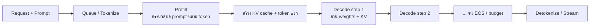
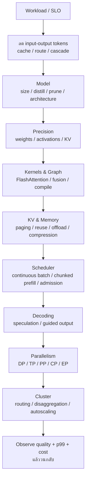
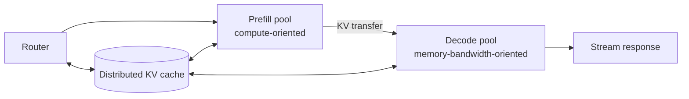

# LLM Inference Optimization 2026

เวลาได้ยินว่า “ช่วยปรับ LLM ให้เร็วขึ้น” ผมจะถามก่อนว่า **ต้องการให้ตัวชี้วัดไหนดีขึ้น โดยต้องรักษาคุณภาพระดับใดและใช้งบเท่าไร** จึงค่อยเลือกว่าจะใช้ FP4, FlashAttention หรือเพิ่ม GPU กี่ใบ เพราะระบบที่สร้าง output tokens/second ได้สูงที่สุดอาจมี p99 TTFT สูงจนผู้ใช้เลิกใช้ ขณะที่ configuration ซึ่งตอบ request เดียวเร็วที่สุดอาจแพงและรองรับหลาย request พร้อมกันแทบไม่ได้

บทความนี้รวบรวมเทคนิคหลักในการปรับประสิทธิภาพ LLM inference ตั้งแต่ prompt, model architecture, quantization, kernel, KV cache, batching, speculative decoding, parallelism ไปจนถึง disaggregated serving และ cluster scheduling พร้อมสถานะของ runtime และงานวิจัยล่าสุดที่ตรวจถึง **9 สิงหาคม 2026** เพื่ออธิบายว่าแต่ละเทคนิคแก้คอขวดอะไร มีข้อแลกเปลี่ยนอย่างไร และควรทดสอบแบบไหน

> **ขอบเขต:** เทคนิคด้านนี้เปลี่ยนแปลงทุกสัปดาห์ จึงรวบรวมทุกงานวิจัยและทุกตัวเลือกการตั้งค่าไว้ในบทความเดียวไม่ได้ บทความนี้ครอบคลุม **ทุกชั้นของระบบและกลุ่มเทคนิคหลักที่ใช้จริง** พร้อมตัวอย่างงานใหม่ในปี 2026 โดยแยกเทคนิคที่พร้อมใช้ใน production ออกจาก preprint และฟีเจอร์ทดลองให้ชัดเจน

## คำตอบสั้น: ลำดับที่ควรทำจริง

ถ้าต้อง optimize ระบบวันนี้ ผมจะทำตามลำดับนี้ก่อน:

1. กำหนดคุณภาพขั้นต่ำที่ยอมรับได้ และ SLO ด้าน TTFT, ITL/TPOT, p99, throughput และต้นทุนให้ชัด
2. เก็บ production trace ที่มี input/output length, arrival rate, prefix similarity, cache hit และ sampling จริง
3. ลด token ที่ไม่จำเป็น เลือกโมเดลเล็กที่สุดที่ผ่านเกณฑ์คุณภาพ และส่งงานให้โมเดลตามระดับความยาก
4. ใช้ inference runtime ที่มี fused attention, continuous batching และ paged KV cache
5. เปิด prefix/KV reuse, chunked prefill และ tune token budget ด้วย load sweep
6. เลือก quantization ที่ **hardware มี native kernel** แล้วตรวจคุณภาพแยกตามการใช้งาน
7. ใช้ speculative decoding เมื่อทดสอบแล้วว่าต้นทุนการ draft อัตราการยอมรับ token และขนาด batch ทำให้ระบบเร็วขึ้นจริง
8. ถ้าโมเดลใส่ในหน่วยความจำของ worker ได้ ให้ขยายด้วย replicas/data parallel ก่อน ใช้ TP/PP/CP/EP เมื่อจำเป็นด้าน memory, latency หรือ architecture
9. ทำ prefill/decode disaggregation หรือ hierarchical KV เมื่อ cluster ใหญ่พอที่จะได้ประโยชน์คุ้มกับการย้ายข้อมูลและความซับซ้อนในการดูแล
10. เปิดใช้ทีละเทคนิค ทดลองกับ traffic ส่วนน้อย วัด p50/p95/p99 + goodput + quality + cost และเตรียมย้อนกลับได้

สิ่งสำคัญคือ **อย่านำอัตราเร็วที่เพิ่มขึ้นจากแต่ละงานวิจัยมาคูณกัน** เช่น FlashAttention 2x × quantization 2x × speculation 2x ไม่ได้แปลว่าระบบจะเร็วขึ้น 8x เพราะเทคนิคเหล่านี้อาจแก้คอขวดเดียวกัน มี overhead ร่วมกัน หรือทำให้คอขวดย้ายไปอยู่ส่วนอื่น

## 1. Optimize อะไร: inference เป็นปัญหาแบบหลายเป้าหมาย

เป้าหมายของระบบหนึ่งอาจเขียนแบบย่อได้ว่า

```text
maximize   goodput / GPU, quality, availability
minimize   TTFT, ITL, p99 latency, cost/request, joules/token
subject to model quality >= floor และ error rate <= budget
```

ไม่มี configuration เดียวที่ให้ผลดีที่สุดในทุกด้านพร้อมกัน:

- batch ใหญ่เพิ่ม throughput แต่เพิ่ม queue และ latency
- tensor parallel อาจลด latency หรือช่วยให้ model fit แต่เพิ่ม collective communication
- 4-bit ลด weight memory แต่บาง hardware dequantize ช้าหรือไม่มี native GEMM
- prefix cache ลด repeated prefill แต่แย่ง HBM จาก active KV blocks
- speculative decoding ลดจำนวน target forward passes แต่เพิ่ม drafter/verification work
- disaggregation แยก SLO ได้ดีขึ้น แต่ต้องย้าย KV cache ข้าม network

ดังนั้นคำว่า “เร็ว” ต้องระบุอย่างน้อยว่าเป็น **single-request latency, latency under load, total throughput หรือ SLO goodput**

## 2. Anatomy: prefill กับ decode เป็นคนละ workload

LLM แบบ autoregressive มีสอง phase หลัก:



### Prefill

Prefill ป้อน prompt หลาย token พร้อมกัน ทำ matrix multiplication ขนาดใหญ่และ parallelism ได้ดี จึงมัก **compute-bound** โดยเฉพาะ prompt ยาวและ batch ที่เหมาะสม ส่วน attention ของ full prompt มีงานเพิ่มตามความยาวบริบทและต้องเขียน KV cache ออกมา

เทคนิคที่มักช่วยเร่ง prefill:

- ลด/บีบ prompt และ RAG context
- prefix cache reuse
- FlashAttention และ fused kernels
- quantize weights/activations หากมี compute kernel ที่เหมาะ
- packed tokens และ remove padding
- chunked prefill เพื่อไม่ให้ prompt ยาว block decode requests
- context parallelism หรือ disaggregated prefill เมื่อ context ใหญ่มาก

### Decode

Decode สร้าง token ทีละตัว โดยแต่ละ token ขึ้นกับ token ก่อนหน้า จึงสร้างทุกตำแหน่งใน sequence พร้อมกันโดยตรงไม่ได้ แต่ละ step ยังต้องอ่าน weights และ KV cache จำนวนมากซ้ำ งานนี้จึงมักติดข้อจำกัดด้านอัตรารับส่งข้อมูลของหน่วยความจำ (**memory-bandwidth-bound**) เมื่อ batch เล็ก และปริมาณข้อมูลที่ attention ต้องอ่านจะเพิ่มตาม context ที่สะสม

เทคนิคที่มักช่วยเร่ง decode:

- continuous batching เพื่อ amortize weight reads หลาย requests
- weight/KV quantization เพื่อลด bytes
- MQA, GQA หรือ MLA เพื่อลด KV footprint
- paged KV cache และ efficient decode attention kernel
- speculative decoding เพื่อลด sequential target steps
- tensor/data/expert parallelism ที่ match topology
- จำกัด output length และหยุดให้เร็วเมื่อ task เสร็จ

> คำว่า “prefill compute-bound, decode memory-bound” เป็นเพียงแนวทางเบื้องต้น Long-context decode อาจติดการรับส่งข้อมูลของ attention/KV ส่วน batch ใหญ่อาจเพิ่มสัดส่วนการคำนวณต่อข้อมูลที่อ่าน และ MoE อาจติด all-to-all หรือการกระจายงานระหว่าง experts ที่ไม่สมดุล จึงต้องวัดการทำงานของระบบจริง

## 3. Metric ที่ต้องวัดก่อนแตะ optimization

[NVIDIA LLM benchmarking guide](https://developer.nvidia.com/blog/llm-benchmarking-fundamental-concepts/) ย้ำว่าต้องประกาศนิยาม metric และ distribution ของ input/output length เพราะเครื่องมือแต่ละตัวอาจคำนวณไม่เหมือนกัน

| Metric | ความหมาย | ผู้ใช้/ระบบรับรู้อะไร | Pitfall |
|---|---|---|---|
| TTFT | เวลาตั้งแต่ส่ง request ถึง token แรก | “เริ่มตอบเร็วไหม” | รวม queue, network, tokenization และ prefill ใน production |
| ITL | ช่วงเวลาระหว่าง token ที่ติดกัน | ความลื่นของ streaming | ค่าเฉลี่ยอาจซ่อน spike; ดู p95/p99 ด้วย |
| TPOT | เวลาเฉลี่ยต่อ output token หลัง token แรก | decode speed | บาง tool ใช้นิยามต่างจาก ITL |
| E2E latency | ส่ง request ถึง token สุดท้าย | งานจบเมื่อไร | ขึ้นกับ output length อย่างมาก |
| Output TPS | output tokens ต่อวินาทีทั้งระบบ | throughput | เพิ่มได้ด้วย batch แต่ latency อาจแย่ |
| RPS | requests ต่อวินาที | capacity | เทียบข้าม workload ไม่ได้ถ้าความยาวต่างกัน |
| Goodput | requests/วินาทีที่ผ่าน SLO | capacity ที่ใช้งานได้จริง | มีความหมายกว่าค่า throughput ตอน saturation |
| VRAM | weights + KV + activations + workspace | fit/concurrency | checkpoint size ไม่เท่ากับ runtime VRAM |
| Cost | ต่อ request/ล้าน token/ชั่วโมง | economics | ต้องรวม idle, replicas และ transfer |
| Energy | joules/token หรือ request | efficiency | peak power ต่ำไม่แปลว่า energy ต่ำ |
| Quality | task score, win rate, safety, calibration | correctness | quantization/cache/routing อาจเปลี่ยน output |

หากใช้คำนิยามแบบ GenAI-Perf:

```text
E2E latency = TTFT + generation time
ITL ≈ (E2E latency - TTFT) / (output tokens - 1)
```

### Benchmark matrix ขั้นต่ำ

อย่าทดสอบเพียง `(input=128, output=128, concurrency=1)` ผมจะสร้าง matrix อย่างน้อยดังนี้:

```yaml
input_tokens:      [128, 1k, 8k, 32k, p50-production, p95-production]
output_tokens:     [32, 128, 512, p50-production, p95-production]
arrival_pattern:   [closed-loop, poisson, production-replay, burst]
request_rate:      [light, target, near-saturation, overload]
concurrency:       [1, 4, 16, 64, production-range]
prefix_similarity: [0%, realistic, high-reuse]
sampling:          [greedy, production-temperature/top-p]
cache_state:       [cold, warm, churn]
metrics:           [p50/p95/p99 TTFT, ITL, e2e, TPS, RPS, goodput, VRAM, power]
```

ให้ warm up kernel/JIT ใช้ model/runtime version เดิมตลอดการทดสอบ บันทึก driver/GPU topology รันซ้ำหลายรอบ และวัดจากฝั่ง client เพื่อรวมเวลาที่ผู้ใช้ต้องรอจริง

## 4. Memory math: ทำไม weights และ KV cache ต้องแยกกัน

### Weight memory โดยอุดมคติ

สำหรับโมเดล `P` parameters ที่ใช้ `b` bits ต่อ weight:

```text
weight payload bytes ≈ P × b / 8
```

ตัวอย่าง 70B ก่อน metadata, unquantized layers และ workspace:

| Format | Payload โดยอุดมคติ |
|---|---:|
| BF16/FP16 | 140 GB |
| FP8/INT8 | 70 GB |
| INT4 payload | 35 GB |

ตัวเลขนี้ไม่ใช่ VRAM ทั้งระบบ เพราะยังมี scales/zero-points, padding, embeddings/lm_head ที่อาจไม่ quantize, KV cache, activations, CUDA graphs และ allocator fragmentation ดูกรณี FP4 แบบละเอียดใน [[NVFP4-Deep-Dive-Format-Quantization-Blackwell]]

### KV-cache memory

สำหรับ decoder ที่ทุก layer มีจำนวน KV heads เท่ากัน:

```text
KV bytes/token
≈ 2 × layers × KV_heads × head_dim × bytes_per_element
  ^ K และ V
```

ตัวอย่างสมมติ `32 layers × 8 KV heads × head_dim 128 × BF16 2 bytes`:

```text
KV = 2 × 32 × 8 × 128 × 2
   = 131,072 bytes/token
   = 128 KiB/token
```

ดังนั้น request เดียวใช้ payload โดยประมาณ:

| Context | BF16 KV | FP8 KV โดยอุดมคติ |
|---:|---:|---:|
| 32K tokens | 4 GiB | 2 GiB |
| 128K tokens | 16 GiB | 8 GiB |

นี่คือเหตุผลที่ **weight-only INT4 ไม่ได้แก้คอขวดของ long context โดยอัตโนมัติ** จึงต้องพิจารณา GQA/MLA, KV quantization, cache eviction/compression และ offload แยกจากการลดพื้นที่เก็บ weights

## 5. แผนที่เทคนิคทั้ง stack



อีกแกนที่ต้องแยกคือ optimization เปลี่ยนผลลัพธ์หรือไม่:

| กลุ่ม | ตัวอย่าง | Output semantics |
|---|---|---|
| Exact/system-level | fused kernel, PagedAttention, continuous batching, exact prefix reuse | ควรเท่าเดิมภายใต้ numerical tolerance/seed |
| Distribution-preserving | speculative decoding ที่ใช้ acceptance rule ถูกต้อง | รักษา target distribution ตามเงื่อนไข algorithm |
| Numerically lossy | FP8/INT4/FP4, KV quantization | ต้องประเมิน quality |
| Context-approximate | KV eviction, prompt compression, semantic cache | อาจตัดข้อมูลหรือคืนคำตอบใกล้เคียง |
| Model-changing | distillation, pruning, early exit, routing | quality/behavior เปลี่ยนโดยออกแบบ |
| Policy-changing | ลด max tokens, stop sequences, constrained output | เปลี่ยนสิ่งที่อนุญาตให้ generate |

## 6. ชั้นที่มักคุ้มที่สุด: ลดงานก่อนทำงานให้เร็ว

### 6.1 ลด input tokens

ทุก token ที่ตัดออกช่วยลดงานหลายส่วนพร้อมกัน ทั้ง tokenization, prefill FLOPs, KV memory และ decode attention traffic อีกทั้งยังลดค่าใช้จ่ายของ API ที่คิดราคาตาม token

แนวทางที่ใช้ได้จริง:

- ตัด whitespace/markup/boilerplate ที่ไม่จำเป็นโดยไม่ทำลาย structure
- deduplicate RAG chunks และไม่ส่งเอกสารที่ retriever ให้คะแนนต่ำ
- ใช้ metadata filter ก่อน vector search
- ส่งเฉพาะ turn ที่เกี่ยวข้อง หรือสรุป history เก่าแทน replay ทั้งหมด
- วาง stable system prompt/tool schemas ไว้ต้น prompt เพื่อเพิ่ม prefix-cache hit
- ทำ context budget ต่อส่วน เช่น system 10%, retrieved evidence 60%, history 20%, query 10%
- เลือก tokenizer/model ที่ represent domain ได้มีประสิทธิภาพเมื่อกำลังเลือก architecture ใหม่

[LLMLingua](https://arxiv.org/abs/2310.05736) เป็นตัวอย่างของการบีบ prompt ที่อาจทำให้เนื้อหาบางส่วนเปลี่ยนไป ต้องทดสอบทั้งความถูกต้องของข้อเท็จจริง การคงคำสั่งไว้ครบ การอ้างอิง และพฤติกรรมเมื่อเจอ prompt injection ไม่ควรถือว่าอัตราการบีบอัดที่งานวิจัยรายงานจะทำได้เสมอใน production

### 6.2 ลด output tokens และ reasoning budget

Decode มักเป็นส่วนแพงสำหรับ chat/reasoning workload:

- ตั้ง `max_tokens` ตาม task แทนค่ากว้างระดับโมเดล
- ใช้ stop sequence/EOS ที่ถูกต้อง
- ขอ structured concise output เมื่อ downstream ไม่ต้องการ prose
- จำกัดจำนวน candidates, beam width, best-of และ parallel samples
- ให้ model หยุดเมื่อ tool call พร้อม แทน generate คำอธิบายต่อ
- ใช้ adaptive reasoning budget: งานง่ายสั้น งานยากค่อยขยาย

อย่าลด budget โดยไม่วัดอัตราทำงานสำเร็จ เพราะแม้ latency ลดลง แต่อาจต้องลองใหม่บ่อยขึ้นจนต้นทุนรวมสูงกว่าเดิม

### 6.3 Exact response cache, semantic cache และ prefix cache ไม่ใช่สิ่งเดียวกัน

| Cache | Key | สิ่งที่ reuse | ความถูกต้อง |
|---|---|---|---|
| Exact response cache | request/config hash | คำตอบเดิมทั้งหมด | exact เมื่อ policy/version ตรงกัน |
| Semantic cache | embedding similarity | คำตอบจากคำถามคล้ายกัน | approximate และเสี่ยง collision |
| Prompt/API cache | prefix ตามกติกา provider | prefill computation/discount | exact prefix แต่ implementation เป็นของ provider |
| KV/prefix cache | token blocks + model state | KV ที่คำนวณแล้ว | exact เมื่อ model/config/cache key ตรง |

OpenAI และ Anthropic มี [prompt caching](https://platform.openai.com/docs/guides/prompt-caching) / [prompt caching docs](https://docs.anthropic.com/en/docs/build-with-claude/prompt-caching) ของ provider ส่วน self-hosted runtime ใช้ prefix/KV cache ในระดับ engine

Semantic cache ต้องคำนึงถึง model version, system policy, tools, tenant, safety policy และความสดใหม่ของข้อมูล ทั้งตอนสร้าง key และตรวจสอบผลลัพธ์ ไม่ใช่ดู cosine similarity อย่างเดียว งาน [LaCache ปี 2026](https://arxiv.org/abs/2608.01718) ชี้ถึงภัยคุกคามแบบ cache-collision จึงควรดูแล semantic cache เหมือนระบบค้นคืนข้อมูลที่ต้องผ่านเกณฑ์ความปลอดภัยและความถูกต้อง

### 6.4 Routing และ cascade

แทนที่จะใช้โมเดลใหญ่กับทุก request:

1. classifier/router ประเมิน domain, difficulty, risk และ latency budget
2. ส่งงานง่ายไป small/specialist model
3. หาก confidence ต่ำหรือ validator ไม่ผ่าน จึง escalate ไป larger model
4. ใช้ policy แยกสำหรับ high-risk task ที่ห้าม downgrade

[RouteLLM](https://arxiv.org/abs/2406.18665) ใช้ข้อมูลความชอบของผู้ประเมินเรียนรู้ว่าจะส่งงานให้โมเดลที่มีความสามารถระดับใด ส่วน [FrugalGPT](https://arxiv.org/abs/2305.05176) ศึกษา prompt adaptation, approximation และ cascades ผลที่งานวิจัยรายงานขึ้นกับชุดโมเดล ราคา และ benchmark ณ เวลานั้น ไม่ควรนำตัวเลขไปคาดการณ์ workload ใหม่โดยตรง

สิ่งที่ต้องติดตามคือคุณภาพของ router ที่อาจเปลี่ยนไป การส่งงานให้โมเดลเล็กผิดกรณี อัตราส่งงานต่อไปยังโมเดลใหญ่ tail latency จากการทำงานสองรอบ และความพร้อมของผู้ให้บริการหรือโมเดล

## 7. Model-level optimization

### 7.1 เลือกโมเดลเล็กที่สุดที่ผ่าน quality

การเลือกโมเดลให้เล็กลงมักลดการใช้ทรัพยากรได้หลายด้านพร้อมกัน มากกว่าการปรับ kernel เพียงอย่างเดียว:

- weight memory และ model-load time ลด
- FLOPs ต่อ token ลด
- decode weight traffic ลด
- ใช้ replica มากขึ้นต่อ GPU fleet
- quantize ง่ายขึ้นและ speculative drafter มีช่องว่างมากขึ้น

แต่ต้องทดสอบกับ **งานของเรา** โดยแยกคุณภาพตามภาษา domain, context length, tool use, safety และการทำตามรูปแบบ output ที่กำหนด คะแนนเฉลี่ยบน leaderboard เพียงอย่างเดียวใช้ตัดสินไม่ได้

### 7.2 Knowledge distillation

Distillation ฝึก student ให้เลียนแบบ teacher ผ่าน logits, hidden states, rationales หรือ generated data [MiniLLM](https://arxiv.org/abs/2306.08543) เป็นตัวอย่าง on-policy distillation สำหรับ generative LLM

ข้อดี:

- ได้ dense model เล็กที่ runtime ทั่วไปเร่งได้จริง
- สามารถ distill domain/policy เฉพาะงาน
- ใช้เป็น production model หรือ speculative drafter ได้

ต้นทุน/ความเสี่ยง:

- ต้องสร้าง/กรอง teacher data และฝึกใหม่
- student อาจเรียนรู้ข้อผิดพลาดของ teacher มาด้วย และความมั่นใจของโมเดลอาจไม่สอดคล้องกับความถูกต้องเหมือนเดิม
- ความสามารถกับข้อมูลที่ต่างจากชุดฝึกมักลดลงก่อนจะเห็นผลใน benchmark ทั่วไป
- ต้องตรวจ licensing และสิทธิการใช้ outputs เพื่อ train

### 7.3 Pruning และ sparsity

แยกอย่างน้อยสามแบบ:

1. **Unstructured pruning** — ตั้ง weight รายตัวเป็นศูนย์ เช่น [SparseGPT](https://arxiv.org/abs/2301.00774) และ [Wanda](https://arxiv.org/abs/2306.11695) ลด nonzero parameters แต่ถ้า runtime ยังทำ dense GEMM จะไม่เร็วตาม sparsity
2. **Semi-structured sparsity** — รูปแบบเช่น N:M ที่ hardware/kernel รองรับ มีโอกาสได้ speedup จริงกว่าแต่จำกัด pattern
3. **Structured pruning** — ตัด heads, channels, neurons, layers หรือ width ทำให้ matrix เล็กลงแบบ dense ใช้ง่ายกว่า แต่กระทบ quality และอาจต้อง fine-tune

[SliceGPT](https://arxiv.org/abs/2401.15024) ใช้ computational invariance เพื่อลด embedding dimension และสร้าง dense matrices ที่เล็กลง หลักสำคัญคือ **การมี weight เป็นศูนย์มากขึ้นไม่ได้แปลว่าจะเร็วขึ้นตามสัดส่วน** ต้องดูรูปแบบการเก็บข้อมูล index overhead การกระจายงาน และ kernel ที่รองรับด้วย

### 7.4 Low-rank factorization, layer dropping และ early exit

- แยก weight matrix เป็นสอง matrix ที่มี rank ต่ำ ช่วยลด parameters/FLOPs เมื่อ rank ต่ำพอให้ประโยชน์ที่ได้คุ้มกับ overhead จากการเรียก kernel และผลลัพธ์ระหว่างทาง
- layer dropping/width reduction ทำให้ model เล็กลงโดยตรง แต่ต้อง retrain/calibrate
- early exit หยุดที่ layer ตื้นเมื่อ confidence สูง เหมาะ task ที่มีคำตอบตัดสินได้ แต่ generation ต้องออกแบบ exit per token/sequence และ calibration ยาก
- dynamic depth/adaptive compute ใช้ layers ไม่เท่ากันตาม token/request เพิ่ม scheduler irregularity

เทคนิคเหล่านี้เปลี่ยน model behavior จึงต้องวัด worst-case quality ไม่ใช่เฉพาะค่าเฉลี่ย

### 7.5 Inference-friendly attention architecture

#### MHA, MQA และ GQA

Multi-Query Attention ([MQA](https://arxiv.org/abs/1911.02150)) แชร์ K/V head เดียวให้หลาย query heads จึงลด KV memory และ bandwidth มาก ส่วน [GQA](https://arxiv.org/abs/2305.13245) ใช้จำนวน KV heads ระหว่าง MHA กับ MQA เพื่อ balance quality/efficiency

อัตราส่วน KV payload โดยคร่าวเมื่อ head dimension เท่ากัน:

```text
GQA KV / MHA KV ≈ num_kv_heads / num_attention_heads
```

นี่เป็นคุณสมบัติของสถาปัตยกรรม Runtime ใช้ประโยชน์ได้เมื่อ checkpoint ผ่านการ train/uptrain มาแล้ว ไม่ใช่ตัวเลือกที่เปิดแล้วเปลี่ยน MHA checkpoint เป็น GQA ได้ทันที

#### MLA

[DeepSeek-V2](https://arxiv.org/abs/2405.04434) เสนอ Multi-head Latent Attention บีบ K/V ลง latent representation เพื่อลด KV cache และจับคู่กับ sparse MoE การเร่งจริงต้องมี MLA-aware kernels และ parallel layout ที่เหมาะ เช่น FlashMLA/attention backends ของ runtime

#### Sliding-window, sparse/linear attention และ SSM/hybrid

- sliding-window จำกัด attention ไป token ล่าสุด ลด compute/KV ที่ active แต่ข้อมูลไกลอาจเข้าถึงผ่าน full-attention layers หรือ sink/global tokens
- block-sparse/local-global attention ลดคู่ token ที่คำนวณ แต่ต้องมี sparse kernel และ model ถูก train ให้ใช้ pattern นั้น
- linear attention เปลี่ยน formulation เพื่อลด scaling ตาม context แต่ behavior ต่างจาก softmax attention
- [Mamba](https://arxiv.org/abs/2312.00752) และ SSM/hybrid models ใช้ recurrent state ที่ scale ต่างจาก KV cache แบบ Transformer

เทคนิคเหล่านี้เหมาะกับการเลือกหรือออกแบบโมเดลใหม่ มากกว่านำไปใช้กับ checkpoint เดิมโดยไม่ปรับอย่างอื่น

### 7.6 Mixture of Experts

MoE มี parameters จำนวนมาก แต่ใช้ experts เพียงบางส่วนต่อ token จึงลด FLOPs ที่ต้องคำนวณเมื่อเทียบกับ dense model ที่มีความสามารถใกล้กัน อย่างไรก็ตาม การทำ inference มีคอขวดเพิ่มขึ้น:

- ยังต้องเก็บ expert weights จำนวนมากไว้ในหน่วยความจำหรือโหลดเข้ามาใช้
- token dispatch/combine ใช้ all-to-all
- hot experts ทำให้ GPU บางตัวแน่น บางตัวว่าง
- batch ต่อ expert เล็กทำให้ GEMM efficiency ต่ำ
- routing pattern ขึ้นกับ workload

จึงต้องใช้ expert parallelism, grouped GEMM, expert placement/replication และ load balancer [DeepSeek-V3 report](https://arxiv.org/abs/2412.19437) และ TensorRT-LLM Wide-EP เป็นตัวอย่างของ co-design ระหว่าง model กับ serving

### 7.7 Multi-Token Prediction

[MTP](https://arxiv.org/abs/2404.19737) เพิ่ม heads ที่ทำนายหลาย token ถัดไประหว่าง training จึงเพิ่มข้อมูลที่ใช้ฝึกและใช้เป็น drafter ในตัวสำหรับ speculative decoding ได้ แต่ไม่ได้แปลว่าทุก runtime จะสร้างหลาย token ต่อ target pass โดยอัตโนมัติ Runtime ยังต้องรองรับการตรวจและยอมรับ token พร้อมปรับ draft depth ให้เหมาะสม

## 8. Quantization: ลด bytes ให้ตรงคอขวดและตรง hardware

Quantization มีอย่างน้อยสามแกน:

```text
สิ่งที่ quantize: weights / activations / KV cache
เวลา: PTQ / QAT-QAD / native low-precision training
execution: native low-bit GEMM / weight-only dequantize / emulation-fallback
```

### 8.1 สูตรที่พบบ่อย

| Recipe | สิ่งที่ลด | จุดเด่น | ระวัง |
|---|---|---|---|
| BF16/FP16 | baseline | compatibility/quality | memory สูง |
| W8A8 INT8/FP8 | weight + activation traffic/compute | native tensor cores บน hardware ที่รองรับ | calibration, outliers, operator coverage |
| W8A16 | weight capacity/traffic | transition ง่าย | activation compute ยัง 16-bit |
| W4A16 AWQ/GPTQ | weight capacity/bandwidth | ใช้แพร่หลายกับ decode | dequant overhead; ไม่ลด KV |
| W4A8 | weights มาก, activations ปานกลาง | potential compute/memory gain | kernel/hardware support แคบกว่า |
| W4A4 FP4 | weight + activation | native FP4 hardware ให้ potential สูง | sensitivity, scales, mixed precision |
| FP8/INT8 KV | KV capacity/bandwidth | concurrency/long context ดีขึ้น | attention kernel + quality |
| 4/3/2-bit KV | KV ลดมาก | long context | accuracy และ custom kernel risk สูงขึ้น |

### 8.2 PTQ, QAT และ mixed precision

- **PTQ:** quantize checkpoint หลัง train; ใช้ calibration data เมื่อ recipe ต้อง estimate ranges ง่ายและถูกที่สุด
- **QAT:** fake-quantization ระหว่าง fine-tune ให้ model ปรับตัวกับ quantization noise
- **Quantization-aware distillation:** ใช้ teacher ช่วยกู้ distribution ของ quantized student
- **Mixed precision:** เก็บ sensitive layers, embeddings, lm_head, outlier channels หรือบาง experts ไว้ precision สูงกว่า

คุณภาพต้องวัดทั้ง perplexity/task score และ behavior ระดับ product เช่น JSON validity, tool-selection accuracy, citation faithfulness, safety refusal และ long-context retrieval

### 8.3 SmoothQuant, AWQ และ GPTQ แก้คนละปัญหา

- [SmoothQuant](https://arxiv.org/abs/2211.10438) ย้ายความยากจาก activation outliers ไป weights ผ่าน equivalent transformation เพื่อ W8A8
- [AWQ](https://arxiv.org/abs/2306.00978) รักษา salient weight channels โดยอาศัย activation statistics สำหรับ weight-only quantization
- [GPTQ](https://arxiv.org/abs/2210.17323) ทำ post-training weight quantization แบบ layerwise/second-order approximation

ชื่อ “INT4” หรือ “FP4” ยังไม่พอ ต้องระบุ group size, scale/zero-point, symmetric/affine, activation dtype, KV dtype, quantized coverage และ backend kernel

### 8.4 FP8, FP4, NVFP4 และ MXFP4

เอกสาร [TensorRT-LLM quantization](https://nvidia.github.io/TensorRT-LLM/features/quantization.html) ณ วันที่ตรวจรองรับหลาย recipe เช่น FP8 per-tensor/block/rowwise, FP8 KV, NVFP4/MXFP4 และ AWQ/GPTQ บางแบบ แต่ support matrix แยกตาม GPU และ model ชัดเจน

หลักที่ห้ามลืม:

- payload 4-bit ไม่เท่ากับ VRAM ลด 4x
- checkpoint โหลดได้ไม่แปลว่ารัน native low-bit tensor core
- fallback W4A16 อาจประหยัด memory แต่ speedup ต่างจาก native W4A4
- quantize weights ไม่ลด KV cache
- prefill/decode ได้ประโยชน์ไม่เท่ากัน
- runtime version และ model-specific operator coverage เปลี่ยนเร็ว

รายละเอียด NVFP4, scale overhead และ Blackwell support อยู่ใน [[NVFP4-Deep-Dive-Format-Quantization-Blackwell]]

### 8.5 KV-cache quantization

[KIVI](https://arxiv.org/abs/2402.02750) วิเคราะห์ว่า key/value distribution เหมาะกับ quantization axis ต่างกัน ส่วน [KVQuant](https://arxiv.org/abs/2401.18079) ใช้ per-channel/pre-RoPE/non-uniform/outlier handling เพื่อ sub-4-bit KV

ใน production ให้ตรวจ:

- quantize ตอน write หรือ read และ conversion overhead
- scale granularity/metadata
- prompt KV กับ decode KV ใช้ dtype เดียวกันหรือไม่
- attention backend รองรับ exact recipe หรือ dequantize กลับ
- quality ที่ context ยาวกว่าชุด calibration
- memory ที่ประหยัดทำให้ batch/concurrency เพิ่มจน attention bandwidth กลายเป็นคอขวดใหม่หรือไม่

## 9. Kernel, compiler และ execution-graph optimization

### 9.1 FlashAttention ไม่ได้ “ทำ attention เป็นเชิงเส้น”

[FlashAttention-2](https://arxiv.org/abs/2307.08691) และ [FlashAttention-3](https://arxiv.org/abs/2407.08608) จัด tile และ online softmax เพื่อลดการอ่าน/เขียน HBM และใช้ GPU pipeline ดีขึ้น โดยคำนวณ exact attention ตาม formulation เดิม ไม่ได้เปลี่ยน complexity เชิงคณิตของ full attention เป็น O(n)

เลือก backend ตาม:

- prefill หรือ decode
- causal/sliding-window/MLA
- head dimension และ GQA ratio
- paged/ragged KV layout
- dtype/quantization
- GPU generation
- batch และ context distribution

[FlashInfer](https://arxiv.org/abs/2501.01005) เน้น attention สำหรับ serving ที่ปรับแต่งได้และรองรับรูปแบบ request/KV หลากหลาย จึงมักใช้เป็น kernel ภายใน runtime มากกว่าเป็น server สำเร็จรูปสำหรับผู้ใช้

### 9.2 Operator fusion

Fusion ลด kernel launches, intermediate tensors และ HBM round trips ตัวอย่าง:

- QKV projection + reshape/rotary บางส่วน
- bias + activation เช่น SwiGLU
- residual + RMSNorm
- dequantize + GEMM
- logits processing + sampling
- MoE routing + grouped GEMM/dispatch paths

การรวมงานมากเกินไปอาจใช้ register มากขึ้น ลด occupancy หรือทำให้มี kernel เฉพาะสำหรับหลาย shape จึงต้องวัดผลจริง

### 9.3 CUDA Graphs, compile และ shape bucketing

Decode step มี kernel เล็กจำนวนมากและ control flow ซ้ำ การ capture graph ลด CPU launch overhead แต่ต้องแลกกับ:

- memory pool/graph buffers เพิ่ม
- dynamic shape ถูกจำกัดหรือสร้างหลาย graph
- batch/sequence changes ทำให้ recapture/fallback
- debugging และ observability ซับซ้อนขึ้น

Shape bucketing รวม requests ให้ลง graph variants ที่จำกัด ส่วน compiler เช่น TensorRT, `torch.compile`, Triton/CUTLASS codegen และ runtime autotuning ทำ constant folding, fusion, layout selection และเลือก GEMM kernel ให้ shape จริง

### 9.4 Packed tokens และ remove padding

ถ้า batch มี prompt ยาว 8K หนึ่งรายการกับ prompt 100 token หลายรายการ การเติม padding ให้ทุก sequence ยาวถึง 8K จะสิ้นเปลืองการคำนวณมาก Packed/ragged representation ช่วยให้ประมวลผลเฉพาะ token จริง [TensorRT-LLM in-flight batching docs](https://nvidia.github.io/TensorRT-LLM/features/paged-attention-ifb-scheduler.html) ระบุว่า packed input เป็นส่วนสำคัญที่ช่วยเพิ่มประสิทธิภาพ

### 9.5 CPU และ pipeline รอบ GPU

GPU เร็วขึ้นแล้วคอขวดอาจย้ายไป:

- tokenizer/detokenizer และ chat-template rendering
- JSON/grammar compilation
- HTTP serialization, TLS, proxy buffers
- synchronous logging/tracing
- image/audio preprocessing ใน multimodal model
- Python GIL/event loop และ scheduler control plane

ใช้ async pipeline, pinned memory, batched tokenization, zero/low-copy transfer และ backpressure พร้อมแยกงาน telemetry ออก เพื่อไม่ให้ขวางขั้นตอนหลักในการตอบ request

## 10. KV-cache และ memory-management optimization

### 10.1 PagedAttention

การจอง contiguous KV ตาม max sequence ทำให้ internal fragmentation สูงและ batch เปลี่ยนยาก [PagedAttention/vLLM paper](https://arxiv.org/abs/2309.06180) แบ่ง KV เป็น fixed-size blocks คล้าย virtual memory:

- allocate block เมื่อ sequence โต
- recycle เมื่อ request จบ
- share blocks สำหรับ common prefix/candidates
- ไม่ต้องย้าย contiguous tensor ใหญ่ทุกครั้ง

ขนาด block มีข้อแลกเปลี่ยน: block ใหญ่ใช้ metadata และการค้นหาน้อยลง แต่มีพื้นที่ว่างที่ใช้ประโยชน์ไม่ได้มากขึ้น ส่วน block เล็กนำข้อมูลกลับมาใช้ซ้ำได้ละเอียดกว่า แต่เพิ่ม overhead ของ page table และ kernel

### 10.2 Prefix caching และ Radix reuse

เมื่อหลาย request มี token prefix เหมือนกัน ระบบ reuse KV ของ prefix แทน prefill ซ้ำ เหมาะกับ:

- system prompt เดิม
- tool definitions/schema ชุดเดิม
- few-shot examples เดิม
- multi-turn conversation ที่ส่ง history เดิม
- RAG/agent workflow ที่มี document prefix ซ้ำ

[vLLM Automatic Prefix Caching](https://docs.vllm.ai/en/latest/features/automatic_prefix_caching/) และ TensorRT-LLM KV cache system ใช้ block matching/reuse ส่วน SGLang ใช้ RadixAttention/Radix cache concept

ข้อจำกัด:

- ช่วย prefill ที่ซ้ำ แต่ไม่ทำให้ decode token ใหม่เร็วขึ้นโดยตรง
- token IDs, model, adapter, position/rope config และ relevant sampling state ต้อง match
- timestamp หรือ request ID ที่เปลี่ยนทุกครั้งตรงต้น prompt ทำให้ข้อความถัดจากนั้นใช้ prefix cache เดิมไม่ได้
- HBM ที่ให้ cache มากเกินไปลด active concurrency
- multi-tenant ต้อง isolate ด้วย namespace/salt; TensorRT-LLM มี cache salting เพื่อควบคุม reuse

### 10.3 Cache-aware routing

เมื่อมีหลาย replicas การส่ง request แบบ round-robin อาจส่ง prefix เดิมไปยัง GPU ที่ไม่มี cache จนต้องคำนวณใหม่ Router จึงควรพิจารณาปัจจัยเหล่านี้ร่วมกัน:

```text
estimated queue delay
+ missing-prefix prefill cost
+ KV transfer cost
+ model/adapter locality
+ SLO deadline
```

Hit rate อย่างเดียวไม่พอ เพราะการดึง prefix ใหญ่ผ่าน link ที่ช้ากับการคำนวณ prefix เล็กบน GPU ที่ว่างมีต้นทุนต่างกัน งาน [PrefixPlace](https://arxiv.org/abs/2608.01655) ปี 2026 ศึกษาการวาง cache โดยคิดทั้งต้นทุนการคำนวณและการย้ายข้อมูล แทนการเพิ่ม hit rate เพียงอย่างเดียว

### 10.4 Offload และ hierarchical KV

การย้าย KV ที่ไม่ค่อยได้ใช้จาก HBM ไปยัง CPU DRAM, local SSD หรือ remote cache ช่วยเพิ่มพื้นที่เก็บรวม แต่เมื่อนำกลับมาใช้ต้องเสียเวลาย้ายข้อมูล ซึ่งอาจช้ากว่าคำนวณใหม่

ตัดสินด้วย:

```text
reuse benefit
≈ recompute_time - fetch_time - queue/contention penalty
```

ต้องมี asynchronous transfer, prefetch, eviction priority และ fast interconnect ระบบอย่าง Mooncake/Dynamo มอง KV เป็น distributed memory object ไม่ใช่ state ภายใน process เดียว

### 10.5 KV eviction/compression

นอกจาก quantize แต่ละ entry แล้ว ยังลดจำนวน token ที่เก็บได้ด้วยวิธีเหล่านี้:

- [H2O](https://arxiv.org/abs/2306.14048): เก็บ recent tokens + heavy hitters
- [SnapKV](https://arxiv.org/abs/2404.14469): ใช้ observation window เลือก prompt positions สำคัญต่อ head
- [PyramidKV](https://arxiv.org/abs/2406.02069): budget ต่างกันตาม layer จากรูปแบบ information funnel
- sliding-window/attention sinks: เก็บ recent window และ sink/global tokens

เทคนิคเหล่านี้เลือกเก็บ context เพียงบางส่วน ต่างจาก PagedAttention ที่จัดการหน่วยความจำโดยไม่ตัดข้อมูล จึงต้องทดสอบทั้ง retrieval, long-form generation, code, repeated entities, multilingual context และ adversarial “needle” หลายตำแหน่ง

### 10.6 Multi-LoRA / adapter memory

ถ้า serve adapters จำนวนมาก:

- cache adapter weights บน GPU และ offload cold adapters
- batch requests ที่ base model เดียวแต่ LoRA ต่างกันด้วย multi-LoRA kernel
- route ตาม adapter locality
- กำหนด per-tenant cache quota

Adapter ขนาดเล็กไม่ได้หมายความว่าจะมี overhead ต่ำเสมอ เพราะการสลับเรียกใช้ adapter และการแบ่ง batch ออกเป็นกลุ่มย่อยอาจลดประสิทธิภาพ GEMM

## 11. Batching และ scheduling

### 11.1 Static, dynamic และ continuous batching

- **Static batch:** รอ batch ครบแล้วรันทุก sequence จนจบ เมื่อ sequence สั้นจบก่อน พื้นที่ส่วนนั้นจะว่างโดยยังนำไปใช้งานใหม่ไม่ได้
- **Dynamic batch:** รอใน time window สั้นเพื่อรวม requests
- **Continuous/in-flight/iteration-level batching:** ทุก decode iteration นำ request ใหม่เข้าและเอา request จบออก

งาน Orca จาก OSDI 2022 วางแนวคิด [iteration-level scheduling และ selective batching](https://www.usenix.org/conference/osdi22/presentation/yu) ส่วน runtimes สมัยใหม่ใช้ continuous batching เป็นพื้นฐาน

ข้อควร tune:

- max sequences
- max batched tokens/token budget ต่อ iteration
- waiting timeout
- prefill/decode priority
- GPU memory utilization/KV reserve
- preemption mode: recompute, swap หรือ reject

### 11.2 ทำไม batch ใหญ่ไม่ดีตลอด

ช่วงแรก batch เพิ่ม arithmetic intensity และ amortize weight reads ทำให้ TPS สูงขึ้น แต่เมื่อ attention/DRAM หรือ compute saturate:

- TPS plateau
- TTFT/ITL เพิ่ม
- KV memory เพิ่ม
- queue และ p99 แย่
- OOM/preemption risk เพิ่ม

งาน [SLIM ปี 2026](https://arxiv.org/abs/2607.29575) วิเคราะห์จุดอิ่มตัวของ decode attention และเสนอให้เลือก batching configuration ภายใต้เป้าหมาย latency เมื่อนำไปใช้จริงควรเลือก **จุดที่ยังผ่าน SLO ก่อน throughput จะเริ่มคงที่** ไม่ใช่เลือก batch ใหญ่ที่สุดที่ engine รับได้

### 11.3 Chunked prefill

Prompt ยาวเพียง request เดียวอาจใช้เวลาส่วนใหญ่ของ iteration จน request ที่กำลัง decode ต้องรอนาน Chunked prefill จึงแบ่ง prompt เป็นส่วนย่อยแล้วสลับประมวลผลกับ decode:

ข้อดี:

- ลด head-of-line blocking และ worst-case TTFT ภายใต้ mixed workload
- ใช้ token budget ยืดหยุ่น
- ผสม compute-heavy prefill กับ bandwidth-heavy decode ได้
- ไม่ต้องตั้ง max batched tokens เท่ากับ prompt ที่ยาวที่สุด

ข้อแลกเปลี่ยน:

- prompt เดี่ยวอาจใช้หลาย iterations และ TTFT เพิ่ม
- chunk เล็กเกินทำ launch/scheduling overhead สูง
- chunk ใหญ่เกินกลับไป block decode
- prefix cache/speculation/graphs อาจมี interaction เฉพาะ runtime

เอกสาร TensorRT-LLM แนะนำให้เปิด chunked context สำหรับ serving ทั่วไป แต่ยังต้องทดสอบกับ workload ของเรา งาน [ปี 2026 เรื่อง power dynamics](https://arxiv.org/abs/2608.01250) ยังพบว่า chunked prefill ช่วยลดอัตราการเพิ่มกำลังไฟภายใต้ load แม้ไม่ลดกำลังไฟสูงสุด จึงเริ่มมีการนำข้อจำกัดด้านกำลังไฟและระบบจ่ายไฟมาพิจารณาในการจัดคิวด้วย

### 11.4 SLO-aware scheduling

Scheduler ใน production ควรพิจารณาปัจจัยอื่นร่วมกับลำดับมาก่อนทำก่อน (FIFO):

- deadline/priority classes
- age และ fairness ป้องกัน starvation
- estimated remaining tokens
- prefix-cache locality
- prefill/decode phase
- tenant quota
- model/adapter/expert locality
- retry/idempotency policy

Admission control และ backpressure สำคัญพอ ๆ กับการปรับ kernel เพราะเมื่อรับงานเกินกำลัง ระบบอาจตอบทุก request ไม่สำเร็จพร้อมกัน ควรกำหนดล่วงหน้าว่าเมื่อใดจะปฏิเสธงาน เข้าคิว หรือลดระดับการให้บริการ เช่น ลด output cap ส่งไปโมเดลสำรอง หรือไม่รับงานที่มีความสำคัญต่ำ

## 12. Speculative decoding แบบละเอียด

ในการทำ autoregressive decode ปกติ target model สร้างหนึ่ง token ต่อ step ตามลำดับ ส่วน speculative decoding ให้ระบบที่ใช้ทรัพยากรน้อยกว่าเสนอ `K` tokens แล้วให้ target ตรวจสอบพร้อมกัน:

```text
draft:   t1, t2, t3, t4
                 │
target verifies all candidates in one parallel pass
                 │
accept matching prefix + sample correction token ตาม algorithm
```

งาน foundational ของ [Leviathan et al.](https://arxiv.org/abs/2211.17192) แสดงการเร่งแบบรักษา target distribution เมื่อใช้ rejection/acceptance rule ถูกต้อง

### 12.1 ตระกูล drafter

| วิธี | Drafter | จุดเด่น | คอขวด |
|---|---|---|---|
| Draft/target | small model แยก | เข้าใจง่าย, lossless algorithm ได้ | model เพิ่ม, tokenizer ต้องเข้ากัน, draft cost |
| Prompt/ngram lookup | pattern ใน prompt/output | แทบไม่มี model cost, ดีมากกับ copy/code | ไม่ช่วย novel text |
| Self-speculation | layer/early-exit ของ target | ไม่เก็บ full second model | shared compute และ calibration |
| Medusa | prediction heads หลายหัว | draft หลาย candidates จาก target hidden | ต้อง train heads/tree verify |
| EAGLE family | feature-level autoregressive drafter | acceptance สูงกว่าทำนาย token อย่างเดียวในหลาย setup | draft module/training/backend |
| Native MTP | heads ที่มากับ model | integration แน่น, ไม่ต้อง model แยก | full-context draft cost, support เฉพาะ architecture |
| PARD | predict draft positions parallel | ลด serial draft loop | ต้องมี draft model/verification ที่รองรับ |
| DFlash | distilled parallel drafter ใช้ target features | frontier สำหรับ parallel drafting | model-specific training/integration |
| Suffix automaton | exact repeated patterns | accuracy สูงเมื่อ match | coverage ต่ำใน novel text |

อ่านต่อเรื่อง speculative decoding และ tree verification ได้ใน [[Leviathan Algorithm Speculative Decoding]] และ [[DDTree Dynamic Draft Tree for Speculative Decoding]]

### 12.2 Linear chain กับ tree drafting

Linear draft เสนอเส้นทางเดียว ถ้า token แรกไม่ผ่านการตรวจสอบ token ที่เสนอต่อจากนั้นจะใช้ไม่ได้ทั้งหมด ส่วน tree draft แตกหลาย branch เพื่อเพิ่มโอกาสที่จะมี prefix ซึ่ง target ยอมรับ แต่ใช้ token สำหรับ draft/verification และ memory มากขึ้น จึงต้องปรับความกว้างและความลึกของ tree ภายใต้ token budget

[EAGLE](https://arxiv.org/abs/2401.15077), [EAGLE-2](https://arxiv.org/abs/2406.16858) และ [EAGLE-3](https://arxiv.org/abs/2503.01840) พัฒนา feature-level drafting และ dynamic/test-time scaling ต่อเนื่อง เอกสาร TensorRT-LLM ปี 2026 รองรับ EAGLE-3 dynamic tree พร้อมข้อจำกัดบาง architecture

### 12.3 เงื่อนไขที่ speculation ชนะ

ให้คิดอย่างง่าย:

```text
speedup เกิดเมื่อ
(draft cost + target verification cost + scheduling overhead)
/ accepted tokens
< target cost ต่อ token แบบเดิม
```

ตัวแปรสำคัญ:

- average accepted tokens ต่อ verification
- drafter-target latency gap
- verification kernel parallel จริงหรือ serialize
- batch size/concurrency
- context length และ draft KV cost
- sampling temperature/top-p
- domain similarity กับ draft training
- memory ของ second model/draft heads

เอกสาร TensorRT-LLM ระบุว่าจะเห็นความเร็วที่เพิ่มขึ้นได้ชัดเมื่อ batch เล็ก เพราะหาก target ทำงานเต็มกำลังจาก batching อยู่แล้ว งาน speculative verification อาจแย่งทรัพยากรจน throughput ลดลง งาน [consumer hardware ปี 2026](https://arxiv.org/abs/2607.17283) พบว่าหลาย configuration ช้าลงเมื่อ draft ไม่เร็วพอหรือ backend ไม่ได้ตรวจสอบแบบ parallel จริง

### 12.4 สถานะปี 2026

ณ วันที่ตรวจ [TensorRT-LLM speculative decoding docs](https://nvidia.github.io/TensorRT-LLM/features/speculative-decoding.html) ระบุ draft/target, EAGLE-3, n-gram, MTP, PARD, DFlash, suffix automaton และ user-provided drafter ขณะที่ SGLang รายงาน [DFlash v2](https://lmsys.org/blog/2026-06-15-next-generation-speculative-decoding-dflash-v2/) ใน stack ของโครงการ

ประเด็นใหม่ที่กำลังศึกษาอยู่คือต้นทุนการ draft เมื่อ context ยาว [Windowed-MTP](https://arxiv.org/abs/2607.21535) เสนอให้จำกัด window เฉพาะ draft attention แล้วให้ target ตรวจสอบด้วย full attention เพื่อคงเงื่อนไขการยอมรับผลลัพธ์เดิม งานนี้ยังเป็น preprint จึงควรตรวจ implementation และโมเดลที่รองรับก่อนใช้

## 13. Parallelism: เพิ่ม GPU อย่างไรไม่ให้ communication กินหมด

### 13.1 Data parallel / replicas

เก็บโมเดลเต็มชุดไว้บนแต่ละ GPU/worker แล้วกระจาย request ให้แต่ละชุดประมวลผลแยกกัน

เหมาะเมื่อ:

- model fit ต่อ worker
- ต้องเพิ่ม total throughput/availability
- request isolation สูง

ข้อดีคือมีการสื่อสารระหว่างเครื่องใน forward path น้อยและขยายระบบได้ง่าย ข้อเสียคือต้องเก็บ weights ซ้ำ และไม่ได้ทำให้ request เดียวเร็วขึ้น

### 13.2 Tensor parallelism

แบ่ง matrices หรือ attention heads ไปยังหลาย GPU โดยแต่ละ layer มีการสื่อสารร่วมกัน (collective) เช่น all-reduce/reduce-scatter/all-gather

เหมาะเมื่อ:

- model ไม่ fit GPU เดียว
- ต้องลด single-request latency ด้วย compute/bandwidth aggregate
- มี fast intra-node fabric

ข้อเสีย:

- communication ทุก layer
- batch/shape เล็กอาจไม่ amortize
- GQA/MQA ที่ KV heads น้อยอาจ shard ไม่ลงตัวและเกิด replication
- cross-node TP บน network ช้ามักแพง

แนวคิด intra-layer model parallel มีรากจาก [Megatron-LM](https://arxiv.org/abs/1909.08053) แต่ inference ต้อง tune ใหม่ตาม batch และ topology

### 13.3 Pipeline parallelism

แบ่ง layers เป็น stages แล้วส่ง activations ผ่าน GPUs

- ช่วยให้ model ใหญ่ fit โดยไม่ collective ทุก layer
- throughput ต้องมี microbatches/requests เติม pipeline
- batch ต่ำมี pipeline bubbles
- stage imbalance ทำให้ GPU ช้าที่สุดกำหนด throughput

สำหรับ interactive decode ที่แต่ละ token ต้องผ่านทุก stage การใช้ PP อาจเพิ่มจำนวนครั้งที่ส่งข้อมูลระหว่าง GPU ต่อ token จึงไม่ใช่ค่าเริ่มต้นที่ดีที่สุดเสมอ

### 13.4 Context parallelism

แบ่ง sequence/context ข้าม devices สำหรับ prompt ยาวมาก ต้องแลก K/V หรือ partial attention results [Ring Attention](https://arxiv.org/abs/2310.01889) ใช้ blockwise ring communication และ overlap communication กับ attention compute ส่วน [Megatron Core context parallel docs](https://docs.nvidia.com/megatron-core/developer-guide/latest/user-guide/features/context_parallel.html) แสดง implementation patterns ปัจจุบัน

CP ช่วย memory/compute ของ context แต่ไม่จำเป็นสำหรับ prompt ปกติ และ topology-sensitive มาก

### 13.5 Expert parallelism

กระจาย experts ของ MoE ข้าม GPUs:

- EP: expert เต็มอยู่แต่ละ rank, dispatch token ไป expert
- expert tensor parallel: shard expert weights ต่อ
- hybrid ETP: ผสม EP/TP
- Wide-EP: กระจายกว้างพร้อม replicate hot experts/load balancing

[เอกสาร TensorRT-LLM ด้าน parallelism](https://nvidia.github.io/TensorRT-LLM/features/parallel-strategy.html) ณ วันที่ตรวจในปี 2026 ระบุ TP, PP, DP, EP, CP และ Wide-EP พร้อมกลยุทธ์ attention-DP/FFN คอขวดหลักคือ all-to-all การกระจายงานระหว่าง experts ที่ไม่สมดุล และ GEMM ขนาดเล็กมาก

### 13.6 เลือกแบบสั้น

| ปัญหา | เริ่มจาก |
|---|---|
| model fit GPU เดียวและต้องเพิ่ม QPS | DP/replicas |
| model ไม่ fit แต่ node มี NVLink/NVSwitch | TP หรือ TP+PP |
| model ใหญ่มากหลาย nodes | TP ใน node + PP ข้าม node |
| context ยาวจน memory/attention ไม่ fit | CP/Ring + chunking |
| MoE experts ใหญ่/มาก | EP/Wide-EP + grouped GEMM |
| low traffic แต่ model ใหญ่ | quantize ก่อนเพิ่ม parallel degree |

## 14. Disaggregated serving: แยก prefill กับ decode

Prefill และ decode ใช้ทรัพยากรต่างกัน จึงมีแนวคิดแยกกลุ่ม worker สำหรับแต่ละช่วง:



งานหลักได้แก่ [DistServe](https://arxiv.org/abs/2401.09670), [Splitwise](https://arxiv.org/abs/2311.18677) และ [Mooncake](https://arxiv.org/abs/2407.00079) ซึ่งมองการแยก phase, provisioning และ KV-centric architecture จากมุมต่างกัน

### 14.1 ประโยชน์

- prefill traffic ไม่รบกวน decode ITL โดยตรง
- scale prefill/decode ratio ตาม input/output distribution
- ใช้ parallelism/hardware ต่างกันต่อ phase
- cache-aware routing และ KV pool ข้าม workers
- ควบคุม TTFT/ITL SLO แยกกัน

### 14.2 ค่าใช้จ่ายที่มักถูกมองข้าม

- KV transfer bytes และ serialization
- network contention กับ TP/EP collectives
- queue ที่สอง phase และ head-of-line blocking
- imbalance เมื่อ workload เปลี่ยนจาก long-input/short-output เป็นตรงข้าม
- failure/retry หลัง prefill เสร็จ
- cache consistency, ownership และ eviction
- control plane, autoscaling และ observability ที่ซับซ้อน

จากตัวอย่าง KV ก่อนหน้า prompt 32K มี KV 4 GiB หากต้องย้ายทั้งหมดผ่าน link 100 Gb/s จะใช้เวลาอย่างน้อยราว 0.344 วินาที และผ่าน link 400 Gb/s จะใช้ราว 0.086 วินาที โดยยังไม่รวม overhead ของ protocol และการแย่งใช้เครือข่าย จึงต้องให้ความสำคัญกับเครือข่ายที่เร็ว การส่งข้อมูลพร้อมกับการคำนวณ การบีบอัด และการเลือกส่งเฉพาะข้อมูลที่จำเป็น

### 14.3 Disaggregation ไม่ได้เพิ่ม throughput โดยอัตโนมัติ

[vLLM disaggregated prefill docs](https://docs.vllm.ai/en/latest/features/disagg_prefill.html) เตือนว่า implementation ของ feature เน้นแยก TTFT/ITL และไม่ได้ปรับ throughput ให้ดีขึ้นโดยตัวมันเอง ขณะที่ระบบ cluster เช่น [NVIDIA Dynamo](https://developer.nvidia.com/blog/introducing-nvidia-dynamo-a-low-latency-distributed-inference-framework-for-scaling-reasoning-ai-models/) รายงาน gains เมื่อรวม planner, smart router, distributed KV manager และ fast transfer บน hardware/workload ที่กำหนด

สองข้อความนี้ไม่ขัดกัน: **การแยกส่วนเป็นเพียงการออกแบบสถาปัตยกรรม ประสิทธิภาพที่ดีขึ้นต้องมาจากการจัดสรรทรัพยากร การส่ง request การทำงานซ้อนกัน และ workload ที่เหมาะสม**

### 14.4 Frontier 2026

- [SmartGen](https://arxiv.org/abs/2607.28150) ศึกษา selective KV transfer เพื่อลด network bottleneck ใน self-hosted PD
- [When Does Disaggregation Pay?](https://arxiv.org/abs/2608.03741) จำลองการแยกต่อไปถึง attention/FFN และ heterogeneous hardware
- KV placement เริ่ม optimize cost/latency มากกว่า hit rate อย่างเดียว

ทั้งหมดเป็นงานที่ยังใหม่มาก ณ วันที่เขียน จึงควรใช้ประกอบการพิจารณาทิศทางการออกแบบ โดยยังไม่ถือเป็นแนวทางมาตรฐานที่ควรเปิดใช้ทันที

## 15. Hardware, topology และ data movement

### 15.1 เลือก hardware จาก bottleneck ไม่ใช่ peak FLOPS อย่างเดียว

ดูอย่างน้อย:

- HBM capacity: model + active KV + workspace + graphs fit หรือไม่
- HBM bandwidth: decode weight/KV traffic
- tensor-core throughput ของ dtype ที่ใช้จริง
- supported quantization formats/kernels
- interconnect bandwidth/latency: TP, EP, CP และ KV transfer
- CPU/DRAM/PCIe สำหรับ offload, tokenization และ multimodal preprocessing
- power limit, cooling และ sustained clock

GPU ที่ FP4 peak สูงแต่ runtime fallback W4A16 อาจแพ้ GPU ที่ FP8 path สมบูรณ์กว่าใน workload จริง

### 15.2 Topology-aware placement

- วาง TP ranks บน NVLink/NVSwitch domain เดียวเมื่อเป็นไปได้
- วาง EP ที่ all-to-all หนาแน่นบน fabric เร็วและ balance experts
- แยก network path ของ KV transfer ออกจาก collectives หากทำได้
- pin CPU/NUMA และ NIC/GPU affinity
- ใช้ GPUDirect RDMA/async transfer เมื่อ stack รองรับ
- profile effective bandwidth ไม่ใช้ชื่อมาตรฐาน link เป็นตัวแทน

### 15.3 Model loading และ cold start

สำหรับ autoscaling/serverless:

- shard checkpoint ให้ตรง parallel layout
- ใช้ local NVMe/cache และ parallel reads
- precompile kernels/engines หรือเก็บ artifacts ตาม GPU/runtime version
- lazy/eager weight loading ตาม traffic pattern
- warm graph/JIT ก่อนรับ production
- รักษา warm pool หาก cold-start SLO สั้นกว่าการ load model

## 16. Runtime landscape ณ สิงหาคม 2026

ไม่มี runtime ที่ชนะทุกโมเดล/ฮาร์ดแวร์:

| ชั้น | จุดแข็งโดยทั่วไป | เหมาะเมื่อ | ตรวจอะไร |
|---|---|---|---|
| vLLM | broad model ecosystem, PagedAttention, continuous batching, OpenAI-compatible serving | ต้องการ baseline แข็งแรงและ portability | exact model/quant/spec/backend support |
| SGLang | Radix/prefix reuse, structured generation, advanced scheduling/speculative stack | agent/structured/prefix-heavy workload | version, backend และ feature interaction |
| TensorRT-LLM | NVIDIA-specific optimized kernels, quantization/parallel/spec features | deploy บน NVIDIA และยอม tune/build artifacts | GPU matrix, model coverage, backend differences |
| FlashInfer | serving attention/kernel primitives | สร้าง runtime หรือใช้ backend ที่ integrate | shape/dtype/layout coverage |
| NVIDIA Dynamo | distributed control plane, routing, disaggregation, KV transfer/cache | cluster-scale multi-node serving | backend maturity, planner, network |
| LMDeploy/อื่น ๆ | model/runtime-specific strengths | ecosystem หรือ hardware เฉพาะ | benchmark เดียวกันทั้งหมด |

งาน [LLM Serving in the Wild ปี 2026](https://arxiv.org/abs/2608.03036) สำรวจการใช้ซอฟต์แวร์โอเพนซอร์ส และพบว่า framework หลักหลายตัวถูกเลือกใช้ต่างกันตามโมเดลและลักษณะงาน งานนี้สะท้อนการใช้งานที่สำรวจพบในช่วงหนึ่ง ไม่ใช่อันดับประสิทธิภาพ

### วิธีเลือก runtime ที่น่าเชื่อถือ

1. สร้าง compatibility matrix: model, tokenizer, LoRA, multimodal, dtype, attention, speculative method
2. run correctness suite ก่อน performance
3. ใช้ checkpoint และ sampling config เดียวกัน
4. sweep concurrency/token budget ไม่เทียบ default กับ tuned config
5. วัด client-side p99/goodput/VRAM/power
6. ตรวจ operational needs: metrics, tracing, rolling update, cancellation, backpressure, auth
7. เลือกจาก workload ไม่ใช่ headline benchmark

## 17. เทคนิคที่ combine กันได้—และจุดชนกัน

| Combination | ทำไมดี | จุดชน |
|---|---|---|
| Quantization + continuous batching | weights เล็กและ amortize reads | batch ใหญ่ทำ low-bit GEMM shape ดี/แย่ได้ต่างกัน |
| GQA/MLA + KV quantization | ลดทั้งจำนวน elements และ bytes/element | custom attention kernel/model support |
| Prefix cache + cache-aware routing | reuse ข้าม request/replica สูง | load imbalance และ tenant isolation |
| Chunked prefill + continuous batching | ลดการรอ decode จาก prompt ยาว | ต้องปรับ chunk size และ token budget ร่วมกัน |
| Speculation + low-batch interactive | ลด sequential target steps | ที่ high batch verification แย่ง throughput |
| Speculation + prefix cache | draft/target เริ่มจาก state ซ้ำได้ | cache key/tree/rollback ซับซ้อน |
| Quantized target + drafter | target ถูกลงและ memory fit | drafter/target latency gap แคบลง อาจลด speedup |
| TP + quantization | ใช้ parallel degree น้อยลงก็เก็บโมเดลได้ | บางกรณีควรลด TP เพื่อลดการสื่อสาร |
| PD disaggregation + KV quantization | transfer bytes ลด | quant/dequant และ cross-worker format compatibility |
| EP + disaggregation | tune MoE phases แยก | network contention หลายรูปแบบ |

ตัวอย่างเช่น quantization อาจทำให้เก็บโมเดลได้ใน GPU เดียว จึงลดจาก TP=2 เป็น TP=1 แม้ low-bit kernel เร็วขึ้นไม่มาก แต่การตัด collective ออกอาจช่วยให้เร็วขึ้นมากกว่าตัว quantized GEMM เอง

## 18. Playbook ตาม workload

### 18.1 Interactive chat: prompt ปานกลาง, output ปานกลาง, traffic bursty

เริ่มจาก:

- streaming
- continuous batching ที่จำกัด queue delay
- paged KV
- prefix cache สำหรับ system/tools
- W8A8/FP8 หรือ W4A16 ที่ผ่าน quality
- speculative decoding ที่ concurrency ต่ำ
- replicas + autoscaling/backpressure

เป้าหมายหลัก: p95/p99 TTFT และ ITL ไม่ใช่ peak TPS

### 18.2 Offline batch generation

- batch ใหญ่/packed tokens
- throughput-oriented token budget
- quantization และ fused kernels
- DP replicas
- sort/bucket ตาม input/output length
- ไม่จำเป็นต้อง speculation หาก target ถูก batch จนอิ่ม
- ใช้ asynchronous queue และ checkpoint outputs

เป้าหมายหลัก: tokens/GPU-hour, completion rate และ cost

### 18.3 Long-context RAG

- retrieval filtering/dedup/context compression
- GQA/MLA model
- FlashAttention prefill
- prefix cache สำหรับ corpus/prompt ที่ซ้ำ
- chunked prefill
- KV quantization และ paged cache
- CP เมื่อ context ไม่ fit
- approximate KV eviction เฉพาะหลัง long-context quality suite

วัด TTFT, KV GiB/request, long-context retrieval accuracy และ p99 ภายใต้ mixed prompt lengths

### 18.4 Agent/tool loop

Agent มักใช้ system prompt/tools ชุดเดิม มี history ยาวขึ้นเรื่อย ๆ และสร้าง output สั้น ๆ หลายรอบ:

- canonicalize tool schemas และเก็บไว้ต้น prompt
- prefix/Radix cache
- exact cache สำหรับ deterministic tool metadata
- incremental context management
- n-gram/suffix speculation สำหรับ code/JSON ที่ซ้ำ
- guided decoding เพื่อลด invalid tool calls
- cache-aware sticky routing ต่อ session
- จำกัด stale history และ summarize tool outputs

ต้องจัดการ cancellation ด้วย เมื่อผู้ใช้หรือ tool ยกเลิกงาน ระบบควรหยุด decode และคืน KV blocks ให้เร็ว

### 18.5 Giant MoE reasoning model

- FP8/FP4 ตาม native hardware
- MLA-aware attention kernel
- EP/Wide-EP + expert load balancing
- high-speed all-to-all fabric
- MTP/EAGLE/DFlash ตาม model support
- PD disaggregation เมื่อ output ยาวและ fleet ใหญ่
- distributed KV/cache-aware router
- monitor expert skew, network utilization และ long-thought output budget

## 19. Diagnostic table: อาการบอกคอขวด

| อาการ | น่าจะเกิดจาก | ทดลองก่อน |
|---|---|---|
| TTFT โตตาม prompt มาก | prefill compute/attention | ลด context, FlashAttention, prefix cache, quant/CP |
| TTFT พุ่งเมื่อมี long prompt ปน | head-of-line blocking | chunked prefill, token budget, separate queue |
| ITL สูงแม้ concurrency=1 | decode bandwidth/launch | weight quant, fused decode, CUDA Graph, speculation |
| TPS เพิ่มแล้วคงที่ แต่ latency พุ่ง | saturation | ลด batch/token budget, SLO-aware admission |
| OOM เมื่อ context/concurrency สูง | KV cache | GQA model, KV quant, paging, lower caps, offload |
| Prefix hit สูงแต่ latency ยังสูง | fetch/routing/eviction cost | cost-aware placement, local hit, lower churn |
| TP เพิ่มแล้วช้าลง | collective dominates | ลด TP, quantize, keep TP intra-node |
| MoE GPU utilization ไม่สมดุล | hot experts | expert replication/EPLB, routing batch, EP layout |
| Speculation acceptance สูงแต่ไม่เร็ว | drafter/verification overhead | profile components, ลด K/tree, low-batch only |
| Quantized model ใช้ memory ลดลงแต่ไม่เร็วขึ้น | dequant/fallback/KV bottleneck | verify kernel, operator coverage, profile bytes |
| p99 แย่แต่ average ดี | queue/burst/preemption | admission control, priority, capacity headroom |
| GPU ว่างแต่ request ช้า | CPU/network/control plane | tokenizer, proxy, async logging, NUMA, graph launch |

## 20. Experimental protocol: พิสูจน์ว่า optimization ดีจริง

### Phase A — Correctness baseline

- freeze model revision, tokenizer, template และ generation config
- golden prompts ครอบคลุมภาษา/domain/tools/long context
- deterministic greedy tests และ stochastic distribution tests
- schema/tool-call/safety assertions
- record hashes/configs

### Phase B — Isolated microbench

วัด prefill, decode, attention, GEMM, KV transfer และ tokenizer แยกกัน เพื่อเข้าใจว่าแต่ละส่วนทำงานอย่างไร แล้ววัด end-to-end เพิ่มเพื่อดูผลทั้งระบบ

### Phase C — End-to-end load sweep

- replay production-like arrivals
- sweep request rate จน saturation
- รายงาน throughput-latency curve ไม่ใช่จุดเดียว
- แยก cold/warm cache
- เก็บ p50/p95/p99 และ error/preemption
- run นานพอเห็น thermal, allocator และ cache churn

### Phase D — Quality gate

สำหรับ lossy/approximate technique:

- task metrics + human/pairwise review
- long-context retrieval
- hallucination/citation
- tool-call exactness
- multilingual slice
- safety/regression
- distribution shift slice

### Phase E — Cost/power

```text
cost/request = fleet cost during window / completed valid requests
cost/1M output tokens = fleet cost × 1,000,000 / valid output tokens
energy/token = integrated watts over time / valid tokens
```

นับเฉพาะ output/requests ที่ **ผ่านเกณฑ์คุณภาพ** ไม่เช่นนั้นระบบที่เร็วแต่ตอบผิดจะดูคุ้มกว่าความเป็นจริง

### Phase F — Canary

- เปิด feature ต่อ traffic ส่วนน้อย
- compare same workload cohorts
- guard p99, error, quality proxy, cache isolation และ cost
- rollback อัตโนมัติเมื่อ budget เกิน
- เปลี่ยนทีละ knob เพื่อรู้ causal effect

## 21. Current frontier ณ 9 สิงหาคม 2026

ส่วนนี้สรุปสถานะของงานใหม่เพื่อประกอบการพิจารณา:

### 21.1 Speculation กำลังเปลี่ยนจาก small-model draft ไป parallel/native draft

TensorRT-LLM docs ที่อัปเดต 30 กรกฎาคม 2026 แสดง EAGLE-3, MTP, PARD, DFlash และ suffix automaton ใน runtime เดียว SGLang รายงาน DFlash v2 เป้าหมายคือเพิ่ม accepted tokens โดยไม่สร้าง draft แบบ serial แพงเกินไป ขณะเดียวกัน Windowed-MTP ชี้ว่าที่ context ระดับล้าน token แม้ native draft head ก็อาจติด KV read

### 21.2 Disaggregation ขยายจาก PD ไป component/hardware specialization

PD เริ่มใช้งานได้จริงมากขึ้นในระบบ cluster ขณะที่งานวิจัยกำลังศึกษาต่อว่าจะย้ายเฉพาะ KV แยก attention/FFN หรือใช้ hardware ต่างชนิดกันได้หรือไม่ แนวทางนี้เพิ่มทั้งโอกาสในการเร่งระบบและความซับซ้อน จึงต้องจำลองผลของ queue การย้ายข้อมูล และความล้มเหลวร่วมกับการวัด kernel

### 21.3 KV cache กลายเป็น distributed data plane

จาก block allocator ใน process เดียวไปสู่:

- global index/cache-aware routing
- hierarchical HBM/DRAM/SSD/object storage
- prefix placement ตาม recompute/transfer cost
- selective KV transfer
- security isolation/salting

ระบบรุ่นถัดไปจึงต้องเลือกว่าจะเก็บ KV ไว้ที่ใดให้เหมาะสม พอ ๆ กับการเลือก GPU ที่ใช้รันโมเดล

### 21.4 Saturation, power และ goodput สำคัญกว่าค่า peak

งาน SLIM และงานศึกษากำลังไฟของ chunked prefill ปี 2026 สะท้อนว่า scheduler ต้องพิจารณา SLO, memory และการเปลี่ยนแปลงกำลังไฟร่วมกับ tokens/sec ส่วนงานทดลอง speculation บนฮาร์ดแวร์ทั่วไปแสดงว่า แม้ algorithm จะรักษาผลลัพธ์เดิมได้ แต่ยังมีต้นทุนการทำงานในระบบ

### 21.5 Runtime feature surface โตเร็วมาก

vLLM, SGLang, TensorRT-LLM, FlashInfer, LMDeploy และ Dynamo เพิ่ม features ต่อเนื่อง จึงควร:

- pin version/commit
- link live support matrix
- retest หลัง upgrade
- แยก “docs รองรับ” จาก “model+GPU+backend ของเรารองรับและเร็ว”

## 22. Decision tree

```text
1) Quality ไม่ผ่าน?
   └─ หยุด: อย่า optimize latency ของคำตอบที่ใช้ไม่ได้

2) Input/output tokens มีของไม่จำเป็น?
   ├─ มี -> ลด/route/cache ก่อน
   └─ ไม่มี

3) Model fit GPU เดียวหรือไม่?
   ├─ ไม่ fit -> quantize/เลือก model เล็ก -> ยังไม่ fitค่อย TP/PP
   └─ fit -> ใช้ replicas เพื่อ throughput ก่อน

4) TTFT เป็นปัญหาหลัก?
   ├─ ใช่ -> prefix cache, prompt reduction, FlashAttention,
   │          chunked prefill, CP/PD ตาม scale
   └─ ไม่ใช่

5) ITL/decode เป็นปัญหาหลัก?
   ├─ ใช่ -> weight/KV bytes, fused decode, batching,
   │          speculation ที่ low batch
   └─ ไม่ใช่

6) KV/OOM เป็นปัญหาหลัก?
   ├─ ใช่ -> GQA/MLA model, KV quant, paging,
   │          caps/offload/compression
   └─ ไม่ใช่

7) Multi-GPU ช้า?
   └─ ตรวจ topology/collectives/parallel degree ก่อนเพิ่ม GPU

8) Cluster ใหญ่และ TTFT/ITL รบกวนกัน?
   └─ model transfer economics แล้วค่อย PD disaggregate
```

## 23. Checklist ก่อน production

### Measurement

- [ ] มี p50/p95/p99 TTFT, ITL, e2e
- [ ] มี throughput-latency curve และ SLO goodput
- [ ] ใช้ ISL/OSL/arrival/prefix distribution จริง
- [ ] วัด cold และ warm cache
- [ ] เก็บ VRAM, GPU/CPU/network, power และ cost

### Model/quality

- [ ] เลือก model เล็กที่สุดที่ผ่าน task-specific quality
- [ ] quantization มี calibration/eval ที่ represent workload
- [ ] approximate cache/compression ผ่าน long-context tests
- [ ] router/cascade มี fallback และ drift monitoring
- [ ] structured/tool/safety behavior ผ่าน regression

### Runtime

- [ ] continuous batching + paged KV ทำงาน
- [ ] packed tokens/remove padding ทำงาน
- [ ] attention/quant kernel เป็น native path ไม่ใช่ fallback
- [ ] token budgets/chunk size sweep แล้ว
- [ ] cancellation คืน resources ถูกต้อง

### Distributed system

- [ ] parallel layout ตรง physical topology
- [ ] TP/EP/CP communication ถูก profile
- [ ] prefix cache แยก tenant ด้วย salt/namespace
- [ ] overload มี admission/backpressure/load shedding
- [ ] PD มี KV-transfer budget, retry และ failure semantics
- [ ] rolling upgrade ไม่ทำ cache/model-version ปะปน

### Operations

- [ ] pin model/runtime/driver artifacts
- [ ] canary และ rollback อัตโนมัติ
- [ ] metrics ไม่ block hot path
- [ ] capacity มี headroom สำหรับ burst/failure
- [ ] benchmark ใหม่หลังเปลี่ยน model, prompt, runtime หรือ GPU

## 24. สรุป

การปรับประสิทธิภาพ LLM inference ให้ครอบคลุมต้องพิจารณาตามลำดับชั้น:

1. **ไม่ทำงานที่ไม่จำเป็น** — ลด tokens, cache, route และกำหนด output budget
2. **ใช้ model ที่เหมาะ** — size, distillation, pruning, GQA/MLA/MoE/MTP
3. **ลด bytes และ FLOPs** — quantize weights/activations/KV ด้วย native kernels
4. **ใช้ GPU ให้มีประสิทธิภาพ** — FlashAttention, fusion, graphs, packed inputs
5. **บริหาร state ให้ดี** — paged/prefix/hierarchical KV, eviction และ isolation
6. **จัดคิวให้ตรง SLO** — continuous batching, chunked prefill, token budget, admission
7. **ลด serial decode steps** — ใช้ speculative decoding เมื่อได้ประโยชน์คุ้มกับงานที่เพิ่มขึ้น
8. **scale แบบ topology-aware** — DP/TP/PP/CP/EP และ hybrid
9. **แยก cluster เมื่อคุ้ม** — PD disaggregation, smart routing, distributed KV
10. **พิสูจน์ด้วย goodput + quality + cost** — ไม่ใช่ benchmark headline

คำแนะนำของผมคือเริ่มจาก production trace และคอขวดที่วัดได้ ปรับทีละเทคนิค แล้วใช้ “จำนวน request ต่อวินาทีที่ผ่านเกณฑ์คุณภาพและ SLO” เป็นตัวชี้วัดหลัก เป้าหมายคือระบบที่ตอบถูก ทันเวลา รับ peak traffic ได้ และมีต้นทุนที่ธุรกิจยอมรับ

## แหล่งอ้างอิงและอ่านต่อ

### Surveys และ measurement

- [A Survey on Efficient Inference for Large Language Models](https://arxiv.org/abs/2404.14294)
- [Taming the Titans: A Survey of Efficient LLM Inference Serving](https://arxiv.org/abs/2504.19720)
- [LLM Inference Unveiled: Survey and Roofline Model Insights](https://arxiv.org/abs/2402.16363)
- [NVIDIA: LLM Benchmarking Fundamental Concepts](https://developer.nvidia.com/blog/llm-benchmarking-fundamental-concepts/)

### Kernels, scheduling และ memory

- [Orca: A Distributed Serving System for Transformer-Based Generative Models](https://www.usenix.org/conference/osdi22/presentation/yu)
- [Efficient Memory Management for Large Language Model Serving with PagedAttention](https://arxiv.org/abs/2309.06180)
- [FlashAttention-2](https://arxiv.org/abs/2307.08691)
- [FlashAttention-3](https://arxiv.org/abs/2407.08608)
- [FlashInfer](https://arxiv.org/abs/2501.01005)
- [vLLM Optimization and Tuning](https://docs.vllm.ai/en/latest/configuration/optimization/)
- [TensorRT-LLM Paged Attention, IFB, and Scheduling](https://nvidia.github.io/TensorRT-LLM/features/paged-attention-ifb-scheduler.html)
- [TensorRT-LLM KV Cache System](https://nvidia.github.io/TensorRT-LLM/features/kvcache.html)

### Quantization, compression และ model architecture

- [SmoothQuant](https://arxiv.org/abs/2211.10438)
- [AWQ](https://arxiv.org/abs/2306.00978)
- [GPTQ](https://arxiv.org/abs/2210.17323)
- [SparseGPT](https://arxiv.org/abs/2301.00774)
- [Wanda](https://arxiv.org/abs/2306.11695)
- [SliceGPT](https://arxiv.org/abs/2401.15024)
- [MiniLLM](https://arxiv.org/abs/2306.08543)
- [MQA](https://arxiv.org/abs/1911.02150) และ [GQA](https://arxiv.org/abs/2305.13245)
- [DeepSeek-V2: MLA and DeepSeekMoE](https://arxiv.org/abs/2405.04434)
- [Better & Faster LLMs via Multi-token Prediction](https://arxiv.org/abs/2404.19737)
- [Mamba](https://arxiv.org/abs/2312.00752)

### KV-cache compression

- [KIVI](https://arxiv.org/abs/2402.02750)
- [KVQuant](https://arxiv.org/abs/2401.18079)
- [H2O](https://arxiv.org/abs/2306.14048)
- [SnapKV](https://arxiv.org/abs/2404.14469)
- [PyramidKV](https://arxiv.org/abs/2406.02069)

### Speculative decoding

- [Fast Inference from Transformers via Speculative Decoding](https://arxiv.org/abs/2211.17192)
- [Medusa](https://arxiv.org/abs/2401.10774)
- [EAGLE](https://arxiv.org/abs/2401.15077)
- [EAGLE-2](https://arxiv.org/abs/2406.16858)
- [EAGLE-3](https://arxiv.org/abs/2503.01840)
- [TensorRT-LLM Speculative Decoding](https://nvidia.github.io/TensorRT-LLM/features/speculative-decoding.html)
- [DFlash v2 / SGLang](https://lmsys.org/blog/2026-06-15-next-generation-speculative-decoding-dflash-v2/)

### Parallel และ distributed serving

- [Megatron-LM](https://arxiv.org/abs/1909.08053)
- [Ring Attention](https://arxiv.org/abs/2310.01889)
- [DistServe](https://arxiv.org/abs/2401.09670)
- [Splitwise](https://arxiv.org/abs/2311.18677)
- [Mooncake](https://arxiv.org/abs/2407.00079)
- [NVIDIA Dynamo](https://developer.nvidia.com/blog/introducing-nvidia-dynamo-a-low-latency-distributed-inference-framework-for-scaling-reasoning-ai-models/)
- [TensorRT-LLM Parallelism](https://nvidia.github.io/TensorRT-LLM/features/parallel-strategy.html)

### Application-level efficiency และ 2026 frontier

- [LLMLingua](https://arxiv.org/abs/2310.05736)
- [RouteLLM](https://arxiv.org/abs/2406.18665)
- [FrugalGPT](https://arxiv.org/abs/2305.05176)
- [LLM Serving in the Wild](https://arxiv.org/abs/2608.03036)
- [When Does Disaggregation Pay?](https://arxiv.org/abs/2608.03741)
- [SmartGen](https://arxiv.org/abs/2607.28150)
- [PrefixPlace](https://arxiv.org/abs/2608.01655)
- [SLIM](https://arxiv.org/abs/2607.29575)
- [LaCache](https://arxiv.org/abs/2608.01718)
- [Lossless but Not Free: Speculative Decoding on Consumer Hardware](https://arxiv.org/abs/2607.17283)
