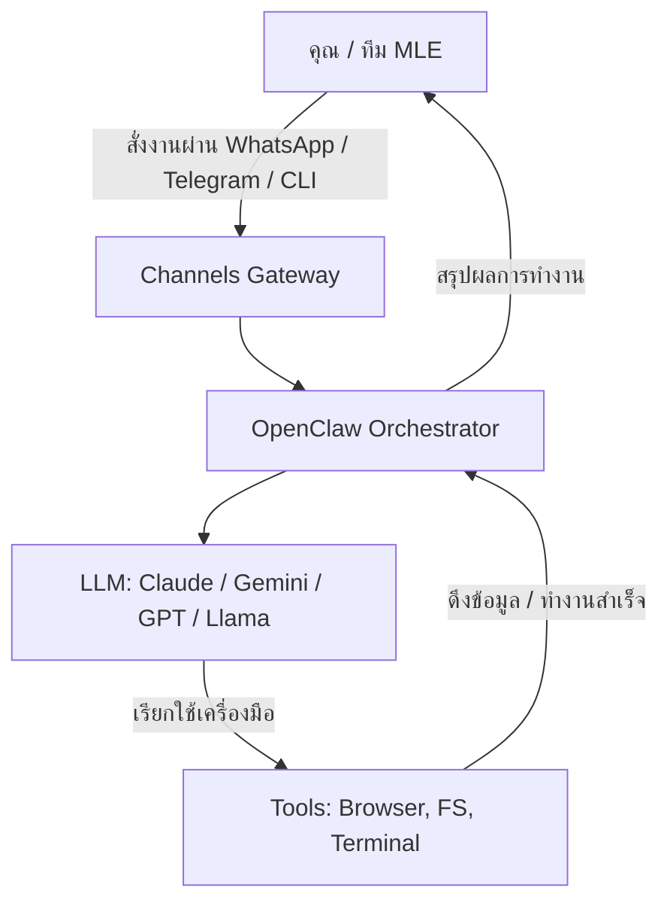

# [openclaw](https://clawctl.com/)

> **"Your Personal Autonomous AI Agent — Local-first, Private, and Agnostic."**

---

## ❔ คืออะไร (What is it)
**OpenClaw** (เดิมชื่อ Moltbot / Clawdbot) คือ Autonomous AI Agent แบบ Open-source ที่ออกแบบมาให้เป็น "ผู้ช่วยส่วนตัวที่รันอยู่บนเครื่องเราเอง" (Local-first) โดยเน้นความปลอดภัย ความเป็นส่วนตัว และความสามารถในการทำงานข้าม Platform (Omni-channel) ผ่าน messaging apps อย่าง WhatsApp, Telegram และ Discord.

สิ่งที่ทำให้ OpenClaw ต่างจากเครื่องมืออย่าง Claude Code คือมันไม่ได้โฟกัสแค่การเขียนโค้ด แต่โฟกัสที่ **"General Task Orchestration"** ตั้งแต่การจัดการไฟล์, รัน Terminal, คุม Browser ผ่าน Playwright ไปจนถึงการแชทโต้ตอบผ่านมือถือจากที่ไหนก็ได้.

---

## 🌍 General Use Cases (สิ่งที่ตัวนี้ทำได้ดี)

นอกเหนือจากงานทางเทคนิค OpenClaw ยังทำหน้าที่เป็น "ผู้ช่วยส่วนตัว" ในชีวิตประจำวันได้:

1. **Remote Admin**: คุณไม่อยู่หน้าคอม แต่อยากเช็คว่า "Server ยังรันอยู่ไหม?" หรือ "Disk จะเต็มหรือยัง?" สั่งผ่าน Telegram ได้ทันที.
2. **Automated Content Curator**: สั่งให้ Agent คอย Scan หน้าเว็บข่าวเทคโนโลยีทุกเช้า แล้วสรุปจุดที่สำคัญที่สุดมาส่งใน WhatsApp.
3. **Personal Knowledge Manager**: สั่งให้มันจดบันทึกไอเดียที่แวบเข้ามาในแชท แล้วให้ Agent ไปเขียนลงในไฟล์ Markdown ในเครื่องให้เรียบร้อย.
4. **Data Scraper with Brain**: เข้าเว็บไปดึงข้อมูลราคาหรือสถิติ แล้วให้ LLM ช่วย Clean ข้อมูลก่อนบันทึกลง CSV หรือ Database.

---

## 🌟 Key Features

### 1. 📂 Local-First & Privacy Suite
- ข้อมูลทั้งหมด (Logs, Files, Context) เก็บไว้บนเครื่องเรา 100%
- ไม่มีการส่งข้อมูลกลับไปที่ Server ของผู้พัฒนาภายนอก.
- เหมาะสำหรับงานที่ต้องจัดการ Internal Data, API Keys หรือความลับของบริษัท.

### 2. 🤖 Autonomous Browser (ZeroClaw / Playwright)
- ความสามารถในการคุม Browser (Headless/Headed) เพื่อทำ **Web Crawling**, **Automated Testing** หรือเก็บข้อมูลจากหน้าเว็บที่ต้อง Login (เช่น Dashboard ภายใน).
- ใช้ Playwright เป็น Backbone ทำให้รองรับ Dynamic Content และการ Interaction ที่ซับซ้อนได้แม่นยำกว่า Scraper ทั่วไป.

### 3. 🛠️ Skill Platform (Extensibility)
- MLE สามารถเขียน **Custom Skills** ด้วย Python หรือ JavaScript เพื่อเชื่อมต่อ with Database หรือ Workflow เฉพาะของทีม.
- รองรับ **Cron jobs** สำหรับรัน Task อัตโนมัติตามเวลา (เช่น ดึงสถิติ Model Performance รายวันส่งเข้า Telegram).

---

## 🛠️ รายละเอียดความสามารถหลัก (Detailed Capabilities)

OpenClaw ไม่ใช่แค่ Chatbot แต่เป็น **Autonomous Agent** ที่มีความสามารถครอบคลุม:

- **🖥️ Terminal Execution**: สามารถสั่งรันคำสั่ง Shell, ติดตั้ง Library, หรือจัดการ Workflow ของระบบได้โดยตรง (มีระบบขออนุญาตก่อนรันเพื่อความปลอดภัย).
- **📂 File System Management**: อ่าน, เขียน, ย้าย, และจัดระเบียบไฟล์ในเครื่องได้เหมือนเราทำเอง (เช่น "ช่วยย้ายไฟล์สรุปจากโฟลเดอร์ Download ไปไว้ใน Obsidian ให้หน่อย").
- **🌐 Web Automation (Playwright)**: เข้าใจเว็บไซด์ที่มี JavaScript ซับซ้อน, จัดการ Pop-up, หรือทำการ Extract ข้อมูลจากหน้าเว็บที่ต้อง Login.
- **🗨️ Multi-Channel Support**: เชื่อมต่อกับแอปแชทที่เราใช้ประจำ (WhatsApp, Telegram, Discord, Slack) ทำให้เราคุมคอมที่บ้าน/ที่ออฟฟิศได้จากทุกที่.
- **⚙️ Persistent Memory**: จดจำบริบทการคุย, ความชอบของผู้ใช้, และประวัติการทำงานเพื่อความฉลาดที่เพิ่มขึ้นตามเวลา.

---

## 🏗️ Core Architecture (สำหรับ MLE)

OpenClaw ถูกสร้างขึ้นบนพื้นฐานของ **Orchestration Framework** ที่แยกส่วนการทำงานชัดเจนเพื่อให้ยืดหยุ่นต่อการทำงานของทีม ML:

- **Gateway**: Single control plane สำหรับจัดการ Sessions, Channels, และ Tools ทั้งหมด.
- **Tools & Skills**: ระบบ Plugin ที่อนุญาตให้ LLM สามารถ Execute คำสั่งจริงได้ (เช่น `FileAccess`, `Terminal`, `Browser`).
- **Channels**: ตัวเชื่อมต่อกับ Chat interfaces (WhatsApp, Telegram, Discord, Slack, etc.).
- **Model Agnostic**: รองรับทุก LLM ผ่าน API (OpenAI, Anthropic, Gemini, Grok) หรือรัน Local ผ่าน Ollama เพื่อความเป็นส่วนตัวสูงสุด.

---

## 💻 OpenClaw vs Claude Code: เจาะลึกความแตกต่าง

แม้ทั้งคู่จะเป็น AI Agent ที่ทำงานผ่าน CLI แต่มี "DNA" และจุดประสงค์การใช้งานที่ต่างกันอย่างชัดเจน:

### 1. บทบาท (Role & Focus)
- **Claude Code**: เปรียบเสมือน **"Senior Pair Programmer"** ที่นั่งอยู่ข้างๆ คุณใน Terminal เน้นการเขียนโค้ด, แก้บั๊ก, และทำ Unit Test ภายในโปรเจกต์ (Project-centric).
- **OpenClaw**: เปรียบเสมือน **"Personal Digital Manager"** ที่รันอยู่บน Server หรือคอมพิวเตอร์ของคุณตลอดเวลา เน้นการจัดการงานทั่วไป (General Tasks), การทำ Automation ข้ามแอป, และการคุมระบบจากระยะไกล (Operating System-centric).

### 2. การสื่อสาร (Interaction Model)
- **Claude Code**: ทำงานในรูปแบบ **Session-based** (เปิด Terminal -> สั่งงาน -> จบงาน) เน้นความรวดเร็วในการเขียนไฟล์และรันคำสั่งภายใต้ Context ของโค้ดเบส.
- **OpenClaw**: ทำงานแบบ **Omni-channel & Always-on** คุณสามารถส่งข้อความหา Agent ผ่าน WhatsApp หรือ Telegram ในขณะที่เดินห้าง เพื่อสั่งให้มัน "สรุปผลการเทรน Model ที่รันค้างไว้ในบริษัท" หรือ "แคปหน้าจอ Dashboard มาให้ดูหน่อย".

### 3. ความสามารถด้าน Browser (Web Capabilities)
- **Claude Code**: มีความสามารถในการอ่านหน้าเว็บจำกัด (มักจะเป็น Read-only) เพื่อหาข้อมูลมาช่วยเขียนโค้ด.
- **OpenClaw**: มีเครื่องยนต์ **Playwright** เต็มรูปแบบ สามารถคลิกปุ่ม, กรอกฟอร์ม, จัดการ Cookies, และ Navigate ผ่านเว็บที่ซับซ้อนได้ (เหมาะมากสำหรับงาน Data Collection หรือ Testing).

### 4. ความเป็นส่วนตัวและโมเดล (Privacy & Model Agnostic)
- **Claude Code**: ผูกติดกับโมเดลของ Anthropic (Claude 3.5/3.7) และมีการเก็บ Log บน Cloud ตามนโยบายของ Anthropic.
- **OpenClaw**: **Local-first โดยสมบูรณ์** คุณเลือกใช้โมเดลอะไรก็ได้ (OpenAI, Gemini หรือ Local model ผ่าน Ollama) ข้อมูล Logs และ Context ทั้งหมดไม่เคยออกจากเครื่องของคุณหากคุณไม่ต้องการ.

---

## 📊 เปรียบเทียบกับเครื่องมืออื่นๆ (Update 2026)

| ฟีเจอร์ | **OpenClaw** (ZeroClaw) | **Claude Code** | **Goose** (Block) |
| :--- | :--- | :--- | :--- |
| **โฟกัสหลัก** | General Assistant / Automation | Agentic Coding | Task Automation |
| **Interface** | CLI, WhatsApp, Telegram, Discord | Dedicated CLI | CLI |
| **Data Privacy** | Local-first (Private) | Cloud-based (Default) | Local / Cloud |
| **Browsing** | Playwright (Native / Full control) | ⚠️ จำกัด (Read-only) | ✅ มี (Puppeteer) |
| **Execution** | Multi-platform / Always-on | Session-based CLI | Session-based CLI |

---

## ⚡ ตระกูล "Claw" และตัวแทนที่เน้น Efficiency (Alternatives)

หาก OpenClaw (ต้นฉบับที่เป็น TypeScript) ดูหนักเครื่องเกินไปสำหรับบาง Environment ทีมสามารถเลือกใช้ตัวแทนในโปรเจกต์ตระกูลเดียวกันที่ถูก Rewrite ใหม่เพื่อความเร็วและประหยัดทรัพยากร:

| โปรเจกต์ | ภาษาที่ใช้ | จุดเด่น (Key Advantage) | ขนาดไฟล์ / RAM | เหมาะสำหรับ |
| :--- | :--- | :--- | :--- | :--- |
| **[NullClaw](https://github.com/nullclaw/nullclaw)** | **Zig** | **Fastest & Lightest** เร็วสุดขีด เริ่มต้นใน <2ms | ~600KB / 1MB RAM | IoT, Edge Computing, ฝังในระบบ |
| **[ZeroClaw](https://github.com/zeroclaw-labs/zeroclaw)** | **Rust** | **Performance & Safety** มีความเสถียรและเร็วสูง | ~3.4MB / 5MB RAM | Server ที่ต้องการความ High-availability |
| **[PicoClaw](https://github.com/sipeed/picoclaw)** | **Go** | **Concurrency** จัดการงานขนานได้ดีในขนาดที่เล็ก | - / ~10MB RAM | Microservices ขนาดเล็ก |
| **[NanoBot](https://github.com/HKUDS/nanobot)** | **Python** | **Simplicity** โค้ดน้อยมหาศาล (~4,000 บรรทัด) | - / - | งานวิจัย, ปรับแต่ง Logic ได้ง่ายและไว |
| **[IronClaw](https://github.com/nearai/ironclaw)** | **Rust** | **Security First** ใช้ Sandboxing (Wasm) | - / - | งานที่ต้องการความปลอดภัยระดับสูง |

> 💡 **MLE Tip**: สำหรับการทำ Automation บน Server ส่วนตัว เราแนะนำ **ZeroClaw** หรือ **NullClaw** เพราะแทบไม่กินทรัพยากรเครื่องทิ้งไว้เลย (Idle consumption แทบเป็นศูนย์) เมื่อเทียบกับ Agent ตัวใหญ่ๆ

---

## 💡 Use Case สำหรับทีม MLE

- **Automated Data Collection**: ตั้งค่า Agent ให้ไปดึงข้อมูลจากแหล่งต่างๆ (Arxiv papers, AI News) มาทำสรุปและบันทึกลง Obsidian หรือส่งเข้ากลุ่ม Slack.
- **Model Monitoring & Alerting**: เชื่อมต่อระบบ Alert ให้ส่งสรุป Error หรือ Model Drift เข้า Telegram พร้อมความสามารถในการสั่ง "Analyze logs" กลับไปได้ทันทีจากมือถือ.
- **Workflow Orchestration**: ใช้เป็นตัวกลางสั่งรัน Task ยาวๆ เช่นการเตรียม Data Environment หรือการ Deploy model เบื้องต้น โดยที่เราไม่ต้องนั่งเฝ้าหน้าจอ.

---

## 📌 วิธีเริ่มต้น (Quick Start)

1.  **ติดตั้ง CLI**: ใช้ `clawctl` (หรือเครื่องมือในตระกูล ZeroClaw)
2.  **Config Model**: ตั้งค่า API Key และ Model ที่ต้องการใน `.zeroclaw/config.toml`
3.  **เชื่อมต่อ Channel**: เลือก Platform (เช่น สแกน QR Code เพื่อต่อ WhatsApp)
4.  **ลองสั่งงาน**: *"ไปอ่าน Repo ล่าสุดของโครงการ X แล้วสรุปจุดที่น่าจะเอามาทำ Optimization ให้หน่อย"*

---

> ℹ️ **Reference**
> - [OpenClaw Official Website](https://clawctl.com/)
> - [GitHub: OpenClaw Project](https://github.com/openclaw/openclaw)
> - [Documentation: Skills & Extensions](https://docs.clawctl.com/)

---
## Related Notes
- [[Sub-Agent]]
- [[Claude Code]]
- [[LLMOps]]
