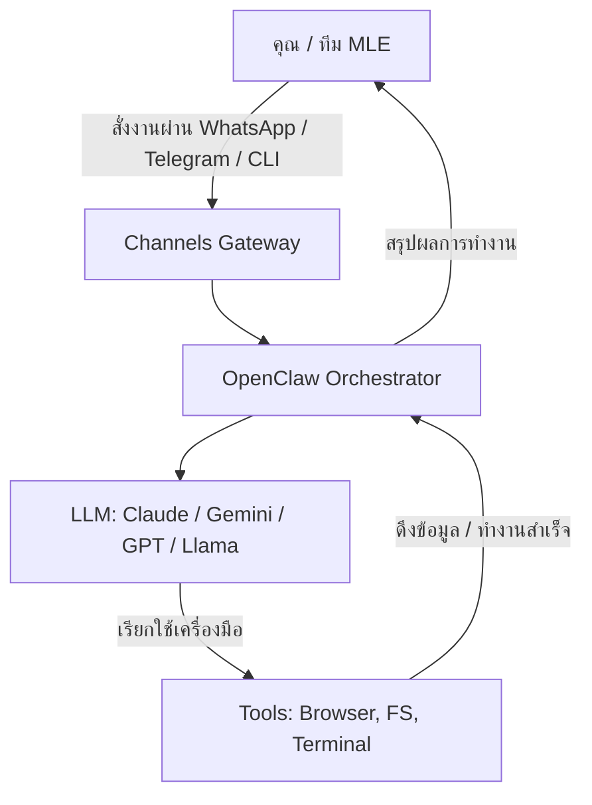

# [openclaw](https://openclaw.ai/)

> **"Your Personal Autonomous AI Agent — Local-first, Private, and Agnostic."**

---

## ❔ คืออะไร (What is it)
**OpenClaw** (เดิมชื่อ Moltbot / Clawdbot) เป็นผู้ช่วย AI อัตโนมัติแบบโอเพนซอร์สที่รันบนเครื่องของผู้ใช้ และสั่งงานผ่านแอปข้อความ เช่น WhatsApp, Telegram และ Discord ได้ ส่วน **ZeroClaw** เป็นอีกโครงการหนึ่งที่พัฒนาด้วย Rust ไม่ใช่อีกชื่อของ OpenClaw

OpenClaw มุ่งจัดการงานทั่วไป (General Task Orchestration) ตั้งแต่จัดการไฟล์ รันคำสั่งใน Terminal ควบคุมเบราว์เซอร์ผ่าน Playwright ไปจนถึงรับคำสั่งจากแอปข้อความบนมือถือ

---

## 🌍 General Use Cases (สิ่งที่ตัวนี้ทำได้ดี)

นอกจากงานทางเทคนิคแล้ว ยังใช้ OpenClaw ช่วยงานประจำวันได้ เช่น:

1. **Remote Admin**: ตรวจจากระยะไกลว่าเซิร์ฟเวอร์ยังทำงานอยู่หรือพื้นที่ดิสก์ใกล้เต็มหรือไม่ โดยสั่งผ่าน Telegram
2. **Automated Content Curator**: ให้ agent อ่านเว็บข่าวเทคโนโลยีทุกเช้า แล้วส่งประเด็นสำคัญเข้า WhatsApp
3. **Personal Knowledge Manager**: ส่งไอเดียผ่านแชท แล้วให้ agent บันทึกลงไฟล์ Markdown ในเครื่อง
4. **Data Scraper with Brain**: ดึงราคาหรือสถิติจากเว็บ แล้วใช้ LLM จัดรูปแบบข้อมูลก่อนบันทึกเป็น CSV หรือเก็บในฐานข้อมูล

---

## 🌟 Key Features

### 1. 📂 Local-First & Privacy Suite
- เก็บไฟล์ บันทึกการทำงาน (logs) และข้อมูลบริบทไว้บนเครื่องที่รันระบบได้
- หากเลือกโมเดลผ่าน API ภายนอก ข้อมูลที่ใช้เรียกโมเดลจะถูกส่งไปยังผู้ให้บริการนั้น การจัดการข้อมูลจึงขึ้นอยู่กับ backend และค่าตั้งค่า
- งานที่มีข้อมูลภายใน API keys หรือความลับขององค์กรต้องเลือกรูปแบบการเชื่อมต่อและสิทธิ์เข้าถึงให้เหมาะสม

### 2. 🤖 Autonomous Browser (Playwright)

- ควบคุมเบราว์เซอร์ทั้งแบบมีหน้าต่างและไม่มีหน้าต่าง (headed/headless) เพื่อค้นข้อมูล ทดสอบเว็บอัตโนมัติ หรือเข้าหน้าเว็บที่ต้องล็อกอิน เช่น dashboard ภายใน
- ใช้ Playwright ควบคุมหน้าเว็บที่มี JavaScript และเนื้อหาเปลี่ยนแปลงระหว่างใช้งาน

### 3. 🛠️ Skill Platform (Extensibility)
- ทีม MLE เขียน **Custom Skills** ด้วย Python หรือ JavaScript เพื่อเชื่อมต่อฐานข้อมูลและขั้นตอนทำงานเฉพาะของทีมได้
- ใช้ **Cron jobs** รันงานตามเวลา เช่น ส่งสถิติประสิทธิภาพโมเดลรายวันเข้า Telegram

---

## 🛠️ รายละเอียดความสามารถหลัก (Detailed Capabilities)

OpenClaw รับคำสั่งและใช้เครื่องมือทำงานได้หลายด้าน:

- **🖥️ Terminal Execution**: รันคำสั่ง Shell ติดตั้งไลบรารี และจัดการงานในระบบได้ โดยการขออนุญาตขึ้นอยู่กับค่าความปลอดภัยที่ตั้งไว้
- **📂 File System Management**: อ่าน เขียน ย้าย และจัดระเบียบไฟล์ เช่น ย้ายไฟล์สรุปจากโฟลเดอร์ Download ไปยัง Obsidian
- **🌐 Web Automation (Playwright)**: ใช้งานเว็บที่มี JavaScript จัดการ pop-up และดึงข้อมูลจากหน้าที่ต้องล็อกอิน
- **🗨️ Multi-Channel Support**: เชื่อมต่อ WhatsApp, Telegram, Discord หรือ Slack เพื่อรับคำสั่งจากระยะไกล
- **⚙️ Persistent Memory**: เก็บบริบทการสนทนา ความชอบ และประวัติการทำงาน เพื่อนำมาใช้ในงานครั้งต่อไป

---

## 🏗️ Core Architecture (สำหรับ MLE)

สถาปัตยกรรมของ OpenClaw แยกส่วนรับข้อความ จัดการงาน เรียกโมเดล และใช้เครื่องมือออกจากกัน:

```mermaid
graph TD
    User[คุณ / ทีม MLE] -- สั่งงานผ่าน WhatsApp / Telegram / CLI --> Channel[Channels Gateway]
    Channel --> Orchestrator[OpenClaw Orchestrator]
    Orchestrator --> LLM[LLM: Claude / Gemini / GPT / Llama]
    LLM -- เรียกใช้เครื่องมือ --> Tools[Tools: Browser, FS, Terminal]
    Tools -- ดึงข้อมูล / ทำงานสำเร็จ --> Orchestrator
    Orchestrator -- สรุปผลการทำงาน --> User
```

- **Gateway**: จุดควบคุมกลางสำหรับจัดการ sessions, channels และ tools
- **Tools & Skills**: เครื่องมือและส่วนขยายที่ให้ LLM เรียกทำงานจริง เช่น `FileAccess`, `Terminal` และ `Browser`
- **Channels**: ตัวเชื่อมต่อกับแอปข้อความ เช่น WhatsApp, Telegram, Discord และ Slack
- **Model Agnostic**: เลือกโมเดลผ่าน API เช่น OpenAI, Anthropic, Gemini และ Grok หรือใช้โมเดล local ผ่าน Ollama

---

## 💻 OpenClaw vs Claude Code: เจาะลึกความแตกต่าง

ทั้งสองเครื่องมือรับคำสั่งผ่าน CLI ได้ แต่เน้นงานและรูปแบบการใช้งานต่างกัน:

### 1. บทบาท (Role & Focus)
- **Claude Code**: เป็นผู้ช่วยเขียนโค้ดใน Terminal เน้นแก้บั๊ก ตรวจโค้ด และทำ unit test ภายในโปรเจกต์
- **OpenClaw**: เป็นผู้ช่วยจัดการงานทั่วไปที่รันบนเซิร์ฟเวอร์หรือคอมพิวเตอร์ต่อเนื่อง เน้นทำงานข้ามแอปและควบคุมระบบจากระยะไกล

### 2. การสื่อสาร (Interaction Model)
- **Claude Code**: ทำงานเป็น session ใน Terminal โดยใช้บริบทของโปรเจกต์เพื่ออ่านและแก้ไฟล์หรือรันคำสั่ง
- **OpenClaw**: รับคำสั่งผ่านหลายช่องทางและทำงานต่อเนื่องได้ เช่น ส่งข้อความทาง WhatsApp หรือ Telegram ให้สรุปผลการฝึกโมเดลหรือจับภาพ dashboard

### 3. ความสามารถด้าน Browser (Web Capabilities)
- **Claude Code**: ในการเปรียบเทียบนี้ เน้นการอ่านเว็บเพื่อหาข้อมูลประกอบการเขียนโค้ด
- **OpenClaw**: ใช้ Playwright คลิกปุ่ม กรอกฟอร์ม จัดการ cookies และนำทางบนเว็บ เหมาะกับการเก็บข้อมูลและทดสอบเว็บ

### 4. ความเป็นส่วนตัวและโมเดล (Privacy & Model Agnostic)
- **Claude Code**: ใช้โมเดลของ Anthropic เช่น Claude 3.5/3.7 โดยการเก็บ logs ต้องพิจารณาตามนโยบายของบริการที่ใช้
- **OpenClaw**: เน้น **local-first** และเลือกได้ทั้งโมเดลผ่าน API กับโมเดลที่รันในเครื่อง แต่ local-first ไม่ได้รับประกันว่าข้อมูลจะไม่ออกจากเครื่องเมื่อเชื่อมต่อบริการภายนอก

---

## 📊 เปรียบเทียบกับเครื่องมืออื่นๆ (Update 2026)

| ฟีเจอร์ | **OpenClaw** | **Claude Code** | **Goose** (Block) |
| :--- | :--- | :--- | :--- |
| **โฟกัสหลัก** | General Assistant / Automation | Agentic Coding | Task Automation |
| **Interface** | CLI, WhatsApp, Telegram, Discord | Dedicated CLI | CLI |
| **Data Privacy** | Local-first (Private) | Cloud-based (Default) | Local / Cloud |
| **Browsing** | Playwright (Native / Full control) | ⚠️ จำกัด (Read-only) | ✅ มี (Puppeteer) |
| **Execution** | Multi-platform / Always-on | Session-based CLI | Session-based CLI |

---

## ⚡ ตระกูล "Claw" และตัวแทนที่เน้น Efficiency (Alternatives)

หาก OpenClaw ซึ่งพัฒนาด้วย TypeScript ใช้ทรัพยากรมากเกินไปสำหรับงานที่ต้องการ ยังมีโครงการทางเลือกที่ใช้ภาษาและแนวทางต่างกัน เช่น:

| โปรเจกต์ | ภาษาที่ใช้ | จุดเด่น (Key Advantage) | ขนาดไฟล์ / RAM | เหมาะสำหรับ |
| :--- | :--- | :--- | :--- | :--- |
| **[NullClaw](https://github.com/nullclaw/nullclaw)** | **Zig** | **Fast & Lightweight** เริ่มทำงานใน <2ms | ~600KB / 1MB RAM | IoT, Edge Computing, ระบบฝังตัว |
| **[ZeroClaw](https://github.com/zeroclaw-labs/zeroclaw)** | **Rust** | **Performance & Safety** เน้นประสิทธิภาพและความปลอดภัย | ~3.4MB / 5MB RAM | เซิร์ฟเวอร์ที่ต้องทำงานต่อเนื่อง |
| **[PicoClaw](https://github.com/sipeed/picoclaw)** | **Go** | **Concurrency** จัดการงานขนานในระบบขนาดเล็ก | - / ~10MB RAM | Microservices ขนาดเล็ก |
| **[NanoBot](https://github.com/HKUDS/nanobot)** | **Python** | **Simplicity** โค้ดประมาณ 4,000 บรรทัด | - / - | งานวิจัยและงานที่ต้องปรับตรรกะบ่อย |
| **[IronClaw](https://github.com/nearai/ironclaw)** | **Rust** | **Security First** ใช้ Sandboxing (Wasm) | - / - | งานที่ต้องการความปลอดภัยระดับสูง |

> 💡 **MLE Tip**: ZeroClaw และ NullClaw เป็นตัวเลือกสำหรับงานอัตโนมัติบนเซิร์ฟเวอร์ส่วนตัวที่ต้องการลดการใช้ทรัพยากร ควรพิจารณาร่วมกับโมเดลและเครื่องมือที่จะใช้งาน

---

## 💡 Use Case สำหรับทีม MLE

- **Automated Data Collection**: ให้ agent ดึงงานวิจัยจาก arXiv หรือข่าว AI มาสรุป แล้วบันทึกลง Obsidian หรือส่งเข้ากลุ่ม Slack
- **Model Monitoring & Alerting**: ส่งสรุป error หรือ model drift เข้า Telegram และรับคำสั่งวิเคราะห์ logs กลับจากมือถือ
- **Workflow Orchestration**: สั่งรันงานที่ใช้เวลานาน เช่น เตรียมสภาพแวดล้อมสำหรับข้อมูลหรือ deploy โมเดล โดยไม่ต้องเฝ้าหน้าจอ

---

## 📌 วิธีเริ่มต้น (Quick Start)

1. **ตรวจสอบ CLI**: คำสั่ง `clawctl` ในตัวอย่างนี้ยังไม่ยืนยันว่าเป็น CLI ของ OpenClaw ควรตรวจสอบแหล่งที่มาก่อนใช้
2. **Config Model (ZeroClaw)**: พาธ `.zeroclaw/config.toml` เป็นการตั้งค่าของ ZeroClaw สำหรับเลือก API Key และ Model
3. **เชื่อมต่อ Channel**: เลือกแพลตฟอร์ม เช่น เชื่อม WhatsApp ด้วย QR Code ตามวิธีของโปรเจกต์ที่ใช้
4. **ลองสั่งงาน**: *"อ่าน repository ของโครงการ X แล้วสรุปส่วนที่น่าจะปรับประสิทธิภาพได้"*

---

> ℹ️ **Reference**
> - [เว็บไซต์ clawctl](https://clawctl.com/)
> - [GitHub: OpenClaw Project](https://github.com/openclaw/openclaw)
> - [เอกสารที่ docs.clawctl.com](https://docs.clawctl.com/)
> - [OpenClaw: Local models](https://docs.openclaw.ai/gateway/local-models)
> - [OpenClaw: Security](https://docs.openclaw.ai/gateway/security)
> - [GitHub: ZeroClaw Project](https://github.com/zeroclaw-labs/zeroclaw)

---
## Related Notes
- [[Sub-Agent]]
- [[Claude Code]]
- [[LLMOps]]
