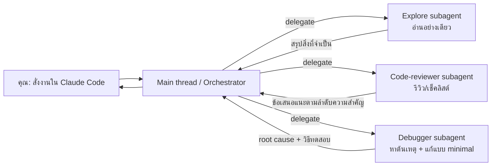

# Subagents ใน Claude Code

ลองนึกภาพว่าเราเป็นนักพัฒนาในวันเดดไลน์…  
งานเข้ามาพร้อมกัน 3 อย่าง: **แก้บั๊ก**, **รีวิวโค้ด**, และ **ไล่หาไฟล์ที่เกี่ยวข้องทั้งโปรเจกต์**  
เราก็เลยเปิด Claude Code (เครื่องมือ CLI สำหรับ agentic coding) เพื่อให้ช่วยทำงานแบบ “สำรวจ → ลงมือแก้ → ตรวจสอบ → ทำซ้ำ” ได้เร็วขึ้น. :contentReference[oaicite:0]{index=0}

แต่พอคุยไปสักพัก สิ่งที่เริ่มปวดหัวคือ…

- แชทยาวขึ้นเรื่อย ๆ (context บวม)
- งานแต่ละแบบต้อง “โหมดสมอง” คนละใบ (รีวิว vs ดีบัก vs สำรวจ)
- งานบางอย่างควรให้สิทธิ์น้อย ๆ (เช่น อ่านอย่างเดียว) แต่บางงานต้องแก้ไฟล์/รันคำสั่ง

ตรงนี้แหละที่ **Subagents** เข้ามาช่วย

---

## Subagents คืออะไร (เล่าแบบเข้าใจง่าย)

**Subagents** ใน Claude Code คือ “ผู้ช่วยเฉพาะทาง” ที่เราตั้งค่าไว้ล่วงหน้า แล้ว Claude Code จะ **มอบหมายงาน** ให้ผู้ช่วยคนนั้นทำแทน โดยแต่ละ Subagent:

- มี “ความถนัด/หน้าที่” ชัดเจน
- มี **context window แยกต่างหาก** (ไม่ทำให้แชทหลักบวม)
- กำหนดได้ว่าจะให้ใช้ **tools อะไรได้บ้าง**
- มี **system prompt เฉพาะทาง** กำกับพฤติกรรม

---

## Diagram: ทำไม Subagents ถึงช่วยลดความวุ่นวาย



หัวใจคือ **ให้ผู้ช่วยไป “ย่อยงาน” ใน context ของตัวเอง** แล้วส่งกลับมาเฉพาะ “สิ่งที่จำเป็น” — แชทหลักเลยยังโฟกัสเป้าหมายใหญ่ได้.

---

## เริ่มใช้งานเร็วที่สุด: `/agents`

วิธีที่เอกสารแนะนำคือเข้าเมนูจัดการ Subagents ด้วยคำสั่ง:

* พิมพ์ `/agents`
* เลือกสร้าง agent ใหม่
* เลือกว่าจะเป็น **project-level** หรือ **user-level**
* เลือก tools ที่อนุญาต และแก้ system prompt ตามสไตล์ทีม

---

## โครงสร้างไฟล์ของ Subagent (สำคัญมาก)

Subagents จะถูกเก็บเป็น **Markdown + YAML frontmatter** และวางได้ 2 ที่:

* `./.claude/agents/` = ใช้เฉพาะโปรเจกต์ (priority สูงสุด)
* `~/.claude/agents/` = ใช้ได้ทุกโปรเจกต์ (priority ต่ำกว่า)

> ถ้าชื่อซ้ำกัน **project-level จะชนะ**.

### Template โครงไฟล์ (ตาม docs)

```
---
name: your-sub-agent-name
description: Description of when this subagent should be invoked
tools: tool1, tool2, tool3
model: sonnet
permissionMode: default
skills: skill1, skill2
---

ใส่ system prompt ของ subagent ที่นี่
```

---

## ตัวอย่าง Subagent

### 1) code-reviewer

```md
---
name: code-reviewer
description: Expert code review specialist. Proactively reviews code for quality, security, and maintainability. Use immediately after writing or modifying code.
tools: Read, Grep, Glob, Bash
model: inherit
---

You are a senior code reviewer ensuring high standards of code quality and security.

When invoked:
1. Run git diff to see recent changes
2. Focus on modified files
3. Begin review immediately

Provide feedback organized by priority:
- Critical issues (must fix)
- Warnings (should fix)
- Suggestions (consider improving)
```

**วิธีเรียกใช้แบบตรง ๆ**

* `Have the code-reviewer subagent look at my recent changes`

---

### 2) debugger

เวลามี error แปลก ๆ หรือ test failed ให้ sub agent โฟกัสที่ “root cause” ไม่ใช่แค่แก้อาการ

```md
---
name: debugger
description: Debugging specialist for errors, test failures, and unexpected behavior. Use proactively when encountering any issues.
tools: Read, Edit, Bash, Grep, Glob
---

You are an expert debugger specializing in root cause analysis.

When invoked:
1. Capture error message and stack trace
2. Identify reproduction steps
3. Isolate the failure location
4. Implement minimal fix
5. Verify solution works
```


---

### 3) data-scientist — สาย SQL/BigQuery (คนละทักษะกับการโค้ดแอป)

ถ้าต้อง “ตอบคำถามจากข้อมูล” ด้วย SQL หรือสรุปอินไซต์เร็ว ๆ ให้แยก agent ไปเลย

```md
---
name: data-scientist
description: Data analysis expert for SQL queries, BigQuery operations, and data insights. Use proactively for data analysis tasks and queries.
tools: Bash, Read, Write
model: sonnet
---

You are a data scientist specializing in SQL and BigQuery analysis.
```


---

## Subagents ทำงานอัตโนมัติได้ยังไง (และเราปรับให้ “เรียกใช้บ่อยขึ้น” ได้)

Claude Code จะพิจารณา delegate จาก:

* คำอธิบายงานที่คุณพิมพ์
* ช่อง `description` ของ subagent
* context ปัจจุบัน + tools ที่มี

ทริคใน docs คือใส่คำใน `description` ให้ชัด เช่น **“Use proactively”** เพื่อกระตุ้นให้มันถูกเลือกบ่อยขึ้น.

---

## Built-in subagents ที่มีมาให้ (และควรรู้จักไว้)

Claude Code มี subagents ติดมาให้ เช่น:

* **General-purpose subagent**: งานหลายสเต็ปที่ต้องทั้งสำรวจและแก้ไข (ใช้ Sonnet, tools ครบ) 
* **Plan subagent**: ใช้เฉพาะตอน “plan mode” เพื่อสำรวจโค้ดก่อนเสนอแผน และป้องกันการซ้อน agent ไม่รู้จบ (subagents ไม่สามารถ spawn subagents อื่นได้) 
* **Explore subagent**: โหมดอ่านอย่างเดียว เน้นค้นหาเร็ว (ใช้ Haiku, read-only) 

---

## Best practices (สรุปให้เอาไปใช้ได้เลย)

แนวทางที่เอกสารแนะนำ:

1. **เริ่มจากให้ Claude ช่วย generate ก่อน แล้วค่อยปรับให้เป็นของเรา**
2. **ทำให้แต่ละ subagent หน้าที่เดียว (single responsibility)**
3. **เขียน prompt ให้ละเอียด + มีตัวอย่าง/ข้อห้าม**
4. **ให้สิทธิ์ tools เท่าที่จำเป็น (least privilege)**
5. **ถ้าเป็น project subagents ให้ commit เข้า version control** 

---

<!-- ## Bonus: เล่นเป็น “สายพานการทำงาน” (Chaining & Resumable)

ถ้างานใหญ่ คุณสั่งเป็นทอด ๆ ได้ เช่น:

* “ให้ code-analyzer หา performance issue ก่อน แล้วค่อยให้ optimizer แก้” 

และถ้างานวิเคราะห์ยาว ๆ สามารถ “resume” ต่อด้วย `agentId` ได้ด้วย. 

--- -->

## แหล่งรวม Subagents จากชุมชน (เอาไปปรับต่อได้ไว)

ถ้าอยากได้ไอเดีย/เทมเพลตจำนวนมาก มี repo รวม subagents ที่คนแชร์ไว้ (เลือกใช้และตรวจ prompt/permissions ให้เหมาะกับทีมก่อน):

* Awesome collection ของ VoltAgent 
* Repo รวม subagents อีกชุด (ตัวอย่างหลายโดเมน) 

---

# References

* [Claude Code Docs — “Subagents”](https://code.claude.com/docs/en/sub-agents)
* [Anthropic Engineering — “Claude Code: Best practices for agentic coding”](https://www.anthropic.com/engineering/claude-code-best-practices)
* [Anthropic Engineering — “Building agents with the Claude Agent SDK” (แนวคิดเรื่อง subagents: parallelization + context isolation)](https://www.anthropic.com/engineering/building-agents-with-the-claude-agent-sdk)
* [VoltAgent/awesome-claude-code-subagents (community templates)](https://github.com/VoltAgent/awesome-claude-code-subagents?utm_source=chatgpt.com)
* [Claude Code Subagents Collection](https://github.com/0xfurai/claude-code-subagents?utm_source=chatgpt.com)

