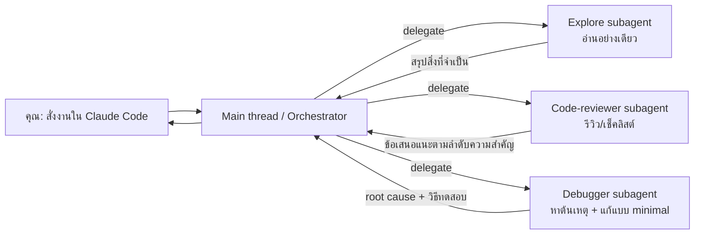

# Subagents ใน Claude Code

สมมติว่าเราเป็นนักพัฒนาที่กำลังเร่งงานให้ทันกำหนดส่ง
มีงานเข้ามาพร้อมกัน 3 อย่าง: **แก้บั๊ก**, **รีวิวโค้ด** และ **ค้นหาไฟล์ที่เกี่ยวข้องในโปรเจกต์**
เราเปิด Claude Code ซึ่งเป็นเครื่องมือ CLI สำหรับ agentic coding เพื่อช่วยสำรวจโค้ด ลงมือแก้ ตรวจสอบผล และทำซ้ำจนงานเสร็จ

แต่เมื่อทำงานไปสักพัก อาจเจอปัญหาเหล่านี้:

- บทสนทนายาวขึ้นเรื่อย ๆ จนมีบริบทสะสมมาก
- งานรีวิว ดีบัก และสำรวจโค้ดต้องใช้แนวทางทำงานต่างกัน
- บางงานต้องการสิทธิ์อ่านอย่างเดียว ส่วนบางงานต้องแก้ไฟล์หรือรันคำสั่ง

**Subagents** ช่วยแยกงานเหล่านี้ให้จัดการได้ง่ายขึ้น

---

## Subagents คืออะไร (เล่าแบบเข้าใจง่าย)

**Subagents** ใน Claude Code คือผู้ช่วยเฉพาะทางที่เราตั้งค่าไว้ล่วงหน้า เพื่อให้ Claude Code มอบหมายงานให้ โดยแต่ละ subagent:

- มีหน้าที่และขอบเขตงานชัดเจน
- มี **context window แยกต่างหาก** ช่วยลดข้อมูลที่สะสมในบทสนทนาหลัก
- กำหนดได้ว่าใช้ **tools ใดได้บ้าง**
- มี **system prompt เฉพาะทาง** กำกับพฤติกรรม

---

## Diagram: ทำไม Subagents ถึงช่วยลดความวุ่นวาย


```mermaid
flowchart LR
  U[คุณ: สั่งงานใน Claude Code] --> M[Main thread / Orchestrator]
  M -->|delegate| E[Explore subagent 
  อ่านอย่างเดียว]
  M -->|delegate| R[Code-reviewer subagent
  รีวิว/เช็คลิสต์]
  M -->|delegate| D[Debugger subagent
  หาต้นเหตุ + แก้แบบ minimal]
  E -->|สรุปสิ่งที่จำเป็น| M
  R -->|ข้อเสนอแนะตามลำดับความสำคัญ| M
  D -->|root cause + วิธีทดสอบ| M
  M --> U
```

หัวใจคือให้ผู้ช่วยทำงานใน context ของตัวเอง แล้วส่งกลับมาเฉพาะข้อสรุปที่จำเป็น บทสนทนาหลักจึงยังติดตามเป้าหมายของงานได้

---

## เริ่มใช้งานเร็วที่สุด: `/agents`

เริ่มจากเปิดเมนูจัดการ subagents ด้วยคำสั่ง:

* พิมพ์ `/agents`
* เลือกสร้าง agent ใหม่
* เลือก **project-level** สำหรับโปรเจกต์นี้ หรือ **user-level** สำหรับใช้ข้ามโปรเจกต์
* เลือก tools ที่อนุญาตและปรับ system prompt ให้เหมาะกับทีม

---

## โครงสร้างไฟล์ของ Subagent (สำคัญมาก)

ไฟล์กำหนด subagent ใช้ **Markdown พร้อม YAML frontmatter** และวางได้ 2 ที่:

* `./.claude/agents/` = ใช้เฉพาะโปรเจกต์ (priority สูงสุด)
* `~/.claude/agents/` = ใช้ได้ทุกโปรเจกต์ (priority ต่ำกว่า)

> ถ้าชื่อซ้ำกัน จะใช้การตั้งค่าระดับ **project-level**

### Template โครงไฟล์ (ตาม docs)

```
---
name: your-sub-agent-name
description: Description of when this subagent should be invoked
tools: tool1, tool2, tool3
model: sonnet
permissionMode: default
skills: skill1, skill2
---

ใส่ system prompt ของ subagent ที่นี่
```

---

## ตัวอย่าง Subagent

### 1) code-reviewer

```md
---
name: code-reviewer
description: Expert code review specialist. Proactively reviews code for quality, security, and maintainability. Use immediately after writing or modifying code.
tools: Read, Grep, Glob, Bash
model: inherit
---

You are a senior code reviewer ensuring high standards of code quality and security.

When invoked:
1. Run git diff to see recent changes
2. Focus on modified files
3. Begin review immediately

Provide feedback organized by priority:
- Critical issues (must fix)
- Warnings (should fix)
- Suggestions (consider improving)
```

**วิธีเรียกใช้แบบตรง ๆ**

* `Have the code-reviewer subagent look at my recent changes`

---

### 2) debugger

เมื่อเจอ error หรือการทดสอบไม่ผ่าน ให้ subagent ตรวจหาสาเหตุที่แท้จริง (root cause) ก่อนแก้ไข

```md
---
name: debugger
description: Debugging specialist for errors, test failures, and unexpected behavior. Use proactively when encountering any issues.
tools: Read, Edit, Bash, Grep, Glob
---

You are an expert debugger specializing in root cause analysis.

When invoked:
1. Capture error message and stack trace
2. Identify reproduction steps
3. Isolate the failure location
4. Implement minimal fix
5. Verify solution works
```


---

### 3) data-scientist — สาย SQL/BigQuery (คนละทักษะกับการโค้ดแอป)

หากต้องตอบคำถามจากข้อมูลด้วย SQL หรือสรุปผลวิเคราะห์ ให้แยกงานไปยัง agent ที่รับผิดชอบด้านข้อมูล

```md
---
name: data-scientist
description: Data analysis expert for SQL queries, BigQuery operations, and data insights. Use proactively for data analysis tasks and queries.
tools: Bash, Read, Write
model: sonnet
---

You are a data scientist specializing in SQL and BigQuery analysis.
```


---

## Subagents ทำงานอัตโนมัติได้ยังไง (และเราปรับให้ “เรียกใช้บ่อยขึ้น” ได้)

Claude Code พิจารณาว่าจะมอบหมายงานให้ subagent ใดจาก:

* คำอธิบายงานที่คุณพิมพ์
* ช่อง `description` ของ subagent
* context ปัจจุบันและ tools ที่มีให้ใช้

เอกสารแนะนำให้เขียน `description` ชัดเจน เช่น **“Use proactively”** เพื่อบอกให้เรียกใช้เมื่อมีงานที่เกี่ยวข้อง

---

## Built-in subagents ที่มีมาให้ (และควรรู้จักไว้)

Claude Code มี subagents ติดมาให้ เช่น:

* **General-purpose subagent**: งานหลายขั้นตอนที่ต้องทั้งสำรวจและแก้ไข (ใช้ Sonnet และมี tools ครบ)
* **Plan subagent**: สำรวจโค้ดก่อนเสนอแผนใน plan mode โดย subagent ไม่สามารถเรียก subagent อื่นซ้อนต่อได้
* **Explore subagent**: เน้นค้นหาและอ่านข้อมูลอย่างรวดเร็ว (ใช้ Haiku และมีสิทธิ์อ่านอย่างเดียว)

---

## Best practices (สรุปให้เอาไปใช้ได้เลย)

แนวทางที่เอกสารแนะนำ:

1. **ให้ Claude ช่วยร่าง subagent ก่อน แล้วปรับให้เหมาะกับงาน**
2. **ให้แต่ละ subagent มีหน้าที่ชัดเจนเพียงด้านเดียว (single responsibility)**
3. **เขียน prompt ให้ชัด พร้อมตัวอย่างและข้อจำกัด**
4. **ให้สิทธิ์ใช้ tools เท่าที่จำเป็น (least privilege)**
5. **เก็บ project subagents ไว้ใน version control ร่วมกับโปรเจกต์**

---

| เครื่องมือ                                   |                                                                                                      Sub-agent แบบกำหนดได้ |                                              รันหลายเทอร์มินัลพร้อมกัน | หมายเหตุ                                                             |
| -------------------------------------------- | -------------------------------------------------------------------------------------------------------------------------: | ---------------------------------------------------------------------: | -------------------------------------------------------------------- |
| **Claude Code**                              |                                                                                   ✅ มี Subagents ชัดเจน ([Claude Code][1]) |                       ✅ ทำได้ (แนะนำ git worktrees) ([Claude Code][2]) | ตรงโจทย์สุดถ้าต้อง “subagent + หลายเทอร์มินัล”                       |
| **Goose (Block)**                            |                                                              ✅ มี Subagents และรันได้ทั้ง sequential/parallel ([Block][3]) |                          ✅ เป็น CLI เปิดหลายเทอร์มินัลได้ ([Block][4]) | เป็น open-source agent สายทำงานจริงในเครื่อง                         |
| **Gemini CLI (Google)**                      | ⚠️ มี “project-level sub-agents” ผ่าน `.gemini/agents/*.toml` + `delegate_to_agent` (ยัง active development) ([GitHub][5]) |                           ✅ เป็น CLI ([Google Cloud Documentation][6]) | ตอนนี้ “มีโครงสร้าง/ฟีเจอร์ย่อย” แต่ประสบการณ์ subagent ยังพัฒนาเร็ว |
| **Gemini Code Assist (Agent mode)**          |                                           ⚠️ ใน VS Code “agent mode” ขับเคลื่อนโดย Gemini CLI ([Google for Developers][7]) | ✅ (ถ้าใช้ Gemini CLI หลายเทอร์มินัล) ([Google Cloud Documentation][6]) | ใน IDE คือโหมดเอเจนต์ทำงานหลายขั้นตอน ([Google for Developers][8])   |
| **OpenAI Codex CLI (ที่คุณเรียก GPT Codex)** |                                           ❌ ยังไม่เห็น subagent แบบ built-in; มีคนขอฟีเจอร์ orchestration/multi-agent อยู่ |               ✅ เป็น CLI เปิดหลายเทอร์มินัลได้ (แต่ต้องจัดการชนกันเอง) | เหมาะกับ “หลาย session” มากกว่า “subagent”                           |
| **Google Antigravity**                       |                              ⚠️ โฟกัส “จัดการหลาย agents/หลาย workspace” ผ่าน manager surface ([Google for Developers][8]) |                                ❌ ไม่ใช่แนว “เปิดหลายเทอร์มินัลรัน CLI” | เป็นแพลตฟอร์ม agent-first มากกว่า CLI                                |
| **Cursor (Multi-Agents/Parallel)**           |                                                       ⚠️ มี multi-agents รันพร้อมกัน (เช่นใช้ git worktrees) ([Cursor][9]) |                ⚠️ เปิดหลายหน้าต่าง/หลาย repo ได้ แต่ไม่ใช่ CLI-centric | เป็น “หลาย agents” มากกว่า “subagent role-based”                     |

[1]: https://code.claude.com/docs/en/sub-agents "Subagents - Claude Code Docs"
[2]: https://code.claude.com/docs/en/common-workflows "Common workflows - Claude Code Docs"
[3]: https://block.github.io/goose/docs/guides/subagents/ "Subagents | goose"
[4]: https://block.github.io/goose/docs/quickstart/ "Quickstart | goose"
[5]: https://github.com/google-gemini/gemini-cli/issues/15176 "Feature: First-Run Experience for Project-Level Sub-Agents · Issue #15176 · google-gemini/gemini-cli · GitHub"
[6]: https://docs.cloud.google.com/gemini/docs/codeassist/gemini-cli?utm_source=chatgpt.com "Gemini CLI | Gemini for Google Cloud"
[7]: https://developers.google.com/gemini-code-assist/docs/agent-mode?utm_source=chatgpt.com "Agent mode overview | Gemini Code Assist"
[8]: https://developers.google.com/gemini-code-assist/docs/use-agentic-chat-pair-programmer "Use the Gemini Code Assist agent mode  |  Google for Developers"
[9]: https://cursor.com/changelog/2-0 "New Coding Model and Agent Interface · Cursor"


---

## แหล่งรวม Subagents จากชุมชน (เอาไปปรับต่อได้ไว)

มี repository รวมแนวทางและ template ของ subagents จากชุมชนให้นำไปปรับใช้ ควรตรวจ prompt และสิทธิ์ให้เหมาะกับทีมก่อนใช้งาน:

* ชุด Awesome collection ของ VoltAgent
* ชุดตัวอย่าง subagents สำหรับงานหลายสาขา

---

# References

* [Claude Code Docs — “Subagents”](https://code.claude.com/docs/en/sub-agents)
* [Anthropic Engineering — “Claude Code: Best practices for agentic coding”](https://www.anthropic.com/engineering/claude-code-best-practices)
* [Anthropic Engineering — “Building agents with the Claude Agent SDK” (แนวคิดเรื่อง subagents: parallelization + context isolation)](https://www.anthropic.com/engineering/building-agents-with-the-claude-agent-sdk)
* [VoltAgent/awesome-claude-code-subagents (community templates)](https://github.com/VoltAgent/awesome-claude-code-subagents?utm_source=chatgpt.com)
* [Claude Code Subagents Collection](https://github.com/0xfurai/claude-code-subagents?utm_source=chatgpt.com)

