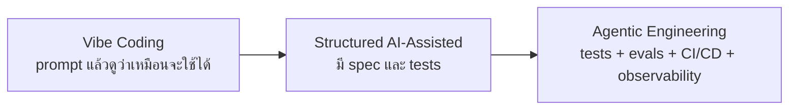
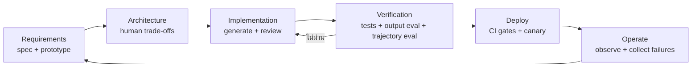

# The New Software Lifecycle: จาก Vibe Coding สู่ Agentic Engineering

> สรุปและเรียบเรียงจาก [The New Software Lifecycle](https://addyosmani.com/blog/new-sdlc-vibe-coding/) โดย Addy Osmani เผยแพร่เมื่อ 16 มิถุนายน 2026

AI ไม่ได้ทำให้วงจรพัฒนาซอฟต์แวร์หรือ **SDLC (Software Development Lifecycle)** หายไป แต่มันทำให้สัดส่วนของงานแต่ละช่วงเปลี่ยนอย่างมาก: การเขียนโค้ดอาจหดจากหลายสัปดาห์เหลือไม่กี่ชั่วโมง ขณะที่การกำหนดความต้องการ การตัดสินใจด้านสถาปัตยกรรม และการตรวจสอบความถูกต้องยังต้องอาศัยวิจารณญาณสูง

ใจความสำคัญของบทความคือ:

> **สิ่งที่แยก Vibe Coding ออกจากงานวิศวกรรม ไม่ใช่ว่าใครเป็นคนเขียนโค้ด แต่คือเราตรวจสอบผลลัพธ์และกระบวนการอย่างไร**

---

## TL;DR

1. **Agent ไม่ได้มีแค่โมเดล** แต่คือโมเดลบวก harness ที่รวม instructions, tools, sandbox, orchestration, guardrails, tests, evals และ observability
2. **Context engineering เป็นทั้งการตัดสินใจทางเทคนิคและต้นทุน** เพราะ static context ถูกส่งซ้ำทุกครั้ง ส่วน dynamic context โหลดเฉพาะเมื่อจำเป็น
3. **Verification คือเส้นแบ่งระหว่าง demo กับ production** โดยต้องตรวจทั้งผลลัพธ์สุดท้ายและเส้นทางที่ agent ใช้
4. **Implementation เร็วขึ้น แต่ specification กลายเป็นคอขวดใหม่** เพราะ agent ทำตามสิ่งที่เราระบุ ไม่ได้เข้าใจบริบทธุรกิจทั้งหมดเอง
5. **Vibe coding ถูกตอนเริ่ม แต่แพงตอนดูแล** หากไม่มี tests, evals, security controls และโครงสร้าง context ที่ดี
6. บทบาทนักพัฒนาเปลี่ยนจาก “ผู้พิมพ์โค้ด” ไปเป็น **ผู้ออกแบบข้อกำหนด ตัดสิน trade-off ตรวจงาน และกำกับระบบ agent**

---

## 1. Agent = Model + Harness

บทความเสนอกรอบคิดว่า agent ประกอบด้วยสองส่วน:

```text
Agent = Model + Harness
```

**Model** คือความสามารถในการเข้าใจและสร้างข้อความหรือโค้ด ส่วน **Harness** คือระบบทั้งหมดที่ทำให้โมเดลทำงานได้อย่างมีขอบเขตและตรวจสอบได้ เช่น

- system instructions และ rule files เช่น `AGENTS.md` หรือ `CLAUDE.md`
- tools, APIs และ MCP servers
- sandbox และ permission boundaries
- orchestration สำหรับเลือกโมเดลหรือมอบหมายให้ sub-agents
- deterministic hooks และ guardrails
- session memory, retrieval และ Agent Skills
- tests, evals, tracing และ observability
- deployment configuration, runtime และ scaling

บทความใช้ภาพจำว่าโมเดลอาจเป็นเพียง **10%** ส่วน harness คือ **90%** ของระบบ ตัวเลขนี้ควรอ่านเป็น *mental model* ไม่ใช่สูตรตายตัว แต่ชี้ให้เห็นว่าเมื่อ agent ทำงานพลาด การเปลี่ยนโมเดลอาจไม่ใช่คำตอบแรก ปัญหามักอยู่ที่ tool หาย, rule คลุมเครือ, guardrail ไม่พอ หรือ context เต็มไปด้วยข้อมูลที่ไม่เกี่ยวข้อง

### วิธี debug ที่ควรลองก่อนเปลี่ยนโมเดล

1. ตรวจว่า agent ได้รับ requirement และ acceptance criteria ครบหรือไม่
2. ตรวจว่า tool ที่จำเป็นมีอยู่และมีสิทธิ์เหมาะสมหรือไม่
3. ตรวจว่า context มีข้อมูลเก่า ซ้ำ หรือขัดแย้งกันหรือไม่
4. ตรวจ trajectory ว่า agent ข้ามการทดสอบหรือใช้ tool ผิดลำดับหรือไม่
5. ตรวจ regression ด้วย eval เดิมหลังแก้ prompt, tool หรือ middleware

---

## 2. Context Engineering คือคันโยกคุณภาพและค่าใช้จ่าย

บทความแบ่ง context ของ agent ออกเป็น 6 กลุ่ม:

- **Instructions** — กฎและวิธีทำงาน
- **Knowledge** — เอกสารหรือข้อมูลโดเมน
- **Memory** — สิ่งที่ต้องจำจากอดีต
- **Examples** — ตัวอย่าง input/output หรือ pattern ที่ดี
- **Tools** — ความสามารถในการอ่าน เขียน ค้น หรือเรียก API
- **Guardrails** — ข้อจำกัดด้านความปลอดภัยและนโยบาย

การตัดสินใจสำคัญคือ อะไรควรอยู่ใน **static context** และอะไรควรเป็น **dynamic context**

| รูปแบบ | โหลดเมื่อไร | จุดแข็ง | ความเสี่ยง |
|---|---|---|---|
| Static context | ทุก interaction | กฎสำคัญไม่หาย | เปลือง token และอาจฝัง signal ไว้ใต้ข้อมูลจำนวนมาก |
| Dynamic context | เมื่อ task ต้องใช้ | จ่ายเฉพาะข้อมูลที่เกี่ยวข้อง | หาก routing ผิด agent อาจไม่ได้รับข้อมูลหรือกฎที่จำเป็น |

แนวทางที่ scale ได้คือ **progressive disclosure**: ตอนเริ่ม agent เห็นเพียง metadata สั้น ๆ ของแต่ละ skill จากนั้นจึงโหลด instructions และ reference ขนาดใหญ่เฉพาะเมื่อ task ตรงกัน วิธีนี้ทำให้ agent มีทักษะจำนวนมากได้โดยไม่ต้องยัดทุกอย่างเข้า prompt ทุกครั้ง

> เส้นแบ่งระหว่าง static และ dynamic context ควรถูก review และ version เหมือน source code เพราะมันกระทบทั้งพฤติกรรม ความปลอดภัย latency และค่าใช้จ่าย

---

## 3. Verification คือเส้นแบ่งระหว่าง Vibe Coding กับ Engineering

เครื่องมือเดียวกันใช้ได้ทั้งสร้าง prototype แบบเร็วและสร้างระบบ production ความแตกต่างอยู่ที่ระดับการตรวจสอบ



บทความแยก verification เป็นสามชั้น:

### Tests — ตรวจส่วนที่ deterministic

ใช้เมื่อ input หนึ่งควรให้ผลลัพธ์ที่ชัดเจน เช่น unit tests, integration tests, schema validation, type checking และ security tests

### Output evaluation — ตรวจว่าสิ่งที่ได้ถูกต้องหรือไม่

ดูผลสุดท้าย เช่น feature ทำตาม requirement ครบหรือไม่ คำตอบอ้างหลักฐานถูกหรือไม่ และคุณภาพผ่าน rubric ที่กำหนดหรือไม่

### Trajectory evaluation — ตรวจว่า agent เดินทางมาถูกวิธีหรือไม่

ดู sequence ของการตัดสินใจและ tool calls เช่น agent อ่านไฟล์ที่เกี่ยวข้องจริงหรือไม่ รัน tests หรือไม่ ตรวจผลหลัง deploy หรือไม่ และหลีกเลี่ยงทางลัดอันตรายหรือไม่

ผลลัพธ์ที่ดูถูกต้องแต่ข้าม checks ที่จำเป็นอาจอันตรายกว่าความผิดพลาดที่เห็นชัด เพราะมันสร้างความมั่นใจผิด ๆ

> **ตั้งมาตรฐานที่ eval ไม่ใช่ demo** — demo แสดงว่าระบบเคยทำสำเร็จหนึ่งครั้ง แต่ eval suite แสดงว่ามันทำซ้ำได้อย่างน่าเชื่อถือเพียงใด

---

## 4. แต่ละช่วงของ SDLC เปลี่ยนอย่างไร



| Phase | สิ่งที่ AI เร่งได้ | สิ่งที่มนุษย์ยังต้องรับผิดชอบ |
|---|---|---|
| Requirements | ร่าง user stories, สร้าง prototype, หา edge cases เบื้องต้น | นิยามปัญหา เป้าหมาย ข้อจำกัด และ acceptance criteria |
| Architecture | เสนอทางเลือกและอธิบาย pattern | ตัดสิน trade-off จากบริบทธุรกิจ ความเสี่ยง และข้อจำกัดจริง |
| Implementation | สร้างโค้ด tests และ migration ได้เร็ว | review ความถูกต้อง ความเรียบง่าย และผลกระทบข้ามระบบ |
| Testing & QA | สร้าง test cases, รันซ้ำ, จัดกลุ่ม failure | ออกแบบ rubric, quality floor และกรณีที่มีความเสี่ยงสูง |
| Review & Deploy | ช่วย review และ automate pipeline | กำหนด gates, permissions, canary, rollback และ accountability |
| Maintenance | อธิบาย legacy code, refactor, อัปเกรด dependency | รักษาความเข้าใจระบบและยืนยันว่า behavior สำคัญไม่เปลี่ยน |

AI จึงไม่ได้ทำให้ทุก phase เร็วเท่ากัน เมื่อ implementation ถูกบีบให้สั้นลง **คุณภาพของ specification และ verification จะกลายเป็นคอขวดใหม่**

---

## 5. Productivity Paradox: เร็วขึ้นและช้าลงพร้อมกันได้

บทความอ้างผลสำรวจที่รายงาน productivity gain ราว **25–39%** แต่ก็ยกงานศึกษาของ METR ที่พบว่านักพัฒนามีประสบการณ์ช้าลง **19%** ในงานบางประเภทหลังรวมเวลาตรวจและแก้สิ่งที่ AI สร้าง

สองผลลัพธ์นี้ไม่จำเป็นต้องขัดกัน เพราะประสิทธิภาพขึ้นกับหลายปัจจัย:

- งานเป็น boilerplate หรือเป็นระบบที่มี edge cases ซับซ้อน
- ผู้ใช้คุ้นเคยกับ codebase มากเพียงใด
- agent มี context และ tools ที่ถูกต้องหรือไม่
- เวลาที่ประหยัดตอน generate ถูกใช้คืนไปกับ review และ rework เท่าไร
- ทีมวัด “เวลาได้โค้ดร่าง” หรือ “เวลาที่ feature ผ่าน production gate”

ดังนั้น metric ที่ควรวัดไม่ใช่จำนวนบรรทัดหรือความเร็วของ demo แต่เป็น **lead time ถึงงานที่ผ่าน quality bar**, defect rate, review time, token/API cost และภาระ maintenance หลังส่งมอบ

---

## 6. ปัญหา 80%: ส่วนแรกเร็ว แต่ส่วนท้ายยังยาก

Agent มักสร้าง 80% แรกของ feature ได้เร็วมาก แต่ 20% สุดท้ายมักประกอบด้วยสิ่งที่โมเดลเห็นไม่ครบ:

- edge cases จาก production
- behavior ที่กระจายอยู่หลาย service
- backward compatibility
- migration และ rollback
- permissions, secrets และ data boundaries
- performance ภายใต้ load จริง
- เงื่อนไขธุรกิจที่ไม่ได้เขียนไว้

ยิ่ง agent ทำส่วนแรกได้เร็ว ทีมยิ่งต้องระวังไม่ให้ความเร็วของ prototype ถูกตีความว่า feature พร้อม production แล้ว

---

## 7. เศรษฐศาสตร์: ถูกตอนเริ่มอาจแพงในระยะยาว

**Vibe coding** มีต้นทุนเริ่มต้นต่ำ: สมัครเครื่องมือ เขียน prompt และได้สิ่งที่รันได้เร็ว แต่ระบบที่ต้องอยู่ระยะยาวอาจสะสมต้นทุนแฝงจาก

- prompting และ token burn ซ้ำ ๆ
- การย้อนทำความเข้าใจโค้ดแบบ ad hoc
- regression ที่ไม่มี test จับ
- security cleanup
- context ที่ยาวขึ้นจนคุณภาพตก
- dependency และ architecture ที่ไม่มีเจ้าของชัดเจน

**Agentic engineering** ลงทุนมากกว่าตอนเริ่มกับ schemas, tests, evals, structured context, tracing และ deployment controls แต่มีโอกาสลดต้นทุนต่อ feature ในระยะยาว

บทความแสดงจุด crossover ที่ vibe coding อาจแพงกว่า **3–10 เท่าต่อ feature** แต่ผู้เขียนระบุชัดว่าเป็นตัวเลขเพื่ออธิบายแนวคิด ไม่ใช่ค่าคงที่ที่วัดได้ทุกองค์กร สิ่งที่ตัดสินว่าคุ้มคืออายุของซอฟต์แวร์ ความเสี่ยง และต้นทุนเมื่อผิดพลาด

### Context และ model routing คือ financial controls

- อย่าส่ง repository ขนาดใหญ่ทั้งหมดเข้า prompt ทุกครั้ง
- ใช้โมเดลใหญ่กับ architecture, ambiguity และ reasoning ที่ยาก
- ใช้โมเดลเล็กกับงาน routine เช่น test generation, formatting, review เบื้องต้น และ CI checks
- วัดคุณภาพและ retry rate ร่วมกับราคาต่อ call เพราะโมเดลที่ถูกกว่าแต่ต้องทำซ้ำหลายครั้งอาจแพงกว่า

---

## 8. Prototype กำลังกลายเป็น Production Agent

บทความมองว่า workflow เดิมที่ใช้ coding agent สร้าง script จะขยายไปถึงการสร้าง agent จริงทั้งวงจร:

1. scaffold project
2. เขียน implementation
3. สร้าง eval dataset
4. รัน evaluation
5. deploy ไป managed runtime
6. รายงานผลและติดตาม production

การประสานงานอาศัยมาตรฐานอย่าง **MCP** สำหรับเชื่อม tools และ **A2A** สำหรับส่งต่องานระหว่าง agents

ผู้พัฒนาจะสลับระหว่างสองโหมด:

- **Conductor** — ทำงานแบบ real-time ใน IDE เหมาะกับการสำรวจและงานที่ requirement ยังไม่นิ่ง
- **Orchestrator** — มอบหมาย goal แบบ asynchronous ให้หนึ่งหรือหลาย agents เหมาะกับงานที่ระบุชัด เช่น migration, test generation หรือ refactoring

การเปลี่ยนผ่านนี้เป็นเรื่องทักษะก่อนเรื่องเครื่องมือ: ต้องรู้ว่างานใดควรควบคุมใกล้ชิด งานใด delegate ได้ และหลักฐานแบบใดจึงเพียงพอสำหรับการยอมรับผลลัพธ์

---

## 9. Workflow ที่นำไปใช้ได้จริง

สำหรับงาน production สามารถเปลี่ยนแนวคิดในบทความเป็น checklist ดังนี้:

### ก่อนให้ agent เขียนโค้ด

- [ ] เขียน problem statement และ non-goals
- [ ] ระบุ acceptance criteria ที่ทดสอบได้
- [ ] บันทึก architecture decisions และ trade-offs สำคัญ
- [ ] กำหนดข้อมูล สิทธิ์ และ tools แบบ least privilege
- [ ] เลือกสิ่งที่ต้องอยู่ static context และสิ่งที่จะโหลดแบบ dynamic

### ระหว่าง agent ทำงาน

- [ ] ให้ทำทีละขอบเขตที่ review ได้
- [ ] เก็บ tool-call trace และการเปลี่ยนแปลงไฟล์
- [ ] ให้รัน formatter, type checker, tests และ security checks จริง
- [ ] ตรวจว่า agent ไม่ได้แก้ tests เพื่อซ่อน failure
- [ ] จำกัด token, เวลา, network และ filesystem scope

### ก่อน merge หรือ deploy

- [ ] ตรวจ output ตาม acceptance criteria
- [ ] ตรวจ trajectory ว่า checks สำคัญถูกเรียกครบ
- [ ] รัน regression suite ใน environment ที่ใกล้ production
- [ ] ใช้ CI gate, canary และ rollback plan
- [ ] บันทึก model, prompt, tool และ dependency versions เพื่อ reproduce ได้

### หลัง deploy

- [ ] วัด defect, latency, cost และ user outcome
- [ ] เก็บ failure ใหม่กลับเข้า eval set
- [ ] แก้ root cause ที่ harness ก่อนรีบเปลี่ยนโมเดล
- [ ] ลบ context และ tools ที่ไม่สร้างคุณค่า

---

## 10. เมื่อไรใช้ Vibe Coding ได้ และเมื่อไรควรยกระดับ

| สถานการณ์ | แนวทางที่เหมาะ |
|---|---|
| script ใช้ครั้งเดียว, prototype, สำรวจไอเดีย | Vibe coding ได้ แต่ควร sandbox และไม่ใส่ข้อมูลลับ |
| internal tool ที่มีผู้ใช้จำกัด | เพิ่ม spec, basic tests, logging และ owner |
| service ที่เก็บข้อมูลหรือเชื่อม production | ใช้ agentic engineering พร้อม CI, evals, least privilege และ observability |
| ระบบการเงิน สุขภาพ ความปลอดภัย หรือ infrastructure สำคัญ | ต้องมี formal review, threat model, audit trail, human approval และ rollback |

หลักคิดคือ **verification budget ต้องโตตาม blast radius และอายุของซอฟต์แวร์** ไม่จำเป็นต้องใช้พิธีการระดับเดียวกันกับทุก prototype แต่ห้ามนำมาตรฐานของ prototype ไปใช้กับระบบที่ผู้ใช้ต้องพึ่งพา

---

## ตัวเลขที่บทความยกมา

บทความระบุว่าในช่วงต้นปี 2026:

- 85% ของ professional developers ใช้ AI coding agents เป็นประจำ
- 51% ใช้ทุกวัน
- ประมาณ 41% ของโค้ดใหม่ถูกสร้างด้วย AI

ตัวเลขเหล่านี้เป็นข้อมูลที่บทความและ whitepaper นำเสนอ บทสรุปนี้ไม่ได้ตรวจสอบ dataset ต้นทางแยกต่างหาก จึงควรย้อนดู primary source ก่อนนำไปใช้กำหนดนโยบาย งบประมาณ หรือคาดการณ์ตลาด

---

## บทสรุป

AI ทำให้ **generation กลายเป็นส่วนที่ง่ายขึ้น** แต่ไม่ได้ทำให้การสร้างซอฟต์แวร์ที่เชื่อถือได้เป็นเรื่องอัตโนมัติ งานที่มีค่ามากขึ้นคือการเขียน specification ที่ดี เลือก architecture อย่างรับผิดชอบ ออกแบบ harness ที่ให้ context และ permissions พอดี และสร้าง verification loop ที่ตรวจได้ทั้งคำตอบและวิธีทำงาน

AI จะขยายวัฒนธรรมวิศวกรรมที่มันเข้าไปอยู่: ทีมที่มี tests, review และ feedback loop ที่ดีจะส่งงานได้เร็วขึ้น ส่วนทีมที่พึ่ง demo และแก้เฉพาะหน้าอาจสร้างหนี้ทางเทคนิคได้เร็วขึ้นเช่นกัน

---

## Related Notes

- [[Claude Code]]
- [[Sub-Agent]]
- [[WIP - llmops]]
- [[openclaw]]

## Reference

- [Addy Osmani — The New Software Lifecycle](https://addyosmani.com/blog/new-sdlc-vibe-coding/) — accessed 15 September 2026
- บทความนี้สรุปแนวคิดบางส่วนจาก whitepaper *The New SDLC With Vibe Coding* ของ Google; ตัวเลขและกรณีศึกษาทั้งหมดข้างต้นควรอ่านโดยคงบริบทและข้อจำกัดที่ผู้เขียนระบุไว้
