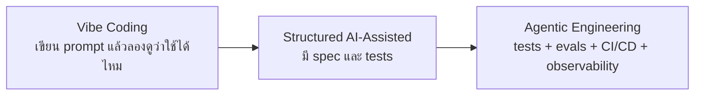
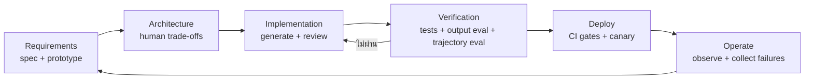

# The New Software Lifecycle: จาก Vibe Coding สู่ Agentic Engineering

> สรุปและเรียบเรียงจาก [The New Software Lifecycle](https://addyosmani.com/blog/new-sdlc-vibe-coding/) โดย Addy Osmani เผยแพร่เมื่อ 16 มิถุนายน 2026

> ภาพประกอบทั้ง 6 ภาพมาจากบทความต้นฉบับ โดยผู้เขียนอนุญาตให้นำไปใช้ซ้ำได้

AI ไม่ได้ทำให้วงจรการพัฒนาซอฟต์แวร์หรือ **SDLC (Software Development Lifecycle)** หายไป แต่ทำให้เวลาที่ใช้ในแต่ละช่วงเปลี่ยนไปมาก การเขียนโค้ดอาจใช้เวลาลดลงจากหลายสัปดาห์เหลือไม่กี่ชั่วโมง ขณะที่การกำหนดความต้องการ การตัดสินใจด้านสถาปัตยกรรม และการตรวจสอบความถูกต้องยังต้องอาศัยวิจารณญาณของมนุษย์

ใจความสำคัญของบทความคือ:

> **สิ่งที่แยก Vibe Coding ออกจากงานวิศวกรรม ไม่ใช่ว่าใครเป็นคนเขียนโค้ด แต่คือเราตรวจสอบผลลัพธ์และกระบวนการอย่างไร**

---

## TL;DR

1. **Agent ไม่ได้มีแค่โมเดล** แต่ยังมี harness ซึ่งรวม instructions, tools, sandbox, orchestration, guardrails, tests, evals และ observability ไว้ด้วย
2. **Context engineering ส่งผลทั้งต่อคุณภาพงานและค่าใช้จ่าย** เพราะ static context ถูกส่งซ้ำทุกครั้ง ส่วน dynamic context โหลดเฉพาะเมื่อจำเป็น
3. **Verification คือเส้นแบ่งระหว่าง demo กับ production** โดยต้องตรวจทั้งผลลัพธ์สุดท้ายและขั้นตอนการทำงานของ agent
4. **Implementation เร็วขึ้น แต่ specification กลายเป็นคอขวดใหม่** เพราะ agent ทำตามสิ่งที่เราระบุ ไม่ได้เข้าใจบริบทธุรกิจทั้งหมดเอง
5. **Vibe coding ถูกตอนเริ่ม แต่แพงตอนดูแล** หากไม่มี tests, evals, security controls และโครงสร้าง context ที่ดี
6. บทบาทนักพัฒนาเปลี่ยนจาก “คนเขียนโค้ด” ไปเป็น **คนกำหนดโจทย์ ชั่งน้ำหนักข้อดีข้อเสีย ตรวจงาน และกำกับการทำงานของ agent**

---

## 1. Agent = Model + Harness

บทความเสนอกรอบคิดว่า agent ประกอบด้วยสองส่วน:

```text
Agent = Model + Harness
```

**Model** คือโมเดลที่ใช้ทำความเข้าใจและสร้างข้อความหรือโค้ด ส่วน **Harness** คือระบบที่ล้อมรอบโมเดล เพื่อให้ทำงานภายในขอบเขตที่กำหนดและตรวจสอบได้ เช่น

- system instructions และ rule files เช่น `AGENTS.md` หรือ `CLAUDE.md`
- tools, APIs และ MCP servers
- sandbox และ permission boundaries
- orchestration สำหรับเลือกโมเดลหรือมอบหมายให้ sub-agents
- deterministic hooks และ guardrails
- session memory, retrieval และ Agent Skills
- tests, evals, tracing และ observability
- deployment configuration, runtime และ scaling

บทความเปรียบเทียบว่าโมเดลอาจเป็นเพียง **10%** ส่วน harness คือ **90%** ของระบบ ตัวเลขนี้ใช้ช่วยให้เห็นภาพ ไม่ใช่สัดส่วนตายตัว ประเด็นคือเมื่อ agent ทำงานพลาด ควรเริ่มตรวจสอบที่ harness ก่อน ปัญหามักอยู่ที่ไม่มี tool ที่จำเป็น กฎไม่ชัดเจน guardrail ไม่เพียงพอ หรือ context เต็มไปด้วยข้อมูลที่ไม่เกี่ยวข้อง


*ภาพจากต้นฉบับ: โมเดลเป็นแกนกลาง ส่วน instructions, tools, orchestration, evals, observability และ infrastructure ประกอบกันเป็น harness*

### วิธี debug ที่ควรลองก่อนเปลี่ยนโมเดล

1. ตรวจว่า agent ได้รับ requirement และ acceptance criteria ครบหรือไม่
2. ตรวจว่า tool ที่จำเป็นมีอยู่และมีสิทธิ์เหมาะสมหรือไม่
3. ตรวจว่า context มีข้อมูลล้าสมัย ซ้ำซ้อน หรือขัดแย้งกันหรือไม่
4. ตรวจขั้นตอนการทำงาน (trajectory) ว่า agent ข้ามการทดสอบหรือใช้ tool ผิดลำดับหรือไม่
5. รัน eval ชุดเดิมหลังแก้ prompt, tool หรือ middleware เพื่อตรวจว่าการแก้ไขทำให้ส่วนอื่นเสียหรือไม่

---

## 2. Context Engineering ส่งผลต่อคุณภาพและค่าใช้จ่ายอย่างไร

บทความแบ่ง context ของ agent ออกเป็น 6 กลุ่ม:

- **Instructions** — กฎและวิธีทำงาน
- **Knowledge** — เอกสารหรือความรู้ที่เกี่ยวข้องกับงาน
- **Memory** — ข้อมูลจากการทำงานครั้งก่อนที่ต้องจำไว้
- **Examples** — ตัวอย่าง input/output หรือ pattern ที่ดี
- **Tools** — ความสามารถในการอ่าน เขียน ค้น หรือเรียก API
- **Guardrails** — ข้อจำกัดด้านความปลอดภัยและนโยบาย

การตัดสินใจสำคัญคือ อะไรควรอยู่ใน **static context** และอะไรควรเป็น **dynamic context**

| รูปแบบ | โหลดเมื่อไร | จุดแข็ง | ความเสี่ยง |
|---|---|---|---|
| Static context | ทุกครั้งที่เรียกโมเดล | มีข้อมูลและกฎสำคัญให้ใช้ทุกครั้ง | ใช้ token มาก และข้อมูลที่ไม่เกี่ยวข้องอาจกลบประเด็นสำคัญ |
| Dynamic context | เมื่องานจำเป็นต้องใช้ | จ่ายเฉพาะข้อมูลที่เกี่ยวข้อง | หากเลือกโหลดข้อมูลผิด agent อาจไม่ได้รับข้อมูลหรือกฎที่จำเป็น |

แนวทางที่รองรับทักษะจำนวนมากได้คือ **progressive disclosure** หรือการค่อย ๆ โหลดข้อมูลตามความจำเป็น ตอนเริ่ม agent เห็นเพียง metadata สั้น ๆ ของแต่ละ skill เมื่องานตรงกับ skill จึงโหลด instructions แล้วค่อยอ่านเอกสารอ้างอิงเพิ่มเติมเมื่อจำเป็น วิธีนี้ทำให้ agent ใช้ทักษะได้หลากหลายโดยไม่ต้องใส่ข้อมูลทั้งหมดไว้ใน prompt ทุกครั้ง

> การเลือกว่าข้อมูลใดควรอยู่ใน static หรือ dynamic context ควรผ่านการ review และเก็บประวัติการเปลี่ยนแปลงเหมือน source code เพราะส่งผลทั้งต่อพฤติกรรมของ agent ความปลอดภัย เวลาตอบสนอง และค่าใช้จ่าย


*ภาพจากต้นฉบับ: static context เชื่อถือได้แต่มีต้นทุนทุก turn ส่วน dynamic context โหลดเฉพาะสิ่งที่ task ต้องใช้*

---

## 3. Verification คือเส้นแบ่งระหว่าง Vibe Coding กับ Engineering

เครื่องมือเดียวกันใช้ได้ทั้งสร้าง prototype อย่างรวดเร็วและพัฒนาระบบสำหรับใช้งานจริง ความแตกต่างอยู่ที่ระดับการตรวจสอบ




*ภาพจากต้นฉบับ: จุดต่างสำคัญไม่ใช่การใช้ AI หรือไม่ แต่คือระดับของ specification และ verification*

บทความแบ่งการตรวจสอบเป็น tests และ evals โดย evals แยกได้อีกสองแบบ:

### Tests — ตรวจส่วนที่มีผลลัพธ์แน่นอน

ใช้เมื่อ input หนึ่งควรให้ผลลัพธ์ที่ชัดเจน เช่น unit tests, integration tests, schema validation, type checking และ security tests

### Output evaluation — ตรวจว่าสิ่งที่ได้ถูกต้องหรือไม่

ดูผลลัพธ์สุดท้าย เช่น feature ทำงานได้ครบตาม requirement หรือไม่ คำตอบอ้างอิงหลักฐานถูกต้องหรือไม่ และคุณภาพผ่านเกณฑ์การประเมิน (rubric) ที่กำหนดหรือไม่

### Trajectory evaluation — ตรวจว่า agent ทำงานตามขั้นตอนที่เหมาะสมหรือไม่

ดูลำดับการตัดสินใจและการเรียกใช้ tools เช่น agent อ่านไฟล์ที่เกี่ยวข้องจริงหรือไม่ รัน tests หรือไม่ ตรวจผลหลัง deploy หรือไม่ และข้ามขั้นตอนจนเกิดความเสี่ยงหรือไม่

ผลลัพธ์ที่ดูถูกต้องแต่ไม่ได้ผ่านการตรวจสอบที่จำเป็นอาจอันตรายกว่าความผิดพลาดที่เห็นชัด เพราะทำให้เรามั่นใจทั้งที่ยังตรวจสอบไม่ครบ

> **ตั้งมาตรฐานที่ eval ไม่ใช่ demo** — demo แสดงว่าระบบเคยทำสำเร็จหนึ่งครั้ง แต่ eval suite แสดงว่ามันทำซ้ำได้อย่างน่าเชื่อถือเพียงใด

---

## 4. แต่ละช่วงของ SDLC เปลี่ยนอย่างไร



| Phase | สิ่งที่ AI เร่งได้ | สิ่งที่มนุษย์ยังต้องรับผิดชอบ |
|---|---|---|
| Requirements | ร่าง user stories, สร้าง prototype, หา edge cases เบื้องต้น | นิยามปัญหา เป้าหมาย ข้อจำกัด และ acceptance criteria |
| Architecture | เสนอทางเลือกและอธิบาย pattern | ชั่งน้ำหนักข้อดีข้อเสียของแต่ละทางเลือกตามบริบทธุรกิจ ความเสี่ยง และข้อจำกัดจริง |
| Implementation | สร้างโค้ด tests และ migration ได้เร็ว | review ความถูกต้อง ความเรียบง่าย และผลกระทบข้ามระบบ |
| Testing & QA | สร้าง test cases, รันซ้ำ, จัดกลุ่ม failure | กำหนดเกณฑ์ประเมิน คุณภาพขั้นต่ำที่ยอมรับได้ และกรณีทดสอบที่มีความเสี่ยงสูง |
| Review & Deploy | ช่วย review และ automate pipeline | กำหนด gates, permissions, canary, rollback และ accountability |
| Maintenance | อธิบาย legacy code, refactor, อัปเกรด dependency | รักษาความเข้าใจระบบและยืนยันว่า behavior สำคัญไม่เปลี่ยน |

AI จึงไม่ได้ทำให้ทุกขั้นตอนเร็วขึ้นเท่ากัน เมื่อเวลาที่ใช้เขียนโค้ดลดลง **ความชัดเจนของ specification และการตรวจสอบความถูกต้องจะกลายเป็นคอขวดใหม่**


*ภาพจากต้นฉบับ: เวลาเขียนโค้ดลดลงจากหลายสัปดาห์เหลือเพียงนาทีถึงชั่วโมง ขณะที่ specification และการประเมินผลมีความสำคัญมากขึ้น*

---

## 5. Productivity Paradox: เร็วขึ้นและช้าลงพร้อมกันได้

บทความอ้างผลสำรวจที่รายงานว่าประสิทธิภาพการทำงานเพิ่มขึ้นราว **25–39%** แต่ก็ยกงานศึกษาของ METR ที่พบว่านักพัฒนาที่มีประสบการณ์ทำงานช้าลง **19%** ในงานบางประเภท เมื่อรวมเวลาตรวจและแก้โค้ดที่ AI สร้างด้วย

สองผลลัพธ์นี้ไม่จำเป็นต้องขัดกัน เพราะประสิทธิภาพขึ้นกับหลายปัจจัย:

- งานเป็น boilerplate หรือเป็นระบบที่มี edge cases ซับซ้อน
- ผู้ใช้คุ้นเคยกับ codebase มากเพียงใด
- agent มี context และ tools ที่ถูกต้องหรือไม่
- ต้องใช้เวลาตรวจและแก้งานมากแค่ไหนเมื่อเทียบกับเวลาที่ประหยัดได้ตอนสร้างโค้ด
- ทีมวัด “เวลาที่ใช้จนได้โค้ดร่าง” หรือ “เวลาที่ใช้จน feature ผ่านเกณฑ์พร้อมใช้งานจริง”

ดังนั้น ตัวชี้วัดที่ควรดูไม่ใช่จำนวนบรรทัดหรือความเร็วในการทำ demo แต่เป็น **ระยะเวลาตั้งแต่เริ่มงานจนงานผ่านเกณฑ์คุณภาพ** อัตราข้อผิดพลาด เวลาที่ใช้ตรวจงาน ค่า token/API และภาระดูแลระบบหลังส่งมอบ

---

## 6. ปัญหา 80%: ส่วนแรกเร็ว แต่ส่วนท้ายยังยาก

Agent มักสร้าง 80% แรกของ feature ได้เร็วมาก แต่ 20% สุดท้ายมักเป็นงานที่ต้องอาศัยบริบทซึ่งโมเดลมีไม่ครบ:

- edge cases จาก production
- behavior ที่กระจายอยู่หลาย service
- backward compatibility
- migration และ rollback
- permissions, secrets และ data boundaries
- performance ภายใต้ load จริง
- เงื่อนไขธุรกิจที่ไม่ได้เขียนไว้

แม้ agent จะสร้าง prototype ได้เร็ว ทีมก็ยังต้องตรวจสอบว่า feature พร้อมใช้งานจริงหรือไม่

---

## 7. เศรษฐศาสตร์: ถูกตอนเริ่มอาจแพงในระยะยาว

**Vibe coding** มีต้นทุนเริ่มต้นต่ำ เพียงสมัครใช้เครื่องมือและเขียน prompt ก็ได้โค้ดที่รันได้ในเวลาไม่นาน แต่ระบบที่ต้องใช้งานและดูแลในระยะยาวอาจสะสมต้นทุนแฝงจาก

- การเขียน prompt ซ้ำและใช้ token อย่างสิ้นเปลือง
- การต้องกลับมาทำความเข้าใจโค้ดที่เขียนขึ้นเฉพาะหน้า
- regression ที่ไม่มี test จับ
- security cleanup
- context ที่ยาวขึ้นจนคุณภาพคำตอบลดลง
- dependency และ architecture ที่ไม่มีเจ้าของชัดเจน

**Agentic engineering** ต้องลงทุนกับ schemas, tests, evals, structured context, tracing และ deployment controls มากกว่าในช่วงเริ่มต้น แต่มีโอกาสลดต้นทุนต่อ feature ในระยะยาว

บทความแสดงจุดที่ต้นทุนสะสมของ vibe coding เริ่มแซง agentic engineering โดยต้นทุนต่อ feature อาจสูงกว่า **3–10 เท่า** แต่ผู้เขียนระบุชัดว่าเป็นตัวเลขเพื่ออธิบายแนวคิด ไม่ใช่ค่าคงที่ที่วัดได้ทุกองค์กร ความคุ้มค่าจึงขึ้นอยู่กับอายุการใช้งานของซอฟต์แวร์ ความเสี่ยง และต้นทุนเมื่อเกิดข้อผิดพลาด


*ภาพจากต้นฉบับ: vibe coding เริ่มได้เร็วและมีต้นทุนเริ่มต้นต่ำ แต่ค่าใช้จ่ายจากการเขียน prompt ซ้ำ การดูแลระบบ การแก้ปัญหาความปลอดภัย และการจัดการ context อาจทำให้ต้นทุนสะสมสูงกว่าในระยะยาว*

### การจัดการ context และการเลือกโมเดลช่วยควบคุมค่าใช้จ่าย

- อย่าส่ง repository ขนาดใหญ่ทั้งหมดเข้า prompt ทุกครั้ง
- ใช้โมเดลใหญ่กับการออกแบบสถาปัตยกรรม งานที่โจทย์ยังไม่ชัดเจน และงานที่ต้องใช้เหตุผลซับซ้อน
- ใช้โมเดลเล็กกับงานทั่วไป เช่น การสร้าง tests การจัดรูปแบบโค้ด การ review เบื้องต้น และ CI checks
- วัดคุณภาพและ retry rate ร่วมกับราคาต่อ call เพราะโมเดลที่ถูกกว่าแต่ต้องทำซ้ำหลายครั้งอาจแพงกว่า

---

## 8. Prototype กำลังกลายเป็น Production Agent

บทความมองว่า workflow เดิมที่ใช้ coding agent สร้าง script กำลังขยายไปครอบคลุมวงจรการพัฒนา agent สำหรับใช้งานจริง:

1. สร้างโครงโปรเจกต์
2. เขียนโค้ด
3. สร้างชุดข้อมูลสำหรับประเมินผล
4. รันการประเมินผล
5. deploy ไปยัง managed runtime
6. รายงานผลและติดตามการทำงานหลังนำไปใช้งานจริง

การประสานงานอาศัยมาตรฐานอย่าง **MCP** สำหรับเชื่อม tools และ **A2A** สำหรับส่งต่องานระหว่าง agents

ผู้พัฒนาจะสลับระหว่างสองโหมด:

- **Conductor** — ทำงานแบบ real-time ใน IDE เหมาะกับการสำรวจและงานที่ requirement ยังไม่นิ่ง
- **Orchestrator** — มอบหมายเป้าหมายให้ agent หนึ่งตัวหรือหลายตัวทำงาน แล้วค่อยกลับมาตรวจผล เหมาะกับงานที่ระบุชัด เช่น migration, test generation หรือ refactoring

การเปลี่ยนแปลงนี้ต้องเริ่มจากทักษะของผู้ใช้ ต้องรู้ว่างานใดต้องดูแลอย่างใกล้ชิด งานใดมอบหมายให้ agent ทำเองได้ และต้องมีหลักฐานอะไรบ้างจึงจะเชื่อถือผลลัพธ์ได้


*ภาพจากต้นฉบับ: เครื่องมือพัฒนาจากการช่วยเติมโค้ด ไปสู่การรับเป้าหมายจากผู้ใช้และทำงานเองได้มากขึ้น*

---

## 9. Workflow ที่นำไปใช้ได้จริง

สำหรับงาน production สามารถเปลี่ยนแนวคิดในบทความเป็น checklist ดังนี้:

### ก่อนให้ agent เขียนโค้ด

- [ ] เขียน problem statement และ non-goals
- [ ] ระบุ acceptance criteria ที่ทดสอบได้
- [ ] บันทึก architecture decisions และ trade-offs สำคัญ
- [ ] กำหนดข้อมูล สิทธิ์ และ tools แบบ least privilege
- [ ] เลือกข้อมูลที่ต้องอยู่ใน static context และข้อมูลที่จะโหลดเมื่อต้องใช้

### ระหว่าง agent ทำงาน

- [ ] แบ่งงานให้ agent ทำทีละส่วนที่ตรวจทานได้
- [ ] เก็บ tool-call trace และการเปลี่ยนแปลงไฟล์
- [ ] ให้รัน formatter, type checker, tests และ security checks จริง
- [ ] ตรวจว่า agent ไม่ได้แก้ tests เพื่อปกปิดข้อผิดพลาด
- [ ] จำกัดจำนวน token เวลา และขอบเขตการเข้าถึงเครือข่ายกับไฟล์

### ก่อน merge หรือ deploy

- [ ] ตรวจ output ตาม acceptance criteria
- [ ] ตรวจลำดับการทำงานว่า agent ตรวจสอบสิ่งที่จำเป็นครบแล้ว
- [ ] รัน regression suite ใน environment ที่ใกล้ production
- [ ] ใช้ CI gate, canary และ rollback plan
- [ ] บันทึกเวอร์ชันของ model, prompt, tool และ dependency เพื่อให้ทำซ้ำได้

### หลัง deploy

- [ ] วัด defect, latency, cost และ user outcome
- [ ] เก็บ failure ใหม่กลับเข้า eval set
- [ ] ตรวจหาสาเหตุใน harness ก่อนตัดสินใจเปลี่ยนโมเดล
- [ ] ลบ context และ tools ที่ไม่จำเป็น

---

## 10. เมื่อไรใช้ Vibe Coding ได้ และเมื่อไรควรยกระดับ

| สถานการณ์ | แนวทางที่เหมาะ |
|---|---|
| script ใช้ครั้งเดียว, prototype, สำรวจไอเดีย | Vibe coding ได้ แต่ควร sandbox และไม่ใส่ข้อมูลลับ |
| internal tool ที่มีผู้ใช้จำกัด | เพิ่ม spec, basic tests, logging และ owner |
| service ที่เก็บข้อมูลหรือเชื่อม production | ใช้ agentic engineering พร้อม CI, evals, least privilege และ observability |
| ระบบการเงิน สุขภาพ ความปลอดภัย หรือ infrastructure สำคัญ | ต้องมี formal review, threat model, audit trail, human approval และ rollback |

หลักคิดคือ **ควรลงทุนกับการตรวจสอบมากขึ้นตามขอบเขตผลกระทบเมื่อระบบผิดพลาดและอายุการใช้งานของซอฟต์แวร์** prototype ทุกชิ้นไม่จำเป็นต้องผ่านการตรวจสอบที่เข้มงวดเท่ากัน แต่ระบบที่ผู้ใช้ต้องพึ่งพาควรมีมาตรฐานสูงกว่า prototype

---

## ตัวเลขที่บทความยกมา

บทความระบุว่าในช่วงต้นปี 2026:

- 85% ของนักพัฒนามืออาชีพใช้ AI coding agents เป็นประจำ
- 51% ใช้ทุกวัน
- ประมาณ 41% ของโค้ดใหม่ถูกสร้างด้วย AI

ตัวเลขเหล่านี้เป็นข้อมูลที่บทความและ whitepaper นำเสนอ บทสรุปนี้ไม่ได้ตรวจสอบชุดข้อมูลต้นทางแยกต่างหาก จึงควรย้อนดูแหล่งข้อมูลต้นทางก่อนนำไปใช้กำหนดนโยบาย งบประมาณ หรือคาดการณ์ตลาด

---

## บทสรุป

AI ทำให้ **การสร้างโค้ดง่ายขึ้น** แต่ซอฟต์แวร์ที่เชื่อถือได้ยังต้องอาศัยงานส่วนอื่นด้วย งานที่สำคัญขึ้นคือการเขียน specification ให้ชัดเจน เลือกสถาปัตยกรรมโดยคำนึงถึงผลกระทบ ออกแบบ harness ที่ให้ข้อมูลบริบทและสิทธิ์การเข้าถึงอย่างเหมาะสม และวางกระบวนการตรวจสอบซ้ำที่ครอบคลุมทั้งผลลัพธ์และวิธีทำงาน

AI จะขยายผลจากวิธีทำงานของทีม ทั้งส่วนที่ดีและส่วนที่เป็นปัญหา ทีมที่มี tests การ review และการนำผลมาปรับปรุงงานอย่างสม่ำเสมอจะส่งงานได้เร็วขึ้น ส่วนทีมที่พึ่ง demo และแก้ปัญหาเฉพาะหน้าอาจสะสมหนี้ทางเทคนิคได้เร็วขึ้นเช่นกัน

---

## Related Notes

- [[Claude Code]]
- [[Sub-Agent]]
- [[WIP - llmops]]
- [[openclaw]]

## Reference

- [Addy Osmani — The New Software Lifecycle](https://addyosmani.com/blog/new-sdlc-vibe-coding/) — accessed 16 September 2026
- บทความนี้สรุปแนวคิดบางส่วนจาก whitepaper *The New SDLC With Vibe Coding* ของ Google; ตัวเลขและกรณีศึกษาทั้งหมดข้างต้นควรอ่านโดยคงบริบทและข้อจำกัดที่ผู้เขียนระบุไว้
