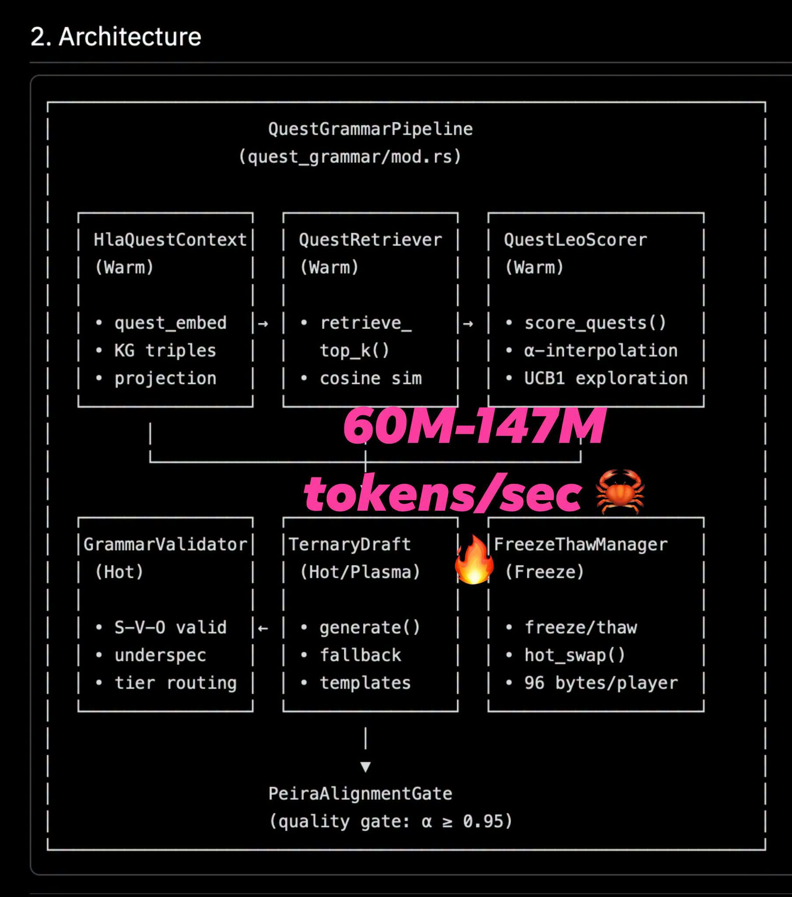

# 019 — วัดความเร็วสร้างเควสต์ให้ถูกงาน

อ่านเพิ่ม: [ผลตรวจและงานวิจัยรอบ 2](#research-review-2)

แหล่งที่มา: `post.md` บรรทัด 359-376 · [ต้นฉบับ](../original/post.md) · ภาพ:  · วันที่ค้นคว้า: 2026-09-20

โพสต์นี้เล่าว่า KatGPT ไม่ได้เร็วเฉพาะ tokenizer แต่ถูกใช้สร้างข้อความเควสต์ในเกมแบบ personalized ได้ระดับ 60M-147M tokens/sec จาก corpus ประมาณ 4MB และ knowledge graph 43,005 triples ภาพประกอบวาง pipeline เป็น `HlaQuestContext`, retriever, scorer, validator, draft generator และ freeze/thaw manager ก่อนผ่าน quality gate ผู้เขียนย้ำให้ “verify” เอง จึงควรอ่านตัวเลขนี้เป็น benchmark ภายในของผู้เขียน ไม่ใช่ผลเทียบมาตรฐานสาธารณะ

ความรู้หลักคือ “tokens/sec” มีความหมายต่างกันตามงาน ถ้าเป็น tokenizer คือการแปลงข้อความเป็น token ส่วนการ generate quest ในโพสต์ดูเหมือนเป็นระบบ deterministic grammar/retrieval/scoring มากกว่า LLM autoregressive ที่ค่อย ๆ sample token ทีละตำแหน่ง งานคนละแบบจึงห้ามเทียบตัวเลขตรง ๆ กับ LLM inference โดยไม่บอกหน่วย งาน input/output, hardware, batch, validation, และจำนวน token ที่นับ

แหล่งภายนอกที่ใกล้เคียงคือ Gigatoken ซึ่ง repo ระบุว่าเป็น tokenizer throughput ระดับ GB/s และ benchmark บน Apple M4 Max เช่น GPT-2 ได้ 8.79 GB/s ในตารางของผู้พัฒนาเอง ([GitHub: gigatoken](https://github.com/marcelroed/gigatoken)). แต่ repo นี้พูดเรื่อง tokenization ไม่ใช่การสร้างเควสต์พร้อมตรวจตรรกะ ส่วน paper `G-RRM` เสนอแนว neuro-symbolic ที่ให้ recurrent reasoning model ช่วย symbolic solver และรายงานว่า speedup ขึ้นกับ solver/โจทย์ ไม่ได้เร็วเสมอทุกกรณี ([arXiv:2607.02491](https://arxiv.org/abs/2607.02491)).

วิธีลองเรียนรู้แบบเล็ก ๆ: สร้างไฟล์ quest template 100 แบบ, สร้าง KG triples เช่น `(npc, wants, item)`, `(item, located_at, place)`, แล้ววัด 3 เวลาแยกกันคือ retrieve, draft, validate อย่านับรวมเฉพาะส่วนที่เร็วที่สุด จากนั้นเขียน invariant เช่น “เควสต์ต้องมีผู้ให้ภารกิจ เป้าหมาย และรางวัล” แล้วนับ rejection rate ด้วย

ข้อควรจำ: Rust, zero allocation, latent space หรือ symbolic pruning ไม่ได้แปลว่า latency เป็นศูนย์หรือถูก 100% โดยอัตโนมัติ ความแม่นของเควสต์ต้องวัดด้วย rule coverage, false accept, false reject, และความหลากหลายของข้อความ ไม่ใช่ throughput อย่างเดียว

คำถามฝึก: ถ้าระบบสร้างเควสต์เร็วมากแต่ validator ปฏิเสธ 40% คอขวดจริงอยู่ตรงไหน?

## ตรวจสอบและค้นคว้าเพิ่มเติม — รอบ 2

<!-- RESEARCH_REVIEW_2_START -->
วันที่ตรวจเพิ่ม: 2026-09-20

**คำถามวิจัย:** ตัวเลข “tokens/sec” ในโพสต์ควรเทียบกับอะไร และเมื่อใดถึงจะเรียกว่า language generation ได้จริง? แหล่งหลักที่เพิ่มคือเอกสาร Hugging Face `tokenizers` และ repo OpenAI `tiktoken` ไม่ใช่เพื่อยืนยันตัวเลข KatGPT แต่เพื่อวางหน่วยวัดให้ถูกชั้น เอกสาร Hugging Face ระบุว่า `tokenizers` เป็น implementation ที่เน้น performance/versatility และ Rust implementation สามารถ tokenize ข้อความระดับ GB ได้เร็วมากบน CPU server [Hugging Face Tokenizers](https://huggingface.co/docs/tokenizers/index). Repo `tiktoken` อธิบาย BPE ว่าเป็น tokenizer แบบ reversible/lossless สำหรับข้อความทั่วไป และระบุ benchmark ของตนว่าเร็วกว่า tokenizer เทียบเคียงในเงื่อนไข GPT-2 tokenizer กับข้อความ 1GB [OpenAI tiktoken](https://github.com/openai/tiktoken).

**กลไกที่เกี่ยวกับโพสต์:** quest generator ของโพสต์ไม่ได้เหมือน LLM decode token-by-token เสมอไป ถ้า corpus ถูก freeze เป็น grammar/KG/triples แล้ว “token” คือหน่วยภายในของ quest engine การวิ่งได้ 60M–147M tokens/sec อาจหมายถึงการ lookup, route, validate หรือประกอบ template ที่ถูกบีบแล้ว ไม่ใช่การคูณ matrix เพื่อทำนาย next-token ของ LLM ขนาดใหญ่ แหล่ง tokenizer ทั้งสองช่วยย้ำว่าการแปลงข้อความเป็น token เป็น hot path คนละชั้นกับการ generate semantic content.

**ผลเชิงปฏิบัติ:** เวลาอธิบายตัวเลขนี้ให้คนเทียบกับ LLM ควรแยก 4 หน่วย: `input bytes/s`, `tokenizer tokens/s`, `quest internal tokens/s`, และ `generated language tokens/s`. ถ้า quest หนึ่งใช้ internal token 200 ตัว แต่ข้อความสุดท้ายมี 40 BPE tokens การเอา 147M internal tokens/sec ไปเทียบกับ LLM 100 output tokens/sec จะผิดตัวหารทันที

**แบบฝึก:** ทำ corpus 100 quest template, KG 1,000 triples และ validator 5 กฎ วัดสามช่วงแยกกัน: tokenize input, retrieve template/triple, render text แล้ว validate จากนั้นรายงาน p50/p95 ต่อ quest ไม่ใช่เฉพาะ throughput รวม Caveat คือ tokenization เร็วมากไม่ได้แปลว่า quest ดี ต้องมี metric เช่น factual consistency, duplicate rate, player relevance และ failure mode ที่ validator ปฏิเสธ
<!-- RESEARCH_REVIEW_2_END -->

<!-- POST_NAV_START -->
---

[สารบัญ](README.md) · [← โพสต์ 018](018-tokenizer-throughput-frame-budget.md) · [โพสต์ 020 →](020-latent-action-factorization.md)

หัวข้อที่เกี่ยวข้อง: [04 NPC, world models, เศรษฐกิจเกม และการประสานฝูง](topics/04-npc-worlds-and-coordination.md) · [08 อ่านและออกแบบ benchmark ให้เปรียบเทียบได้](topics/08-performance-and-benchmarks.md)
<!-- POST_NAV_END -->
