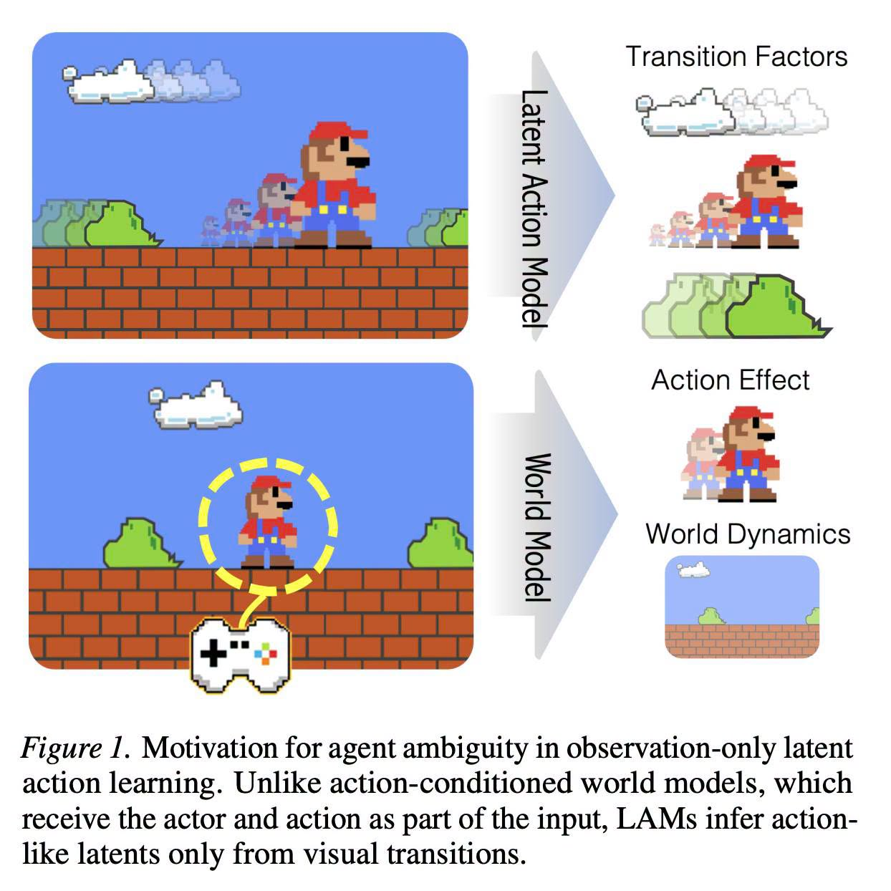

# 020 — Latent Action ต้องแยก “อะไรเปลี่ยน” ก่อน

อ่านเพิ่ม: [ผลตรวจและงานวิจัยรอบ 2](#research-review-2)

แหล่งที่มา: `post.md` บรรทัด 340-358 · [ต้นฉบับ](../original/post.md) · ภาพ:  · วันที่ค้นคว้า: 2026-09-20

โพสต์หยิบ paper `Latent Actions from Factorized Transition Effects under Agent Ambiguity` และตีความว่าแนวทาง “latent first transition” หรือการ factorize การเปลี่ยนแปลงช่วยให้ transfer ข้าม morphology shift ได้ ภาพ Mario ชัดมาก: ถ้าดูสองเฟรม เราเห็น Mario ขยับ เมฆขยับ พุ่มไม้เปลี่ยน และกล้องเลื่อนพร้อมกัน ถ้าโมเดลพยายามสรุป “action เดียวที่แท้จริง” จากภาพรวมทั้งหมด มันจะสับสนว่าอะไรเกิดจาก agent และอะไรเป็น dynamics ของโลก

ใน arXiv paper ผู้เขียนบอกว่าปัญหา observation-only latent action learning มี agent ambiguity เพราะ observation ผสม agent motion, distractor, camera dynamics และ background changes จึงเสนอ Observed Transition Factorization (OTF) เพื่อค้นหา transition primitives ที่ใช้ซ้ำได้ แล้วค่อย aggregate เป็น latent actions; paper ยังอ้างว่า primitives transfer across appearance and morphology shifts และช่วย downstream policy ในบาง setting ([arXiv:2606.30544](https://arxiv.org/abs/2606.30544)).

เทคนิคที่ควรจำคือ factorization ไม่ใช่การทำนายอนาคตทั้งโลกทันที แต่แบ่ง “ผลของการเปลี่ยน” เป็นชิ้นเล็ก เช่น entity A เดินขวา, camera pan ซ้าย, particle กระพริบ, enemy idle แล้วเลือกส่วนที่เกี่ยวกับ policy ของ agent วิธีนี้คล้ายการเปลี่ยนจากภาพดิบเป็นรายการเหตุการณ์ที่นำไปใช้ซ้ำได้

ตัวอย่างทดลอง: ทำ grid world 8x8 มีผู้เล่น เหรียญ และเมฆพื้นหลังที่เลื่อนเอง เก็บ state สองเฟรม แล้วเขียน transition extractor ง่าย ๆ ว่า object ไหนเปลี่ยนตำแหน่ง จากนั้นฝึกหรือเขียน policy ด้วยเฉพาะ transition ของผู้เล่น เทียบกับ policy ที่กินภาพรวมทั้งหมด ดูว่าเมื่อเปลี่ยน sprite หรือเพิ่มเมฆอีกชุด policy ยังทำงานได้ไหม

ข้อจำกัด: paper นี้เป็นงานวิจัยปี 2026 ที่ผู้เขียนรายงานผลใน setting ของตนเอง ไม่ได้แปลว่า LAM ทุกตัวจะ zero-shot ได้ทุกเกม คำว่า “latent action” ก็คือ proxy ที่มีประโยชน์ ไม่จำเป็นต้องตรงกับ action label ของมนุษย์เสมอ

คำถามฝึก: ในเกมของคุณ อะไรคือ transition ที่เกิดจาก player, environment, UI, และ camera?

## ตรวจสอบและค้นคว้าเพิ่มเติม — รอบ 2

<!-- RESEARCH_REVIEW_2_START -->
วันที่ตรวจเพิ่ม: 2026-09-20

**คำถามวิจัย:** Latent Action Model ควรเรียน “action จริง” หรือ “ผลของการเปลี่ยน” ก่อน? นอกจาก arXiv ที่มีอยู่แล้ว ผมเปิด project page ของผู้เขียน OTF-LAM ซึ่งอธิบายด้วยตัวอย่าง Mario ว่าหนึ่ง frame transition ผสม player motion, enemy/background, camera scroll และ UI change เข้าด้วยกัน ผู้เขียนจึงเสนอให้เริ่มจาก representation ของ “what changed” เป็นชุด motion primitives ก่อนค่อย aggregate เป็น latent action [OTF-LAM project page](https://hazel-heejeong-nam.github.io/LAM/). อีกแหล่งที่ช่วยให้เข้าใจ variant `OTF-LAM-Dino` คือ DINOv2 ซึ่งเสนอ visual features แบบ self-supervised ที่ใช้ข้ามงานได้โดยไม่ต้อง fine-tune ทุกงาน [DINOv2](https://arxiv.org/abs/2304.07193).

**กลไกที่เกี่ยวกับโพสต์:** ภาพ Mario ในโพสต์ควรอ่านเป็นปัญหา inverse ambiguity: action เป็น cause แต่ observation transition เป็น effect ที่รวมหลาย cause ถ้า LAM บีบทั้ง frame-pair เป็น latent เดียว มันอาจเอาการเลื่อนกล้องหรือเมฆเคลื่อนเป็นส่วนหนึ่งของ “action” ได้ OTF จึงแยก local transition primitives ก่อน แล้วค่อยใช้ state ปัจจุบันบอกว่ากลุ่ม primitive ใดเกี่ยวกับ controllable action

**ผลเชิงปฏิบัติ:** แนวคิด “latent first transition” ใช้ได้ดีกับเกมถ้าเรายอมทำ intermediate representation ที่ตรวจได้ เช่น object delta, camera delta, UI delta, particle delta ไม่ใช่โยน pixel diff ทั้งก้อนเข้า latent แล้วหวังว่ามันรู้เอง การ transfer ข้าม morphology shift ใน paper เป็นผลใน setting ของผู้เขียน ไม่ใช่ใบอนุญาตให้บอกว่า zero-shot ทุกเกมหรือทุก avatar

**แบบฝึก:** ทำ replay สองเฟรมของ platformer แล้วเขียน extractor ง่าย ๆ ให้แยก `player_dx`, `camera_dx`, `enemy_dx`, `background_anim` จากนั้นฝึก classifier/action decoder ด้วยเฉพาะส่วน player และ state context เปรียบเทียบกับ baseline ที่ใช้ pixel diff ทั้งภาพ Caveat คือถ้า extractor พลาดตั้งแต่ต้น policy จะเรียน shortcut ที่ผิด และ DINO-like feature ลดภาระ texture ได้แต่ไม่ได้ระบุ action causality ให้ฟรี
<!-- RESEARCH_REVIEW_2_END -->

<!-- POST_NAV_START -->
---

[สารบัญ](README.md) · [← โพสต์ 019](019-quest-generation-throughput.md) · [โพสต์ 021 →](021-rust-bytemuck-bincode-layout.md)

หัวข้อที่เกี่ยวข้อง: [01 Latent representation, geometry และความหมายของข้อมูล](topics/01-latent-representations-and-geometry.md) · [04 NPC, world models, เศรษฐกิจเกม และการประสานฝูง](topics/04-npc-worlds-and-coordination.md)
<!-- POST_NAV_END -->
