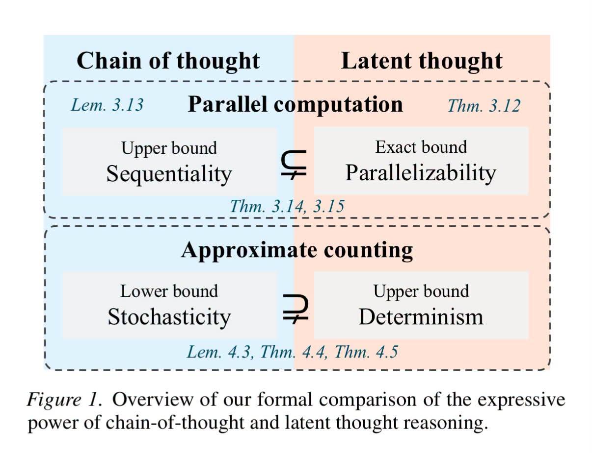

# 027 — Deterministic ช่วย Replay แต่ไม่รับประกันความถูกต้อง

อ่านเพิ่ม: [ผลตรวจและงานวิจัยรอบ 2](#research-review-2)

แหล่งที่มา: `post.md` บรรทัด 277-287 · [ต้นฉบับ](../original/post.md) · ภาพ:  · วันที่ค้นคว้า: 2026-09-20

โพสต์บอกว่า KatGPT “Latent First” ทำให้ parallel และ deterministic ได้ แล้วเทียบกับ LLM ที่ stochastic จน hallucinate; จุดที่ต้องปรับคือ deterministic ช่วยให้ replay/debug ง่ายขึ้น แต่ไม่ใช่หลักฐานว่าคำตอบถูก ภาพประกอบจาก paper เปรียบ chain-of-thought กับ latent thought โดยอ้างว่า latent thought มี parallelizability และ determinism ในงาน formal บางชนิด

ความรู้สำคัญคือ deterministic หมายถึง input/state/seed เดิมให้ผลเดิม ไม่ได้แปลว่าถูกเสมอ ส่วน stochastic sampling ใน LLM ช่วยสร้างความหลากหลาย แต่ก็เพิ่มโอกาสคำตอบแกว่งถ้าไม่มี grounding หรือ verifier งานสำรวจ latent space ปี 2026 ชี้ว่า explicit token computation มีข้อจำกัดเรื่อง redundancy, discretization bottleneck, sequential inefficiency และ semantic loss จึงมีงานจำนวนมากย้าย computation เข้า latent space ([arXiv:2604.02029](https://arxiv.org/abs/2604.02029)).

ในเกมหรืองาน shallow reasoning เช่น quest grammar, rule validation, NPC state update การทำ deterministic มักดี เพราะ debug/replay ได้และ sync multiplayer ง่ายกว่า แต่สำหรับงาน creative text ที่ต้องหลากหลาย อาจต้องผสม stochastic ในขั้น draft แล้วใช้ deterministic validator คุมขอบเขต

แบบฝึก: สร้าง quest generator สองโหมด โหมด A random template ด้วย seed, โหมด B deterministic เลือก template จาก hash ของ `(npc_id, zone_id, motivation)` แล้ววัดว่า replay หลังโหลดเกมได้เควสต์เดิมไหม จากนั้นเพิ่ม validator เช่น ห้าม quest ใช้ item ที่ไม่มีใน zone

ข้อจำกัด: “latent first” เป็นแนวออกแบบกว้างมาก ถ้า latent representation เสีย ข้อผิดพลาดจะถูกทำซ้ำอย่างสม่ำเสมอ Deterministic จึงต้องคู่กับ observability, tests, และ fallback

คำถามฝึก: งานใดในเกมควรสุ่มเพื่อความสด และงานใดควร deterministic เพื่อความยุติธรรม?

## ตรวจสอบและค้นคว้าเพิ่มเติม — รอบ 2

<!-- RESEARCH_REVIEW_2_START -->
วันที่ตรวจเพิ่ม: 2026-09-20

**คำถามวิจัย:** deterministic ช่วยลด hallucination หรือแค่ทำให้ replay ได้? แหล่งใหม่คือ PyTorch Reproducibility note ซึ่งระบุว่าผล reproducible ไม่รับประกันข้าม release, commit หรือ platform และ deterministic operations มักแลกกับ performance [PyTorch Reproducibility](https://docs.pytorch.org/docs/stable/notes/randomness.html). อีกแหล่งคือ Coconut ปี 2024 ซึ่งใช้ hidden state เป็น continuous thought แล้ว feed กลับเข้าโมเดลเพื่อ reasoning ใน latent space; paper รายงานประโยชน์กับโจทย์ reasoning บางประเภท แต่ไม่ได้บอกว่า latent determinism ทำให้ถูกเสมอ [Coconut](https://arxiv.org/abs/2412.06769).

**กลไกที่เกี่ยวกับโพสต์:** deterministic หมายถึง input/state/seed/runtime เดิมให้ output เดิม จึงดีต่อ debug, replay, multiplayer sync และ audit แต่ถ้า formula, latent encoder หรือ rule ผิด ระบบจะตอบผิดแบบเดิมซ้ำทุกครั้ง Stochastic decoding ของ LLM เพิ่มความแกว่ง แต่ hallucination มาจากหลายสาเหตุ เช่นข้อมูลไม่พอ, objective next-token, retrieval ผิด หรือ verifier ไม่มี ไม่ใช่เกิดจาก randomness อย่างเดียว

**ผลเชิงปฏิบัติ:** ควรเปลี่ยนกรอบจาก “deterministic ลดหลอน” เป็น “deterministic ทำให้ความผิดตรวจซ้ำและแก้ได้ง่ายขึ้น” สำหรับ shallow reasoning ในเกม ใช้ deterministic core + validator + seed log แล้วแยกชั้นที่ต้องการความหลากหลาย เช่น dialog flavor หรือ cosmetic variation ให้สุ่มแบบมี seed

**แบบฝึก:** สร้าง quest engine ที่เลือก action จาก hash `(npc_id, tick, state_version)` แล้วจงใจใส่กฎผิดหนึ่งข้อ รันซ้ำ 10 ครั้งจะได้ bug เดิมทุกครั้ง จากนั้นเพิ่ม test/verifier จึงลด error ได้จริง Caveat คือการตั้ง seed อย่างเดียวไม่ครอบคลุม nondeterminism จาก parallel scheduling, floating point, GPU kernel หรือ dependency version
<!-- RESEARCH_REVIEW_2_END -->

<!-- POST_NAV_START -->
---

[สารบัญ](README.md) · [← โพสต์ 026](026-mux-ahla-tpass-lattice.md) · [โพสต์ 028 →](028-gcrl-lod-latent-intersection.md)

หัวข้อที่เกี่ยวข้อง: [03 Neuro-symbolic, constraints, types และการตรวจคำตอบ](topics/03-neuro-symbolic-types-and-verification.md) · [06 Rust, memory layout, SIMD และ CPU/GPU runtime](topics/06-rust-memory-and-hardware.md) · [08 อ่านและออกแบบ benchmark ให้เปรียบเทียบได้](topics/08-performance-and-benchmarks.md)
<!-- POST_NAV_END -->
