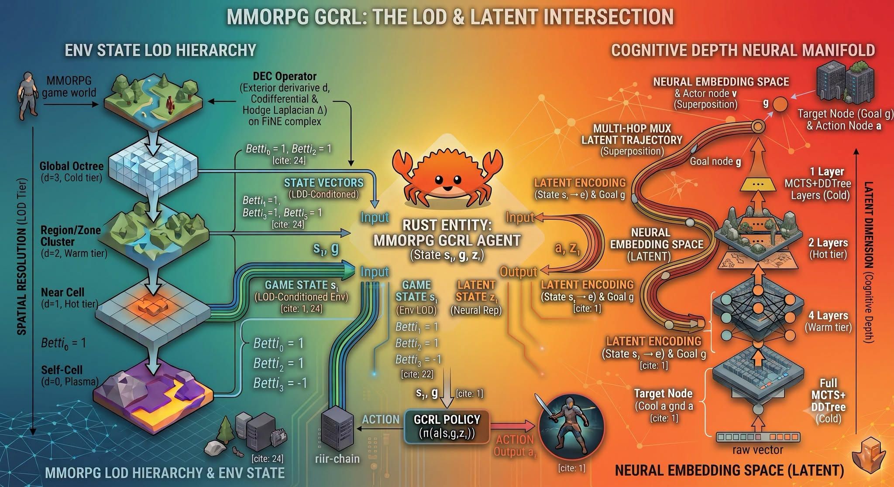
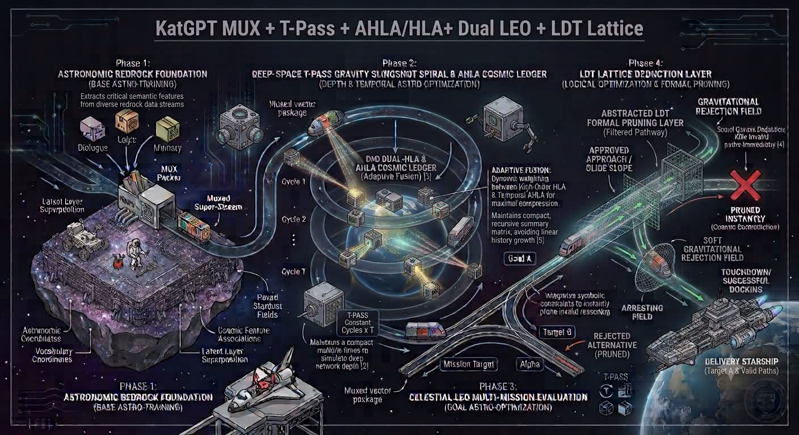

# 028 — สองภาพ: LOD/GCRL และ MUX-T-PASS Pipeline

อ่านเพิ่ม: [ผลตรวจและงานวิจัยรอบ 2](#research-review-2)

แหล่งที่มา: `post.md` บรรทัด 271-276 · [ต้นฉบับ](../original/post.md) · ภาพ:   · วันที่ค้นคว้า: 2026-09-20

โพสต์นี้มีแต่ภาพ จึงต้องอ่านจากภาพเป็นหลัก ภาพแรกชื่อ `MMORPG GCRL: The LOD & Latent Intersection` แสดงโลกเกมแบบ level of detail: global octree, region/zone cluster, near cell, self-cell แล้วส่ง state vectors เข้า Rust entity/agent และ policy แบบ goal-conditioned RL หรือ GCRL ภาพนี้ยังแบ่ง cognitive depth เป็น raw vector, full MCTS+DDTree cold tier, 4 layers warm tier, 2 layers hot tier, และ 1 layer/MCTS+DDTree cold tier เพื่อสื่อว่าไม่ใช่ทุก tick ต้องใช้ reasoning ลึกเท่ากัน

ภาพที่สองชื่อ `KatGPT MUX + T-Pass + AHLA/HLA + Dual LEO + LDT Lattice` เป็น concept pipeline เชิงเปรียบเทียบ แบ่งเป็น phase: foundation/base training, deep-space T-PASS gravity/slingshot spiral, celestial goal-mission evaluation, และ LDT lattice deduction layer จุดสำคัญคือภาพไม่ได้ให้ benchmark แต่ขยายคำศัพท์ภายในว่า MUX รวมสัญญาณ, T-PASS วน depth, AHLA/HLA ทำ summary/compression, และ LDT/Lattice ทำ formal pruning

ความรู้รวมจากสองภาพคือการแยก spatial resolution กับ cognitive depth คนละแกน ฝั่งโลกเกมลดรายละเอียดตามระยะ เช่น global ใช้ summary, near cell ใช้ข้อมูลละเอียด ฝั่ง reasoning เลือกความลึกตามความยากของ action และใช้ pruner ตรวจ validity ก่อน commit ในงาน AI ภาษาสมัยใหม่ latent space ถูกมองเป็น substrate สำหรับ reasoning, planning, modeling, memory และ embodiment ตาม survey `The Latent Space` ([arXiv:2604.02029](https://arxiv.org/abs/2604.02029)). ส่วนแนวคิดลด attention cost มีตัวอย่างอย่าง Linformer ที่อาศัย low-rank approximation เพื่อลด O(n²) เป็น O(n) ใน self-attention ของตัวเอง ([arXiv:2006.04768](https://arxiv.org/abs/2006.04768)). สองแหล่งนี้ช่วยอธิบายว่าทำไมภาพถึงสนใจ projection, summary และ tiered computation แต่ไม่ได้ยืนยันระบบ KatGPT เฉพาะ

แบบฝึก: ทำ NPC 1 ตัวที่มองโลก 4 ระดับ ระดับ world มีจำนวนเมืองและภัยใหญ่ ระดับ zone มีอาหาร/ศัตรูเฉลี่ย ระดับ near cell มีตำแหน่งจริง ระดับ self มี hp/hunger จากนั้นให้ policy ใช้เฉพาะระดับที่จำเป็น เช่น ถ้าหิวใช้ near food ถ้าหนีสงครามใช้ world threat เพิ่มอีกขั้นคือให้ action ง่ายใช้ 1-2 reasoning passes แต่ action เสี่ยง เช่น โจมตีเมือง ใช้ search/pruner ลึกกว่า

ข้อจำกัด: ภาพมีคำและ citation placeholder หลายจุดที่ตรวจไม่ได้จากไฟล์ต้นฉบับ จึงควรใช้เป็น concept map ไม่ใช่หลักฐานว่า GCRL/MMORPG pipeline หรือ MUX/T-PASS/AHLA/Lattice ผ่าน benchmark แล้ว คำอย่าง LEO, LDT และ DDTree ยังต้องหา source ภายใน/ภายนอกเพิ่มก่อนสรุปเป็น fact

คำถามฝึก: ถ้า NPC ทุกตัวใช้ full-resolution state และ full-depth reasoning ทุก tick คุณเสีย compute กับข้อมูลหรือ reasoning ที่ไม่จำเป็นตรงไหนบ้าง?

## ตรวจสอบและค้นคว้าเพิ่มเติม — รอบ 2

<!-- RESEARCH_REVIEW_2_START -->
วันที่ตรวจเพิ่ม: 2026-09-20

**คำถามวิจัย:** GCRL/LOD ในภาพช่วย MMORPG agent อย่างไรโดยไม่ปนกับ attention optimization? แหล่งใหม่คือ Universal Value Function Approximators (UVFA) ของ Schaul et al. ซึ่งนิยาม value function ที่ขึ้นกับทั้ง state และ goal `V(s,g;θ)` เพื่อ generalize ข้ามเป้าหมาย [UVFA PDF](https://proceedings.mlr.press/v37/schaul15.pdf). อีกแหล่งคือ Hindsight Experience Replay (HER) ซึ่งใช้ประสบการณ์ที่ล้มเหลวแล้ว relabel goal เพื่อเรียนจาก sparse reward ได้ดีขึ้น [HER](https://arxiv.org/abs/1707.01495).

**กลไกที่เกี่ยวกับโพสต์:** ภาพ LOD & Latent Intersection ควรอ่านเป็น hierarchy ของ state fidelity: global/zone/near/self ไม่ใช่ claim ว่า agent ทุกตัวรัน reasoning เต็มทุก tick GCRL หมายถึง policy/value ที่ condition ด้วย goal เช่น “ไปหาอาหาร”, “หนี predator”, “ส่งของ” ส่วน LOD ช่วยกำหนดว่าต้องดูข้อมูลละเอียดแค่ไหนในแต่ละระยะ

**ผลเชิงปฏิบัติ:** สำหรับ MMORPG ให้แยก `goal vector` ออกจาก `world state vector` แล้ว cache/value ตามระดับ LOD ตัวอย่าง: NPC ไกลมากใช้ zone congestion กับ danger summary; NPC ใกล้ผู้เล่นใช้ object-level state; NPC ตัวเองใช้ inventory/health/trust ระดับละเอียด วิธีนี้ลด compute แต่ยังต้องวัด error จาก summary

**แบบฝึก:** ทำ grid โลก 4 zone ให้ agent มี goal `food`, `safety`, `trade` แล้วฝึกหรือเขียน UVFA-like scorer `score(state, goal)` เปรียบเทียบการใช้ full map กับ zone summary ถ้า agent หาอาหารพลาดเพราะ summary stale ให้เพิ่ม version/TTL Caveat คือ HER/UVFA เป็นงาน RL ที่มีเงื่อนไขการฝึกของตน ไม่ได้ยืนยันว่า LOD diagram ในภาพผ่าน benchmark แล้ว
<!-- RESEARCH_REVIEW_2_END -->

<!-- POST_NAV_START -->
---

[สารบัญ](README.md) · [← โพสต์ 027](027-latent-first-deterministic.md) · [โพสต์ 029 →](029-rust-ep5-neuro-symbolic-study-guide.md)

หัวข้อที่เกี่ยวข้อง: [03 Neuro-symbolic, constraints, types และการตรวจคำตอบ](topics/03-neuro-symbolic-types-and-verification.md) · [04 NPC, world models, เศรษฐกิจเกม และการประสานฝูง](topics/04-npc-worlds-and-coordination.md)
<!-- POST_NAV_END -->
