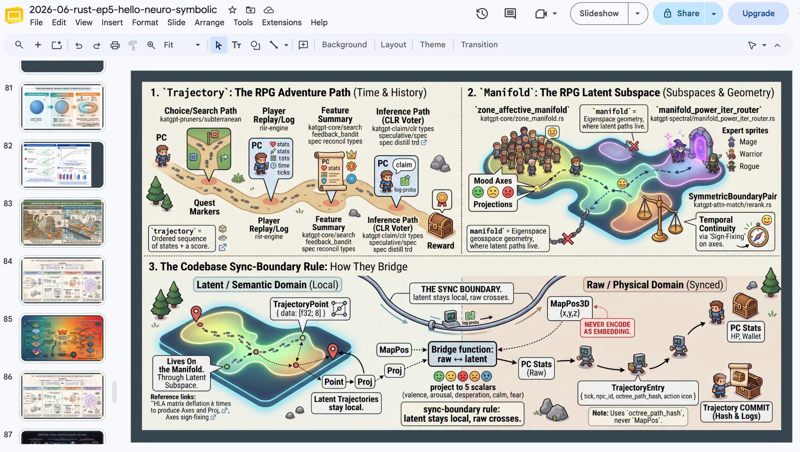
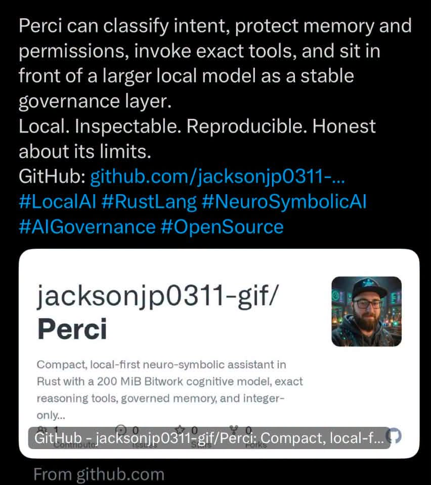

# 029 — วิธีเรียนจาก Live Neuro Symbolic

อ่านเพิ่ม: [ผลตรวจและงานวิจัยรอบ 2](#research-review-2)

แหล่งที่มา: `post.md` บรรทัด 264-270 · [ต้นฉบับ](../original/post.md) · ภาพ:   · วันที่ค้นคว้า: 2026-09-20

โพสต์นี้เป็นประกาศ live/onsite Rust EP5 Hello Neuro Symbolics มากกว่าบทความเทคนิค ภาพแรกเป็นสไลด์ Google Slides เกี่ยวกับ trajectory, manifold, sync boundary ระหว่าง latent/semantic domain กับ raw/physical domain ภาพสองเป็นลิงก์ repo `Perci` ที่อธิบายว่าเป็น local-first neuro-symbolic assistant in Rust แต่ผมไม่ได้ยืนยันเนื้อหา repo ได้จากภาพเพียงอย่างเดียว

หัวข้อที่ควรเตรียมก่อนดู live คือ neuro-symbolic AI คือการรวม neural network-based learning กับ symbolic knowledge representation/logical reasoning งาน `Neurosymbolic AI: The 3rd Wave` บอกว่าแนวนี้พยายามรวม learning กับ reasoning/explainability และโยงกับ trust, safety, interpretability, accountability ([arXiv:2012.05876](https://arxiv.org/abs/2012.05876)). Survey อีกฉบับกล่าวถึง cognitive computational systems ที่ผสม machine learning กับ automated reasoning ([arXiv:1711.03902](https://arxiv.org/abs/1711.03902)).

เวลาเรียน session แบบนี้ ให้จดแยก 4 ช่อง: คำศัพท์, claim, demo evidence, และคำถามตรวจสอบ เช่น “sync boundary” หมายถึงข้อมูลใดอยู่ latent และข้อมูลใดต้อง commit เป็น raw state? “ไม่มี if/else” หมายถึงเลิกเขียน condition จริงหรือย้าย condition เป็น rule/pruner? “Rust” ให้ประโยชน์ตรง memory layout, concurrency, หรือ deployment?

คำบางคำใน session อาจมีทั้งส่วน public และส่วน project-specific ต้องแยกก่อนจดว่า “ภายใน”: `DFlash` เป็น paper speculative decoding ที่ใช้ lightweight block diffusion drafter สร้าง draft block แบบขนานและให้ target LLM verify ([arXiv:2602.06036](https://arxiv.org/abs/2602.06036)); `DDTree` หรือ Diffusion Draft Tree เป็น paper ที่สร้าง candidate tree จาก per-position distributions ของ block diffusion drafter แล้ว verify ด้วย ancestor-only attention mask ([arXiv:2604.12989](https://arxiv.org/abs/2604.12989)). ส่วน `AHLA/HLA` ในบริบท KatGPT มีคำอธิบายใน README ว่า Higher-order Linear Attention / O(1) prefix stats แต่ผมยังไม่พบ public paper ที่ตรงชื่อ AHLA โดยตรง ([katgpt-rs README](https://raw.githubusercontent.com/katopz/katgpt-rs/develop/README.md)).

แบบฝึกหลังดู: สรุปหนึ่ง flow เป็น pseudo-code 15 บรรทัด เช่น `observe -> encode -> propose actions -> symbolic validate -> commit trajectory` แล้วทำ checklist ว่าขั้นไหน probabilistic, deterministic, reversible, และ testable

ข้อจำกัด: เพราะโพสต์ให้ channel/record ในคอมเมนต์ที่ไม่มีใน `post.md` ไฟล์นี้จึงไม่สรุปเนื้อหา video ที่ไม่ได้เปิดดูโดยตรง แต่ให้วิธีศึกษาและแหล่งพื้นฐานไว้ตรวจสิ่งที่ได้ยิน

คำถามฝึก: ใน demo หนึ่งตัว คุณแยกได้ไหมว่าอะไรเป็น neural, อะไรเป็น symbolic, และอะไรเป็น engineering glue?

## ตรวจสอบและค้นคว้าเพิ่มเติม — รอบ 2

<!-- RESEARCH_REVIEW_2_START -->
วันที่ตรวจเพิ่ม: 2026-09-20

**คำถามวิจัย:** ถ้าโพสต์เป็น live/session pointer เราควรเพิ่มคุณค่าโดยไม่แต่งเนื้อหาวิดีโออย่างไร? แหล่งใหม่คือรายงาน National Academies “How People Learn II” ซึ่งสรุปหลักฐานด้าน learning science ว่าความรู้เดิม, context, motivation, feedback และการจัดโครงสร้างความรู้มีผลต่อการเรียน [How People Learn II](https://www.nationalacademies.org/our-work/how-people-learn-ii-the-science-and-practice-of-learning). อีกแหล่งคือ Dunlosky et al. 2013 ที่ประเมินเทคนิคเรียนหลายแบบและพบว่า practice testing กับ distributed practice มี utility สูง [PubMed record](https://pubmed.ncbi.nlm.nih.gov/26173288/).

**กลไกที่เกี่ยวกับโพสต์:** ภาพ/โปสเตอร์ Rust EP5 และ Perci เป็นหลักฐานว่ามี resource ให้ตามต่อ แต่ไม่ยืนยันว่าใน live พูดครบทุกหัวข้อที่เราอยากสรุป ดังนั้น round 2 ควรเพิ่ม study protocol: ก่อนดูให้ตั้งคำถาม, ระหว่างดูเก็บ timestamp, หลังดูทำ retrieval practice และแยกศัพท์ public research ออกจากศัพท์ project-specific เช่น AHLA, T-PASS, LATTICE

**ผลเชิงปฏิบัติ:** วิธีเรียน session neuro-symbolic ให้ได้ผลคือทำ active notes แบบ claim/evidence/unknown ไม่ใช่จดคำเท่ ๆ อย่างเดียว หลังดู 24 ชั่วโมงให้ปิดโน้ตแล้วเขียน pipeline เอง: input state → latent/state transform → symbolic constraint → verifier → output ถ้าเขียนไม่ได้ให้ย้อน timestamp เฉพาะจุด

**แบบฝึก:** เปิดวิดีโอหนึ่งช่วง 15 นาทีแล้วทำตาราง 4 คอลัมน์ `คำ`, `ผู้พูดหมายถึงอะไร`, `source ที่ยืนยัน`, `คำถามต่อ` จากนั้นทำ self-test 10 ข้อในวันถัดไป Caveat คือแหล่งเรียนไม่ใช่แหล่งหลักของ technical claim จนกว่าจะมี timestamp, slide หรือ repo/paper ที่ตรวจได้
<!-- RESEARCH_REVIEW_2_END -->

<!-- POST_NAV_START -->
---

[สารบัญ](README.md) · [← โพสต์ 028](028-gcrl-lod-latent-intersection.md) · [โพสต์ 030 →](030-latent-thought-flows.md)

หัวข้อที่เกี่ยวข้อง: [03 Neuro-symbolic, constraints, types และการตรวจคำตอบ](topics/03-neuro-symbolic-types-and-verification.md) · [10 วิธีอ่าน paper, สร้างการทดลอง และวางแผนเรียน](topics/10-research-methods-and-learning.md)
<!-- POST_NAV_END -->
