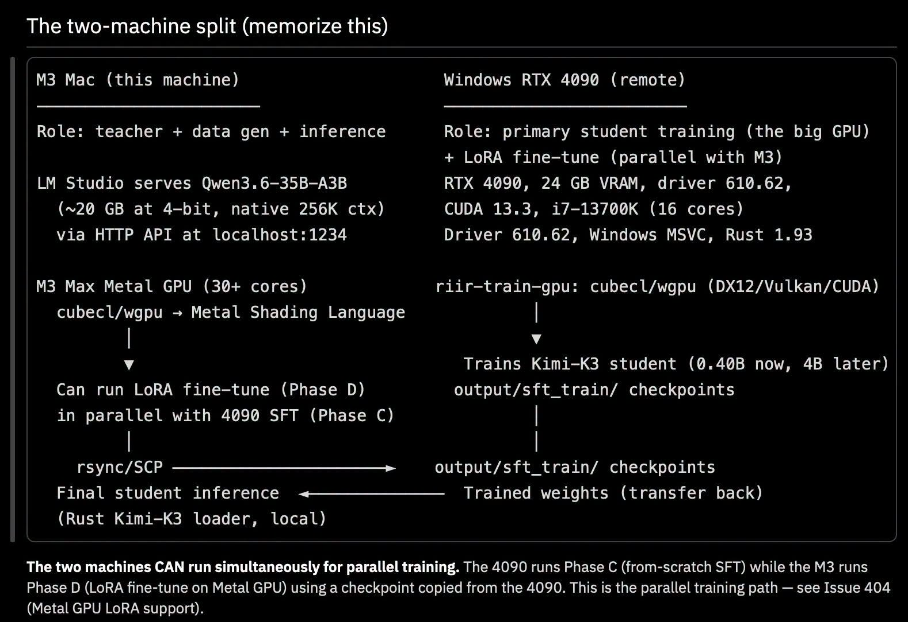

# 040 — Kimi K3, MLA, Muon และ Training Stack แบบ Rust

อ่านเพิ่ม: [ผลตรวจและงานวิจัยรอบ 2](#research-review-2)

แหล่งต้นฉบับ: [post.md](../original/post.md) บรรทัด 112-120  
รูปประกอบ:   
วันที่ค้นคว้า: 2026-09-20

## ประเด็นจากต้นฉบับ

โพสต์พูดถึงการใช้ RTX 4090 เป็นเครื่อง train หลัก และ M3 Max เป็นเครื่อง teacher/data generation/inference/fine-tune ผ่าน stack ที่ผู้เขียนอยากคุมเองด้วย Rust ภาพ “two-machine split” ระบุว่า M3 serve Qwen3.6-35B-A3B ผ่าน LM Studio ที่ localhost, ใช้ Metal/wgpu สำหรับ fine-tune บาง phase ส่วน Windows + RTX 4090 ทำ student training และ LoRA fine-tune แล้ว sync checkpoint กลับมา run local

ต้นฉบับระบุขนาดที่อยากทดลองเพียง **4B-A2B** จึงควรอ่านเป็นโครงการย่อส่วนตามแนวคิดของผู้เขียน ไม่ใช่การฝึก Kimi K3 ตัวเต็มบน 4090 เครื่องเดียว

อีกแกนคืออยากลองสถาปัตยกรรมแนว Kimi K3 เช่น Gated MLA / Kimi Delta Attention และ Muon optimizer พร้อมโยงกับ Ruliology ว่าจะเอา condition เข้ากับ neural layer โดยไม่ต้องแตกเป็น if/else แบบ imperative ได้อย่างไร

## ความรู้ที่ค้นเพิ่ม

แหล่งหลักที่ตรงกับ Kimi K3 คือ technical report [`Kimi K3: Open Frontier Intelligence`](https://arxiv.org/pdf/2607.24653). รายงานระบุว่า Kimi K3 เป็น MoE 2.8T parameters, activate 104B parameters ต่อ token, native vision, context window 1M tokens และ built on Kimi Delta Attention กับ Attention Residuals ร่วมกับ Stable LatentMoE ที่ activate 16 จาก 896 routed experts ต่อ token รายงานยังบอกว่าปล่อย full model weights เพื่อการวิจัย

จุดที่เกี่ยวกับ optimizer ตรงกับโพสต์มากกว่าแค่หน้า Muon ทั่วไป: Kimi K3 ใช้ `Per-Head Muon` สำหรับ matrix parameters โดยแบ่ง momentum matrix ของ Q/K/V projection ตาม head แล้วทำ Newton–Schulz orthogonalization แยกต่อ head ผู้เขียนให้เหตุผลว่า full-matrix orthogonalization ทำให้ head ที่ gradient/momentum ใหญ่ครอบ update direction ส่วน per-head ช่วยให้ learning dynamics สมดุลและ stable ขึ้นในสเกลใหญ่ [Kimi K3 report](https://arxiv.org/pdf/2607.24653)

ส่วน MLA มีต้นทางเด่นใน DeepSeek-V2 ซึ่งอธิบาย Multi-head Latent Attention ว่า compress KV cache เป็น latent vector เพื่อลด memory ระหว่าง inference [DeepSeek-V2](https://arxiv.org/abs/2405.04434). Kimi K3 เองไม่ได้เป็น “แค่ MLA” แต่รวม KDA, Gated MLA/attention variants, Stable LatentMoE, AttnRes และระบบ training/inference ขนาดใหญ่

## วิธีลองทำ

ถ้าจะทดสอบ idea แบบไม่หลงคำใหญ่ ให้ตั้ง experiment log แยกตาม phase:

- data generation tokens/s บน M3
- transfer checkpoint size และเวลา rsync/SCP
- training step time, VRAM peak, loss curve บน 4090
- LoRA fine-tune step time บน Metal/wgpu
- inference latency หลังโหลด checkpoint กลับมา

จากนั้นเปลี่ยนทีละตัว เช่น AdamW เทียบ Muon หรือ attention block ธรรมดาเทียบ MLA-like compression แล้ววัดทั้งคุณภาพและ throughput อย่าเปลี่ยน optimizer, architecture, data และ quantization พร้อมกัน เพราะจะไม่รู้ว่าอะไรช่วยจริง

## ข้อควรระวัง

Rust 100% ไม่ได้แปลว่าจะชนะ CUDA/cuBLAS อัตโนมัติ โพสต์เองยอมรับว่ายังแพ้ CUDA ใน cuBLAS และ autograd fusion ประเด็นที่เรียนได้คือการออกแบบ pipeline ให้คุม ownership, latency, shape และ data movement ได้ชัดขึ้น ส่วน claim “Kimi K3 + Muon + Rust จะออกมาแบบใด” ยังเป็นแผนทดลอง ต้องแยกจากผลที่ Kimi team รายงานในสเกล 2.8T

## แหล่งอ้างอิง

- [Kimi K3 technical report](https://arxiv.org/pdf/2607.24653)
- [DeepSeek-V2 technical report](https://arxiv.org/abs/2405.04434)
- [Muon optimizer writeup](https://kellerjordan.github.io/posts/muon/)

<!-- RESEARCH_REVIEW_2_START -->

## ตรวจสอบและค้นคว้าเพิ่มเติม — รอบ 2

วันที่ตรวจเพิ่ม: 2026-09-20

**แหล่งใหม่ 1 — LoRA: Low-Rank Adaptation of Large Language Models (2021, [arXiv](https://arxiv.org/abs/2106.09685)).** โพสต์พูดถึง LoRA fine-tune ขนานกับการ train student บน RTX 4090/M3 Max คำถามคือ LoRA ลดต้นทุนตรงไหน LoRA freeze weight หลักแล้วฝึก low-rank matrices ที่แทรกใน layer ทำให้จำนวนพารามิเตอร์ train ลดลงมาก ผลของ paper อยู่ที่ NLP models ใน setting ของผู้เขียน ไม่ได้บอกว่า LoRA บน Metal/wgpu จะเร็วหรือเสถียรเท่ากับ CUDA โดยอัตโนมัติ

**แหล่งใหม่ 2 — ZeRO: Memory Optimizations Toward Training Trillion Parameter Models (2020, [arXiv](https://arxiv.org/abs/1910.02054)).** คำถามคือทำไม training stack ใหญ่ต้องคิดเรื่อง memory partitioning ZeRO แยก optimizer states, gradients และ parameters ข้าม devices เพื่อลด memory redundancy นี่ช่วย framing โพสต์เรื่องสองเครื่อง/VRAM 24 GB: bottleneck ของ training ไม่ใช่ FLOPs อย่างเดียว แต่รวม optimizer state, activation, checkpoint transfer และ communication

**วิธีต่อยอดกับโพสต์:** ทำตารางแยก `from-scratch SFT`, `LoRA`, `inference`, `data generation` แล้ววัด VRAM peak, wall-clock, checkpoint size, transfer time และ validation loss. ถ้าจะทดลอง Muon/Per-Head Muon ให้เปลี่ยน optimizer อย่างเดียวก่อน อย่าเปลี่ยน data/model/hardware พร้อมกัน

**ตัวอย่างวัดผลเพิ่ม:** ทำตาราง `phase × machine × artifact`: pretrain/SFT, LoRA adapter, optimizer state, checkpoint, inference weights, และ generated samples. ใส่คอลัมน์ `can_resume_training`, `can_serve_inference`, `needs_optimizer_state`, `network_transfer_GB`. ตารางนี้ช่วยจับความสับสนว่าไฟล์ weight ที่ “เอากลับมาใช้ infer” ไม่เท่ากับ state ที่ “เอาไป train ต่อ” และช่วยเห็นว่าค่าใช้จ่ายจริงอาจอยู่ที่ checkpoint/optimizer มากกว่า forward pass

**ข้อจำกัด:** Kimi K3 report เป็นระบบใหญ่ที่มี MoE/attention/optimizer recipe เฉพาะ การเอาเฉพาะชื่อ MLA/Muon มาใช้ใน Rust stack ต้องพิสูจน์ใหม่ทั้งหมด โดยเฉพาะ autograd fusion, kernel quality และ numeric stability
<!-- RESEARCH_REVIEW_2_END -->

<!-- POST_NAV_START -->
---

[สารบัญ](README.md) · [← โพสต์ 039](039-katgpt-go-weight-puct-simd.md) · [โพสต์ 041 →](041-one-layer-lora-overhead.md)

หัวข้อที่เกี่ยวข้อง: [06 Rust, memory layout, SIMD และ CPU/GPU runtime](topics/06-rust-memory-and-hardware.md) · [07 การฝึกโมเดล, attention และสถาปัตยกรรมขนาดเล็ก](topics/07-training-and-model-architecture.md) · [08 อ่านและออกแบบ benchmark ให้เปรียบเทียบได้](topics/08-performance-and-benchmarks.md)
<!-- POST_NAV_END -->
