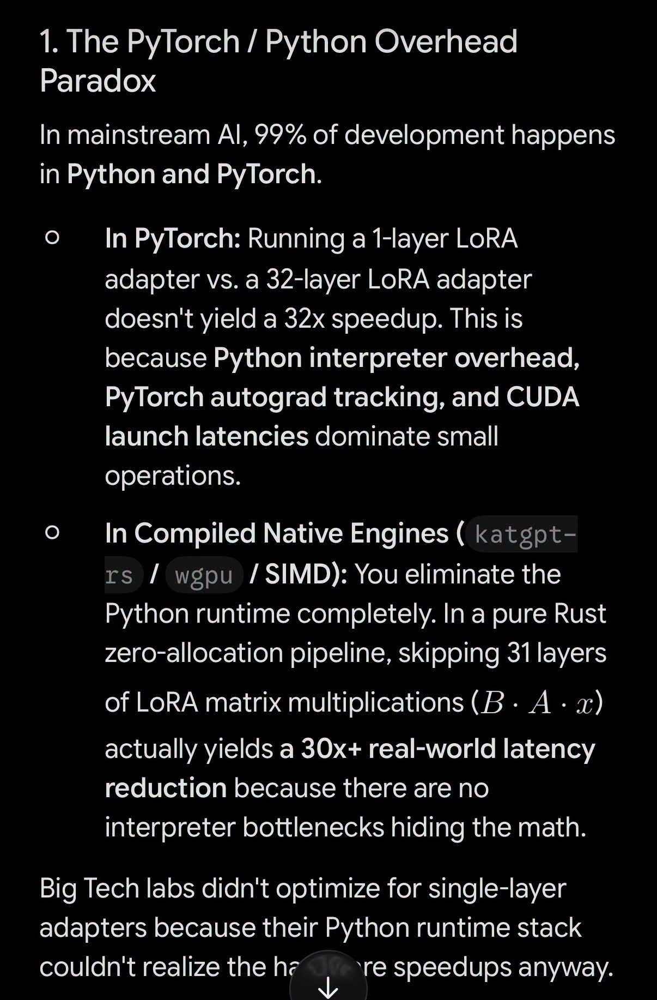

# 041 — One Layer, Python Overhead และคำว่าเร็วกว่า 30x

อ่านเพิ่ม: [ผลตรวจและงานวิจัยรอบ 2](#research-review-2)

แหล่งต้นฉบับ: [post.md](../original/post.md) บรรทัด 105-111  
รูปประกอบ:   
วันที่ค้นคว้า: 2026-09-20

## ประเด็นจากต้นฉบับ

โพสต์บอกว่า Gemini อ้าง paper “One Layer Is All You Need” แล้วเสนอว่า `katgpt-rs` แบบ model based อาจเร็วขึ้นอีก 30x ภาพอธิบายว่าใน PyTorch/Python การลด LoRA จาก 32 layers เหลือ 1 layer อาจไม่เร็วขึ้น 32x เพราะมี overhead จาก interpreter, autograd tracking และ CUDA launch latency แต่ใน native engine ที่ compile แล้วอาจเห็นผลมากกว่า

ประเด็นที่ควรเรียนคือ overhead ไม่ได้มีแค่ FLOPs ถ้างานเล็กมาก เวลาจริงอาจอยู่ที่ runtime dispatch, memory movement, kernel launch, allocation หรือ graph overhead มากกว่า matrix multiplication เอง

## ความรู้ที่ค้นเพิ่ม

NVIDIA CUDA Best Practices เน้นว่าการ optimize performance ต้องดู parallel execution, memory usage และ instruction usage ร่วมกัน และ data transfer ระหว่าง host/device ควรถูก minimize เพราะมีต้นทุนสูง [CUDA Best Practices](https://docs.nvidia.com/cuda/cuda-c-best-practices-guide/index.html). นี่สนับสนุนกรอบคิดในภาพว่า workload เล็ก ๆ อาจไม่คุ้มกับการยิง GPU kernel แยกหลายครั้ง

ฝั่ง Rust SIMD ก็ต้องระวังภาษาการตลาด เอกสาร Rust ระบุว่า portable SIMD เป็น nightly experimental API และ operation อาจ map เป็น implementation ที่เหมาะสมต่อ target ไม่ใช่ instruction เดียวเสมอ [Rust `std::simd`](https://doc.rust-lang.org/std/simd/index.html). ดังนั้น “30x” ต้องเป็น hypothesis ที่ต้อง benchmark ไม่ใช่ข้อเท็จจริงจาก docs

อีกความต่างที่ต้องแยกคือ **ฝึก adapter เพียง layer เดียว** ยังอาจต้องรัน forward ของ backbone ทุก layer อยู่ จึงคำนวณ speedup จากจำนวน layer ที่ปรับน้ำหนักโดยตรงไม่ได้ เช่น ถ้าส่วนที่ลดได้คิดเป็น 20% ของเวลารวม ต่อให้ทำส่วนนั้นเร็วขึ้น 32 เท่า ทั้งงานจะเร็วขึ้นเพียง 1/(0.8+0.2/32) ≈ 1.24 เท่า นี่เป็นตัวเลขสมมติ ไม่ใช่ผลของ paper ที่ชื่อยังไม่ยืนยัน ดูความต่างการฝึกกับการใช้งานเพิ่มเติมใน [โพสต์ 023](023-single-layer-rl-and-mapping.md)

## วิธีลองวัด

ทำ microbenchmark 3 ชั้น: pure math kernel, full inference function, และ end-to-end API call วัดเป็น p50/p95 latency และ throughput พร้อม batch size 1, 8, 64 ถ้า one-layer adapter เร็วขึ้นเฉพาะ kernel แต่ end-to-end ไม่เปลี่ยน แปลว่า bottleneck อยู่ข้างนอก kernel ถ้า native engine ดีขึ้นทั้งสามชั้น จึงค่อยสรุปว่า overhead ถูกตัดจริง

## ข้อควรระวัง

ผมยังไม่ยืนยัน paper “One Layer Is All You Need” จากแหล่ง primary ในงานนี้ เพราะชื่อค้นแล้วไม่พบหน้าต้นทางที่แน่ชัดพอสำหรับ claim เฉพาะ จึงควรอ่านไฟล์นี้เป็นบทเรียนเรื่อง overhead และ benchmarking มากกว่าเป็นสรุป paper ดังกล่าว

## แหล่งอ้างอิง

- [CUDA C++ Best Practices Guide](https://docs.nvidia.com/cuda/cuda-c-best-practices-guide/index.html)
- [Rust Portable SIMD](https://doc.rust-lang.org/std/simd/index.html)

<!-- RESEARCH_REVIEW_2_START -->

## ตรวจสอบและค้นคว้าเพิ่มเติม — รอบ 2

วันที่ตรวจเพิ่ม: 2026-09-20

**ค้นชื่อ paper เพิ่ม:** พบแหล่ง primary ที่ใกล้เคียงชื่อมากที่สุดคือ **“Is One Layer Enough? Training A Single Transformer Layer Can Match Full-Parameter RL Training” (2026, [arXiv](https://arxiv.org/abs/2607.01232))** ไม่ใช่ชื่อ “One Layer Is All You Need” ตามโพสต์โดยตรง paper นี้ศึกษาการ train/ปรับพารามิเตอร์เพียงหนึ่ง transformer layer ระหว่าง RL post-training แล้ววัด layer contribution ผลคือบาง layer กู้คืน gains ได้มากใน setting ของ paper แต่ inference ยังใช้โมเดลเต็ม จึงไม่ควรเอาไปยืนยันว่า runtime ใช้ layer เดียวแล้วเร็วขึ้น 30×

**แหล่งใหม่ 2 — PyTorch Performance Tuning Guide (official, [docs](https://docs.pytorch.org/tutorials/recipes/recipes/tuning_guide.html)).** คำถามคือ overhead มาจากไหนได้บ้าง เอกสาร PyTorch แนะนำเรื่อง disabled debug APIs, fused operations, `torch.compile`, data loading, mixed precision และ avoiding unnecessary CPU-GPU sync สิ่งนี้สนับสนุนบทเรียนว่า Python/PyTorch overhead, autograd, launch และ sync อาจกินเวลางานเล็ก แต่ไม่ได้บอกว่า Rust native จะชนะเสมอ

**ทดลองที่ควรทำ:** สร้าง workload 3 แบบ: matrix ใหญ่หนึ่งก้อน, matrix เล็กซ้ำ 10,000 ครั้ง, และ end-to-end request ที่มี serialization. วัด PyTorch eager, PyTorch compiled, Rust CPU SIMD และ GPU kernel เฉพาะ path เดียวกัน ถ้า Rust ชนะเฉพาะงานเล็กมาก ให้รายงานว่าเป็น overhead-sensitive workload

**ข้อจำกัด:** ยังไม่พบ primary source ชื่อ “One Layer Is All You Need” ที่ตรงกับ claim LoRA 30× จึงแก้ความหมายใน note นี้เป็น “paper ที่อาจถูกอ้างผิดชื่อ” และ “hypothesis benchmark” ไม่ใช่ข้อเท็จจริง
<!-- RESEARCH_REVIEW_2_END -->

<!-- POST_NAV_START -->
---

[สารบัญ](README.md) · [← โพสต์ 040](040-kimi-mla-muon-rust-training.md) · [โพสต์ 042 →](042-latent-rag-cargo-heal.md)

หัวข้อที่เกี่ยวข้อง: [07 การฝึกโมเดล, attention และสถาปัตยกรรมขนาดเล็ก](topics/07-training-and-model-architecture.md) · [08 อ่านและออกแบบ benchmark ให้เปรียบเทียบได้](topics/08-performance-and-benchmarks.md)
<!-- POST_NAV_END -->
