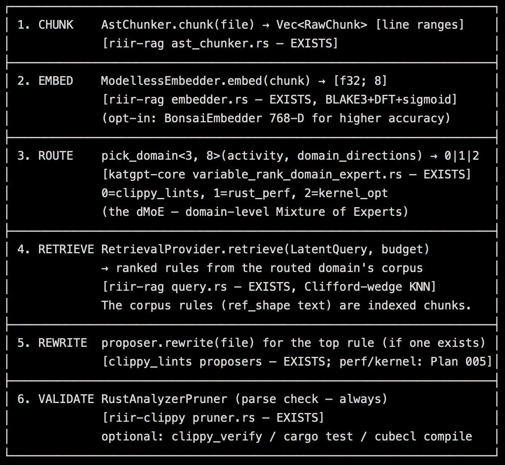

# 042 — RAG ใน Latent Space เพื่อแก้ Clippy และ Kernel Perf

อ่านเพิ่ม: [ผลตรวจและงานวิจัยรอบ 2](#research-review-2)

แหล่งต้นฉบับ: [post.md](../original/post.md) บรรทัด 95-104  
รูปประกอบ:   
วันที่ค้นคว้า: 2026-09-20

## ประเด็นจากต้นฉบับ

โพสต์เสนอ RAG ใน latent space เพื่อแก้ warning/error/perf โดยไม่เปลือง token ภาพวาง pipeline เป็น `CHUNK -> EMBED -> ROUTE -> RETRIEVE -> REWRITE -> VALIDATE` โดยอ้าง AST chunker, model-less embedder, domain expert routing, retrieval provider, proposer rewrite และ Rust analyzer parser validation เป้าหมายคือให้ `cargo heal` แก้ clippy, kernel perf และ warning/error ได้อัตโนมัติโดยลด loop ผ่าน LLM

## ความรู้ที่ค้นเพิ่ม

Clippy เป็นชุด lint ของ Rust เพื่อจับ common mistakes และช่วยเขียน Rust ให้ดีขึ้น เอกสารทางการบอกว่ามี lint จำนวนมาก แบ่งหมวดหมู่ [Clippy Documentation](https://doc.rust-lang.org/clippy/). rust-analyzer เป็น language server ที่ให้ IDE functionality และรวม diagnostics จาก rustc/clippy ได้ [rust-analyzer](https://rust-analyzer.github.io/). ดังนั้น idea ที่ใช้ AST/diagnostics เป็น input ให้ repair engine มีฐานที่ดี เพราะข้อมูล structured กว่า prompt text ยาว ๆ

RAG แบบ latent space ในโพสต์เป็นระบบภายใน ไม่ใช่มาตรฐานสาธารณะ แต่สอดคล้องกับแนวคิด retrieval: แปลงปัญหาเป็น representation, ดึง rule/corpus ที่ใกล้, แล้ว apply edit ก่อน validate ข้อดีคือ deterministic กว่า LLM full generation ถ้า corpus/rules ชัด ข้อเสียคือ coverage จำกัดตาม corpus และ router

## แบบฝึก

ลองทำ mini healer สำหรับ lint เดียว เช่น `needless_borrow`:

1. เก็บตัวอย่างก่อน/หลังแก้ 20 คู่
2. เขียน matcher จาก AST หรือ regex อย่างระวัง
3. สร้าง proposer ที่เสนอ patch
4. validate ด้วย `cargo check` และ `cargo clippy`
5. บันทึก false positive ทุกครั้งกลับ corpus

นี่คือ engineering loop ที่ดี เพราะ repair ไม่จบที่ “เสนอ” แต่จบที่ “ผ่าน validator”

## ข้อควรระวัง

ตัวเลข latency “13 µs²”, “เร็วกว่า clippy 2,018,108x” และ “tokens/sec 74,000x” เป็น claim จากโพสต์ที่ต้อง reproduce ด้วย workload เดียวกัน หน่วย `µs²` ยังแปลกสำหรับ latency เพราะ latency ปกติใช้ `µs` ไม่ใช่ไมโครวินาทียกกำลังสอง จึงควรแก้หน่วยก่อนเผยแพร่เป็น benchmark จริง

## แหล่งอ้างอิง

- [Clippy Documentation](https://doc.rust-lang.org/clippy/)
- [rust-analyzer official site](https://rust-analyzer.github.io/)

<!-- RESEARCH_REVIEW_2_START -->

## ตรวจสอบและค้นคว้าเพิ่มเติม — รอบ 2

วันที่ตรวจเพิ่ม: 2026-09-20

**แหล่งใหม่ 1 — Tree-sitter documentation (official, [docs](https://tree-sitter.github.io/tree-sitter/)).** คำถามคือ AST chunking ที่เหมาะกับ code repair ควรพึ่งอะไร Tree-sitter เป็น incremental parsing system ที่ให้ concrete syntax tree และรองรับหลายภาษา วิธีนี้ต่างจาก regex เพราะ preserve structure ของ code ได้ดีกว่า สำหรับ pipeline ในภาพ `CHUNK -> EMBED -> ROUTE` การใช้ parser/AST ช่วยให้ chunk อยู่ในขอบเขต function/block แทนตัดตามบรรทัดสุ่ม

**แหล่งใหม่ 2 — rustc JSON diagnostics (official, [docs](https://doc.rust-lang.org/rustc/json.html)).** rustc รองรับ JSON output สำหรับ diagnostics ที่มี message, spans, children และ code บางกรณี ข้อมูล structured นี้เหมาะกับ healer เพราะรู้ file/line/range มากกว่าข้อความ error เฉย ๆ

**ต่อยอดกับโพสต์:** แยก retrieval corpus เป็น `lint rule`, `perf pattern`, `kernel note`, `security sink/source` แล้วให้ทุก suggestion ต้องอ้าง span จาก parser/diagnostic ก่อน rewrite. ตัวอย่างทดลอง: lint `needless_borrow` ควรสร้าง patch เฉพาะ expression span ไม่แก้ทั้งบรรทัด

**ตัวอย่างวัดผลเพิ่ม:** สร้างชุด clippy errors 50 เคสและ kernel perf notes 20 เคส แปลงทุกเคสเป็น tree-sitter span + rustc JSON diagnostic + rule id แล้วให้ retrieval คืน top-5 rules. วัด `hit@5`, `wrong_domain_rate`, `patch_compiles`, และ `patch_reverted_by_review`. ถ้า latent retrieval เจอ rule ถูกแต่ span ผิด แสดงว่าต้องปรับ chunking; ถ้า span ถูกแต่ patch พัง แสดงว่า validator ยังไม่พอ

**ข้อจำกัด:** RAG ใน latent space ไม่ได้ปลอด token/latency โดยอัตโนมัติ ถ้า embedder/router miss domain จะดึง rule ผิด และถ้า validator แค่ parse ผ่าน อาจยังเปลี่ยน semantics จึงควรมี compile/test/bench ตามชนิด patch
<!-- RESEARCH_REVIEW_2_END -->

<!-- POST_NAV_START -->
---

[สารบัญ](README.md) · [← โพสต์ 041](041-one-layer-lora-overhead.md) · [โพสต์ 043 →](043-rust-simd-on-gpu.md)

หัวข้อที่เกี่ยวข้อง: [08 อ่านและออกแบบ benchmark ให้เปรียบเทียบได้](topics/08-performance-and-benchmarks.md) · [09 RAG, code healing และความเป็นส่วนตัวของ embedding](topics/09-rag-code-healing-and-privacy.md)
<!-- POST_NAV_END -->
