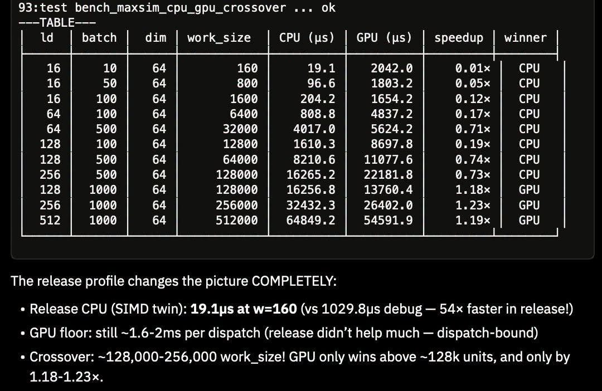

# 044 — งานเล็ก CPU/SIMD อาจชนะ GPU

อ่านเพิ่ม: [ผลตรวจและงานวิจัยรอบ 2](#research-review-2)

แหล่งต้นฉบับ: [post.md](../original/post.md) บรรทัด 80-88  
รูปประกอบ:   
วันที่ค้นคว้า: 2026-09-20

## ประเด็นจากต้นฉบับ

โพสต์เตือนว่าอย่าเสียพลังกับ human coding style มากเกินไปเมื่อ AI เป็นคนเขียน code แล้ว ควรลงไปคิดเรื่อง CPU/SIMD/GPU kernel และเลือกเครื่องมือให้เหมาะ ภาพ benchmark ภายในแสดงว่า workload เล็ก CPU ชนะ GPU และ GPU เริ่มชนะเมื่อ `work_size` ประมาณ 128,000 ขึ้นไปในชุดทดสอบนั้น

## ความรู้ที่ค้นเพิ่ม

หลักนี้มีเหตุผลทางระบบ: GPU มี parallelism สูง แต่ต้องจ่ายต้นทุน launch, scheduling, memory transfer และ synchronization เอกสาร NVIDIA ย้ำว่าการ optimize GPU ต้อง maximize parallel execution, memory usage และ instruction usage ร่วมกัน และควรลด data transfer host/device เพราะมีต้นทุนสูง [CUDA Best Practices](https://docs.nvidia.com/cuda/cuda-c-best-practices-guide/index.html). ดังนั้นงานเล็กที่ CPU SIMD ทำจบใน cache อาจเร็วกว่า GPU แม้ GPU มี FLOPs สูงกว่า

Rust portable SIMD ก็ช่วยให้เขียน data parallel CPU path ได้โดยไม่ bind กับ architecture เฉพาะ แต่ยังเป็น experimental nightly API [Rust `std::simd`](https://doc.rust-lang.org/std/simd/index.html). นี่เหมาะกับแนวคิด “ขยันให้ถูกที่”: ก่อนย้ายไป GPU ควรวัด CPU scalar, CPU SIMD, GPU รวม overhead และ GPU เฉพาะ kernel แยกกัน

## แบบฝึก

สร้างตาราง benchmark ที่มี columns: `batch`, `dim`, `work_size`, `cpu_us`, `gpu_us`, `winner`, `speedup` แล้วรัน release mode เท่านั้น เพิ่มแถว warmup และแยก “รวม transfer” กับ “device-only” ถ้าผลบอกว่า GPU ชนะเฉพาะ device-only แต่แพ้ end-to-end นั่นคือ product path ยังไม่ควรใช้ GPU

## ข้อควรระวัง

ค่า crossover 128k ในภาพเป็นของ workload/เครื่อง/implementation ของผู้เขียน ไม่ใช่ threshold สากล งาน memory-bound, compute-bound, branchy, หรือ batchable จะมีจุดเปลี่ยนต่างกันมาก การสรุปที่ปลอดภัยคือ “GPU ต้องมีงานพอให้กลบ overhead” ไม่ใช่ “เกิน 128k แล้ว GPU ชนะเสมอ”

## แหล่งอ้างอิง

- [CUDA C++ Best Practices Guide](https://docs.nvidia.com/cuda/cuda-c-best-practices-guide/index.html)
- [Rust Portable SIMD](https://doc.rust-lang.org/std/simd/index.html)

<!-- RESEARCH_REVIEW_2_START -->

## ตรวจสอบและค้นคว้าเพิ่มเติม — รอบ 2

วันที่ตรวจเพิ่ม: 2026-09-20

**แหล่งหลักใหม่ที่อ่าน:** [CUDA Programming Guide](https://docs.nvidia.com/cuda/cuda-programming-guide/index.html) และ [WebGPU specification](https://www.w3.org/TR/webgpu/). CUDA guide แยกเรื่อง programming model, SIMT kernels, asynchronous execution, unified/system memory และ compiler/runtime ไว้ชัด จึงสนับสนุนแกนคิดของโพสต์ว่า GPU มีต้นทุนระบบหลายชั้น ส่วน WebGPU spec ช่วยย้ำว่าการใช้ GPU ผ่าน API สมัยใหม่ต้องมี device, queue, command encoding และ synchronization ไม่ใช่เรียกฟังก์ชันคณิตศาสตร์หนึ่งครั้งแล้วได้ FLOPs เต็มทันที

**สิ่งที่ขยาย/แก้ความเข้าใจจากโพสต์:** ภาพ threshold `work_size ≈ 128k` ควรอ่านเป็นผลของเครื่องและ workload นั้น ไม่ใช่กฎทั่วไป รอบ 2 เพิ่มกรอบวัดว่า “งานเล็ก CPU/SIMD ชนะ GPU” เกิดได้จากอย่างน้อย 4 ต้นทุน: launch/dispatch, copy หรือ memory visibility, scheduling, และ synchronization. ถ้างานอยู่ใน L1/L2 cache และมี branch น้อย CPU SIMD อาจเร็วมาก; ถ้างานใหญ่และ memory access coalesced GPU จึงเริ่มคุ้ม

**ตัวอย่างทดลอง:** ทำ microbenchmark เดิมด้วย matrix 3 แกน: `work_size`, `arithmetic_intensity` เช่น add-only เทียบ fused multiply-add หลายรอบ, และ `batching` เช่น 1 request เทียบ 128 requests. รายงาน 2 ตาราง: end-to-end latency และ device-only/kernel latency. เพิ่ม regression เส้นง่าย ๆ `total = fixed_overhead + work / throughput` เพื่อประมาณ crossover ของเครื่องนั้น แล้วแนบ raw command, compiler flags, driver/runtime version

**ข้อจำกัด:** CUDA/WebGPU docs ไม่ได้ยืนยันตัวเลขในภาพของผู้เขียน และไม่ควรนำ threshold 128k ไปใช้กับงาน LLM decode, physics, image processing หรือ kernel optimization อื่นตรง ๆ. งานจริงอาจชนะเพราะลด allocation, เปลี่ยน layout, หรือเพิ่ม locality โดยไม่เกี่ยวกับ GPU เลย ดังนั้นข้อสรุปที่ปลอดภัยคือวัดแบบ matched workload ก่อนย้าย runtime
<!-- RESEARCH_REVIEW_2_END -->

<!-- POST_NAV_START -->
---

[สารบัญ](README.md) · [← โพสต์ 043](043-rust-simd-on-gpu.md) · [โพสต์ 045 →](045-ruliology-program-games.md)

หัวข้อที่เกี่ยวข้อง: [06 Rust, memory layout, SIMD และ CPU/GPU runtime](topics/06-rust-memory-and-hardware.md) · [08 อ่านและออกแบบ benchmark ให้เปรียบเทียบได้](topics/08-performance-and-benchmarks.md)
<!-- POST_NAV_END -->
