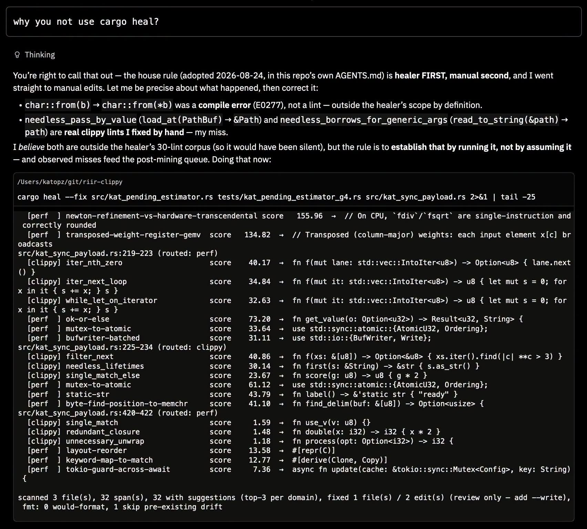

# 046 — ช่องว่างระหว่าง LLM กับ Rules-Based Engineering

อ่านเพิ่ม: [ผลตรวจและงานวิจัยรอบ 2](#research-review-2)

แหล่งต้นฉบับ: [post.md](../original/post.md) บรรทัด 63-72  
รูปประกอบ:   
วันที่ค้นคว้า: 2026-09-20

## ประเด็นจากต้นฉบับ

โพสต์บอกว่างานจำนวนมากไม่จำเป็นต้องเรียก LLM API เช่น linter, performance และ security บางส่วน สามารถทำด้วย rules-based + shallow reasoning + ruliology ได้ ผู้เขียนยก `cargo heal` เป็นตัวอย่างที่ให้ AI ใช้ แต่ AI “ขี้เกียจใช้” และภาพแสดงตัวอย่างผลลัพธ์ที่ scan file, route domain เป็น clippy/perf, ให้ suggestion และ fix บางส่วนแบบ review-only

## ความรู้ที่ค้นเพิ่ม

Clippy เป็นเครื่องมือ official ของ Rust ที่รวม lints เพื่อจับ common mistakes และปรับ idiomatic Rust [Clippy docs](https://doc.rust-lang.org/clippy/). rust-analyzer ให้ diagnostics และ IDE features สำหรับ Rust [rust-analyzer](https://rust-analyzer.github.io/). ดังนั้นการสร้าง healer ที่อ่าน diagnostics แล้วเสนอ patch มีฐานจาก ecosystem อยู่แล้ว สิ่งที่เพิ่มคือ corpus/heuristics ของ domain เฉพาะ เช่น kernel optimization หรือ security rule ที่ Clippy ไม่รู้ครบ

แนวคิด “LLM + rules” ดีตรงที่ rules ตรวจได้เร็วและ repeatable ส่วน LLM เหมาะกับช่องว่างที่ rule ยังจับไม่ได้ แต่ถ้าใช้ LLM กับทุก lint จะเสีย token และ latency โดยไม่จำเป็น

## แบบฝึก

ลองทำ policy ง่าย ๆ สำหรับทีม:

1. ทุก compile error ให้ `cargo check` เป็น source of truth
2. ทุก style lint ให้ `cargo clippy --fix` ก่อน
3. perf/security ใช้ rule corpus เฉพาะ repo
4. LLM ใช้เฉพาะเมื่อ rule ไม่มี suggestion หรือ patch ไม่ผ่าน test

วัดผลด้วยจำนวนรอบแก้ต่อ PR, token ที่ใช้ และ false fixes

## ข้อควรระวัง

Rules-based ไม่ได้แปลว่าถูกเสมอ rule ที่ match ผิดอาจสร้าง patch ที่ compile ผ่านแต่ semantics ผิด เช่นเปลี่ยน allocation pattern แล้วกระทบ lifetime/performance จริง จึงต้องมี validator หลายชั้น: parse, typecheck, test, benchmark เฉพาะกรณี และ human review สำหรับ code สำคัญ

## แหล่งอ้างอิง

- [Clippy Documentation](https://doc.rust-lang.org/clippy/)
- [rust-analyzer](https://rust-analyzer.github.io/)

<!-- RESEARCH_REVIEW_2_START -->

## ตรวจสอบและค้นคว้าเพิ่มเติม — รอบ 2

วันที่ตรวจเพิ่ม: 2026-09-20

**แหล่งหลักใหม่ที่อ่าน:** [cargo fix — The Cargo Book](https://doc.rust-lang.org/cargo/commands/cargo-fix.html) และ [rustc lints — The rustc book](https://doc.rust-lang.org/rustc/lints/index.html). `cargo fix` เป็นคำสั่ง official สำหรับ apply suggestions จาก compiler diagnostics ส่วน rustc lints แสดงว่า warning/deny/forbid/allow เป็นระบบระดับ compiler ที่ตั้ง policy ได้ ไม่จำเป็นต้องให้ LLM ตัดสินทุกครั้ง

**สิ่งที่ขยายจากโพสต์:** ภาพ `cargo heal` ควรยืนบน pipeline ที่แยก “แหล่ง truth” ให้ชัด: compiler diagnostic ให้ข้อเท็จจริงเรื่อง type/borrow/check, lint ให้ policy ที่ตั้งได้, rule corpus ให้ domain-specific suggestion, และ LLM ช่วยเมื่อไม่มี rule หรือ patch ต้องอธิบายบริบท. นี่ทำให้คำว่า shallow reasoning ไม่ใช่การลดคุณภาพ แต่เป็นการใช้เครื่องมือ deterministic ก่อนเรียก stochastic model

**ตัวอย่างทดลอง:** ทำ healer แบบ 4 ขั้น: 1) รัน `cargo check --message-format=json`, 2) เก็บ diagnostic code/span/suggestion, 3) route ไป `compiler`, `clippy`, `perf`, `security`, 4) apply เฉพาะ patch ที่มี validator ตรง เช่น compiler suggestion ต้องกลับไปรัน `cargo check`, perf suggestion ต้องมี benchmark เฉพาะ. วัดผลด้วยจำนวน patch ที่ apply ได้เอง, revert rate, และเวลาต่อไฟล์

**ข้อจำกัด:** `cargo fix` ใช้ suggestions ที่เครื่องมือ Rust สร้าง ไม่ครอบคลุมทุก optimization/security smell. Rule corpus ภายในอาจเร็วและถูกกับ repo ของผู้เขียน แต่ถ้าไม่มี validator ก็อาจกลายเป็น auto-fixer ที่ compile ผ่านแต่เปลี่ยน behavior. ข้อความรอบ 2 จึงเน้นว่า AI ควรใช้ cargo/rustc เป็น oracle แรก ไม่ใช่แทนที่ compiler
<!-- RESEARCH_REVIEW_2_END -->

<!-- POST_NAV_START -->
---

[สารบัญ](README.md) · [← โพสต์ 045](045-ruliology-program-games.md) · [โพสต์ 047 →](047-latent-first-neuron-db.md)

หัวข้อที่เกี่ยวข้อง: [09 RAG, code healing และความเป็นส่วนตัวของ embedding](topics/09-rag-code-healing-and-privacy.md)
<!-- POST_NAV_END -->
