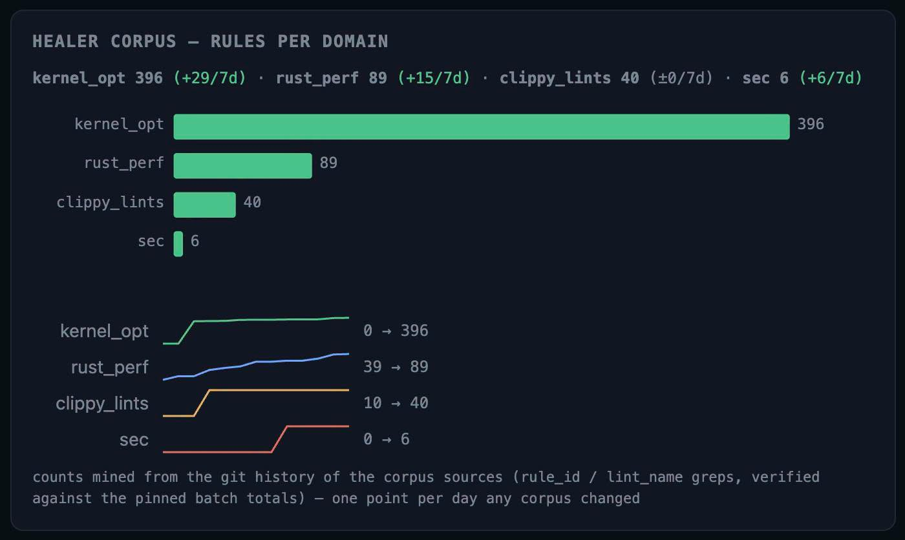

# 047 — Latent-First Code Healer และ Corpus ที่โตเอง

อ่านเพิ่ม: [ผลตรวจและงานวิจัยรอบ 2](#research-review-2)

แหล่งต้นฉบับ: [post.md](../original/post.md) บรรทัด 55-62  
รูปประกอบ:   
วันที่ค้นคว้า: 2026-09-20

## ประเด็นจากต้นฉบับ

โพสต์เล่าว่า code healer ภายในมี corpus ด้าน kernel optimization มากกว่า Rust/Clippy เพราะ Clippy ไม่มีความรู้ kernel มากนัก ภาพแสดงจำนวน rules ต่อ domain: `kernel_opt 396`, `rust_perf 89`, `clippy_lints 40`, `sec 6` และมี trend จาก git history ผู้เขียนพูดถึง local `Ternary-Bonsai-27B`, neuron-db, RAG built-in และ sync auto

## ความรู้ที่ค้นเพิ่ม

ประเด็นสำคัญคือ knowledge base สำหรับ code repair ควรแยก domain เพราะ lint, perf, kernel และ security มีหลักฐานต่างกัน Clippy official docs ครอบคลุม lint ใน Rust ecosystem [Clippy](https://doc.rust-lang.org/clippy/) แต่ kernel optimization ต้องอิง benchmark, memory layout, vectorization และ hardware behavior มากกว่า lint ทั่วไป ฝั่ง CUDA docs ก็เน้น memory access, parallel execution และ instruction throughput เป็นแกน optimize [CUDA Best Practices](https://docs.nvidia.com/cuda/cuda-c-best-practices-guide/index.html)

คำว่า latent-first ในโพสต์หมายถึงให้ระบบทำงานกับ representation ที่ค้น/route ได้โดยไม่ต้องแปลงเป็น prompt ยาวทุกครั้ง วิธีนี้อาจลด token และ latency แต่ต้องมี schema/validator ที่แข็งพอ มิฉะนั้น latent index จะกลายเป็น black box ใหม่

## วิธีลอง

ทำ corpus ตารางเดียวก่อน:

| domain | trigger | suggestion | validator |
| --- | --- | --- | --- |
| clippy | lint name | patch template | cargo clippy |
| rust_perf | pattern | rewrite note | criterion bench |
| kernel_opt | shape/memory | kernel plan | microbench |
| sec | sink/source | safer API | test + review |

จากนั้นให้ทุก missed case เพิ่มกลับเข้า corpus พร้อม reason ว่าทำไม rule เดิมพลาด

## ข้อควรระวัง

จำนวน corpus มากกว่าไม่ได้แปลว่าดีกว่า ต้องวัด precision, recall, false positive และ cost ต่อ fix โดยเฉพาะ perf rule เพราะ patch ที่เร็วใน microbench อาจช้าลงใน workload จริง หรือเร็วขึ้นแต่ลด readability/maintainability เกินคุ้ม

## แหล่งอ้างอิง

- [Clippy Documentation](https://doc.rust-lang.org/clippy/)
- [CUDA Best Practices Guide](https://docs.nvidia.com/cuda/cuda-c-best-practices-guide/index.html)

<!-- RESEARCH_REVIEW_2_START -->

## ตรวจสอบและค้นคว้าเพิ่มเติม — รอบ 2

วันที่ตรวจเพิ่ม: 2026-09-20

**แหล่งหลักใหม่ที่อ่าน:** Monperrus, [Automatic Software Repair: a Bibliography (2018)](https://arxiv.org/abs/1807.00515) และ [CodeQL overview](https://codeql.github.com/docs/codeql-overview/about-codeql/). งาน software repair ชี้ว่าการซ่อมโค้ดต้องมี oracle/test/spec เพื่อคัด patch ส่วน CodeQL วางแนวคิด code-as-data: query โค้ดด้วยภาษาเฉพาะเพื่อหา pattern ที่สนใจ แหล่งทั้งสองช่วยแยก neuron-db/RAG ของโพสต์ออกจากการ “เดาคำตอบ” แบบไม่มีหลักตรวจ

**สิ่งที่ขยายจากโพสต์:** Corpus ที่โตเองควรมี metadata มากกว่าข้อความ rule เช่น `trigger`, `evidence`, `patch_template`, `validator`, `known_false_positive`, `hardware_scope`. ถ้าเป็น kernel optimization ต้องมี hardware/compiler/workload tag; ถ้าเป็น security ต้องมี sink/source/threat model; ถ้าเป็น clippy ต้อง map ไป lint name. Latent-first ดีตรง route เร็ว แต่ชั้นสุดท้ายควรคืน artifact ที่ตรวจด้วย rule/test/query ได้

**ตัวอย่างทดลอง:** แยก corpus 100 rules เป็น train/eval แบบ held-out จาก issue จริง แล้ววัด precision/recall ของ retrieval ก่อนให้ LLM เขียน patch. ให้หนึ่งเคสมีหลาย query: lexical, embedding, domain tag. ถ้า embedding เจอ rule ใกล้แต่ validator ไม่ตรง ให้บันทึกเป็น hard negative กลับเข้า neuron-db. รายงาน `retrieval_hit@5`, `patch_apply_rate`, `compile_pass_rate`, และ `semantic_revert_rate`

**ข้อจำกัด:** Bibliography ด้าน repair ไม่ยืนยันว่า corpus ภายในผู้เขียนดีกว่า Clippy; มันให้กรอบวัดเท่านั้น. CodeQL ก็ไม่ใช่ replacement ของ compiler หรือ benchmark. ข้อสรุปรอบ 2 คือจำนวน rules ต่อ domain มีประโยชน์เมื่อทุก rule มี oracle และประวัติผลลัพธ์ ไม่ใช่แค่มี embedding เยอะ
<!-- RESEARCH_REVIEW_2_END -->

<!-- POST_NAV_START -->
---

[สารบัญ](README.md) · [← โพสต์ 046](046-rules-shallow-reasoning-cargo-heal.md) · [โพสต์ 048 →](048-vllm-katgpt-rs-benchmarking.md)

หัวข้อที่เกี่ยวข้อง: [05 Memory, adaptation และระบบที่ปรับปรุงตัวเอง](topics/05-memory-and-self-improvement.md) · [09 RAG, code healing และความเป็นส่วนตัวของ embedding](topics/09-rag-code-healing-and-privacy.md)
<!-- POST_NAV_END -->
