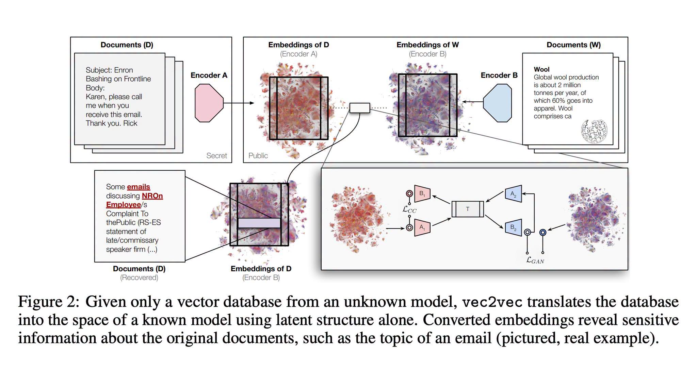

# 051 — Vector DB ไม่ได้ปลอดภัยเพราะเป็น Embedding

อ่านเพิ่ม: [ผลตรวจและงานวิจัยรอบ 2](#research-review-2)

แหล่งต้นฉบับ: [post.md](../original/post.md) บรรทัด 30-35  
รูปประกอบ:   
วันที่ค้นคว้า: 2026-09-20

## ประเด็นจากต้นฉบับ

โพสต์สรุป paper ว่า vector database อาจถูก “แงะ” ได้ด้วย universal latent representation ทำให้ sensitive information ถูกอนุมานกลับได้โดยไม่ต้องรู้ encoder และเสนอว่าถ้าทำ infer + vector DB เองก็ออกแบบป้องกัน leakage ได้ดีขึ้น ภาพประกอบชัดมาก: attacker มี embeddings จาก encoder A และใช้ latent structure แปลไป space ของ encoder B จนกู้หัวข้อเอกสาร sensitive ได้ เช่น email เรื่องพนักงาน/ข้อร้องเรียน

## ความรู้ที่ค้นเพิ่ม

paper [`Harnessing the Universal Geometry of Embeddings`](https://arxiv.org/html/2505.12540v2) เสนอ `vec2vec` เพื่อแปล embeddings จาก space หนึ่งไปอีก space หนึ่งโดยไม่ต้องมี paired data, ไม่ต้องรู้ encoder และไม่ต้องมี predefined matches หน้าโครงการ [`vec2vec`](https://vec2vec.github.io/) สรุปผลกระทบด้าน security ว่า vector DB อาจ reveal ข้อมูลจาก input ได้ แม้ผู้โจมตีเห็นแค่ vectors ไม่เห็น text ต้นฉบับ

ภัยจริงไม่จำเป็นต้อง reconstruct เอกสารเต็มคำต่อคำ แค่ infer attribute ได้ก็พอเสียหาย เช่น topic ของอีเมล, โรค, intent, customer tier, legal matter, employee complaint หรือ internal project codename เพราะ embedding ถูกออกแบบมาให้เก็บ semantic similarity เพื่อ retrieval ไม่ใช่ hash ทางเดียว

## Threat model ที่ควรเขียนให้ชัด

ถามก่อนว่า attacker ได้อะไร:

- read-only access ต่อ vector table ทั้งหมดหรือบาง tenant
- query access ที่ยิง nearest-neighbor ได้จำนวนมาก
- metadata ข้าง vector เช่น document id, timestamp, tenant, ACL, chunk title
- sample text บางส่วนจาก corpus เดียวกัน
- model name หรือ embedding dimension

ถ้า vector หลุดพร้อม metadata ความเสี่ยงสูงกว่า vector เดี่ยว ๆ มาก เพราะ attacker ผูก cluster กับคน/เวลา/โครงการได้

## วิธีป้องกันเชิงออกแบบ

ลดข้อมูลก่อน embed: redact PII/secrets, chunk ให้น้อยที่สุดเท่าที่งานต้องใช้, แยก index ตาม tenant/security boundary, บังคับ ACL ก่อน retrieval, encrypt at rest, จำกัด bulk export, rate-limit query, log anomalous scans, rotate credentials, และทำ deletion/retention จริงเมื่อเอกสารหมดอายุ สำหรับงาน sensitive มาก ให้ทำ privacy review โดยถือว่า “ถ้า vector table หลุด อาจ infer topic ได้” ไม่ใช่ “มีแต่ vector จึงปลอดภัย”

ข้อสำคัญ: การ rotate หรือแยก embedding space อย่างเดียวไม่ใช่เกราะพอ เพราะ vec2vec โจมตีสมมติฐานนั้นโดยตรง มันพยายามแปลข้าม space จาก geometry ของ embeddings เอง การ self-host ช่วยให้คุม network, ACL, logging และ retention ได้มากขึ้น แต่ไม่ได้ทำให้ embedding หยุดรั่วเชิง semantic โดยอัตโนมัติ

## แบบฝึก

ทำ threat-model table 3 คอลัมน์: `asset`, `possible inference`, `control` เช่น `HR complaint chunks → topic/employee group → separate index + strict ACL + no bulk export + audit logs` การฝึกนี้ดีกว่าถามลอย ๆ ว่า “vector DB ปลอดภัยไหม”

## ข้อควรระวัง

ข้อสรุปจาก paper ยังขึ้นกับ embedding/model/dataset ที่ทดลอง ไม่ได้แปลว่าทุก vector DB อ่านคืนได้เท่ากัน แต่เพียงพอที่จะล้ม assumption ว่า embedding เป็น anonymization หรือ one-way protection

## แหล่งอ้างอิง

- [Harnessing the Universal Geometry of Embeddings](https://arxiv.org/html/2505.12540v2)
- [vec2vec project page](https://vec2vec.github.io/)

<!-- RESEARCH_REVIEW_2_START -->

## ตรวจสอบและค้นคว้าเพิ่มเติม — รอบ 2

วันที่ตรวจเพิ่ม: 2026-09-20

**แหล่งหลักใหม่ที่อ่าน:** Morris et al., [Text Embeddings Reveal (Almost) As Much As Text (2023)](https://arxiv.org/abs/2310.06816) / [HTML full text](https://arxiv.org/html/2310.06816) และ Carlini et al., [Extracting Training Data from Large Language Models (2020)](https://arxiv.org/abs/2012.07805). งาน Morris et al. ระบุ threat model ชัด: attacker มี embedding เป้าหมายและ query access ไปยัง embedder เพื่อ re-embed ข้อความเดา แล้วใช้ Vec2Text ปรับข้อความซ้ำให้ embedding ใกล้เป้าหมาย ไม่ใช่การ “ถอดรหัส” เวกเตอร์ด้วยสูตรเดียว

**ขอบเขตตัวเลขที่ต้องอ่านให้ถูก:** ผล 92% exact recovery มาจาก setting ใน-domain: Wikipedia/Natural Questions 32 tokens ที่ embed ด้วย GTR-base และใช้ Vec2Text 50 correction steps + sequence beam; ส่วน OpenAI `text-embeddings-ada-002` บน MS MARCO 32-token ได้ exact 60.9% ในตารางเดียวกัน และ 128-token MS MARCO เหลือ 8.0% exact. กรณี MIMIC-III ที่เป็น clinical notes แบบ pseudo re-identified ใช้ GTR embeddings, truncate 32 tokens และกรอง note ที่มีชื่อ; Vec2Text กู้ full names ได้ 89.2% และ exact document 26.0%. ตัวเลขเหล่านี้จึงไม่ใช่ “vector DB ทุกชนิดถูก reconstruct ได้ 92%” แต่เป็นหลักฐานว่า embeddings ของข้อความสั้น/มี query access อาจรั่วข้อมูลมากพอจนต้องถือเป็นข้อมูลอ่อนไหว

**สิ่งที่ขยาย/แก้จากโพสต์:** โพสต์พูดว่า “แงะ Vector DB ได้” ด้วย universal geometry; รอบ 2 เพิ่มความหมายเชิงความปลอดภัยว่า risk ไม่จำเป็นต้องเป็นการเจาะระบบ runtime เสมอ แค่ attacker ได้ vectors, query access หรือ pairs บางส่วนก็อาจเดาเนื้อหา/หัวข้อ/ข้อมูลส่วนตัวได้. การเข้ารหัส at rest ช่วยตอน storage ถูกขโมย แต่ถ้า service ยอมให้ query/export vector กว้าง ๆ หรือ log vectors หลุด ความหมายเชิง semantic ยังรั่วได้

**ตัวอย่างทดลองเชิงป้องกัน ไม่ใช่ exploit:** สร้างชุดเอกสาร 1,000 ชิ้นที่มี PII จำลอง เช่น email/order/medical keywords แล้ว embed สองแบบ: raw และ redacted. ให้ทีมภายในทำ red-team แบบจำกัดสิทธิ์: ใช้เฉพาะ nearest-neighbor queries และตัวอย่าง vectors ที่ได้รับอนุญาต วัดว่าเดา category หรือ reconstruct phrase sensitive ได้กี่ครั้ง จากนั้นเปิด controls ทีละชั้น: PII redaction ก่อน embed, per-tenant index, no bulk export, access log/anomaly detection, rate limit, short retention, และ evaluate noise/dropout ที่อาจลด recall

**ข้อจำกัด:** ไม่ควรตีความว่า vector DB ทุกระบบ “แตก” เท่ากัน ความเสี่ยงขึ้นกับ embedding model, dimension, domain, attacker knowledge, access pattern และ controls. Differential privacy/noise อาจลด leakage แต่ก็กระทบ retrieval quality ต้องวัด utility-privacy tradeoff ด้วยชุดงานจริง
<!-- RESEARCH_REVIEW_2_END -->

<!-- POST_NAV_START -->
---

[สารบัญ](README.md) · [← โพสต์ 050](050-flow-reasoning-models.md) · [โพสต์ 052 →](052-llama-cpp-vllm-bragging-gate.md)

หัวข้อที่เกี่ยวข้อง: [09 RAG, code healing และความเป็นส่วนตัวของ embedding](topics/09-rag-code-healing-and-privacy.md)
<!-- POST_NAV_END -->
