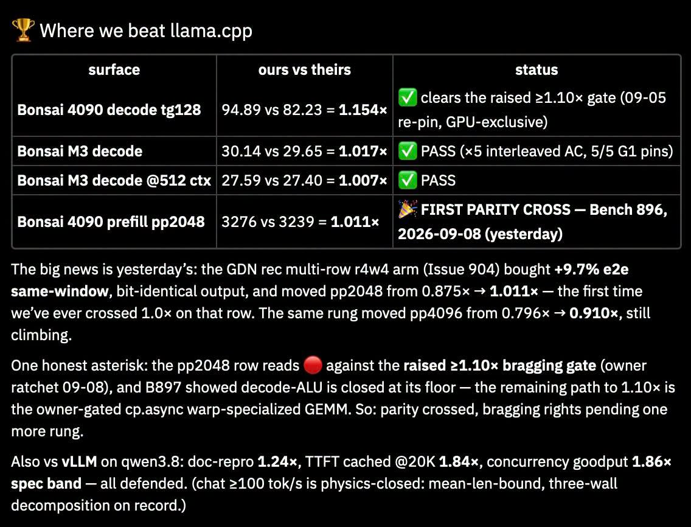

# 052 — Bragging Gate และการเทียบ llama.cpp/vLLM

อ่านเพิ่ม: [ผลตรวจและงานวิจัยรอบ 2](#research-review-2)

แหล่งต้นฉบับ: [post.md](../original/post.md) บรรทัด 24-29  
รูปประกอบ:   
วันที่ค้นคว้า: 2026-09-20

## ประเด็นจากต้นฉบับ

โพสต์ถามว่าอะไรเร็วกว่า llama.cpp 1.15x และ vLLM 1.84x แต่ยังอยากให้เร็วกว่า 1.1x จึงตั้ง “bragging gate” ให้ AI ไล่ optimize kernel ต่อ ภาพแสดงตาราง claim เทียบหลาย surface เช่น Bonsai 4090 decode, Bonsai M3 decode, prefill pp2048 และเทียบ vLLM บาง row

## ความรู้ที่ค้นเพิ่ม

llama.cpp เป็น inference runtime C/C++ ที่เน้น local inference บน hardware หลากหลาย ส่วน vLLM เป็น serving engine ที่เด่นเรื่อง throughput และ KV cache management ผ่าน PagedAttention งาน vLLM paper รายงาน throughput ดีขึ้น 2-4x เมื่อเทียบ baseline ในงานที่ประเมิน [PagedAttention paper](https://arxiv.org/abs/2309.06180). การที่ runtime เฉพาะทางชนะ llama.cpp/vLLM ในบาง row จึงเป็นไปได้ แต่ต้องอ่านเป็น row-level benchmark

แนวคิด bragging gate ดีในฐานะ engineering discipline: อย่า celebrate improvement เล็กเกิน noise เช่น 1.007x อาจเป็นความแปรปรวนของ run ถ้าไม่มี confidence interval แต่ gate ก็ไม่ควรสูงจนทำให้ละเลย improvement ที่สำคัญต่อ workload จริง เช่น p95 latency ลดลง 5% ใน path ที่คนใช้ทุกวัน

## วิธีลอง

ตั้ง benchmark policy:

- ต้องมี baseline ล่าสุดและ commit pin
- run อย่างน้อย 5-10 ครั้ง
- รายงาน median, min, p95 และ stddev
- แยก decode/prefill/TTFT
- เก็บ raw command และ model checksum

ถ้าจะ claim 1.15x ให้ระบุว่าเป็น `94.89 vs 82.23 tokens/s` ใน workload ไหน ไม่ใช่ “เร็วกว่า llama.cpp” แบบรวมจักรวาล

## ข้อควรระวัง

ภาพ claim ว่า benchmark บาง row “PASS” แม้เร็วกว่าแค่ 1.007x ซึ่งอาจใกล้ noise มาก ต้องใช้ statistical rigor การ optimize kernel โดย AI ยังต้องมี bit-identical output หรือ tolerance ที่ระบุไว้ ไม่ใช่เร็วขึ้นแต่คำตอบเปลี่ยนโดยไม่ตั้งใจ

## แหล่งอ้างอิง

- [vLLM/PagedAttention paper](https://arxiv.org/abs/2309.06180)
- [vLLM docs](https://docs.vllm.ai/)

<!-- RESEARCH_REVIEW_2_START -->

## ตรวจสอบและค้นคว้าเพิ่มเติม — รอบ 2

วันที่ตรวจเพิ่ม: 2026-09-20

**แหล่งหลักใหม่ที่อ่าน:** repo [ggml-org/llama.cpp](https://github.com/ggml-org/llama.cpp) และ [MLPerf Inference reference implementation](https://github.com/mlcommons/inference). llama.cpp เป็น runtime inference C/C++ ที่ใช้กว้างสำหรับ local LLM ส่วน MLPerf Inference repo ให้ตัวอย่างวัฒนธรรม benchmark ที่ต้องกำหนด scenario, rules และ implementation artifacts ชัดเจน

**สิ่งที่ขยายจากโพสต์:** “bragging gate” ควรถูกนิยามเป็นสัญญาวัดผล ไม่ใช่แค่ threshold speedup. ถ้า claim เร็วกว่า llama.cpp 1.15× หรือ vLLM 1.84× ต้องมี row ที่เทียบได้จริง: model เดียว, quantization เดียว, prompt/output เดียว, sampling เดียว, thread/GPU config เดียว และต้องรวม correctness/tolerance. หาก katgpt-rs ใช้ architecture หรือ speculative path ต่างออกไป ให้ claim เป็น “เร็วกว่าใน task นี้” มากกว่า “เร็วกว่า runtime นั้นทั้งหมด”

**ตัวอย่างทดลอง:** ทำ `bench.yaml` ที่บังคับทุก runner อ่าน config เดียว: `model`, `weights_sha`, `runtime_commit`, `prompt_tokens`, `decode_tokens`, `batch`, `concurrency`, `warmup`, `repeats`, `metric`. เก็บ raw stdout/stderr และไฟล์ผล JSON ทุก run แล้วให้ gate ผ่านเมื่อ median speedup > 1.10 และ lower bound ของ bootstrap CI ยัง > 1.03 พร้อม output match หรือ quality score ไม่ตก

**ข้อจำกัด:** MLPerf ไม่ได้เป็น benchmark เฉพาะ katgpt-rs และ repo llama.cpp ไม่ได้เป็นตัวแทน config ทุกแบบ. รอบ 2 แก้จุดเสี่ยงจากโน้ตเดิมโดยย้ำว่า speedup เล็กใกล้ noise ต้องมี repeat/statistics; speedup ใหญ่แต่ workload ไม่ตรงกันก็ยังใช้ bragging สาธารณะไม่ได้
<!-- RESEARCH_REVIEW_2_END -->

<!-- POST_NAV_START -->
---

[สารบัญ](README.md) · [← โพสต์ 051](051-vector-db-embedding-inversion.md) · [โพสต์ 053 →](053-paper-flow-and-topic-selection.md)

หัวข้อที่เกี่ยวข้อง: [06 Rust, memory layout, SIMD และ CPU/GPU runtime](topics/06-rust-memory-and-hardware.md) · [08 อ่านและออกแบบ benchmark ให้เปรียบเทียบได้](topics/08-performance-and-benchmarks.md)
<!-- POST_NAV_END -->
