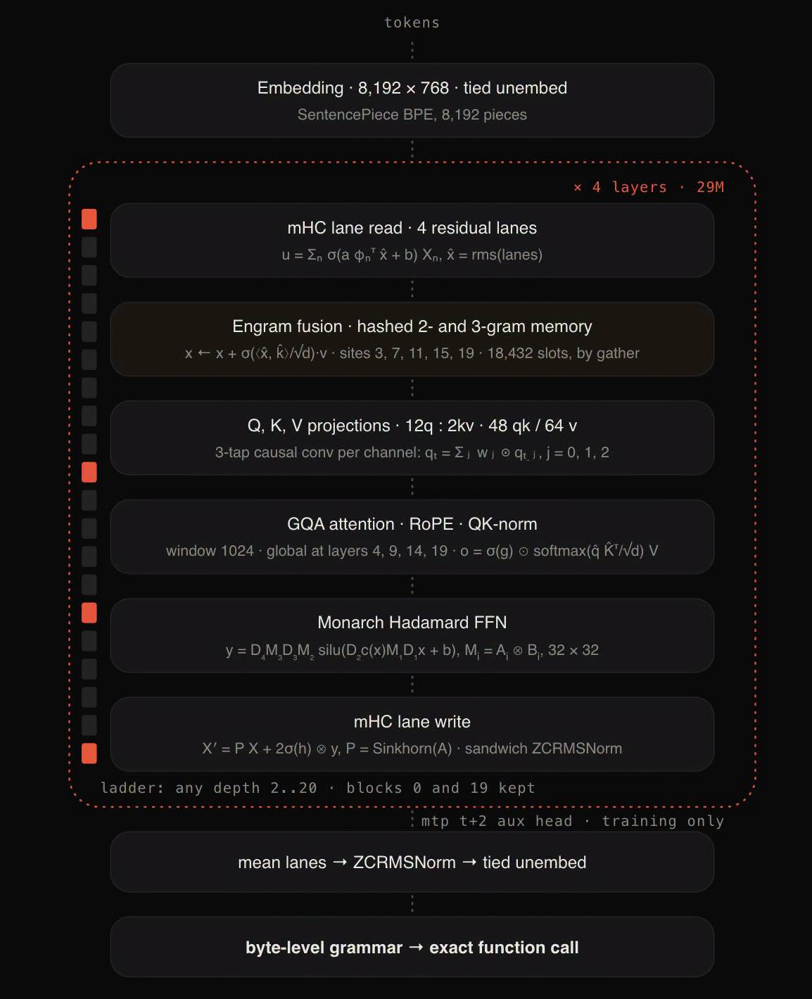

# 055 — อยากทำ Type-Safe Jev เอง ต้องเริ่มจาก Schema, Architecture และ Eval

อ่านเพิ่ม: [ผลตรวจและงานวิจัยรอบ 2](#research-review-2)

แหล่งต้นฉบับ: [post.md](../original/post.md) บรรทัด 1-6  
รูปประกอบ:   
วันที่ค้นคว้า: 2026-09-20

## ประเด็นจากต้นฉบับ

โพสต์ชวนคนที่อยากทำ “typesafe Jev” เองไปฟัง onsite และบอกว่ายังไงก็ไม่เร็วเท่า `katgpt` ภาพประกอบเป็น architecture ของ model ขนาดเล็ก 29M: embedding 8,192 × 768, residual lanes, n-gram memory, Q/K/V projections, GQA attention, RoPE, QK-norm, Monarch Hadamard FFN, normalization และ byte-level grammar → exact function call

Jev ตาม official blog ของ TypeSafe คือ model สำหรับ typed probabilistic decisions: input เป็น state ที่ไม่จำเป็นต้องเป็น text สวย ๆ แล้ว output เป็น structured values ที่ software ใช้ได้ตรง มี probability/confidence และไม่ได้ sample token-by-token แบบ LLM [TypeSafe AI blog](https://typesafe.ai/blog/introducing-system-one-models-and-jev). ถ้าจะทำเอง แก่นจึงไม่ใช่ “ทำ chatbot ให้เร็ว” แต่คือ “จำกัด output space ให้ตรวจได้”

## อ่านภาพ architecture แบบไม่จมศัพท์

`Embedding 8,192 × 768` คือชั้นแปลง token เป็นเวกเตอร์ 768 มิติ โดย vocab เล็กระดับ 8k ชิ้นเหมาะกับระบบแคบ ๆ มากกว่า LLM ใหญ่

`GQA attention` หรือ grouped-query attention คือให้ query heads หลายหัวแชร์ key/value heads บางส่วน เพื่อลด KV cache และเร่ง decode โดยยังรักษาคุณภาพใกล้ multi-head attention กว่า MQA ในหลายกรณี [GQA paper](https://arxiv.org/abs/2305.13245). พูดง่าย ๆ คือ “มีหลายตาที่ถาม แต่ไม่ต้องมีสมุดจด key/value แยกครบทุกตา”

`RoPE` คือ rotary position embedding ใช้วิธีหมุนเวกเตอร์เพื่อใส่ข้อมูลตำแหน่งเข้าไปใน attention และช่วยให้ model รู้ระยะสัมพันธ์ระหว่าง token [RoFormer](https://arxiv.org/abs/2104.09864). ภาษาง่าย ๆ คือคำเดียวกันที่อยู่ต้นประโยคกับท้ายประโยคจะมีมุมตำแหน่งต่างกัน

`FFN` ใน Transformer คือชั้น feed-forward ที่ประมวลผลแต่ละตำแหน่งหลัง attention เหมือน “ครัวแปลง feature” ของ token นั้น ๆ Transformer ดั้งเดิมใช้ position-wise FFN เป็นส่วนหลักคู่กับ attention [Attention Is All You Need](https://arxiv.org/abs/1706.03762). ในภาพนี้ใช้ชื่อ `Monarch Hadamard FFN` ซึ่งเป็น design ภายในของผู้เขียนที่น่าจะตั้งใจให้คูณเมทริกซ์เร็ว/มีโครงสร้างมากขึ้น แต่ยังต้องมี benchmark ของ repo เองก่อนสรุปว่าเร็วกว่าทั่วไป

`byte-level grammar → exact function call` คือจุดที่ใกล้คำว่า type-safe: decoder ถูกบังคับให้ออกตาม grammar หรือ function schema จึงลดปัญหา JSON พัง enum เกิน หรือ field หาย

## วิธีลองทำเวอร์ชันเล็ก

เลือก task เช่น NPC เลือก action จาก `Attack | Flee | Patrol | Talk | Abstain` ให้ input เป็น JSON state แล้วทำ 3 baseline:

1. rule-based if/else
2. small classifier คืน probability ต่อ enum
3. constrained decoder ที่ออก enum/function call เท่านั้น

วัด accuracy, abstain rate, latency, calibration และ OOD behavior เช่น fog-of-war, stale state, enemy ที่ไม่เคยเห็น, หรือ state ที่ขัดแย้งกัน ถ้า confidence สูงตอนผิด ระบบ downstream จะพังแม้ type จะถูก

## ข้อควรระวัง

Type-safe แปลว่า output ตรง schema ไม่ได้แปลว่าตัดสินใจถูก และ architecture diagram ไม่ใช่หลักฐาน performance ตัวเลข “เร็วกว่า” ต้องมี workload, hardware, batch, compiler flag, latency percentile และ baseline เดียวกันก่อนใช้เทียบสาธารณะ

## แหล่งอ้างอิง

- [TypeSafe AI: Introducing System One Models & Jev](https://typesafe.ai/blog/introducing-system-one-models-and-jev)
- [GQA: Training Generalized Multi-Query Transformer Models](https://arxiv.org/abs/2305.13245)
- [RoFormer: Rotary Position Embedding](https://arxiv.org/abs/2104.09864)
- [Attention Is All You Need](https://arxiv.org/abs/1706.03762)

<!-- RESEARCH_REVIEW_2_START -->

## ตรวจสอบและค้นคว้าเพิ่มเติม — รอบ 2

วันที่ตรวจเพิ่ม: 2026-09-20

**แหล่งหลักใหม่ที่อ่าน:** [OpenAI Structured Outputs guide](https://platform.openai.com/docs/guides/structured-outputs) และ repo [Outlines: Structured Outputs](https://github.com/dottxt-ai/outlines). OpenAI docs อธิบายการบังคับ output ให้ตรง JSON Schema ผ่าน structured outputs ส่วน Outlines เป็นไลบรารี open-source สำหรับ constrained/structured generation. ทั้งสองแหล่งช่วยเติมส่วน “byte-level grammar → exact function call” ในภาพให้จับต้องได้กว่าเดิม

**สิ่งที่ขยายจากโพสต์:** ถ้าจะทำ TypeSafe Jev เอง จุดเริ่มไม่ใช่เพิ่ม model ใหญ่ แต่คือกำหนด output space ที่ตรวจได้: enum, schema, grammar, validator, abstain policy, และ eval. OpenAI docs บอกว่า Structured Outputs ทำให้ response ยึดตาม JSON Schema ที่กำหนด และแยกจาก JSON mode ที่เพียงรับประกัน JSON valid; docs ยังระบุ edge cases เช่น refusal หรือ max tokens และรองรับ JSON Schema เพียง subset บางส่วน. ดังนั้น constrained decoding ช่วยลด invalid JSON/enum ผิดใน interface แต่ไม่ได้ทำให้ decision ถูกเอง. ถ้า task เป็น NPC action schema อาจบังคับให้คำตอบอยู่ใน `Attack | Flee | Patrol | Talk | Abstain` ได้ แต่ต้องยังวัดว่า action นั้นเหมาะกับ state หรือไม่

**ตัวอย่างทดลอง:** สร้าง schema `NpcDecision { action: enum, target_id?: string, confidence: number, rationale_code: enum }`. ทดสอบ 3 decoder: free-text แล้ว parse, JSON schema constrained, และ classifier ตรงสู่ enum. ใช้ 1,000 state ที่มี label หรือ simulator oracle วัด invalid rate, semantic error, ECE calibration, abstain coverage, latency p50/p95. ถ้า constrained decoder invalid rate เป็นศูนย์แต่ semantic error เท่าเดิม แปลว่าชนะด้าน interface ไม่ใช่ intelligence

**ข้อจำกัด:** OpenAI Structured Outputs เป็นเอกสารบริการ/API เฉพาะและอาจเปลี่ยนตามรุ่น จึงใช้อ้างเรื่องหลักการ schema-constrained output ได้เฉพาะตาม docs วันที่ตรวจ ไม่ใช่พิสูจน์ performance ของ katgpt หรือ Jev. Outlines เป็น implementation หนึ่ง ไม่ใช่มาตรฐานเดียว. รอบ 2 จึงสรุปว่า type safety เป็นชั้น interface + validation; ความเร็วและคุณภาพต้อง benchmark แยก
<!-- RESEARCH_REVIEW_2_END -->

<!-- POST_NAV_START -->
---

[สารบัญ](README.md) · [← โพสต์ 054](054-typesafe-jev-vs-local-npc.md) · โพสต์ล่าสุด

หัวข้อที่เกี่ยวข้อง: [03 Neuro-symbolic, constraints, types และการตรวจคำตอบ](topics/03-neuro-symbolic-types-and-verification.md) · [07 การฝึกโมเดล, attention และสถาปัตยกรรมขนาดเล็ก](topics/07-training-and-model-architecture.md)
<!-- POST_NAV_END -->
