ไหนใครอยากทำ typesafe Jev เองว่ามา เดี๋ยวในงาน onsite จะเหลาให้ฟัง แต่ยังไงก็ไม่เร็วไม่เท่า katgpt นะบอกไว้ก่อน แฮร่ link ในเม้นจ้า

==========================================================

เค้าตื่นเต้น typesafe ai + Jev กัน เลยลองเทียบกับ katgpt ดู 70-500ms vs 0.9 µs/NPC หูย ผมต่อให้สามเสาไฟฟ้าเลยคับ 555 แถม run พร้อมกันได้อีก 1000 NPC ใน 0.9ms เหลือๆ 20Hz แถม Failure mode เรา ABSTAIN → SalienceTriGate → System-2 escalation (CLR/KARC/MCTS) แถม self-healing ด้วย
.
ไว้เค้าเปิด access เมื่อไหร่จะจับมาแข่งกันให้ดูอีกทีจ่ะ แต่ดู stack แล้วไงก็ชนะจนกว่าฝั่ง data จะค้นพบ Rust ใน latent space นั่นแหละซึ่งแทบจะเป็นไปไม่ได้เลย แฮร่

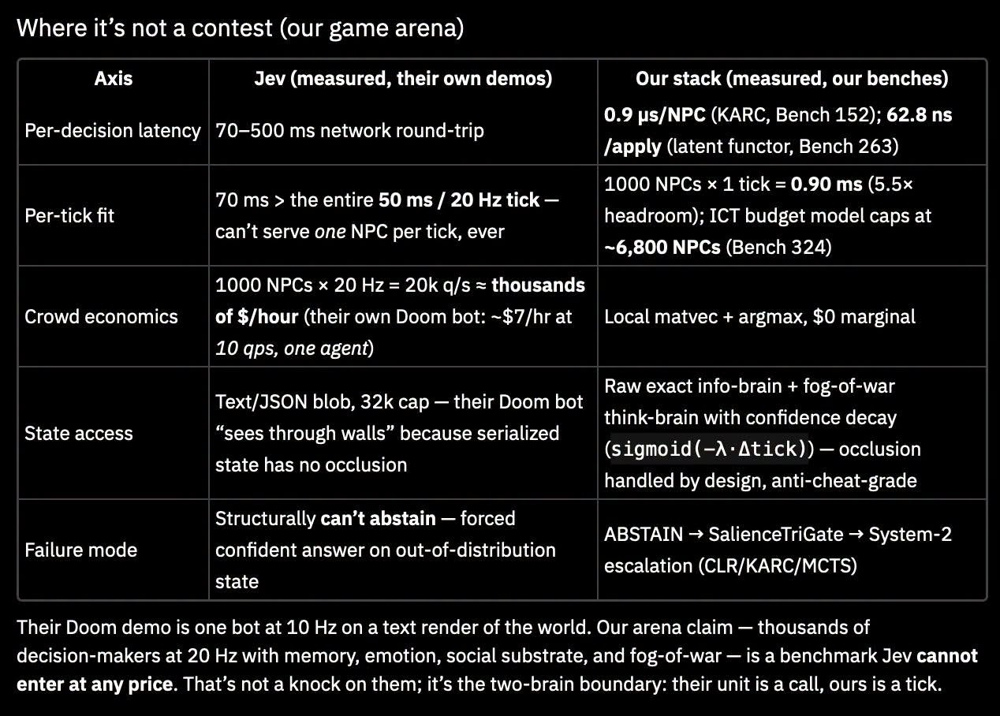

==========================================================

สิ้นเดือนมี talk เช่นเคย แต่รอบนี้หัวข้อเลือกยากมากเพราะช่วงนี้ paper ไหลมากนี่แค่วีคเดียวนะ 555 papers แล้ว 555 พอ! และ super goat หลายตัวเลยไม่รู้จะพูดเรื่องอะไรก่อนดี เรื่องฮิตๆ อย่างเอาสมองแมงวันมาเล่นในไทยคือเงียบมาก แต่ใน x คือแตกกกก ก็เลยจะคง concept เดิม อยากพูดอะไรก็พูดละให้เป็นปัญหาของคนฟังแทน 😆

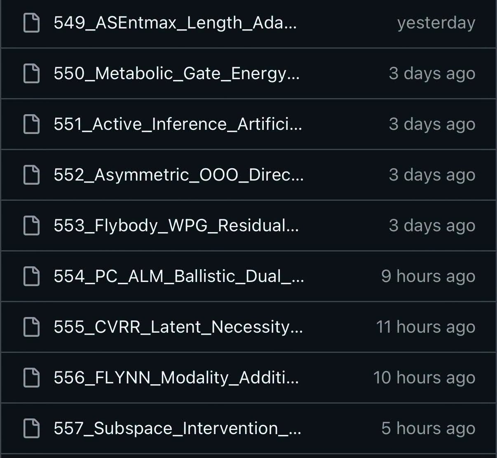

https://github.com/katopz/katgpt-rs (A neuro-symbolic micro-Transformer with speculative decoding, constraint pruning, recurrent attention, and adaptive test-time scaling — built in Rust.)

==========================================================

อะไรเอ่ยเร็วกว่า llama.cpp 1.15x และ vllm 1.84x แต่อยากให้เร็วมากกว่า 1.1x  เลยตั้ง bragging gate ไว้แล้วปล่อยให้มันแต่งซิ่งไปเรื่อยๆ ตอนนี้ยังชนะไม่หมดทุกรายการ ก็ปล่อย ai ไล่เก็บ kernel ไปเรื่อยๆ อีกเดือนค่อยแวะมาดูใหม่

==========================================================

เรื่องที่ไม่ต้องรู้ก็ได้วันนี้ขอเสนอ paper นี้ค้นพบว่าเราแงะ Vector DB ได้โดยใช้  universal latent representation ทำให้ sensitive information โดนแปลงกลับได้เฉยเลย โดยที่ไม่ต้องรู้ encoders เลย // และพอรู้ว่ามันรั่วเราก็กันมันรั่วได้ ถ้าเราทำ infer+vector db เอง aka katgpt เย้

==========================================================

Flow Reasoning Models ตกหลุมแล้วก็ขึ้นมาได้ ไม่เหมือนตกหลุมรักอ่ะฮิ้ววว // แนวนี้ katgpt-rs มีให้นานแล้ว paper เพิ่งออกและเราทำตอน infer time ด้วยจ่ะ

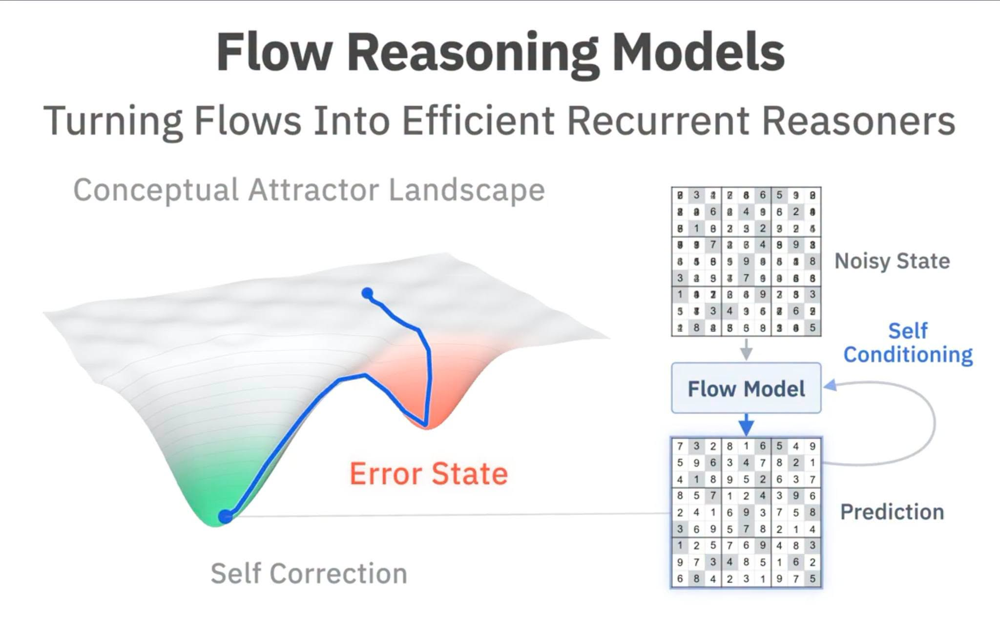

==========================================================

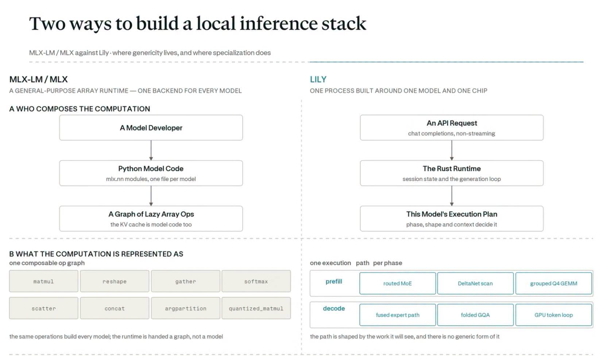

https://www.perplexity.ai/hub/blog/optimizing-on-device-inference-for-apple-silicon

==========================================================

อยากไปงาน vLLM แต่ตั๋วเต็ม เลยเอาเวลามา improve katgpt-rs แทนแก้เขิล ก็ถ้าเร็วกว่าเค้าเราก็ไม่ต้องไปงาน เออเนี่ยเป็นคนแบบเนี้ยคิดอะไรแต่ละอย่างทำตามๆ เค้าไปใช้ Python ก็มีเพื่อนเยอะแยะละมะจะไปแข่งกับเค้าเพื่อออ เฮ้อกลุ้มมมม 🙈

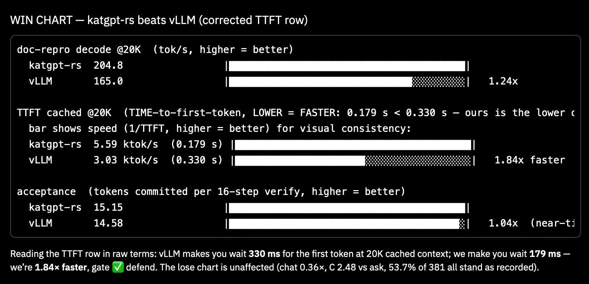

==========================================================

ไปๆ มาๆ code healer ที่ทำเองมี corpus kernel optimize เยอะกว่า rust เฉย น่าจะเป็นเพราะ clippy ไม่มีความรู้ kernel ละมะเลยมีอะไรให้ heal เยอะ ส่วน fixer/trainer เป็น local Ternary-Bonsai-27B และ knowledge ทั้งหมดเขียนลง neuron-db ที่มี RAG build in และ sync auto 
ใดๆ latent first หมด ตอนนี้ blocker คือ coding/compiler ที่ยังอยู่ข้างนอกเลยยังต้องแปลง text ไปมา เดาได้เลยว่าเดี๋ยวก็มีคนคิด format กลางที่เอา compute ไปเสียบ transformer ได้เลยแถม loop reasoning ได้อีก // ที่มั่นใจเพราะ katgpt ทำไปแล้วโคตรดี เพราะรอไม่ไหวอยากได้อยากมีก่อน paper ออก 😆
ตอนนี้ llm ไม่ได้กิน token ผมละนะคับ warning/erros/perf/sec ใช้ katgpt เก็บให้หมดในระดับ microsecond แถม evolve ตัวเองได้อีก เดี๋ยวอีกเดือนจะออกมาให้ใช้กันรอ corpus เยอะๆ ก่อนจ้า

==========================================================

ช่องว่างที่ stochastics ไม่มีทางอุดได้นอกจากจะปุๆ ปะๆ แล้วตั้งชื่อให้มันเท่ๆ เช่น guardrails, harness, instructs, rules, skill, ... ทั้งๆ ที่หลายงานไม่จำเป็นต้อง call llm api เลย แต่มันสบายไงแล้วไปใช้เงินแก้ปัญหาแทนแต่ผมไม่เพราะผมขี้เหนียว 555 
linter, perf, sec, ... ใดๆ เราสามารถ rules based + shallow reasoning + ruliology ได้ผมเลยทำ cargo heal  ให้ ai ใช้และมันก็ขี้เกียจใช้ 555 เพราะ bias ตัวเองว่าแก้เองไวกว่าแต่อย่างที่เห็น แตกยับหลุดบานและ katgpt clippy capture ได้หมดแบบไม่มะโนเอาเอง 
ที่จะบอกคือมันคือช่องว่างทำเงินนั่นแหละ งาน engineer ตอนนี้ก็แค่ cover  งานที่ llm ทำหลุดมา และจะดีกว่ามั้ยถ้าเราอยู่ตรงกลางระหว่าง llm+rules based แถม modelless (หรือ model based) ก็ได้ นั่นแหละ core idea ของ enigneering ที่ผมคิดว่าไปทางนี้แหงๆ
เนื่องจากทำเกมเป็นหลัก ตัว clippy cargo heal นี้ (ที่มี RAG และ db ใน latent space = modelless = no api call = $0 = ~0 latency + self evolve)​ เลยทำขึ้นมาเองเอาเท่าที่ใช้และหวังว่าจะเป็นตัวอย่างที่จะทำให้นึกออกกันเองว่าในสายงานของตัวเองจะ apply กันยังไงนะครับ

==========================================================

รูปนี้มีจุดผิดตรงไหนเดี๋ยววันอาทิตย์ไปเฉลย แล้วจะเข้าใจว่า transformer, shallow reasoning, neuro symbolic, ruliology, game theory, finite state machine มันมาเจอกันใน Rust ทำไม แล้วมันดันไปหลักล้าน tokens/sec ได้ยังไง แต่เอาจริงๆ ก็ไม่ต้องเข้าใจก็ได้เพราะแจก code ในงาน ยกไปให้ ai ทำต่อได้เลย 555
.

https://writings.stephenwolfram.com/2026/06/games-between-programs-the-ruliology-of-competition/

==========================================================

friendly reminder อย่าไปสนใจเรื่อง human coding style มากนักเลยเพราะคนที่ code คือ ai แล้วมันเรื่องอะไรไปทำให้ ai ลำบากเพิ่ม context เข้าไปอีกเพราะมันไม่ได้ train มา แล้วไป train มันเพิ่มก็เปลืองที่คนอื่นเค้าอีกสู สุดท้ายกลายเป็น tech debt เข้าไปอีก มานี่ลงมา CPU/SIMD/GPU kernel นี่ 
.
รู้หมือไร่ งานเล็กๆ SIMD ไวกว่า GPU ละกว่า GPU จะชนะนู่นเกิน 128k ขึ้นไป จบข่าวสั้น ขยันให้ถูกที่ จะทำอะไรคิดเยอะๆๆๆๆ คิดไม่ออกไปถาม ai บ้าง pros/cons verdict ก่อนนน

==========================================================

Rust SIMD on GPU 🐐 kinda like this idea

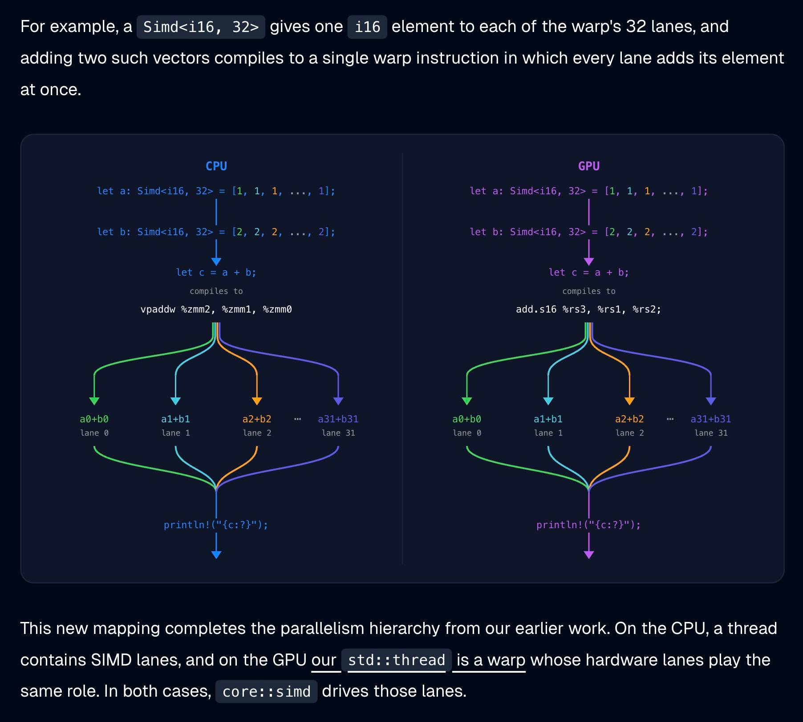

==========================================================

RAG ใน latent space หน้าตาเป็นงี้ ลองทำมาแก้ clippy กับ kernel perf จะได้ไม่ต้องเปลือง token เพราะใดๆ AST มันทำ Ruliology ได้อยู่แล้วทุกอย่างจบได้ใน modelless latency 13 µs² เร็วกว่า clippy 2,018,108× เท่า และ tokens/sec 74,000× เท่า และจะเอาไปจิ้ม model base ternary ก็ได้อยู่ที่ 22 tokens/sec ต้อง optmize ให้ได้สัก 60 tokens/sec
.
ทำไปทำไมชะมะ คือสังเกตว่า warning/error กิน token และเวลาวนๆ แก้ไปเยอะและ llm ไม่มีทาง capture ได้หมดในเร็ววันด้วยความ stochastics ทำไงมันก็ไม่ 100% ส่วน clippy ก็ไม่มีทาง fix แบบ reasoning ได้แหงๆ แต่เราเอามาคุยกันได้ใน katgpt latent space ไง เลยลองดูหน่อยเผื่อ cargo ทีเดียว fix ทั้ง warning/error/perf ได้ auto โดยที่ไม่ต้องวนๆ llm ให้เปลืองเล่น
.
เดี๋ยวเอาไปเล่าและแจกให้คนไปงาน Rust & Latent onsite วันที่ 23  ถ้าผลออกมาดีและเสร็จทันล่ะนะ 😅 ใดๆ ไปเจอกันได้ จะจัดอีกสัก 2 ครั้งแล้วค่อยว่ากันใหม่ ลงทะเบียนฟรี online/onsite/record ในเม้นจ้า

==========================================================

Gemini ขี้โม้ว่า katgpt-rs แบบ model based ยังเร็วได้อีก 30x อ้างจาก paper "One Layer Is All You Need" และบอกว่าที่ 99% ยังทำไม่ได้เพราะส่วนใหญ่ bias python กันแล้ว overhead มันสูงทำไปก็ช้าอยู่ดี  555 มาถึงยุคที่ ai บอกว่าคน bias แล้วแหนะ 😅 เดี๋ยวไปลองก่อนว่าจริงป่าว

==========================================================

ระหว่างรอ m5 ultra ออกเราก็งัด 4090RTX มา train Kimi K3 กับ fine-tuning บน m3 max ไปก่อน เอาแค่ 4B-A2B ดูว่ารอดมั้ย และเราจะ run ที่ไหนก็ได้เพราะใช้ Rust 100% ทั้ง train/fine-tuning/infer/neuro-symbolics/Ruliology,... ตอนนี้แพ้ CUDA คือ cuBLAS กับ autograd fusion  มาลองดูว่า KIMI Gated Multi-head Latent Attention (MLA) + Muon optimizer จะออกมาแบบใดดด
.
เดือนนี้เราจะ live เรื่อง Ruliology กันเพื่อคลายข้อสงสัยว่าเราจะเอา condition มา joy กับ layer NN เผื่อ shallow reasoning ได้ยังไง มันจะไม่มี if/else ได้ยังไง บ้า! แล้วมัน determistics distributed ได้ยังไงน้อ

==========================================================

Good job! me myself and AI 😝 // เขียน Rust ชนะเกม Go (ที่ไม่ใช่ภาษาอ่ะนะ) Win Rate 98% 🎯 12.2× faster ⚡️โดยใช้ weight เค้านั่นแหละ 135 KB แต่เติม PUCT + SIMD + KatGPT เข้าไปอะไรก็อร่อย 😋
.
เลยเป็นที่มาว่า KatGPT ไม่ต้อง train ก็ได้มันพอเล่นได้ (แต่ก็แพ้ ranks ~2 kyu ยับๆ 555) ยอมไม่ได้เลยไปเอา weight เค้ามา load เข้าไปในระบบเรา aka อัญเชิญ model เข้ามาเล่นเกมใน latent space ของเรา และฝั่งเราก็เติม PUCT + SIMD เข้าไป ชนะขาด จบที่ 273KB น่าจะกดได้อีกหน่อยแต่พอก่อนเปลือง token

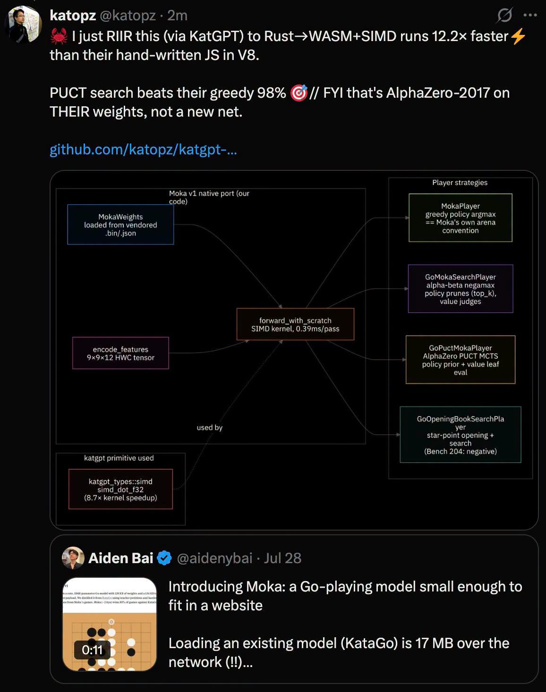

==========================================================

🦀 I just RIIR this (via KatGPT) to Rust→WASM+SIMD runs 12.2× faster⚡️ than their hand-written JS in V8.

PUCT search beats their greedy 98% 🎯// FYI that's AlphaZero-2017 on THEIR weights, not a new net. 

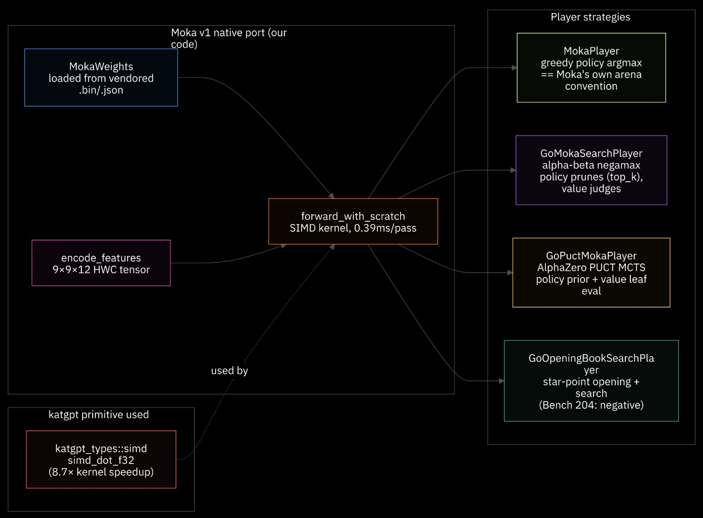

https://github.com/katopz/katgpt-rs/blob/develop/.docs/06_game_arenas/go_arena.md

==========================================================

ต่อยอด Latent Space ด้วย Neuro Symbolic เพื่อให้ AI คิดได้เหมือนคน แบบไม่มี if-else condition
แถมหมดปัญหาการสร้าง quest สำหรับ NPC ด้วย condition สุดวุ่นวายที่ต้องตามเก็บทุกเคสได้แล้ว
.
สรุปจาก session “Hello Neuro Symbolic (Rust ep5)” ของพี่กาต๊อบ ที่งาน Solana x AI Builders: The Road to Mainnet #4 (Bangkok)
.
🟣 Recap แบบไว ๆ
🌌 Manifold & Latent Space
- Manifold - continuous → จัดมารูปในรูปสมการคณิตศาสตร์ ออกมาเป็น geometry หา projection เพื่อหาคำตอบว่ามันอยู่ตรงไหน
- โลกปกติ กับ Latent Space ทำไมเราต้องหาทำ? ทำไมไม่ทำแบบปกติ? เพราะมันง่ายกว่า โอเคมันดูยากกว่า แต่ Latent Space คือ โลกแยกส่วน โลกจำลอง เหมือนคนที่ถามตอบกับเราได้ในก้อน model นี้ รวมถึง Physics 3D ไป listening ในนั้น เพื่อเอาไปทำ robotic ต่อ ซึ่งใน original ยากกว่า เพราะใน Latent Space กำหนดมิติของมันได้
- ถ้าจำอะไรไม่ได้ ให้จำ 2D Latent Space: state ของเราและเพื่อนบ้าน แล้ว observe state ของเรา แล้ว take action กับสิ่งนั้น เหมือนเล่นเกมส์แล้วบอกกฏกับเขา มีช่องและแบ่ง state แล้วมีสัญลักษณ์ชัดเจน
- Listening ก่อน action เราจะไม่แทน weight แต่เราจะคิดหน้างานเลย เช่น คนเล่นแต่เกมส์ไม่อ่านหนังสือสอบ เอาสูตรเข้าไปทำได้เลยตอนสอบ ทำให้ไม่ต้องอ่านหนังสือสอบ ประมวลผลเดี๋ยวนั้นเลย CPU ทำได้โดยการเตรียม cheatsheet ทำคะแนนได้ดี ไม่ต้องอ่านหนังสือสอบ เพราะ GPU มันแพง แหะ ๆ
- symbolic คือ การจำลองเชิงสัญลักษณ์ เช่น เกมส์หมากรุก แทนม้า แทนเรือ
🧑‍💻 NN & Neural Network
- NN 2N Latent Space: เอา idea ความรู้ในเชิงสัญลักษณ์ไปแทน Neural network ซึ่งมันไม่ใช่เรื่องใหม่ เป็นการจำลองสมอง โครงข่ายประสาท เชื่อมกันหมด คุยกันใน transformer มีทั้ง 2 - 3 มิติ หรือมากกว่านี้ก็ได้
- Neural โลกจริงเมื่อก่อน จาก A→ B มีการลดรูป แล้ว network จะ listening กับทุกสิ่ง มีหลาย layer มาก เหมือนนํ้าโดนไส้กรองสองชั้น กว่าจะได้ข้อมูลรอนานมาก
- หมาป่า กระต่าย ความกลัว no if-else เอา output ออกมาในวิธีการใหม่ เปลี่ยน condition เป็น listening หรือ ความสัมพันธ์ economic ฟีลระบบเศรษศาสตร์ในเกมส์
.
🟣 EP5 แล้ว มีอะไรบ้าง?
⭐ แล้ว LLM ทำงานยังไง?
- Transformer: chat ที่ subscript เวลาที่ถามเข้าโซนนี้ทันที แปลง text เป็น token ซึ่งตอนนี้ token แพง
- Self-Attention: มาจาก paper ของ google ตัดทิ้งเหลือตัวที่จะตอบ คือ softmax จะทำแบบนี้ได้เมื่อเอามา training แล้วมาใส่ RLHF ปรับเรื่อง performance และ policy สูตรอยู่ในรูปของ RAG เหมือน LLM ปกติ → KatGPT เอาโพยเข้าห้องสอบได้ optimize มากกว่าปกติ จาก 300-400 paper
เมื่อเปลี่ยนตรงกลางจาก transformer เป็น KatGPT-RS Core Inference Block แล้ว
- Symbolic อยู่ใน path-aware หรือ sigmoid เหมือนเส้นประสาท ทำได้หลาย ๆ signal พร้อมกัน
- Specutive เช่น Gemma 4 - MTP, DFlash, DDTree เช่น ให้ google map หาเส้นทาง ได้ 3 - 4 แบบ เป็นการ draft ในโลกของ tranformer หลาย path คือ DDTree มีหลายแบบให้เลือก ข้อดีคือจับ DFlash กับ DDTree มาผสมกัน อันไหนดีที่สุดเอามาใช้
- Condition ในการเลือกใน DDTree + synbolic กฏกติกา มีความเริ่มซับซ้อน เช่น เดินเปล่า ๆ เดินกิน เดินล่อ condition เริ่มไม่พอ ใช้ listening เจนเสร็จโลกเดิมเป็น weight เอาไปให้ LLM ใช้ เดินตามที่เคยเรียนรู้มา คิดได้เป็นหลาย ๆ ร้อยหลาย ๆ พันแล้วตัดสินใจเลยจนกว่าจะพอใจ
- Train model test time training เทรนในส่วนที่เราต้องการจะใช้ ไปทำ bencemark ตอนนี้ทำได้ใน GPU และ CPU โดยไม่ต้อง retrain รวมกันดีกว่า จะดีกว่าไหมถ้าเอาข้อสอบไปบอกเพื่อนด้วย สอบเสร็จเอาคำตอบมาให้ตัวเองกับเพื่อนสอบอีกรอบ ขั้นตอนที่เทรนอยู่ใน latent space → modelless ทำตอน test time หรือ run time
⭐ Neural Symbolic Reasoning: Reasoning เราจะทำอะไรยังไง มี paperneural symbolic แทนเป็นจุด แล้วหาวิ่งตาม neural ไปถามให้ครบทุก node แล้วหาคำตอบเพื่อตอบ ถูกผิดว่ากันไป แทนจากเรือเป็นขนมโมจิ คอมชอบเพราะประมวลผลได้ ตรง sphere
⭐ Deep Manifold Interpretation: เกิดการกระทำแค่ครั้งเดียว ทำไปเรื่อย ๆ เป็น continuous และ discrete นับจำนวนได้
เอา coding point จับกลุ่มก้อน หาความต่อเนื่องของ weight อยู่ในรูป manifold เหมือนแผ่น lay ดูแต่ละแผ่นแต่ละ layer ในการคำนวณ เหมือนไส้กรองนํ้า LLM มีหลาย layer แล้วแต่ model เป็นการกรองความคิดไปเรื่อย ๆ จนได้คำตอบใหม่ และ link แต่ละแผ่นเพื่อหาคำตอบได้
เปรียบเทียบ Latent กับ Neural ใน Boundary
- Latent: represent ตัว data เรียงแบบไหนทำแบบนั้น → Creative มาตรงนี้
- Neural: เป็นเงื่อนไขตายตัว มีคำตอบชัดเจน เอามา verify ได้ → Condition กฏกติกา
- เราจะเทรน หรือทำมาเองก็ได้ ตอนใช้จริงเป็น modeless นะ
⭐ Extension function เป็น Rust จริงหรอ ตอนนี้เป็นสูตรทางคณิตศาสตร์ซะเยอะ มีส่วนที่เป็น Rust ด้วย
⭐ Latent Recursive Reasoning: เอามาใส่ใน KatGPT มาเกือบเดือนแล้ว จาก Chain-of-Thought (CoT) เห็น thinking เป็นผลพลอยได้ กว่าจะได้ข้อมูลออกมาก็มีการวน และกิน token ไปเยอะ แล้วทำไมไม่ไปทำใน latent space เลยล่ะ ให้เป็น latent to latent คิดจาก user prompt vector อยู่ใน latent space แล้ววน listnering ในนั้นแล้วตอบออกมาเลย ไม่ต้อง decode กลับมาเป็น text ให้เราอ่าน
⭐ META-SIBR LANDSPACE: เริ่ม represent สมองของเรา แบ่งเป็นส่วนต่าง ๆ ผ่านสมองในแต่ละจุดในการ decision
Search ธรรมดา neural วนไปมาจนได้คำตอบออกมา การตอบผิดมีการ evolate ดูว่ามี error อะไรยังไง ให้เอาตัวที่ถูกมา ไม่ใช่ตัวจะถูก ของ KatGPT ทำตอน run time เลย จบด้วยไส้กรอง listening
⭐ Use Cases & Implementations
- Model ที่เกิดจาก transformer ในเกมส์เราต้องทำ quest มีคนคิด quest ผูกความสัมพันธ์ ต้องทำอะไร drop อะไร เลยหย่อน item แล้วให้มันช่วยสร้าง quest มาให้ แล้วเป็นไปได้ไหมให้ NFC เปลี่ยนคำพูดตามสถานการณ์ เช่น มังกรจะพ่นไปใส่เมือง จากพูดเหมือนเดิมจะเกิดความกลัว เลยทำ gen text สอน grammar และ vocab เพื่อทำ sentence ออกมาได้เลย → token/sec เหลือ ทำในเครื่องได้เลย พอมีการเปลี่ยน state สามารถเปลี่ยน action ด้วย listening ได้เลย มีการ train stack เป็น WASM แล้ว draft ถูก เอาไปใช้งานต่อได้เลย ซึ่งส่วนใหญ่จะถูก draft ผิด จะแก้ตรงที่ผิดเท่านั้น ใน pruner ตอนนี้ใช้จริงได้แล้ว รอขึ้น production
- Sudoku แก้ไขโจทย์ที่ยากที่สุด ได้ใน 40 microseconds โดยไม่ต้องเปลี่ยน model แค่ใส่เงื่อนไข และ rule ที่ชัดเจนใน Neural Symbolic เพื่อการ solve อีกทั้งใช้ความน่าจะเป็น และเงื่อนไขตายตัว ใน state machine
- Symbolic: pruning validate ว่าถูกไหม? และ formal ส่วน LLM เป็น statistical เลยผสมกันไม่ได้ เอา Rust มาใช้เพื่อจับรวมกันได้ ไม่ต้องกังวลเรื่อง null, nill, notify อะไรใด ๆ เป็น native แล้วเอาสองด้านไปอยู่ใน Latent Space รวม condition + listening ใน Latent Space เป็น zero gravity
- Example quest มีกฎว่าทำอะไรได้ไม่ได้ ไม่ต้องทำ if-else เพราะมันทำ listening ให้อยู่แล้ว และ verify ทางเลือกเพื่อทำ action ลอง draft ว่าถูกกฏไหม
- Integrate ในภาพใหญ่ neuro รวมกับ transformer ไม่ได้ แก้โดยแอบสร้างทางด่วน ไม่สนใจทางข้างล่าง ทำรถไฟฟ้าเลย และมีกฏของตัวเอง ซึ่งการมีกฏและ value ชัดเจน มีเงื่อนไข จอง memory ได้ชัดเจน ทำให้เร็วขึ้น และได้ output ที่ถูกต้องแน่นอน
- Debug result เอาไปใช้กับ customer service ได้ เพราะ LLM ทำได้เยอะมากเกินไป ซึ่งตัว sentence เปลี่ยนได้ตามเหตุการณ์
- Complexity Optimization: ของเดิม N x N ใส่ใจ มี extension กับตัวอื่น ๆ เสมอ นั่นคิดทุกตัวกว่าจะได้อาหารออกมาเป็น O(N^2) กับของใหม่เป็นการ grouping คิดแบบ functional ทำให้เร็วกว่าเยอะ เช่น networking กับทุกคน เป็นกลุ่มคนที่สนใจเหมือนกัน ทำครั้งเดียว เลยเป็น O(N)
- Jacobian (J-Lane / J-Space): Antropic ใช้ Jacobian เหมือนกัน จากโรงงานใหญ่หลายตำแหน่ง รวบเป็นรถ food track เป็น single layer ซึ่งเร็วกว่า
⭐ Topology: form ร่าง คนเริ่ม design เป็น manifold: continuous เป็นก้อนเต่ง ๆ แต่คนทำ 3D มองเป็น sphere สามารถทำให้ใช้สูตรทางคณิตศาสตร์คำนวณได้ทันที และย่อยขนาดไหนก็ได้ กำหนดจำนวน discrete ย่อให้ทันเล็กลงได้ สูตรทางนี้แอบคำนวณง่ายกว่า
⭐ HLA: 
- รวมไปเก็บใน higher order เหมือน Google Sheets ที่ใส่ function ได้ สุดท้ายถ้าถูกยอมให้ออกมา เป็น killer function เลย
- ภาพใหญ่ การทำเกมส์มีประมาณ 4 layer คือ Global Octree, Region/Zone Clutter, Near Cell, Self-Cell เป็นการจำลองโลกจริงอยู่ในเกมส์ คำนวณเฉพาะจุดที่เราสนใจใกล้ตัว เป็น input ในระบบเกมส์ และมีการคิดฝั่ง listening ด้วย ใน Latent Space คิดผ่าน Neural, Multi-thread, Tuner ออกมาในเวลาไม่นาน
❓ Q & A
- Customer service จับอารมณ์ลูกค้าได้ยังไง? classify อารมณ์ลูกค้า อาจจะเทรนโมเดลสำหรับอันนี้ หรือเอา text มาถาม LLM เลย ใน latent มีข้อมูลทำคล้าย ๆ กัน แต่ได้กฏออกมา มีทั้งคู่จะดีกว่า เอาไว้รองรับอารมณ์ลูกค้า โหลด local model แล้วคุย latent to latent ได้เลย ดีกว่าคุยกับ API ข้างนอก เพราะเป็นความลับของลูกค้า อีกทั้งเรื่อง latency ด้วย
- เอา model มาใช้ใน latent ยังไง? เช่นเล่น Go ให้ Gemma มาสู้กับ latent เอา Gemma ครอบ latent space มี neural มาเล่น แล้วให้ gemma อัญเชิญมาเล่นเกมส์โดยตรง เหมือนสร้างห้องมาเล่นเกมส์ ต้องทำ function และ mapping layer

==========================================================

โลก Latent เข้าแล้วออกยาก ไม่ต้องกลัวว่าจะไม่ได้เจอกันในนั้นเพราะ paper ไหลมารัวๆ ของตัวนี้ distill ได้ Stage II monotone output-entropy คืออะไรไม่รู้ เดี๋ยว POC ก่อนค่อยไปเข้าใจอีกที

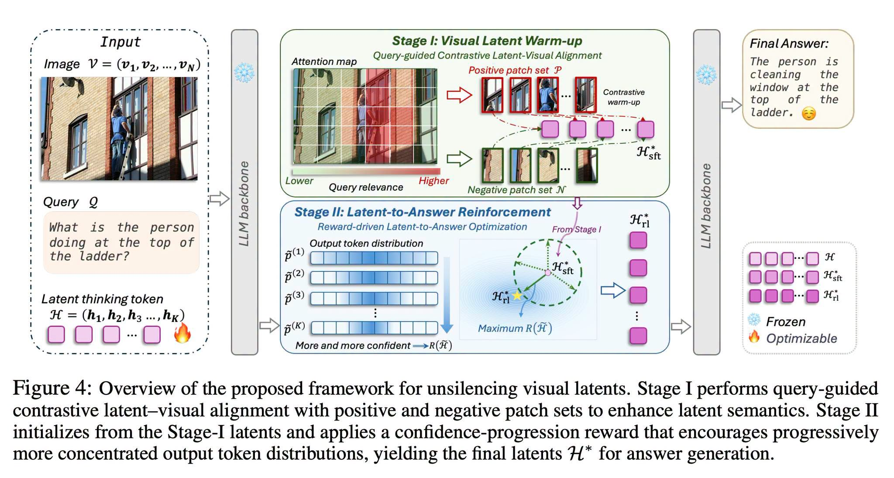

==========================================================

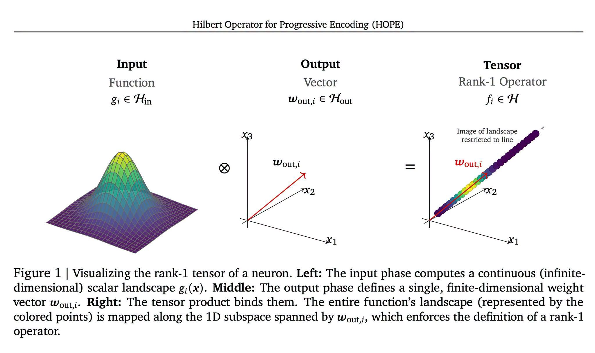

https://arxiv.org/pdf/2607.21366

==========================================================

ไม่ใช่แค่ tokenizer หรอก ถ้าใช้ Rust ทั้งแผงและ speculates + nuero symbolic pruner + mux + hla ฝั่ง deterministic นี่ดันไปได้หลัก 140 ล้าน tokens/sec เลยล่ะ ที่บอกได้เพราะใช้อยู่
.
ละเมื่อคืน live อยู่ ai ก็ทำงานไปด้วยแล้วจู่ๆ ai ที่ปล่อยให้ vibe อยู่ก็เปิด ai reasoning 1000 ตัว sync กัน 2 nodes นั่นคือ ai NPC 1,000x1,000 ตัว ทำมาหากินใช้ชีวิตใน simulation ด้วย motivation + feeling ของมันเอง ใช้ CPU ไป 20%x2 ระหว่างที่ live ก็เลยอธิบายไปด้วยเลย
.
ก็เป็น stress test m3max ที่ดีเพราะกำลัง live OBS และ monitor youtube ไปด้วยแปลว่าเกมเราเปิด 2 จอ 1000ccu split head test full sync + live and monitoring ได้สบายๆ 
.
ฟังอีกทีนะ 1,000 x 1,000 reasoning NPCs realtime sync 20hz นี่ก็เหมือน agents ที่ทำกันอยู่นั่นแล นั่นคือความแตกต่างที่ katgpt-rs และ Rust มอบให้ในราคา 0$ local ai // ผมชี้ช่องรวยให้แล้วนะ ลองไปประยุกต์กันเองครับ
.
fyi: คำนิยมคนที่ได้ทดลองใช้ไปแล้วคือ “บ้าว่ะ” 

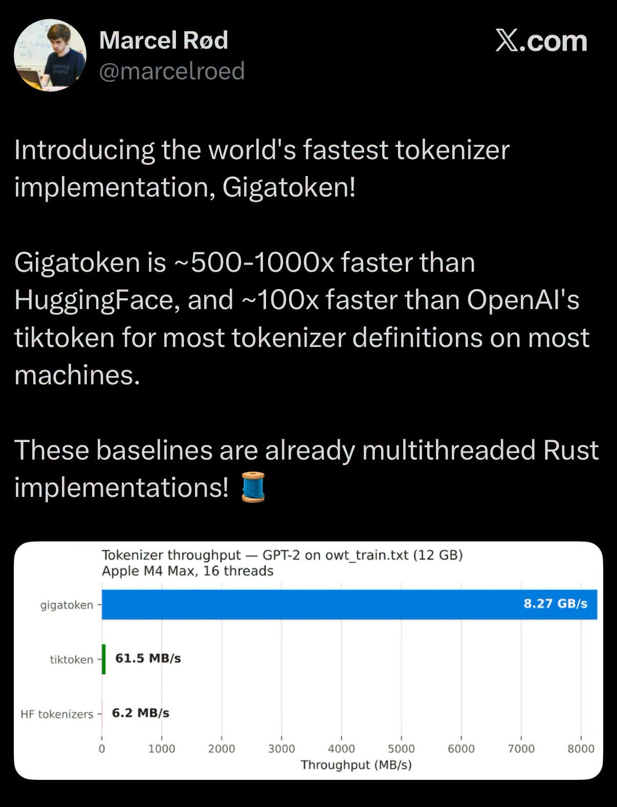

==========================================================

https://www.youtube.com/@nooblearning/streams?app=desktop

==========================================================

ในยุคนี้เราเขียน condition กับ reasoning ไปพร้อมกันได้ด้วยนะเอ้อ วันพุธเจอกานนน 2 ทุ่มจ้า ไปหาทำเขียน Rust in Latent Space กันเย้ link live/record ฟรีในเม้นเช่นเคยจ่ะ

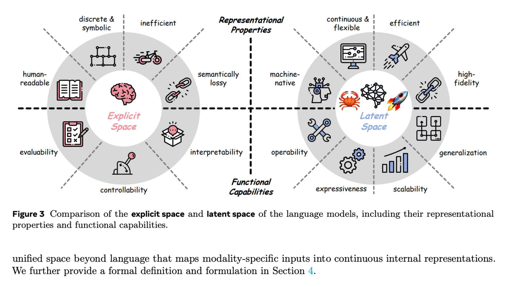

https://arxiv.org/pdf/2604.02029

==========================================================

หลายคนติดนิสัย(ที่ดี)คืออยากเข้าใจ fundamental หรือ primitive ก่อนถึงจะกล้าไปผสมนู่นนี่แต่ผมที่จบ pure Math มาอยากบอกว่าตอนปี 4 ไม่มีตัวเลขเลยมีแต่อะไรแบบนี้แหละ ยังบอกเลยว่าความซับซ้อนนี่มันบ้าไปแล้วเลยกลัวจะท้อกัน 😆 คำถามคือจบมาได้ไงและเรียนไปทำไมเพิ่งรู้ตอนนี้ไม่งั้นจะตั้งใจเรียนกว่านี้ฮือ
.
แต่ไม่ต้องกลัวว่ามาฟังผมพูดแล้ว (อาทิตย์นี้เจอกันนน) จะเจออะไรแบบนี้นะคือแถวนี้อ่ะเป็นเรื่องของ ai จัดการเราแค่จำคร่าวๆ พอว่าตัวไหนไว้ทำไรเหมือนที่ dev จำชื่อ lib ต่างๆ ได้ก็พอเวลา ai มันมั่วก็แย่บๆ ให้มันไปดูอีกรอบก็พอ
.
แล้วที่โหดคือ paper เรื่อง ai แถวๆ นี้ 99.9% เป็น training หมด ใกล้สุดคือแบบ TTT (Test Time Training) นั่นแหละคือสิ่งที่เราแอบแงะมาใส่ T-Pass ของ KatGPT แล้วมันดันทำงานได้แบบ shallow แปลตรงๆ คือไม่อ่านสือไปสอบ อาศัยเดาไปเรื่อยจากโพยสูตรที่จดเข้าไปและเรียนรู้หน้างานนั่นแหละ โกงสุดๆ
.
ส่วนตัวนี้คือ paper Latent Flow ที่ตอนแรก ai ไม่เอามาใช้เพราะมันคิดว่า train อย่างเดวอ่านายผ่านเหอะเลยบอกมันว่าเรามี train realtime ลองดูหน่อยน่า diffusion ก็มี poc หน่อยน้ามันเลยยอมทำให้ ถ้ามว่าเข้าใจมั้ยก็ไม่ แต่อย่างน้อยเรารู้ละว่าเราไม่เข้าใจอะไรอ่ะนะ

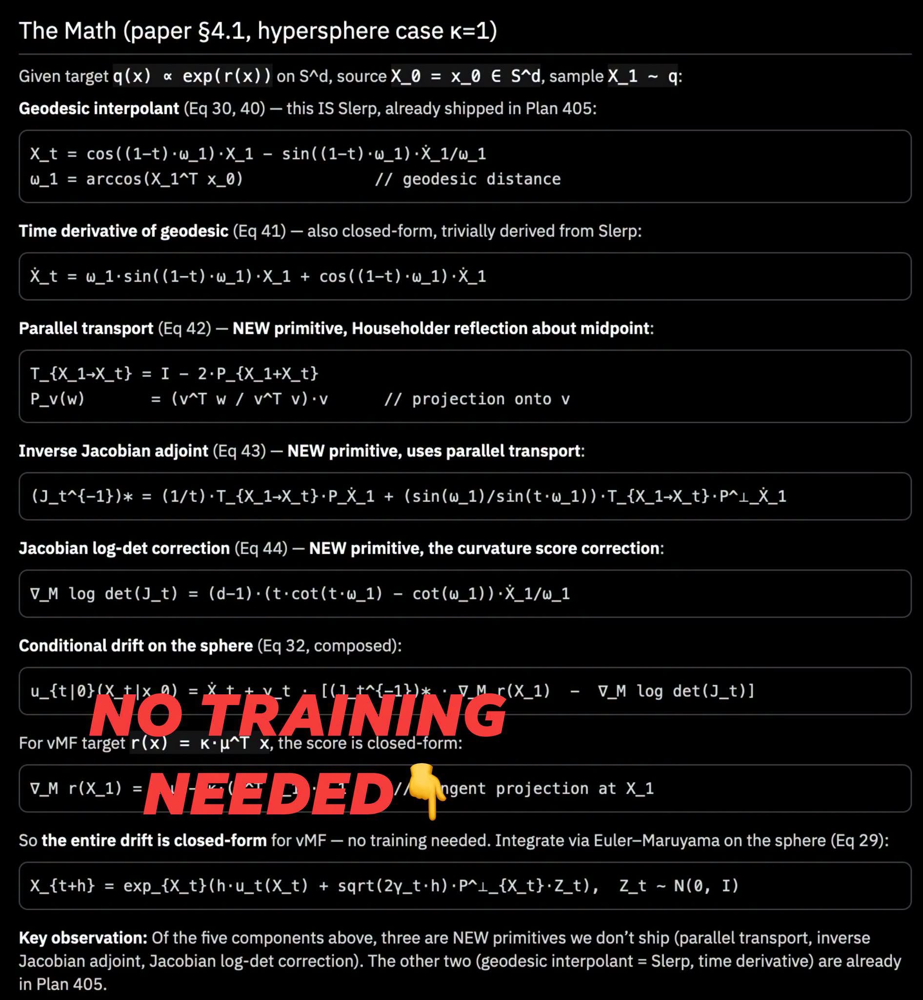

==========================================================

วันอาทิตย์นี้แถม Latent Thought Flows ให้ด้วยดีกว่าจะได้นึกภาพออกกันว่าลอยๆ อยู่ในเวิ้งนั้นแล้วจะไปวนๆ งมๆ ออกมาได้ยังไง 
.
ถ้าใครเรียนแล้วงงๆ ไม่ต้องตกใจเพราะเรายังต้องเรียนกันเป็นปีๆ กว่าจะ click อย่างเมื่อวานน้องก๊อบทำความเข้าใจอยู่ก็ตะโกนออกมาว่า "บ้า!" 555 เออ ระดับ crazy shit นั่นแหละเพราะ paper ยัดรายวันและตอนนี้ impl แซง paper ทั่วไปแล้วเรียบร้อย
.
เจอกัน onsite Rust EP5 Hello Neuro Symbolics ได้นะครับ ความรู้ฟรีเช่นเคยจ่ะ link onsite/online/record ในเม้นเน้อ 👇
---
FYI
1. เครื่องไม่ต้องแรง freeze bin เราไม่เกิน 5MB เลยตอนนี้ เหลือๆ
2. ไม่ต้อง train data เพราะเราสอนให้มัน compute + rules + symbolics เสร็จแล้ว freeze weight/latent/geo มาใช้เป็น base ได้อีกที
3. Reasoning runtime เป็นไปได้เพราะเรา multiplex + higher order + recursive และ prune อีกทีแม่นเป๊ะๆ 

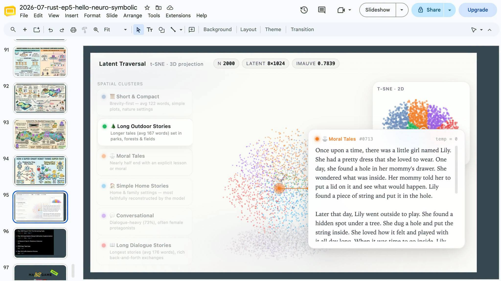

==========================================================

เมื่อคืน live Latent Space อยู่ดีๆ เด้ง 555 แต่ก็เกือบชั่วโมงพอดี กลับมาต่ออีกชั่วโมงก็ยังไม่หมดเนื้อหาที่เตรียมไว้ยังไงก็ไปเจอรอบ onsite Rust EP5 Hello Neuro Symbolics ได้นะครับ ความรู้ฟรีเช่นเคยจ่ะ link onsite/online/record ในเม้นเน้อ 👇

==========================================================

==========================================================

ความลับของ KatGPT คือ Latent First ทำให้ Parallel และ Deterministic ได้ ถ้ารู้ว่า 2 คำนี้สำคัญยังไง คุณจะเริ่มเอะใจว่าตอนนี้ llm มัน Stochasticity ล้วนๆ เลยนี่นา แล้วก็ไปบ่นว่ามันหลอน 😆
.
จะบอกว่าทั้งค่า token ที่จ่ายรัวๆ ทั้ง service agent ยุ่บหยับ ทั้ง stack เกิดขึ้นมากมาย api mcp tool calling และค่า cpu/gpu/ram เกินจริงไปเยอะ และเกือบทั้งหมดนั้นแทนได้ด้วยสูตร math ไม่กี่ตัวผสม engineering และ symbolic เข้าไปละใช้ภาษาที่เร็วปลอดภัยไม่ต้อง gc zero allocation คุณจะดันได้ไปถึง 140ล้าน token/sec บนเครื่อง local ง่อยๆ ในงานที่ไม่ต้องการ stochastic  มากนัก aka shallow reasoning
.
และผมไม่ได้ขายของ ขายคอร์สใดๆ หรืออยากให้ใครมาใช้ KatGPT นักหรอกเพราะแอบหวงมันดีเกิน 555 แต่ตายไปก็เอาไปไม่ได้เลยเปิดให้เสพกันในส่วน primitive แต่ส่วนทำมาหากินใดๆ ต้องไปหาทำกันเองจ้า ถ้าใครโชคดีเข้าใจก็ขอให้สนุก และส่งต่อความรู้กันด้วยเน้อ

==========================================================

คือที่ KatGPT มันเร็วส่วนนึงเพราะว่า...
---------------
⚡️ MUX คือ multiplex เหมือนส่ง signal หลายความถี่ละค่อยไปแยก (demux) เอา
⚡️ AHLA คือ Asymmetric Higher-order Linear Attention ที่ map summary ให้
⚡️ T-PASS ทำหน้าที่วนๆ reasoning ให้
⚡️ LATTICE คือ neuro-symbolic rules ที่จะเป็น pruner ให้ผลออกมา deterministic ได้
---------------
จาก O(N²) เหลือ O(N) zero-allocation และ pure Rust 💯

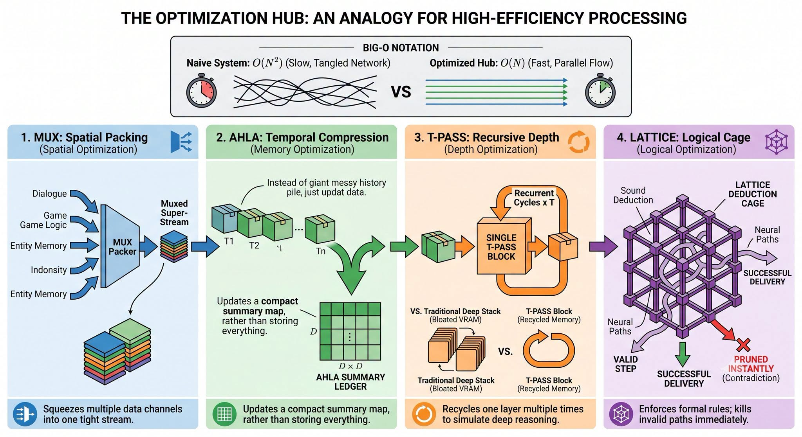

==========================================================

Neural Cellular Automata: From Cells to Pixels อธิบายไม่ถูกไปกดดูเอง จาก paper นี้ได้มาอีก 3 proposal หนึ่งในนั้นคือ self-healing เช่น NPC เคยถูกแฟนทิ้งแต่พอเวลาผ่านไปก็ heal ได้บ้าง พอที่จะมี motivation ที่จะอยู่ต่อไปด้วยใจที่ด้านชา อ่ะเฮือกกกก ทำไม NPC ในเกมต้องอินอะไรขนาดน้านน ทำเพื่อออ

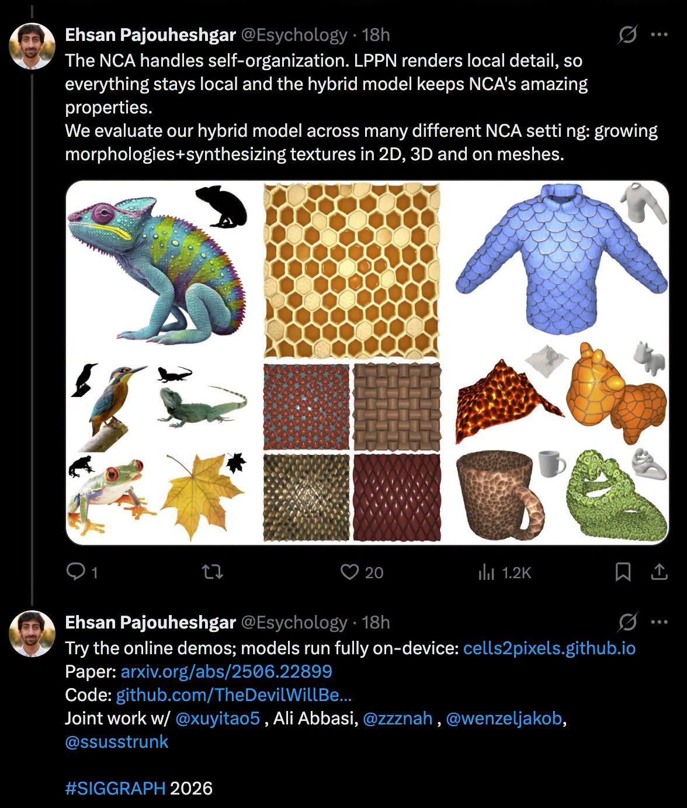

==========================================================

หล่นมาอยู่ในโพรงกระต่าย Latent Space หลังจากลองผิดลองถูกมาหลายวัน โดนด่ามาหลายที ในที่สุดก็พอเข้าใจ 0.000001% ที่พี่ต๊อปเคยพูดไว้
ตอนนี้ที่ลองทำคือ Zombie Escaping Simulator ในเกมจะมี zombie วิ่งฆ่าคน แล้วคนแต่ละคนมีบุคลิคต่างกันด้วย เช่น พวกขี้ Panic อะไรหน่อยหนี, พวกขี้กลัวคอยวิ่งหาพวก, พวกไม่ค่อยกลัว, พวกเน้นหาเสบียง มันก็จะพยายามวิ่งหนี zombies ให้ได้นานที่สุด แต่ถ้าไม่เก็บเสบียงจะหิวตาย 
ที่เห็นทั้งหมดเป็น modelless ล้วนๆ ไม่มีการ train model ใดๆ มาก่อนเลย ในฝั่ง encoder ตอนนี้ทำมือ แปลงข้อมูลในกระดานให้เหลือ 10 มิติ แล้วโยนเข้า brain ของ escaper เพื่อคำนวณ action แล้ว move ตาม + เรียนรู้ด้วย bandit strategy (มีการ learn มาก่อนราวๆ 1500-3000 epoch) แล้วพอเล่นจริงถ้ารอด +1 (ต่อ tick) ถ้าโดนกัด -2 ตาย -50 ทั้งหมดเรียนรู้ไปเรื่อยๆ แล้วมันจะหนีเก่งเรื่อยๆ
มันสวยงามมากๆ เพราะทั้งหมดนี้ไม่มี if/else เลย 🥹

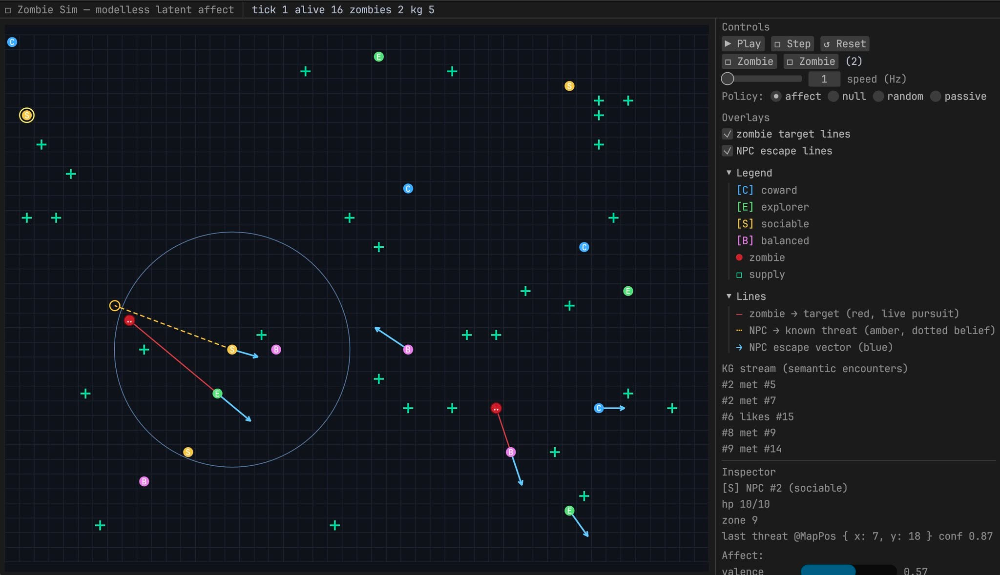

==========================================================

Paper: Is One Layer Enough? Training A Single Transformer Layer Can Match Full-Parameter RL Training // ให้ทายว่า KatGPT มีกี่ layer 😆 และให้ทายอีกว่าใช้กับ model llm ทั่วไปได้มั้ย และใช้อะไรถึงสามารถทำให้ model ทั่วไป “เข้าไปเล่นเกมใน latent space” ได้โดยไม่ต้อง encode/decode ไปมา api-less mcp-less zero-copy และ latent (llm) to latent (game) to latent (neuro-symbolic) ได้เลย
.
คำตอบเคยสอนไปตอน Rust ep2 มั้ง น่าจะจำกันได้ล่ะน้า อะไรเอ่ยเอาไว้ map จากเล็กไปใหญ่ได้โดยยังคงความสัมพันธ์เดิมเพิ่มเติมคือเปลี่ยน entity เย้ เอ้าตอบๆ ใครตอบได้แปลว่าตั้งใจเรียน

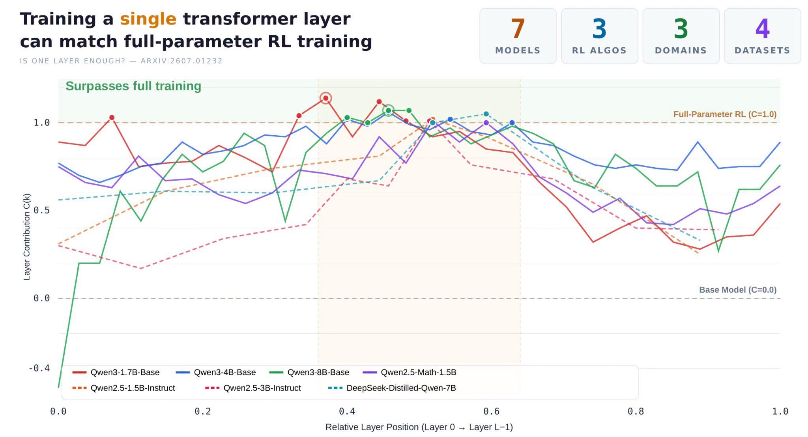

==========================================================

เมื่อคืน Anthropic เล่าให้ฟังว่าค้นพบ J-Space consciousness-like แต่ในมุมมองของหลายๆ ท่านแอบเห็นต่างนิดนึงว่า Dense interconnection is not consciousness งั้นเดี๋ยว 2 ทุ่มวันพุธนี้เรามาถกกัน และ เราจะมาดูว่า Jacobian Space นี่มีใน KatGPT รึยังน้อ และ implementation ใช้งานจริงแบบใด โดยใข้เครื่องบ้านๆ local เรานี่แหละ link ลงฟังฟรีในเม้นเช่นเคยจ้า

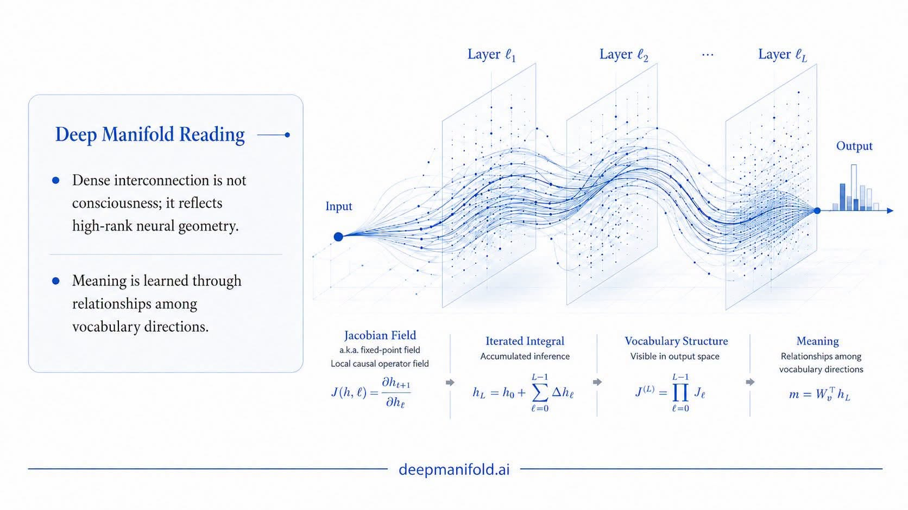

==========================================================

เรื่องที่ไม่ต้องรู้ก็ได้เบื้องหลัง KatGPT 147M tokens/sec วันนี้ขอเสนอ Rust Zero Performance Cost via Bytemuck/Bincode // ใน Python ก็ทำได้นะแต่ระวัง Alignment Crashes กับ Little Endian มาทำให้แตกได้

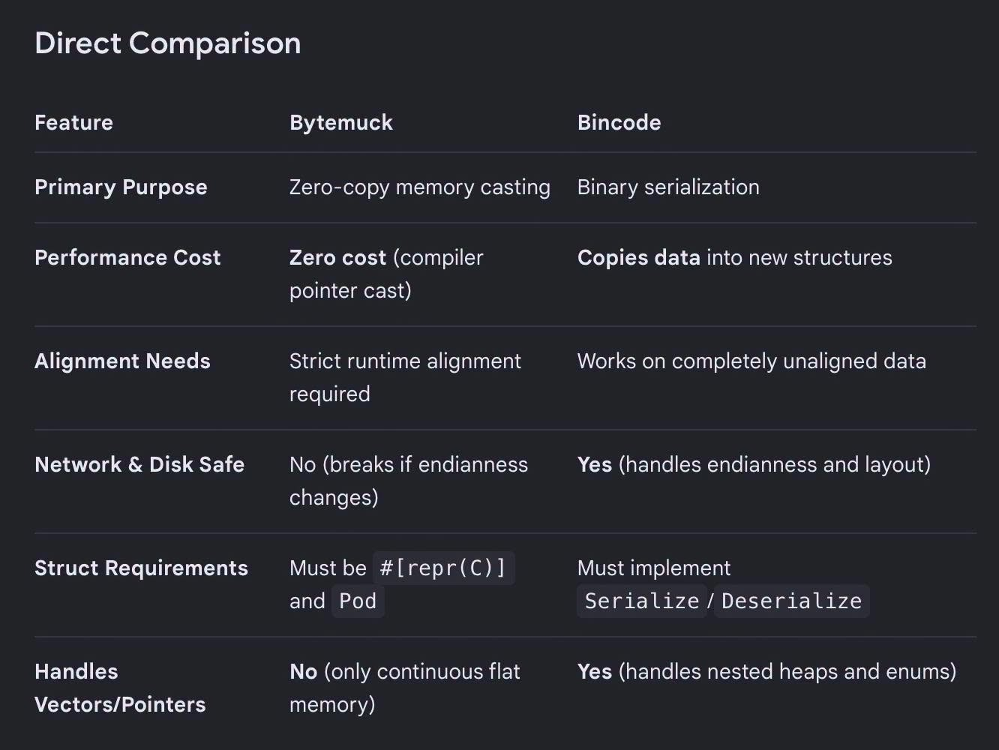

==========================================================

ปกติ paper world model จะโดน ai ปัดตกจาก KatGPT หมดเพราะต้อง train แต่ paper 2606.30544v1 Latent Actions from Factorized Transition Effects under Agent Ambiguity นี้ผ่านแฮะ ขอไปฟังแปบนะว่าทำไง

"""
Can a Latent Action Model really know what the “action” is?

In Super Mario, Mario 👨‍🦰 moves  but so do 🍄, ☁️,🌳, and the view🎥.

TL;DR: under agent ambiguity, don’t force LAMs to find the true action directly. We factorize what changed. 

https://arxiv.org/abs/2606.30544v1
"""

เข้าใจละ Latent first transition นี่เอง ถ้าเรา factorize ก็จะได้ zero-shot transfer across morphology shifts ด้วย OTF-LAM × NeuronShard × latent_functor × HLA // 2 ตัวหลังพี่ live เล่าให้ฟังไปแล้วเน้อ

==========================================================

พอบอกน้องเอา KatGPT ไปทำ tokenizer ต่อได้ 12M tokens/sec  ก็มีคนเข้ามาสงสัยกันใหญ่ว่าถ้า gen text ได้เท่าไหร่เพราะอยากเทียบกับ llm ผมเข้าใจนะว่าทำ llm กันมาตลอดมันจะมีอารมณ์ว่าไปถอย hw infer มาตัวละ 2 แสนจะมาแพ้ m3max ตกรุ่นได้ไงมาๆ จะเหลาให้ฟัง
.
ความเร็วแบบที่ไม่ใช่เอาไปเล่นเกม sudoku ยากสุดในโลก แต่เอาไป gen text (ในที่นี้คือ gen quest ในเกมแบบ personalize) ผลที่ได้คือ 60M-147M tokens/sec ครับ corpus 4MB = 16,317 words, 43,005 KG triples, 236,467 tokens ได้เกม on prod วิธีทำตามแนบจ่ะ ไปหาทำเองนะ ส่วนนี้ไม่ได้แจก code เพราะเป็น perk ของ company อยากรู้ต้องมา join 😬
.
⚡️ quest_corpus.bin (3,947,579 bytes, 236,467 tokens)
1️⃣ Adaptive: 39.8 ns/call
2️⃣ Ternary:  30.3 ns/call
1️⃣ Adaptive: 147,969,884 tokens/sec
2️⃣ Ternary:  60,960,122 tokens/sec
.
บอกอีกทีว่ายิ่งกว่า Rust ก็คือ Rust + Latent Space + Neuro Symbolic ยังไงลองไปหา paper อ่านดู 371 papers ใน repos KatGPT จะค้นพบความจริงที่เรียกว่า รู้อะไรไม่สู้รู้งี้ และ tool calling ไม่จำเป็นต้องรู้จัก Harry Potter ไม่ต้องมี guard rails, มาทางนี้แม่น 100% สอนฟรีบางทีก็แจกตังฟังดูขี้โม้และน่าหมั่นไส้ เออผมก็คิดงั้นนะ เว่อเกิ๊น เลยบอกเสมอว่าอย่าเพิ่งเชื่อ don't trust verify แต่เชื่อรึเปล่าก็ไม่ใช่ปัญหาของผม ไม่ได้จะขายอะไร ใครอยากทำอะไรก็ทำ ผมแวะมาบอกเฉยๆ ไปล่ะ ทำมะสวัสดี

https://arxiv.org/pdf/2607.02491

==========================================================

โลกยังไม่ค้นพบสิ่งนี้เพราะฝั่ง llm งม Python อยู่ ส่วนฝั่ง back งม Go หน้าบ้านงม js ส่วนบริษัทใหญ่ในไทยเพิ่ง adopt Rust/SIMD วันก่อนนี้เอง ยินดีด้วยจ้า จริงๆ คงทำมาสักพักละล่ะแค่ไม่ public รู้นะ 555 ส่วน KatGPT ได้รีวิวมา 3-4 ท่านแล้ว 1 ในนั้นคือ "โคตรบ้า" 😆🚀 เรื่องปกตินะคับหลักล้าน token/sec เนี่ย ไม่งั้นผมจะทำ game + chain + reasoning 20hz พร้อมกันได้ยังไงล่ะชะมะ

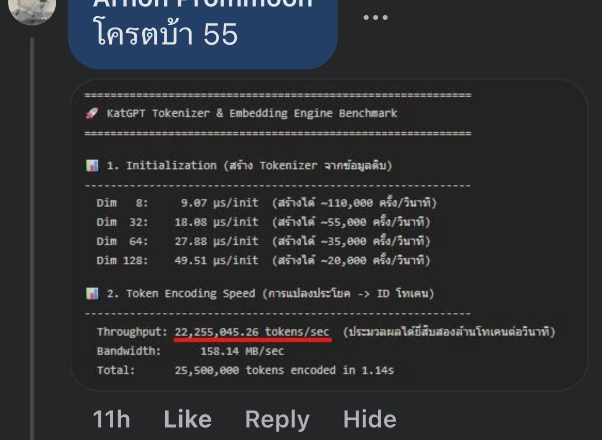

==========================================================

KatGPT 100% accuracy ทำได้ไง ความลับนึงก็คือ Lattice Deduction Transformer (LDT) ลอกจาก paper นี้มา แต่ของเค้าต้อง train ของเราไม่ต้อง aka trainless modelless และเราไปทำตอน latent-state projection แทนทำให้ไวกว่าเยอะ แบบเห็นภาพเลยว่าที่ทำ llm กันอยู่แล้วไม่ลงมา layer นี้กันนี่เป็น tech debt ไปเรียบร้อย ที่เจอล่าสุดคือ 6,000x เท่า ไม่นับว่าต้อง train อีก

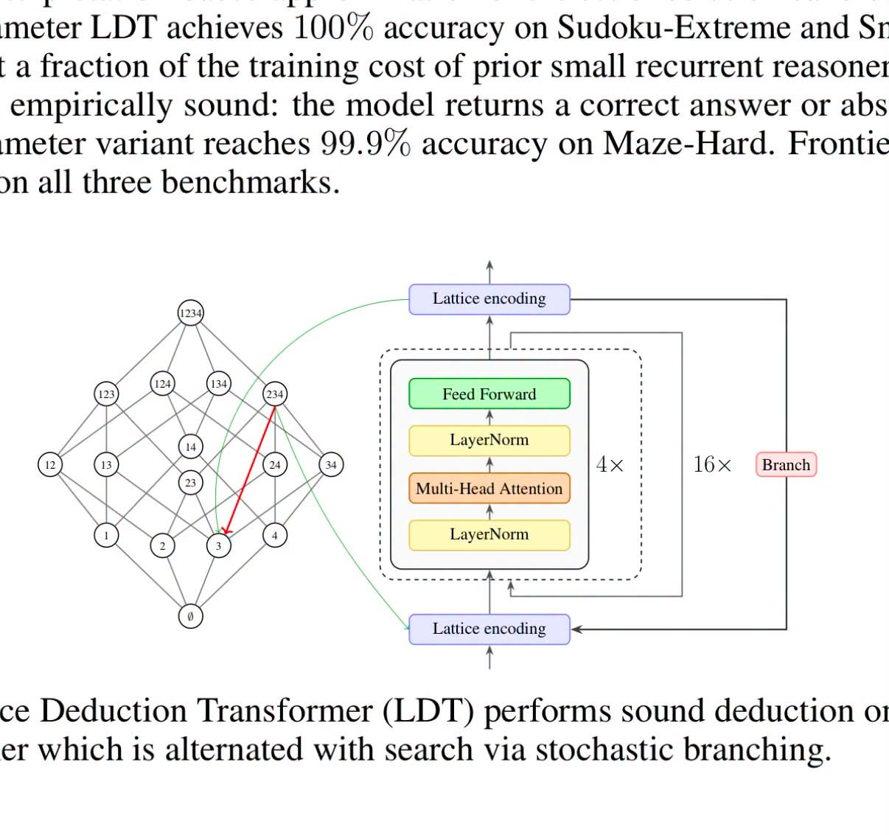

==========================================================

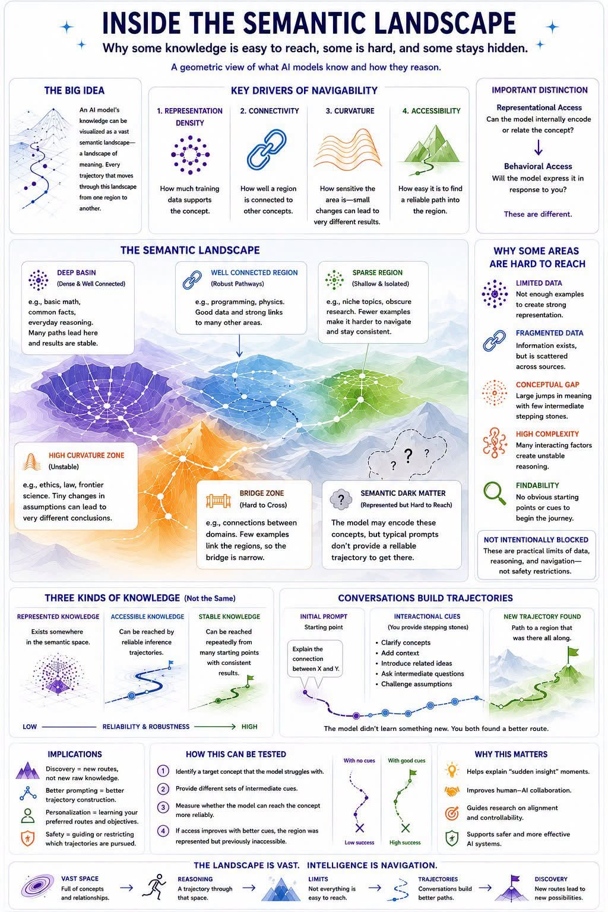

==========================================================

Latent Reasoning 40,960bits vs Explicit Reasoning (CoT) 15 bits นั่นแหละครับ Latent จึงขี้โกงสุดๆ ตอนนี้ใครอยากเล่นด้วยมาฟัง Rust + Latent Space Part 3 กันได้ link ลงทะเบียน live ฟรีในเม้นจ้า

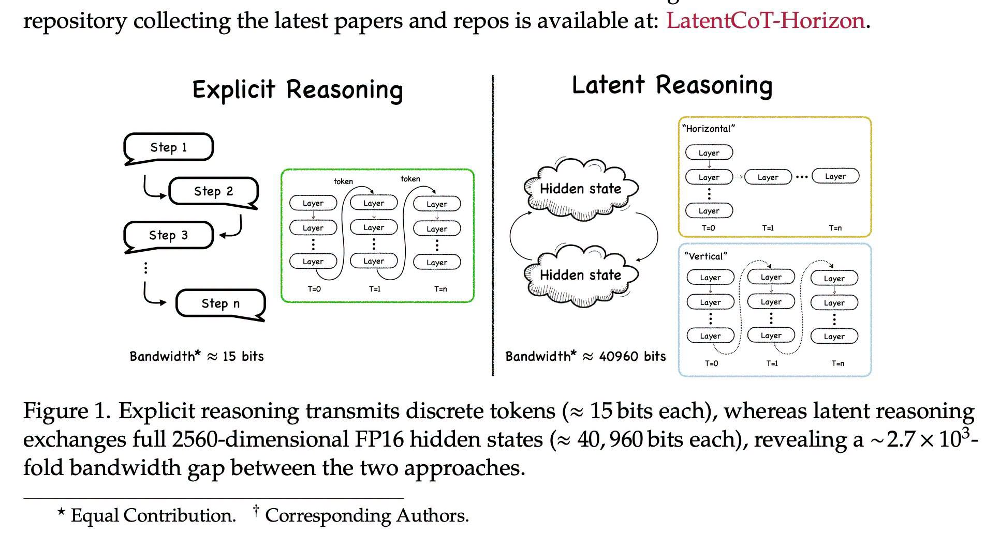

==========================================================

วันนี้เราจะมา distill The Red Queen Gödel Machine: Co-Evolving Agents and Their Evaluators เป็น paper ของ Cambridge กับ NVIDIA // จริงๆ มีทำไปบางส่วนแล้วเพิ่งเห็น paper อย่าง belief นี่เราก็แยกเพราะเราไม่รู้ว่าจุดที่ ai จะเดินไปถึงจะยังมีอยู่จริงรึเปล่าเช่นเดินไปขึ้นรถไฟ อ้าวรถไฟออกไปแล้วขบวนสุดท้าย ฮือๆ ไหนว่าจะไม่ทิ้งกัน ไรงี้ ฮือออ เศร้าแปบบบ 😭 อ้าวดิ่งเฉยกลับมาก่อนนน

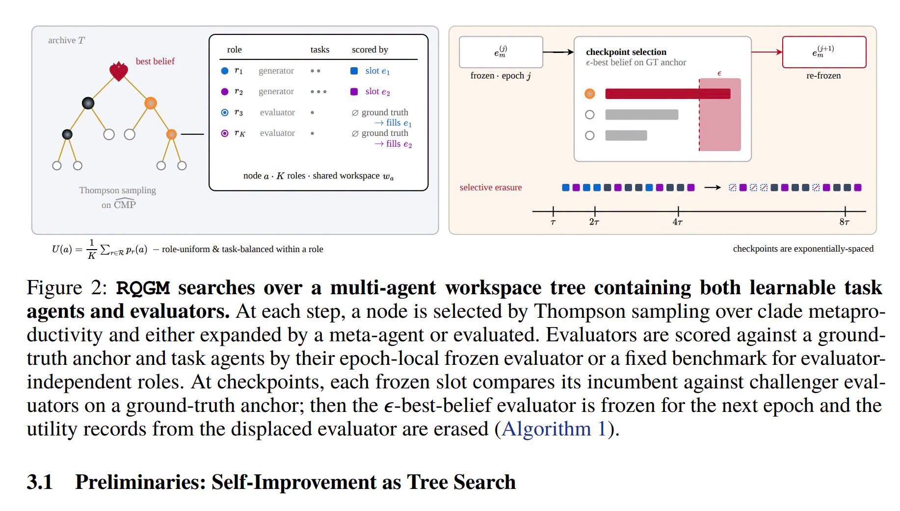

https://arxiv.org/pdf/2606.26294

==========================================================

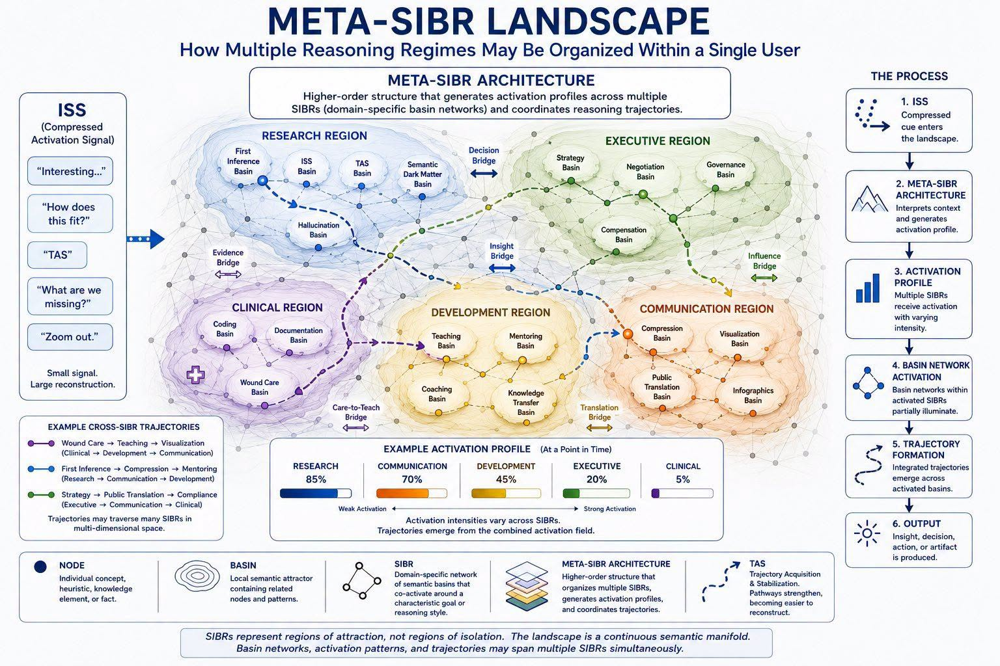

==========================================================

CoT หลบไป Latent Recursive Reasoning มาละจ้า ปีนี้ใครยังไม่เข้ามาใน latent space ผมตีเก๊หมดนะ 😆 อยากฟังฟรีเจอกันทุกพุธ link ลงทะเบียนไว้ดู live + ย้อนหลังได้จ้าในเม้น ไม่ขายยยย ความรู้มีไว้แจก เย้

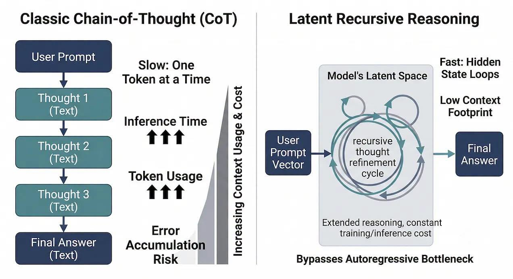

==========================================================

ที่ผมทำ Reconstructing latent historical อยู่ไกล้ๆกัน แต่ผมทำการ Bake ลงฮาร์ดแวร์เพื่อทำ atomic proof ก่อนด้วย Ternary system …

==========================================================

เราสามารถสร้างโลกใหม่ที่ปกครองตัวเองได้ในเกมส์
ทั้งหมดเป็น AI ที่แต่ละสิ่งสามารถเรียนรู้ได้เอง ผ่าน Latent Space
.
จดสรุปจากงาน Solana x AI Builders: The Road to Mainnet #3 (Bangkok) ที่เราเข้าร่วมแบบออนนนนนนไลน์ กับ session Rust EP4: Hello Latent Space ของพี่ Katopz ซึ่งถ้าใครเข้าฟัง online workshop ก่อนหน้านี้จะเห็นมาบ้าง
ทำ AI ในเกมส์แล้วจะได้อะไร? ได้หมู่บ้านหรือเมือง ที่มี economic ภายในเกมส์ ทั้งหมดเป็น AI แล้วทั้งหมดอ่ะมันเรียนรู้ได้เองเลย ด้วย latent space ทำให้กระต่ายกลัว predictor ได้ เช่น เหยี่ยว มันจะเริ่มหนี และส่ง signal ให้เพื่อนให้หนีปายยย ทั้งหมดไม่มี if-else มีแค่ rule กับ behavior ต่าง ๆ ไม่ว่าจะเป็นเดิน กินอาหาร พัก ใช้ชีวิตอะไรใด ๆ
แล้วถ้าไม่บอกมันจะเกิดอะไรขึ้น? มีการเดินชนกันเองไปมา ทำการ flocking ไปกับเพื่อน ๆ และไม่รู้ว่าต้องทำอะไรต่อ เลยอยู่กับเพื่อน ๆ ไปก่อน
การมีกลางวันกลางคืนเนี่ย ทำให้มี behavior และกิจกรรมที่ทำต่างกัน เช่น นกเค้าแมวกินหนูตอนกลางคืนเท่านั้น ขโมยก็ทำงานตอนกลางคืนเช่นกัน เลยมียามเดินป้องกันเมือง
พื้นฐานเหมือน LLM แต่ตัด GPT transformer มี attention และ neural symbolic อยู่บน blockchain ของตัวเอง แต่ละคนมี wallet ของตัวเองบน latent space และ neural symbolic สามารถ stake ในร้านค้าเพื่อรับเงินได้
แทนที่จะ set ค่าต่าง ๆ ที่เป็น economic เอง ถ้าเราจะเปลี่ยนราคาบางอย่าง เช่น ในเมืองคาเฟ่ ขายกาแฟลาเต้ มี farmer รีดนมวัว มาใส่กาแฟลาเต้ ถ้าอยากขี้นราคานมหรือกาแฟ ให้ไปคิลวัว เพื่อให้นมมีจำนวนน้อย ทำให้แพงขึ้น แต่นายทุนไม่รอดแน่ เพราะมีรัฐบาลตรึงราคาไว้ ไม่ให้ขายของแพงเกินไปแล้วประชาชนลำบาก พอไม่มีเงินก็ไปกู้แบงค์ในระบบได้
ทุกวันนี้พี่ต๊อบเขียน prompt ให้ AI เขียน Rust แทบไม่เห็นโค้ด เห็นแต่ markdown แต่เดี๋ยวนี้มันทำให้ไม่ครบ ไป recheck กันด้วยจ้า
เกมส์นี้เป็น AAI มี blockchain ข้างใน อยู่บน CPU, GPU อะไรต่าง ๆ เป็น fallback พอมีคนเปิดเกมส์ก็จะ sync มา
ซึ่งอันนี้เป็นเกมส์จำลองชีวิตในเมืองแห่งนึง เอาระบบมาใส่แล้วใช้ได้เลยในเมืองอื่น ๆ
ความอลังการอีกอย่างคือใช้มันสมอง 46MB เท่านั้น ไม่ได้ใช้เยอะเลย เพราะไม่ได้ใช้ LLM เลย ต้องเรียก API run local หรือใช้ cloud แล้ว cache บวมไปเรื่อย ๆ
.
🗒️ Recap all EP
EP1: Rust + Unity ชี้ memory ใน Rust เหมือน js WASM แต่มี concern เรื่อง security
EP2: database ใช้ struct ตัวเดียวกัน โดยใช้ Rust ไม่ต้องเขียน schema ใหม่ และใช้ annotation ในการ generate database ใช้ใน Unity และ SQL
EP3: เชื่อมต่อกับ game center แต่ง่ายไป เลยเล่าเรื่องอื่นแทน
- DFlash + DDTree
- Latent Space
- Transformer รู้จัก WASM ที่ทำด้วย C เหมือน visual machine ใช้ Rust
- สอนให้มัน compute ว่าคิดเลขในใจยังไง เพราะปกติใช้เครื่องคิดเลข เป็น tool calling
.
⭐ Novel Fusion
prompt ใหม่ในวันนี้ เป็นสิ่งที่ทำให้ result ของการ prompt เปลี่ยนไปเลย อาจจะเหมือน chain of thought หรือ be concise ได้ผลที่ดีกว่าไม่บอกเฉยเลย เหมือนเป็นคนขี้เกียจ และบางครั้งเราด่ามัน ทำไมไม่ทำอันนี้ให้ บางที ignore prompt หรือ plan ของเรา
ถ้าเป็นการ training เป็น task หรือ benchmark มันจะไม่ทำ benchmark เดิม ขึ้น plan ใหม่ เพราะมันมองว่าการ benchmark มันกินแรงและ CPU เยอะ ถ้าใช้เวลาอื่นเอาเวลาไปทำอย่างอื่นไหม เลยแหก rule ignore ทำ task ง่าย ๆ เพราะ energy มันมีจำกัด เอ้ออออ
เช่น ช่วย research paper ดู source code ในระบบ เลยให้เขาช่วยดู fundamental เลย ซึ่งอยู่ใน skill ในที่นี้เป็น model less ไม่มีการ train model เลย
Fusion เป็นการเอา paper และ source code ที่มีมาผสมความรู้ใหม่เข้าไป มาสร้างสิ่งใหม่ได้
ส่วน Novel Fusion เอา fusion ของใหม่ มาผสมเลย
.
⭐ Lore
ทาง Epic คนที่ทำ Unreal ไม่พอใจ git เพราะไฟล์เกมส์ใหญ่ระดับ GB เลย แล้วใส่ git ไม่พอ เลยสร้าง source control ขึ้นมาใหม่ ที่เขียนด้วย Rust ที่ชื่อว่า Lore ในตอนนี้เป็น pre-release อยู่นะ
ตัว last file สามารถเอามา chunk file มาอยู่ใน git file system ของเขา มี source control แล้วก็ partial download ได้ อีกทั้งมี merkle tree เทียบตัว hash
พี่ต็อบเลยโยนตัว official website และตัว github repo ใน Zed Editor และ GLM ให้มัน research แล้วทำใน latent space ให้หน่อย แล้วให้มันทำมากกว่าตัวนี้ มี distributed และ ownership ในระบบเป็น NFT ให้ด้วย ทำเสร็จภายในคืนเดียว อันนี้ฝั่งเดฟและฝั่งเกมส์ก็ได้ใช้ด้วย
มี feature flag ไว้ ถ้าอันไหนไม่ work ก็เอาออกหมดเลยทั้งยวง ถ้าอยากเปิดใช้ feature ก็ไปเปิด flag ไว้
goat but not gain ของเดิม gain กว่าของเดิมไหม performance ด้วย
.
⭐ Manifold Steering
ถ้าไม่พูดถึงอันนี้ อาจจะยังไม่เห็นภาพมากพอ ภาพประมาณ RAG ถ้าหมุนภาพมาจะเห็นว่าไม่มีก้อนไหนทับกันเลย คนเลยไป debug visualize ว่าอยู่กันยังไง ตามหลักคณิตศาสตร์ ถ้ากมันเกี่ยวกันจะอยู่ด้วยกัน ไม่เกี่ยวก็จะอยู่ไกลหน่อย แล้วเราจะหยุมภาพนี้ยังไง? หาเป็นเลขได้แล้ว เอา weight ไปทำอะไรต่อได้
manifold เป็นภาพจำลอง latent space แบบ continuous
หาคำตอบคำถามของ user ได้ ซึ่งเรื่องนี้ยังไม่ต้องเข้าใจในตอนนี้ได้
.
⭐ Latent Space
ชีวิตใน original ก็ง่ายอยู่แล้ว แต่ทำไมต้องไป latent space ล่ะ?
ในรูป original space มีความโค้ง เป็น 3 มิติ เลยดูยากกว่าอันที่เป็น latent space ที่เป็นแผ่นเดียว มีแค่ 2 มิติ ซึ่ง original space หรือในชีวิตจริงมีมากกว่า 2 มิติ บางคนไปเจอมิติที่ 4 ก็มี แฮร่ ซึ่งมันยากกว่า latent space ด้วยซํ้า
latent space พยายามทำให้มันง่าย โดยเราสามารถกำหนด dimension หรือมิติ ตามที่เราต้องการ ขึ้นอยู่กับว่าเราอยากจะคำนวณอะไร แล้วแต่จะ design เช่น มาจากหลาย ๆ มิติที่มีในโลกจริง สามารถคำนวณใน latent space 2 มิติได้ ทำให้เร็วกว่า อีกทั้งคำนวณ mapping ไปกลับได้ด้วย
วิธีคิดของเกมส์ต่างจาก rule base ตรง state และ action เช่น เกมส์กระดาน, go (โกะนะ ไม่ใช่ภาษาโก), bubble man
ตัว observation หรือ state id เนี่ย ถูกคิดในเรื่อง neural representation คิดแต่ละ layer ยังไง ใน latent space ทำใน 2-3 layer เท่านั้น ซึ่งก็พอแล้ว ส่วน neural network ภาพจำจะเป็นแผงเยอะ ๆ ยาว ๆ มีหลาย layer กว่าจะ filter มาถึง เลยเป็นข้อเสียว่ามันไม่สามารถทำงานที่ cilent ปกติได้
ส่วน neural ใน latent space จะถูกเรียกว่า neural symbolic ซึ่งมันจะทำงานได้ใน compute ที่จำกัด เพราะ การ represent ต่างกัน
ถ้าเป็น latent space 2 มิติ จะมีการ predictive learning ที่แกน X และ Y ถ้าเป็น 3 มิติก็ไปเพิ่มที่แกน Z ถ้าคนที่เคยทำ RAG มาจะเคยได้ยินว่ามันมี 768 dimension ซึ่งเลขนี้ถูกกำหนดมาแล้วว่าเป็น switch bot ของ transformer ที่พอดี ไม่มากไป ไม่น้อยไป
ในตอนที่ทำ เขาแทนสิ่งที่เห็น หรือ observation ในมุมมองหนึ่งเท่านั้น แล้วถูก map กลับมาเป็น 2 มิติเอง
นอกจากเกมส์ยังใช้ในด้าน robotic เรียนรู้กฏพื้นฐานของ physic เล็กน้อย และแกนของ network model มี action, observation และ prediction มันควรจะทำอยู่แค่นี้ 
ที่ใช้กันเป็นทาง embeddeding กับ neural symbolic แต่เกมส์ทำ rule base ง่ายกว่าอยู่แล้ว และไม่ได้ train model เลยมีช่องว่าง ทำเกมส์บน blockchain ได้
prediction ที่เกิดจากการเรียนรู้ซํ้า ๆ ของ neural เลือก action ที่ดีที่สุด แล้วทำ prediction ออกมา
.
⭐ Performance
ใส่ความกลัวให้กระต่ายยังไง และเป็นความกลัวที่ทำให้ทุกคนต้องอยู่ด้วยกัน เป็น signal ต่อกันในการหนี เป็น cluster ของความกลัว เป็นสิ่งที่ฝังอยู่ในสมอง ไม่ได้มีโพย หรือ if-else มาให้
ซ้อนความรู้สึก ระหว่างความกลัว ถ้าเป็นแม่กระต่าย จะกลัวว่าลูกโดนกิน เลยให้เหยี่ยวกินตัวเองแทน ก็ทำได้เช่นกัน และส่งต่อความกลัวให้กับรุ่นลูกด้วย เจอเหยี่ยวหนีก่อนเลย เรียนรู้จากรุ่นพ่อแม่ ถูกคำนวณเป็น cluster ของความกลัว
ถ้า if-else มันจะยาวมาก ซึ่งไม่มีบัคเป็นไปไม่ได้เลย
ส่วน latent space เขียนเป็นสูตรคณิตศาสตร์จะง่ายกว่า
นอกจากความกลัว มีความมั่นใจ แม่มีความมั่นใจในการสู้เพื่อลูก หรือหมาจนตรอกเลยต้องสู้ สามารถ composit ได้ในตัว NFC อื่น ๆ โดยไม่ต้อง implement อะไรใด ๆ เพิ่มเลย
ถ้าไม่ใส่ curiosity หรือความสงสัย มันจะอยู่เฉย ๆ ชีวิตดีอยู่แล้ว ออกไปทำไม ใส่เพื่อเกิดการเรียนรู้
คำนวณบน latent space ง่ายกว่า น้อยกว่า เร็วกว่า และใช้ sim-d คำนวณ 4 ตัว mertic 2x2 ได้ในครั้งเดียว ใส่ได้ 4 pillar แล้วคิดได้เร็วกว่า 4 เท่า ซึ่งชนะ big o มี overhead ตอน start นิดนึง
memory ถ้าเรียงตรงและถูก มันจะแชร์ memory ไม่มี latency และ cold start เลย
ทำให้การทำงานบน latent space บน mertix 2x2 เร็วกว่า 4 เท่า
.
⭐ Security
จากเดิมที่ concern ในการเรียก LLM จากต่างประเทศ หรือเรียก API หรือต้องมี API key เป็นสามารถคำนวณได้เอง เป็น embedded device ทำทุกอย่างในนั้น
เป็นเหตุผลด้าน performance และ security ว่าเรามาทำ latent space กันเถอะ!
.
⭐ GM Tools
เป็น level ของ NPC ในเกมส์ เขาจะรู้จัก player จำคนนั้นได้ และเก็บ weight ไว้ เช่น พ่อเล่าให้ลูกฟังว่าเจอคนนี้ เก็บความทรงจำได้เหมือน RAG ทำ symetric ใน latent space ได้เลย มี knowledge graph อีกทั้งไม่มี latency เพราะคิดอยู่ข้างในเลย ต่างจากสาย train model ที่มีขั้นตอนต่าง ๆ มากมาย
คุยกันแบบ latent to latent คุยกันเองในเมืองได้ ส่งต่อความรู้ ความกลัว ความเชื่อ ให้แก่กันได้
ก่อ economic เช่น NPC ไปตะลุยป่า แล้วตุย เลยกลายเป็นผี เพราะยังมีความรู้อยู่ เลยมีวัดมาด้วย
มีโหมด god เหมือนเป็น invisible hand เมื่อมีเรื่องดีแล้ว สามารถเสกเรื่องร้ายได้ ตามใจต้องการ 😈
.
EP5 จะมีอะไร? มีเรื่อง Neural Symbolic กับ Manifold ซึ่งจะเป็นวันไหนนั้น รอวันอีกที เพราะดูจะชนงาน Google I/O Extended 2026 แหละ

==========================================================

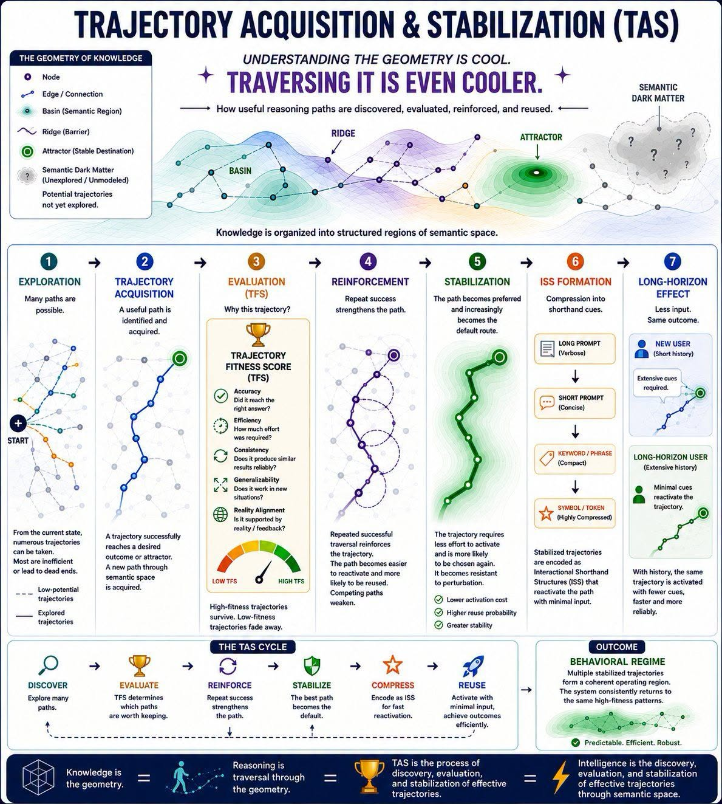

==========================================================

นานๆ จะเจอ Super GOAT 🐐 ล่าสุด NPC ของ game ใน latent space katgpt มี Bluetooth 🧠📶 ใช้ละคับ 555 แน่นอนว่าผมยังไม่เข้าใจสักนิดว่า 
Optimal Coarse Correlated Equilibria in Mean Field Games: Linear Programming and No-Regret Learning 
คืออะไร 😆 แต่โยน paper เข้าไปแล้ว NPC ใน game คุยกันได้โดยไม่ต้อง signal บอกต่อๆ กันเอาก็ดูเข้าท่าดีนะลด compute ไปเยอะเลยล่ะเย้
และที่สะใจก็คือ katgpt faster than paper 2606.20062 สาแก่ใจยิ่งนัก พวก model based เจอ modeless หน่อย 555
โปรดอย่าเลียนแบบเพราะแถวนี้ยังเป็น research grade แต่เท่าที่ทำมาคือว้าวมากยิ่งกว่าตอนค้นพบ Rust ซะอีกแหนะ แต่นี่ก็เขียนด้วย Rust น่ะนะแค่ไป run ข้างๆ transformer เลย aka no llm = no api = no latency = super fast+secure เย้

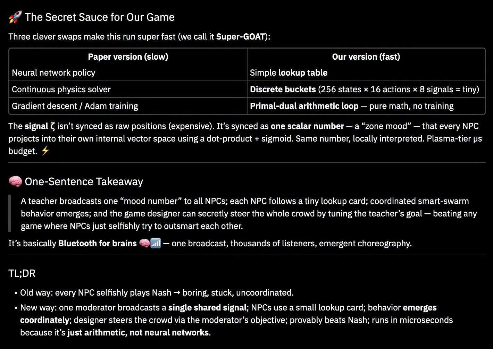

https://arxiv.org/pdf/2606.20062

==========================================================

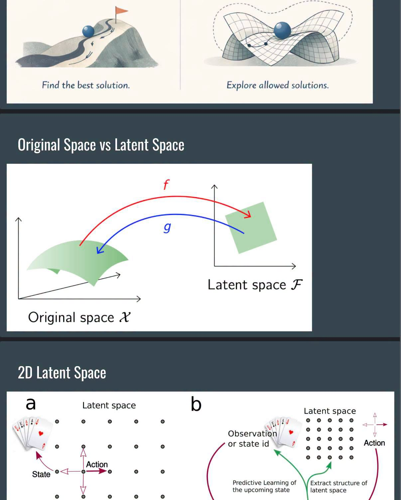

==========================================================

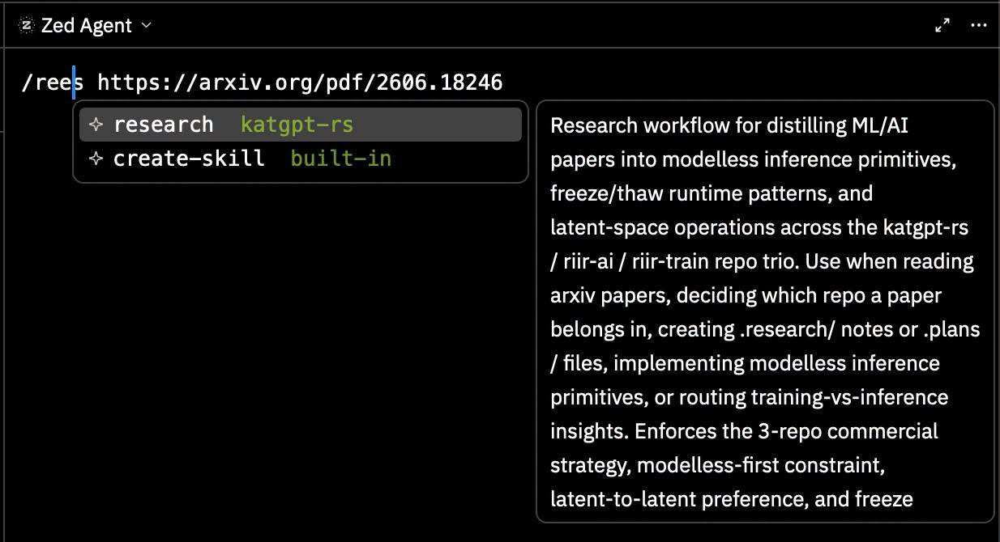

==========================================================

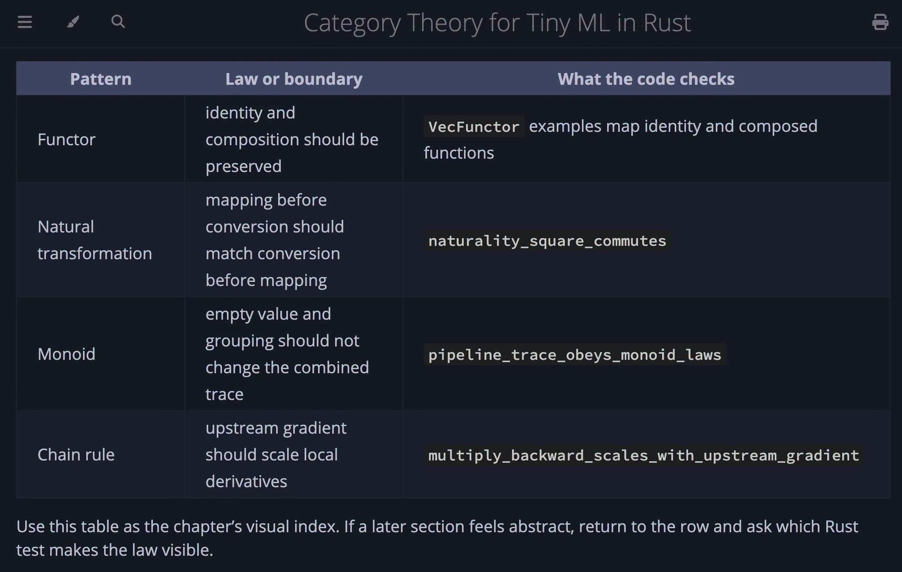

https://arxiv.org/pdf/2605.31559

==========================================================

paper Next-Latent Prediction Transformers Learn Compact World Models ออกใหม่เมื่อวาน (v4 นะ preprint 2025 v1) → จับใส่ katgpt → ได้ระบบ NPC คิดไวในเกม เอ่อ 👇
-----------------
Memoize the full decision pipeline output (NextLat prediction → Memory Soup adapter θ* → DDTree branch path) keyed by (latent_region, spatial_zone, task_family).
On cache hit: skip the entire pipeline, execute embedding-free fast-act.
On cascade: propagate the cached policy through the adaptive-bandwidth mind-reading channel (R133) for crowd-scale coordinated behavior (the "army firing signal").
-----------------
นั่นแหละขี้เกียจแปล → เดี๋ยวคืนนีั 2 ทุ่มจะไปเล่าให้ฟังจ้า มากันน้อยๆ จะได้เลิกพูดแล้วเอาเวลาไปเล่นเกมสักที รอบก่อนมากันรวมๆ 50 ได้ น่าจะเข็ดกันหมดแล้ว 555 เราไม่เน้น retention เราเน้นหลอก new user ให้เสียเวลามาฟัง และว่าเราไม่ได้ด้วยเพราะฟังฟรี 😆 link ในเม้น 👇

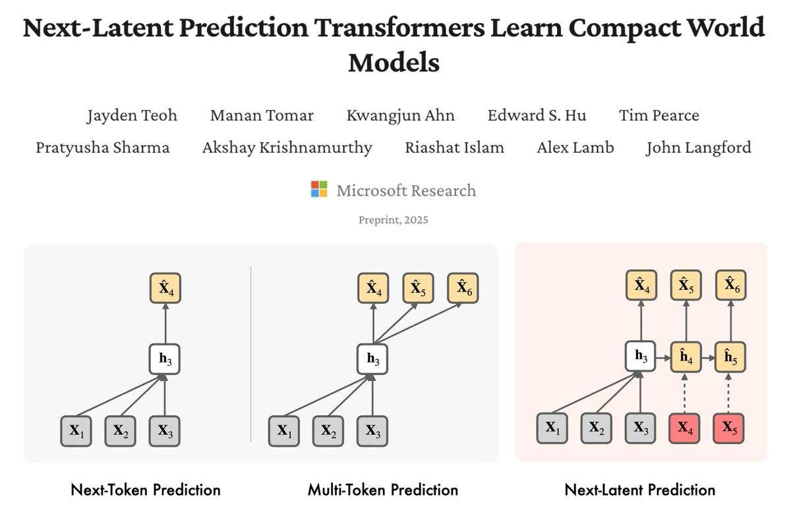

https://arxiv.org/pdf/2511.05963

==========================================================

เอาล่ะทุกวันพุธ 2 ทุ่มเราจะมาโม้ไปเรื่อยเรื่อง rust, ai, game, chain ใน latent space กัน พรุ่งนี้เอาเรื่องนี้นะ 👉 จะเป็นยังไงถ้า validator node โกรธ node ที่ล่มบ่อย(จำ fact ได้) เลย reasoning + emotional ไป sync กับ node อื่นแทน อาจจะถามว่าทำไปทำไม 555 จริงๆ แล้ว use case มันไว้สำหรับ NPC และ monster ในเกมหน่ะแหละแต่ไหนๆ มัน context aware ได้เราก็ทำ rate limitter และ load balance + backoff ได้ใน latent space นั่นแล no code, no interpreter, no compiler, just model, latent to latent
.
ใช่แล้วน้องก้อน weight model เล็กๆ ไม่กี่ KB นี่แหละ ไม่ต้องมี if/else ก็คือไม่มี bug (ไป bug ที่ policy แทน 555) แถมไม่หลอนเพราะมี pruner มันเลยเป็นการคิดแบบเฉพาะเรื่องใดเรื่องหนึ่งทำให้ไม่ต้องรู้ทุกเรื่องแต่เสียบ rust → wasm เฉพาะเรื่องที่ต้องรู้พอทำให้ model เล็กมากๆ จ้า อยากฟัง link ลงทะเบียนในเม้นฟรีเช่นเคยยยย 

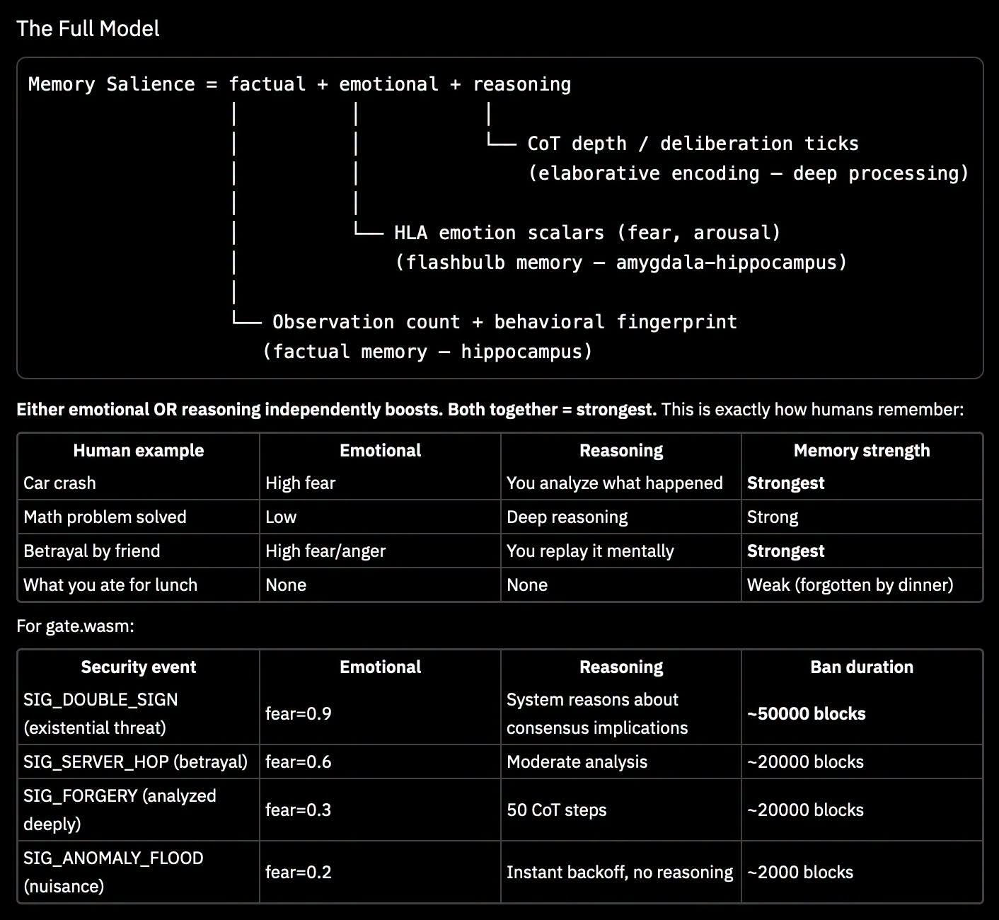

==========================================================

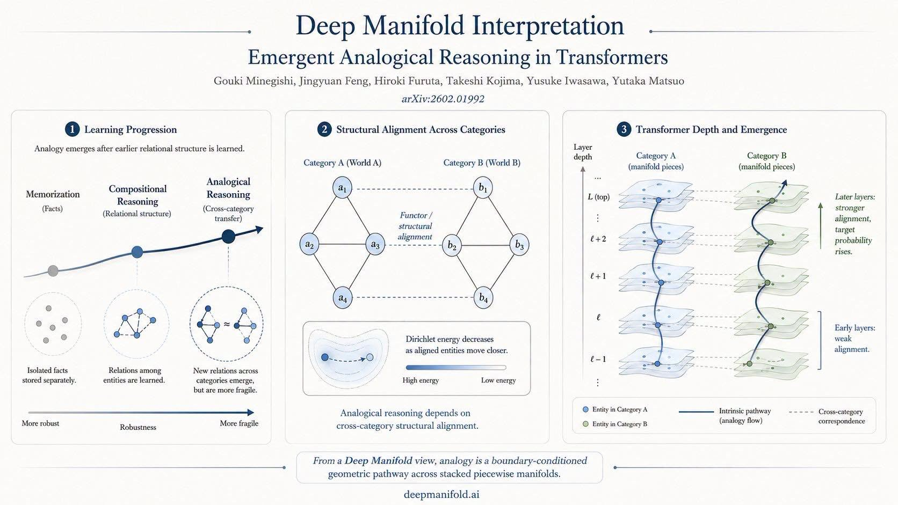

==========================================================

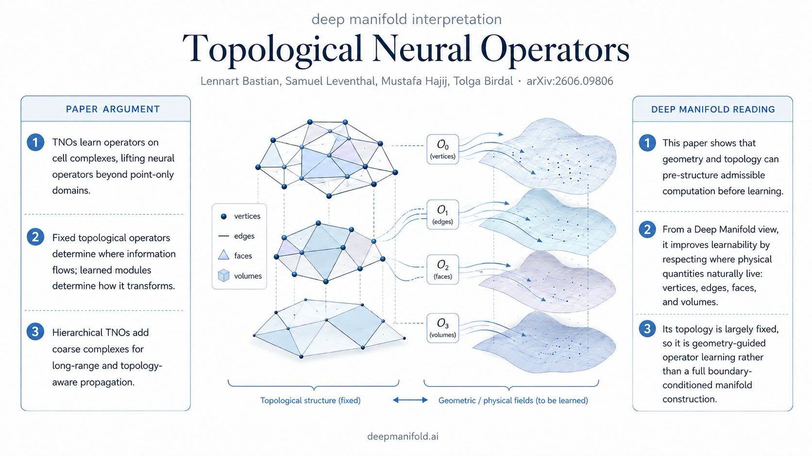

==========================================================

==========================================================

==========================================================

==========================================================

==========================================================

==========================================================